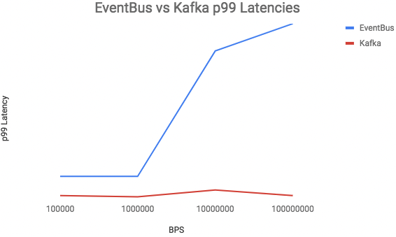

# 1장. 카프카 개요

- 문제를 해결하기 위해 2010년 개발된 카프카
    - 데이터 파이프라인 확장의 어려움
    - 이기종 간의 호환성
    - 고성능 기반의 실시간 데이터 처리의 어려움

- 데이터 플랫폼의 핵심 입지를 다지게 된 이유
    - 굉장히 안정적인 애플리케이션
    - 사용자들의 요구에 맞춰 크고 작은 신기능들이 발 빠르게 추가되면서 고객을 끊임없이 만족시켜줌
    
    👉 실시간 스트리밍 플렛폼이 필요한 곳에서는 대부분 카프카를 필수 요소로 채택
    

- 아파치 카프카와 컨플루언트 카프카의 차이 (자동차에 비유해 설명)
    - 아파치 카프카: 자동차의 핵심인 엔진
    - 컨플루언트 카프카: 내비게이션, 조향 장치, 각종 편의기능 등이 모두 탑재된 완성된 자동차

## 1. 잘란도와 트위터의 카프카 도입 사례

---

### 1-1. 유럽 최대 온라인 패션몰 잘란도의 도전 사례

---

- 잘란도: 유럽 전역에 걸쳐 대표적인 온라인 쇼핑 사이트
    - 2020년
        - 실사용자(active user) 수: 3100만명
        - 연간 주문수: 1억 4500만 건
        - 상품 판매 건수: 50만 건
    - 데이터에 대한 온갖 요구사항이 불거지자, 잘란도에서는 이러한 다양한 데이터 요구사항을 근본적으로 해결하기 위한 대책을 강구했다.
        
        💡데이터의 변화가 스트림으로 컨슈머 측에 전달되는 이벤트 드리븐 시스템으로의 전환을 결정
        

- 위기에 봉착한 잘란도
    - 이벤트 드리븐 시스템 구성에서 가장 중요한 사항
        
        1️⃣ 인바운드 데이터와 아웃바운드 데이터가 동일해야 한다.
        
        - 데이터가 누락된다면 데이터에 대한 신뢰성을 잃게 되고 결국 쓸모없는 데이터로 취급받게 된다.
        - 💡방지하기 위해서는 인바운드 데이터와 아웃바운드 데이터가 일치함을 검증해야 함
            - 데이터 파이프라인이 추가됨에 따라 데이터 검증에 대한 피로도 역시 더욱 높아지기만 할 것이다.
        
        2️⃣ 통신 방법에 대한 선택도 필요
        
        - 가장 널리 쓰이면서도 매우 간단한 REST API 기반의 통신
        - 정합성 유지와 이벤트들의 변경 순서가 중요
    - 초기에는
        - 데이터의 오차를 줄이려는 목적으로 API 와 PostgreSQL 로 연결하는 CRUD 타입으로 구성
        - 데이터베이스 업데이트가 완료된 후에는 아웃바운드 이벤트가 생성되도록 구성
    - 😃 데이터의 오차는 줄일 수 있었음
    - 😰 동기화 방식에서 한계점
        - 여러 네트워크를 이용하는 환경에서 모든 데이터 변경에 대한 올바른 전달 보장 문제
        - 동일한 데이터를 동시에 수정하면서 정확하게 순서를 보장해야 하는 문제, 그리고 수정된 이벤트들을 정확한 순서대로 아웃바운드 전송하는 문제
        - 다양한 클라이언트들의 요구사항을 효율적으로 지원하기 어려운 문제
        - 빠른 전송을 위한 클라이언트 또는 대량의 배치 전송을 위한 클라이언트를 지원하기 어려운 문제

- 비동기 방식의 대표 스트리밍 플랫폼, 카프카 도입
    - 동기 방식의 한계점을 느끼고 비동기 방식으로의 전환을 고려
    - 카프카가 잘란도의 대안으로 부상한 이유
        - 높은 처리량
            - HTTP 기반으로 전달되는 이벤트일지라도 이벤트가 카프카로 처리되는 응답시간은 불과 한자릿수의 밀리초(ms) 단위로 처리됐다.
        - 순서 보장
            - 이벤트 처리 순서가 보장되면서, 엔티티 간의 유효성 검사나 동시 수정 같은 무수한 복잡성들이 제거됨으로써 구조 또한 매우 간결해졌다.
        - 적어도 한 번(at least once) 전송 방식
            - 분산된 여러 네트워크 환경에서의 데이터 처리에서 중요한 모범 사례는 멱등성
            - 이벤트들이 중복 발생할 수는 있으나 누락 없는 재전송이 가능하므로 메시지 손실에 대한 걱정이 사라진다.
            - 중복 메시지 처리가 가능하도록 허용된다면 복잡한 트랜잭션 처리 또한 필요하지 않게 된다.
            
            👉 아키텍처는 더욱 단순해지고 처리량 또한 더욱 높아진다.
            
        - 강력한 파티셔닝
            - 논리적으로 토픽을 여러 개로 나눌 수 있다.
            - 각 파티션들을 다른 파티션들과 관계없이 처리할 수 있으므로 효과적인 수평 확장이 가능해졌다.
        - 자연스러운 백프레셔 핸들링
            - 카프카의 클라이언트는 풀(pull) 방식으로 동작
                - 장점: 자기 자신의 속도로 데이터를 처리할 수 있다.
                    - 푸시(push) 방식은 브로커가 보내주는 속도에 의존해야 한다.
            - 성능과 편리함에 집중하고자 풀 방식을 채택한 카프카 클라이언트
                - 복잡한 피드백이나 제한의 요구사항이 사라져 매우 간단하고 편리하게 클라이언트를 구현할 수 있다.
        - 로그 컴팩션
            - 스냅샷 역할이 가능해졌고, 새로운 애플리케이션이 나중에 메시지를 읽어가는 방식도 전혀 문제가 되지 않았다.
        - 그 외 여러 가지 기능
            - 프로듀서와 컨슈머가 완벽하게 분리된 비동기식 방식을 사용함에 따라 애플리케이션의 병목 현상을 정확하게 파악할 수 있음
                
                → 모니터링을 통해 지연에 대한 문제를 빠르게 해결할 수 있게 됐다.
                

- 카프카로 도약의 기회를 얻은 잘란도
    - 잘란도는 이벤트 스트림을 통해 모든 데이터를 비동기 방식으로 처리하고 있다.
    - 잘란도는 카프카를 전격 도입함으로써 내부의 데이터 처리를 간소화함은 물론, 높은 처리량을 바탕으로 스트림 데이터 처리의 확장성 또한 높일 수 있었다.

### 1-2. SNS 절대 강자 트위터의 카프카 활용 사례

---

- 트위터: 대표적인 실시간 서비스
    - 워크로드를 처리할 수 있는 시스템으로 그간 이벤트 버스(event bus)를 구축해 운영했지만, 향후 카프카로 전환

- 카프카로 유턴한 트위터
    - 카프카 0.7 버전 많은 문제점
        - 많은 I/O 오퍼레이션에서의 문제 발생
            - HDD 에서는 헤드 위치를 이동하는 과정 때문에 랜덤 쓰기가 매우 느리다.
        - 내구성 및 리플리케이션의 미구현 등으로 인한 불안정성
    - 이후 큰 진전을 이룬 카프카 👉 실시간 메시징 시스템의 업계 표준으로 자리매김
        - 빠른 응답시간
        - 높은 처리량
        - 펍/섭 모델을 지원
        
        💡수평 확장이 용이하며 고가용성을 갖춘 시스템으로 성장했다.
        
        → 트위터는 다시 카프카로의 전환을 검토하게 되었다.
        
    - [전환 목적](https://blog.twitter.com/engineering/en_us/topics/insights/2018/twitters-kafka-adoption-story)
        - 비용 절감 👉 단일 컨슈머일 경우 68%, 팬아웃(여러 컨슈머)일 경우 75% 리소스 절감
            
            
            
            - 카프카는 BPS(Bytes per second)와 상관없이 지연이 거의 발생하지 않음
                - 1️⃣ 이벤트 버스는 서빙 레이어와 스토리지 레이어가 분리되어 있어 추가적인 홉이 필요
                    - 네트워크 시간
                    - JVM 프록시 계층을 통과하는 시간
                - 카프카는 하나의 프로세스에서 스토리지와 요청을 모두 처리한다.
                - 2️⃣ 이벤트 버스는 `fsync()`를 하는 동안 블로킹을 하는 반면, 카프카는 OS에 의존해 백그라운드로 `fsync()`를 처리
                - 3️⃣ 카프카는 제로카피([zero-copy](https://www.linuxjournal.com/article/6345))를 사용
                    
                    
                    
                    - 리눅스의 기능
                        - 1. 2개의 시스템 콜로 복사
                            
                            ```bash
                            read(file, tmp_buf, len);
                            write(socket, tmp_buf, len);
                            ```
                            
                            
                            
                        - 2. `mmap` 호출
                            
                            ```bash
                            tmp_buf = mmap(file, len);
                            write(socket, tmp_buf, len);
                            ```
                            
                            
                            
                        - 3. `sendfile`로 `read`, `write` 대체
                            
                            ```bash
                            sendfile(socket, file, len);
                            ```
                            
                            
                            
                        - 4. gather 를 지원하는 하드웨어는 여러 메모리 위치에서 데이터를 어셈블하여 다른 복사본을 제거할 수 있다.
                            - 리눅스 커널 2.4 이후 버전, NIC 장비가 gather 을 지원할 경우
                            
                            
                            
                    - 장점
                        
                        ](./images/1/Untitled%206.png)
                        
                        [참고](https://developer.ibm.com/articles/j-zerocopy/)
                        
                        - [한글버전](https://soft.plusblog.co.kr/7) 참고
                    - 단점
                        - 현재 `sendfile`은 2GB 이상의 파일을 전송할 때 사용할 수 없다. 오늘날(2003년 1월 1일 기준) 이러한 크기의 파일은 그리 흔하지 않으며, 출시되는 도중에 모든 데이터를 복제해야 한다는 것은 다소 실망스러운 일이다.
                        - 이 경우 `sendfile`과 `mmap` 메서드를 모두 사용할 수 없기 때문에, `sendfile64`는 미래의 커널 버전에서 매우 유용할 것이다.
                    
                    → 몇 가지 단점에도 불구하고 제로 카피 `sendfile`은 유용한 기능이다.
                    
        
        😃 하드웨어 운영 유지 비용 + 기타 부대 비용 절감
        
        - 커뮤니티
            - 이미 많은 기업에서 채택됐으며, 카프카를 향상하고 버그를 수정하며 새로운 기능을 개발하고 기여하는 엔지니어들이 전 세계에 걸쳐 수백 명
            - 클라이언트나 브로커 등의 문제가 발생하면 이미 다양한 사용자들의 경험담이 웹에 공유되어 있어서 웹 검색 등을 통해 해결 방법을 빠르게 찾기 쉬움
            - 대중화된 카프카를 채택함으로써 기업 입장에서도 카프카를 사용하는 새로운 데이터 엔지니어를 고용하기 쉽다.

- 세게 유수 기업이 선택하는 카프카
    - 이러한 고민을 하고 있다면 카프카를 도입함으로써 상당히 많은 문제를 해결할 수 있을 것
        - 동기/비동기 데이터 전송에 대한 고민이 있는가?
        - 실시간 데이터 처리에 대한 고민이 있는가?
        - 현재의 데이터 처리에 한계를 느끼는가?
        - 새로운 데이터 파이프라인이 복잡하다고 느끼는가?
        - 데이터 처리의 비용 절감을 고려하고 있는가?

## 2. 국내외 카프카 이용 현황

---

### 해외 카프카 이용 현황

---

- 라인: 내부의 50여 개 서비스들이 카프카를 이용하고 있으며, 하루에만도 2500억 건이 넘는 메시지를 처리하고 약 210TB 의 데이터가 카프카로 인입된다.
- 뉴욕타임스: 실시간으로 콘텐츠를 배포
- 아디다스: 모니터링과 분석 등의 작업을 실시간으로 처리
- 데이터독: 각종 메트릭과 이벤트 통합 파이프라인
- 스포티파이: 로그 전송 시스템
- 페이팔, 넷플릭스, 아우디, 우버 등, 2020년 기준으로 포춘 100대 기업 중 약 80% 이상이 카프카를 사용하고 있다.

### 국내 카프카 이용 현황

---

- 네이버
- 카카오: 총 7개의 클러스터를 보유하고 있고, 하루 2600억 개의 메시지를 처리하며, 하루 약 240TB의 데이터가 카프카로 유입된다.

## 3. 카프카의 주요 특징

---

### 높은 처리량과 낮은 지연시간

---

)](./images/1/Untitled%207.png)

1-3. 카프카, 펄사, 래빗MQ 성능 비교 ([출처](https://www.confluent.io/ko-kr/blog/kafka-fastest-messaging-system/))

- 매우 높은 처리량과 낮은 지연시간 (latency)
    
    
    
    RabbitMQ 대기 시간은 30MB/s 보다 높은 처리량에서 현저하게 감소한다. 또한 미러링의 영향은 높은 처리량에서 매우 크며, 미러링 없이 기존 대기열만 사용하면 대기 시간을 단축할 수 있다.
    
- 처리량이 가장 높은 것: 카프카
- 응답 속도가 가장 빠른 것: 래빗MQ

👉 처리량과 응답 속도를 같이 비교했을 때는 카프카가 단연 독보적

### 높은 확장성

---

- 처리량이 높은 시스템이라 할지라도 분명 그 끝은 존재할 것 → 확장이 가능해야 한다.
- 링크드인 비즈니스가 급속도로 성장하면서 애플리케이션 확장의 필요성을 느꼈다.
- 당시 애플리케이션은 확장하기가 어려웠다.
- 자사가 스스로 겪은 불편사항을 개선하고자 → 카프카를 확장 가능하도록 초기부터 설계

### 고가용성

---

- 카프카 초기 버전에서는 무엇보다 메세지(레코드)를 빠르게 처리하는 것이 목표였지만, 점차 시간이 지나면서 고가용성 측면도 중요하게 여기게 됐다.
- 카프카는 2013년에 클러스터 내 레플리케이션(replication) 기능을 추가했고, 이를 통해 카프카 클러스터의 고가용성이 확보됐다.

### 내구성

---

- 프로듀서는 카프카로 메세지를 전송할 때, 프로듀서의 `acks`라는 옵션을 조정하여 메세지의 내구성을 강화할 수 있다. 강력한 메세지의 내구성을 원한다면 옵션을 `acks = all`로 사용할 수 있다. 이렇게 프로듀서에 의해 카프카로 전송되는 모든 메시지는 안전한 저장소인 카프카 로컬 디스크에 저장된다.
- 카프카의 경우에는 컨슈머가 메시지를 가져가더라도, 메시지는 삭제되지 않고 지정한 설정 시간 또는 로그의 크기만큼 로컬 디스크에 보관되므로, 코드의 버그나 장애가 발생하더라도 과거의 메시지들을 불러와 재처리할 수 있다.

### 개발 편의성

---

- 카프카는 메시지를 전송하는 역할을 하는 프로듀서(producer)와 메시지를 가져오는 역할을 하는 컨슈머(consumer)가 완벽하게 분리되어 동작하고 서로 영향을 주지도 받지도 않는다.
- 개발 편의성을 제공하기 위해 카프카에서는 카프카 커넥트(Kafka Connect)와 스키마 레지스트리(Schema Registry)를 제공
    - 스키마 레지스트리: 개발자가 데이터 활용보다는 데이터를 파싱하는 데 많은 시간을 소모하는 매우 비효율적인 현실을 보완하고자 스키마를 정의해서 사용할 수 있도록 개발된 애플리케이션
    - 카프카 커넥트: 프로듀서와 컨슈머를 따로 개발하지 않고도 카프카와 연동해 손쉽게 소스와 싱크로 데이터를 보내고 받을 수 있는 별도의 애플리케이션
        - 엘라스틱서치, HDFS 등 다양한 소스와 싱크를 제공

### 운영 및 관리 편의성

---

- 한 시스템에서 중요한 역할을 하는 애플리케이션이라면 성능 확장을 위한 증설 작업이 쉽고 간단해야 하며, 최신 버전이 릴리스되는 경우 무중단으로 버전 업그레이도 가능해야 하고, 버전 업그레이드 작업 역시 단순해야 한다.

## 4. 카프카의 성장

---

### 리플리케이션 기능 추가(v0.8)

---

- 2013년 12월 버전 0.8을 세상에 공개

### 스키마 레지스트리 공개(v0.8.2)

---

- 프로듀서와 컨슈머 간에 서로 데이터 구조를 설명할 수 있는 스키마를 등록 지정해 사용
- 2015년 2월 카프카 0.8.2 버전이 발표

### 카프카 커넥트 공개(v0.9)

---

- 시스템과 카프카를 하나하나 연동하는 클라이언트를 개발하고 유지보수하는 일은 점점 과중해지고 있다.
    
    → 이러한 애로사항들을 해결
    
- 2015년 11월 0.9 버전을 발표

### 카프카 스트림즈 공개(v0.10)

---

- 실시간 처리에 대한 니즈를 충족
- 2016년 5월 버전 0.10을 발표

### KSQL 공개

---

- 개발자들이 별도의 코드를 작성하지 않고도 익숙한 언어인 SQL 기반으로 실시간 처리 가능한 KSQL 이 2017년 8월 단독으로 공개됐다.

### 주키퍼 의존성에서 해방(v3.0)

---

- 카프카의 토픽, 브로커 등을 관리하는 목적으로 분산 코디네이터 시스템인 주키퍼(ZooKeeper)를 사용해왔으나 주키퍼는 그간 카프카가 높은 성능을 갖는 데 장벽이 되어왔다.
- 2021년 4월 2.8 버전 발표와 함께 처음으로 주키퍼 없이 동작 가능한 카프카가 공개됐다.
- 2021년 9월 21일, 아파치 카프카 3.0 이 릴리스됐다.
    - 주키퍼 의존성이 제거된 정식 카프카 버전에 한 걸음 더 다가간 것으로 보입니다만, 아직은 여전히 실제 운영 환경에서 사용하는 것을 추천하지는 않음
    - 카프카의 메시지 포맷 v0, v1 지원 종료
    - 자바 8 과 스칼라 2.12 지원 종료
    - 주키퍼의 의존성을 제거하면서 새롭게 도입된 합의 프로토콜인 크래프트(KRaft)를 카프카 전반에 적용하려는 양상이 두드러진다.
    - 프로듀서의 전송 보장에 대해 ‘중복 없는 전송(멱등성)’ 방식을 기본값으로 채택
    - 컨슈머의 `session.timeout.ms` 기본값을 늘려 컨슈머의 안정성을 한층 높였다.

## 5. 다양한 카프카의 사용 사례

---

### 데이터 파이프라인 : 넷플릭스 사례

---

- 넷플릭스는 데이터 기반 회사로서 풍부한 데이터 분석을 통해 비니스와 제품에 대한 의사결정을 내린다. 전 세계에 걸쳐 커다란 규모로 데이터를 수집, 통계, 처리, 적재하기 위해 파이프라인들이 연결되어 있어 이러한 파이프라인을 연결해주는 역할로 카프카를 사용하고 있다.
    
    )](./images/1/Untitled%209.png)
    
    1-5. 넷플릭스의 카프카 사용 사례 ([출처](https://netflixtechblog.com/evolution-of-the-netflix-data-pipeline-da246ca36905))
    
- 사용자의 넷플릭스 비디오 시청 활동, 유저 인터페이스 사용 빈도, 에러 로그 등의 모든 이벤트는 데이터 파이프라인을 통해 흐른다.

### 데이터 통합: 우버 사례

---

)](./images/1/Untitled%2010.png)

1-6. 우버의 카프카 사용 사례 ([출처](https://eng.uber.com/ureplicator-apache-kafka-replicator/))

- 앱으로부터 이벤트 데이터를 수집하고 이렇게 수집된 데이터는 카프카를 통해 다양한 다운스트림 컨슈머들에게 전달된다.
- 크게 배치 파이프라인과 실시간 파이프라인을 구분 → 애플리케이션 분석, 디버깅, 알람 등으로 이용되고 있음

### 머신러닝 분야 활용 사례

---

)](./images/1/Untitled%2011.png)

1-7. 머신러닝 분야에서의 사용 사례 ([출처](https://www.confluent.io/blog/build-deploy-scalable-machine-learning-production-apache-kafka/))

### 스마트 시티 분야 활용 사례

---

)](./images/1/Untitled%2012.png)

1-8. 스마트 시티에서의 카프카 사용 사례 ([출처](https://www.kai-waehner.de/blog/2020/02/24/building-smart-city-event-streaming-platform-apache-kafka/))

- 참고
    - [https://hoing.io/archives/4907](https://hoing.io/archives/4907)
