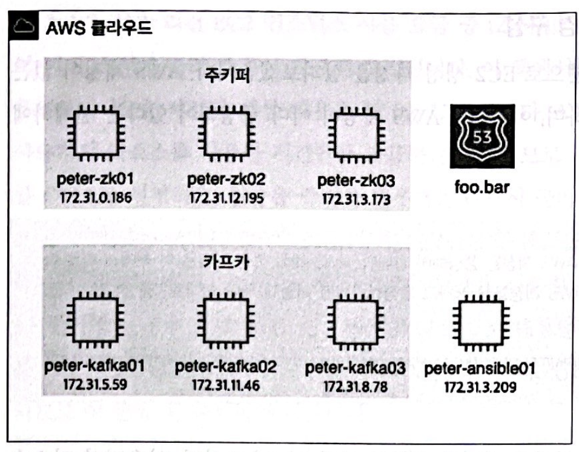

# 2장. 카프카 환경 구성

## 1. 이 책의 실습 환경 구성

---



2-1. 실습 환경 구성도

- 실제 운영 환경에서는 서비스의 안정성ㅇ이 최우선이므로 단독 서버 형태로 운영하는 경우는 거의 없고, 대부분 이중화 또는 클러스터 형태로 구성한다.
    - 주키퍼의 경우 최소 수량인 EC2 인스턴스 3대로 구성
    - 카프카의 경우도 최소 수량인 EC2 인스턴스 3대로 구성
- 운영 관경에서 서버 간 통신에서 직접 서버의 IP 를 호출하거나 사용하는 방식은 거의 사용하지 않으며, 대부분 서버의 호스트네임과 IP 를 매핑하는 DNS 를 별도로 구성해 사용
    - 온프레미스의 DNS 서비스는 AWS 에서 Route53 이라는 서비스에 대응된다.

### 1-1. AWS 환경에서 실습 환경 구성

---


- AWS 요금 체계는 총 사용 비용을 사용자가 리소스를 사용한 시간만큼 과금하는 방식이므로, 실습할 때만 잠시 EC2 인스턴스를 ON 으로 설정하고, 실습을 중지한 경우에는 반드시 곧바로 EC2 인스턴스를 OFF(중지 또는 셧다운)로 설정하는 방법으로 실습을 진행해야 비용을 절약할 수 있다.
- 스팟 인스턴스는 ON/OFF 를 할 수 없다 → 무조건 인스턴스를 삭제해야 한다.

- AWS 계정을 생성한 후 AWS Management Console 화면에서 **EC2를 사용하여**라는 메뉴를 클릭
- 1️⃣ EC2 인스턴스의 운영체제를 선택하는 AMI (Amazon Machine Image) 선택 화면
    - Amazon Linux 2 AMI를 선택
- 2️⃣ EC2 인스턴스 타입을 선택하는 화면
    - 후반부의 실습 과정에서는 각 EC2에 하나 이상의 애플리케이션을 구동하게 되므로, 4GB 용량의 메모리가 지원되는 **t2.medium**을 선택하고 나서 **다음: 인스턴스 세부 정보 구성**을 클릭
    - 배포용 서버는 **t2.small** 타입으로 해도 된다.
- 3️⃣ EC2 인스턴스의 세부 정보 구성 화면
    - **인스턴스 개수**를 7로 변경한 후 **다음: 스토리지 추가** 단계로 넘어간다.
    - 다음 단계인 스토리지 구성과 태그 추가는 딱히 변경할 사항 x
        - 스팟 인스턴스를 사용하고자 하는 분들은 두 번째 **구매 옵션**에서 **스팟 인스턴스 요청** 체크박스를 선택
- 4️⃣ 보안 그룹 구성 화면
    - 포트 범위를 지정
    - **유형**: **모든 트래픽**과 **모든 TCP**
    - **포트 범위**: **0-65535**
    - **보안 그룹 이름**: **peter-sg-kafka**
    - **모든 트래픽 유형**
        - AWS상의 EC2 인스턴스들끼리 서로 통신할 수 있도록
        - **소스**: **사용자 지정**으로 선택해 **172.31.0.0/16**을 허용하도록 입력
            - 기본 VPC 가 생성된 기준의 CIDR (Classless Inter-Domain Routing)
            - 만약 별도로 VPC와 서브넷(Subnet)을 설정한 분들은 각자 구성한 CIDR을 추가하면 된다.
    - **규칙 추가**를 클릭해서 새로운 유형을 추가
        - 본인의 로컬 환경에서 EC2로 접근해야 하므로
        - **유형**: **모든 TCP**
        - **소스**: **내 IP**
- 5️⃣ **검토 및 시작**을 클릭
- 6️⃣ 키 페어를 생성
    - 리눅스 서버는 일반적으로 계정/비밀번호를 입력해 접근, EC2 인스턴스는 키 페어를 이용해 접근
    - **키 페어 이름**: **keypair**
    - **키 페어 다운로드 버튼**을 클릭 → keypair.pem 파일
        - 키 페어의 권한을 변경: `chmod 600 keypair.pem`
- 7️⃣ **인스턴스 시작** 버튼을 클릭

- 💡EC2 인스턴스가 모두 생성되었다
    - AWS EC2 메인 페이지 - **EC2 서비스** - 죄측 메뉴의 **인스턴스** 클릭
    - Name 필드 하단 - 편집 - 팝업창을 통해 호스트네임을 설정
- peter-ansible01 인스턴스의 상세정보
    
    
    
    2-9. peter-ansible01의 상세정보
    
    - 퍼블릭 IPv4 주소
        - 나의 로컬 PC에서 AWS 내의 배포 서버인 peter-ansible01 인스턴스로 접근하려면 인터넷 구간을 거쳐야 하므로, peter-ansible01 EC2 인스턴스의 퍼블릭 IP 주소를 목적지 주소로 입력해야 한다.
    - 프라이빗 IPv4 주소
        - AWS 내에 존재하는 배포 서버인 peter-ansible01 은 카프카 또는 주키퍼 EC2 인스턴스와 서로 동일한 내부 네트워크 환경에 위치하고 있다.
            
            → 카프카 또는 주키퍼 EC2 인스턴스로 접근할 때 목적지 주소는 카프카 또는 주키퍼 인스턴스의 프라이빗 IP 주소를 이용해 접근한다.
            
- 나의 로컬 환경에서 인터넷을 거쳐 AWS로 접근하는 방법
    
    
    
    - 로컬 환경에서 AWS EC2로 접근하려면 퍼블릭 IP 주소를 이용하는 동시에 키 페어도 이용해야 함
        
        ```bash
        ssh -i keypair.pem -l ec2-user 13.125.209.60
        
        # -l(사용자명 옵션)을 @로 변경해 접속하는 방법
        ssh -i keypair.pem ec2-user@13.125.209.60
        ```
        
        - `-i`: 개인 키 파일을 지정
        - `-l`: 사용자 아이디를 지정
- EC2 인스턴스를 중지(stop)한 후 다시 퍼블릭 IP 주소로 접근하고자 한다면, 접근이 불가능한 경우가 발생할 수 있다 → 프라이빗 IP 주소는 인스턴스를 재시작해도 변경되지 x
    - 매번 EC2 인스턴스가 실행될 때마다 새로운 퍼블릭 IP 주소를 할당받기 때문
    - AWS의 탄력적 IP(Elastic IP): AWS에서는 불변의 고정 IP를 사용하는 서비스를 제공 → 추가 비용이 발생
        - EC2 인스턴스 좌측 메뉴에서 **탄력적 IP**로 진입한 후 탄력적 IP를 생성
        - 고정 IP가 필요한 EC2 인스턴스를 탄력적 I와 연결하기만 하면 된다.

- 8️⃣ DNS 설정
    - Route53 → AWS 비용이 추가됨
        - Route53을 이용해 각 호스트들을 foo.bar라는 프라이빗 도메인에 등록하면 된다.
    - 대안으로 서버의 `/etc/hosts` 파일을 수정해 사용 → 실제 운영 환경에서 권장 x
        
        ```bash
        172.31.3.209 peter-ansible01.foo.bar peter-ansible01
        172.31.0.186 peter-zk01.foo.bar peter-zk01
        172.31.12.195 peter-zk02.foo.bar peter-zk02
        172.31.3.173 peter-zk03.foo.bar peter-zk03
        172.31.5.59 peter-kafka01.foo.bar peter-kafka01
        172.31.11.46 peter-kafka02.foo.bar peter-kafka02
        172.31.8.78 peter-kafka03.foo.bar peter-kafka03
        ```
        
        - 준비한 목록을 모든 EC2 인스턴스의 `/etc/hosts` 파일에 추가한다.
    - 정상적으로 도메인 질의가 동작하는지 확인: `ping -c 2 peter-zk01.foo.bar`
        - 도메인 주소로 `ping` 명령어를 실행했을 때 `/etc/hosts`에 등록한 내용과 동일한 IP 주소를 찾아서 `ping` 연결이 된다면, 도메인 구성이 정상적으로 잘된 것

### 1-2. 온프레미스 환경에서 실습 환경 구성

---

## 2. 카프카 클러스터 구성

---

- 앤서블(Ansible)이라는 도구를 이용
    - 오픈소스 소프트웨어
    - 다수의 서버를 대상으로 설정 관리, 애플리케이션 배포 등을 코드로 관리할 수 있도록 도움을 주는 도구
- 설치
    - 아마존 리눅스에서 제공하는 `amazon-linux-extras` 명령어를 이용
        
        ```bash
        sudo amazon-linux-extras install -y ansible2
        ```
        
    - `git clone` 명령어를 이용해 설치에 필요한 파일들을 다운로드
        
        ```bash
        sudo yum install -y git
        git clone https://github.com/onlybooks/kafka2
        ```
        
    - 로컬에 내려받은 keypair.pem 파일을 배포 서버에 복사
        
        ```bash
        localhost> scp -i keypair.pem keypair.pem ec2-user@13.125.20.117:~
        ```
        
        - 배포하는 서버에서 앤서블을 이용해 다른 서버로 배포할 때 별다른 인증 x
    - 권한을 변경하고 키 등록 → 배포 서버에 로그아웃 후 재접속을 할 경우 설정이 초기화된다.
        
        ```bash
        chmod 600 keypair.pem
        ssh-agent bash
        ssh-add keypair.pem
        ```
        
        - `ssh-agent`: 키를 메모리에 저장해두고 계속 사용할 수 있음
        - `ssh-add`: 키를 등록
    - 별도로 `ssh` 공개 키를 생성해 사용하는 방법
        - 1. 배포 서버에서 공개 키 생성
            
            ```bash
            ssh-keygen
            ```
            
            - `ssh-keygen`: 공개 키를 생성
            - `/home/ec2-user/.ssh/id_rsa.pub`이라는 파일이 생성된다.
        - 2. 공개 키 내용을 접속하고자 하는 서버에 복사
            - `cat` 명령어로 확인
                
                ```bash
                cat /home/ec2-user/.ssh/id_rsa.pub
                ```
                
            - 출력된 내용을 복사한 후 peter-kafka01 서버로 로그인한 후 vi 편집기 모드로 authorized_keys 파일을 열고, 복사한 내용을 붙여넣기, authorized_keys 파일의 권한은 600
                
                ```bash
                vi /home/ec2-user/.ssh/authorized_keys
                chmod 600 .ssh/authorized_keys
                ```
                
        
        😃 배포 서버에서 다른 서버로 비밀번호 없이 접속
        
    - 주키퍼를 설치
        - 배포 서버로 로그인
        - 깃허브에서 내려받은 경로로 이동
        - 리눅스의 `cd` 명령어를 이용해 ansible_playbook 디렉토리로 이동
        - 앤서블 명령어인 `ansible-playbook`을 써서 hosts 파일에 지정된 peter-zk01, peter-zk02, peter-zk03 서버에 모두 주키퍼를 설치
            
            ```bash
            cd kafka2/chapter2/ansible_playbook
            ansible-playbook -i hosts zookeeper.yml
            ```
            
    - 주키퍼가 제대로 실행되고 있는지 확인
        - 리눅스의 `systemd`를 통해서 관리되도록 앤서블에 포함
            
            ```bash
            peter-zk01> sudo systemctl status zookeeper-server
            ```
            
        - `Active: active (running)`이 확인되면 정상적으로 실행되고 있는 상태
    - 주키퍼가 정상적으로 실행되고 있다면, 카프카를 설치
        
        ```bash
        ansible-playbook -i hosts kafka.yml
        ```
        
    - 잘 실행됐는지 확인
        
        ```bash
        peter-kafka01> sudo systemctl status kafka-server
        ```
        
        - `Active: active (running)`이 확인되면, 정상적으로 실행된 것

- 리눅스 환경에서 `systemd`에 프로세스를 등록해 사용하면, 서버가 예기치 않게 재시작되더라도 자동으로 프로세스를 실행할 수 있으며 시스템 관리자가 프로세스를 관리하기도 매우 편리하다.
    - 프로세스 상태 확인 명령어: `systemctl status zookeeper-server`
    - 프로세스 중지 명령어: `systemctl stop zookeeper-server`
    - 프로세스 시작 명령어: `systemctl start zookeeper-server`
    - 프로세스 재시작 명령어: `systemctl restart zookeeper-server`

## 3. 5분 만에 카프카 맛보기

---

### 3-1. 카프카의 기본 구성

---


2-11. 카프카 기본 구성도

- 카프카: 데이터를 받아서 전달하는 데이터 버스(data bus)의 역할
- 프로듀서(producer): 카프카에 데이터(메시지)를 만들어서 주는 쪽
- 컨슈머(consumer): 카프카에서 데이터(메시지)를 빼내서 소비하는 쪽
- 주키퍼: 카프카의 정상 동작을 보장하기 위해 메타데이터(metadata)를 관리하는 코디네이터(coordinator)
    - 브로커들의 노드 관리 등을 하고 있다.
        - 카프카: 애플리케이션의 이름
        - 브로커: 카프카 애플리케이션이 설치된 서버 또는 노드

### 3-2. 메시지 보내고 받기

---

- 카프카에서 제공하는 도구 중 `kafka-topics.sh` 명령어를 이용해 peter-overview01 토픽을 생성
    
    ```bash
    peter-kafka01> /usr/local/kafka/bin/kafka-topics.sh --bootstrap-server peter-kafka01.foo.bar:9092 \
    --create --topic peter-overview01 \
    --partitions 1 --replication-factor 3
    
    Created topic test-overview01.
    ```
    
- 2개의 cmd 창을 열어서
    - 하나의 창에서는 컨슈머를 실행
        
        ```bash
        peter-kafka01> /usr/local/kafka/bin/kafka-console-consumer.sh --bootstrap-server peter-kafka01.foo.bar:9092 \
        --topic peter-overview01
        ```
        
    - 나머지 하나의 창에서는 프로듀서를 실행
        
        ```bash
        peter-kafka01> /usr/local/kafka/bin/kafka-console-producer.sh --bootstrap-server peter-kafka01.foo.bar:9092 \
        --topic peter-overview01
        
        >Fist message
        >
        ```
        
    
    → 메시지 전송 시, 콘솔 컨슈머가 실행되고 있는 창에 메시지가 보일 것
    

- 카프카에서 제공하는 명령어 중 주로 사용하는 명령어
    - `kafka-topics.sh`: 토픽을 생성하거나 토픽의 설정 등을 변경하기 위해 사용함
    - `kafka-console-producer.sh`: 토픽으로 메시지를 전송하기 위해 사용함. 기본 옵션 외 추가 옵션을 지정할 수 있고, 이를 통해 다양한 프로듀서 옵션 적용 가능
    - `kafka-console-c.onsumersh`: 토픽에서 메시지를 가져오기 위해 사용함. 기본 옵션 외 추가 옵션을 지정할 수 있고, 이를 통해 다양한 컨슈머 옵션 적용 가능
    - `kafka-reassign-partitions.sh`: 토픽의 파티션과 위치 변경 등을 위해 사용함
    - `kafka-dump-log.sh`: 파티션에 저장된 로그 파일의 내용을 확인하기 위해 사용함

- 참고
    - [https://hoing.io/archives/4269](https://hoing.io/archives/4269)
