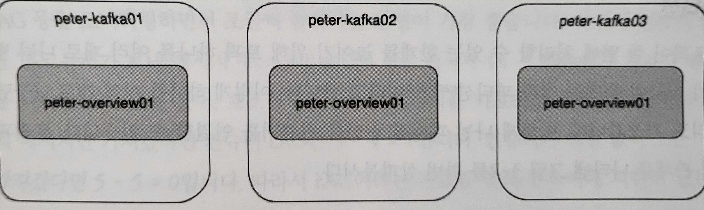

# 3장. 카프카 기본 개념과 구조

## 1. 카프카 기초 다지기

---

> 카프카를 구성하는 주요 요소
> 
> - 주키퍼(Zookeeper): 아파치 프로젝트 애플리케이션 이름이다. 카프카의 메타데이터(metadata) 관리 및 브로커의 정상상태 점검(health check)을 담당한다.
> - 카프카(Kafka) 또는 카프카 클러스터(Kafka cluster): 아파치 프로젝트 애플리케이션 이름이다. 여러 대의 브로커를 구성한 클러스터를 의미한다.
> - 브로커(broker): 카프카 애플리케이션이 설치된 서버 또는 노드
> - 프로듀서(producer): 카프카로 메시지를 보내는 역할을 하는 클라이언트를 총칭한다.
> - 컨슈머(consumer): 카프카에서 메시지를 꺼내가는 역할을 하는 클라이언트를 총칭한다.
> - 토픽(topic): 카프카는 메시지 피드들을 토픽으로 구분하고, 각 토픽의 이름은 카프카 내에서 고유하다.
> - 파티션(partition): 병렬 처리 및 고성능을 얻기 위해 하나의 토픽을 여러 개로 나눈 것
> - 세그먼트(segment): 프로듀서가 전송한 실제 메시지가 브로커의 로컬 디스크에 저장되는 파일을 말한다.
> - 메시지(message) 또는 레코드(record): 프로듀서가 브로커로 전송하거나 컨슈머가 읽어가는 데이터 조각을 말한다.

### 1-1. 리플리케이션

---

- 리플리케이션(replication): 각 메시지들을 여러 개로 복제해서 카프카 클러스터내 브로커들에 분산시키는 동작을 의미
- 토픽 명령어 중 `replication-factor` 옵션: 카프카 내 몇 개의 리플리케이션을 유지하겠다는 의미
    - `--replication-factor 3`: 원본을 포함한 리플리케이션이 총 3개가 있다.
        
        
        
        3-1. 토픽의 리플리케이션 배치
        
        - 정확하게 말하면, 카프카에서 토픽이 리플리케이션되는 것이 아니라 토픽의 파티션이 리플리케이션되는 것

- 리플리케이션 팩터 수가 커지면 안정성은 높아지지만, 그만큼 브로커 리소스를 많이 사용하게 된다.
    - 복제에 대한 오버헤드를 줄여서 최대한 브로커를 효율적으로 사용하는 것을 권장
    
    > **테스트나 개발 환경**: 리플리케이션 팩터 수 1
    > 
    > 
    > **운영 환경(로그성 메세지로서 약간의 유실 허용)**: 리플레키이션 팩터 수 2
    > 
    > **운영 환경(유실 허용안됨)**: 리플레키이션 팩터 수 3
    > 

### 1-2. 파티션

---

- 파티션(partition): 하나의 토픽이 한 번에 처리할 수 있는 한계를 높이기 위해 토픽 하나를 여러 개로 나눠 병렬 처리가 가능하게 만든 것
    - 하나를 여러 개로 나누면 분산 처리도 가능, 나뉜 파티션 수만큼 컨슈머를 연결할 수 있다.
        
        
        
        3-2. 토픽과 파티션의 관계
        
        - 토픽1: 파티션0이라는 1개의 파티션으로 구성
        - 토픽3: 파티션0, 파티션1, 파티션2의 총 3개의 파티션으로 구성되어 있다.
    - 파티션 번호는 0부터 시작

- 파티션 수도 토픽을 생성할 때 옵션으로 설정
    - 파티션 수는 초기 생성 후 언제든지 늘릴 수 있지만, 반대로 한 번 늘린 파티션 수는 절대로 줄일 수 없다.
    - 초기에 토픽을 생성할 때 파티션 수를 작게(2 또는 4) 생성한 후, 메시지 처리량이나 컨슈머의 LAG 등을 모니터링하면서 조금씩 늘려가는 방법이 가장 좋다.
        - 컨슈머의 LAG: 프로듀서가 보낸 메시지 수(카프카에 남아 있는 메시지 수) - 컨슈머가 가져간 메시지 수

### 1-3. 세그먼트

---

- 우리가 프로듀서를 이용해 보낸 메시지는 바로 peter-overview01 토픽의 파티션0에 저장되어 있다.

- 프로듀서에 의해 브로커로 전송된 메시지는 토픽의 파티션에 저장되며, 각 메시지들은 세그먼트(segment)라는 로그 파일의 형태로 브로커의 로컬 디스크에 저장된다.
- 각 파티션마다 N개의 세그먼트 로그 파일들이 존재한다 👉 세그먼트의 파일 내용을 출력해봄으로써 프로듀서가 전송한 메시지가 브로커의 로컬 디스크에 안전하게 저장되어 있음을 알 수 있다.
    
    
    
    3-3. 파티션과 세그먼트의 관게
    
    - 디렉토리 경로: `/data/kafka-logs`
    - 도커로 설치한 경우: `/var/lib/kafka/data`
        
        <aside>
        💡 kafka-topics --bootstrap-server kafka1:9091 --create --topic peter-overview01 --partitions 2 --replication-factor 2
        
        </aside>
        
        ```bash
        kim-yoonhee  cd ~/kafka/kafka2/appendix_C/cluster_zk_kafka
        kim-yoonhee  ~/kafka/kafka2/appendix_C/cluster_zk_kafka   main  docker-compose start
        kim-yoonhee  ~/kafka/kafka2/appendix_C/cluster_zk_kafka   main  docker exec -it kafka1 /bin/bash
        root@kafka1:/# cd /var/lib/kafka/data
        root@kafka1:/var/lib/kafka/data# ls
        __confluent.support.metrics-0  __consumer_offsets-25  __consumer_offsets-42
        __consumer_offsets-0	       __consumer_offsets-26  __consumer_offsets-43
        __consumer_offsets-1	       __consumer_offsets-27  __consumer_offsets-44
        __consumer_offsets-10	       __consumer_offsets-28  __consumer_offsets-45
        __consumer_offsets-11	       __consumer_offsets-29  __consumer_offsets-46
        __consumer_offsets-12	       __consumer_offsets-3   __consumer_offsets-47
        __consumer_offsets-13	       __consumer_offsets-30  __consumer_offsets-48
        __consumer_offsets-14	       __consumer_offsets-31  __consumer_offsets-49
        __consumer_offsets-15	       __consumer_offsets-32  __consumer_offsets-5
        __consumer_offsets-16	       __consumer_offsets-33  __consumer_offsets-6
        __consumer_offsets-17	       __consumer_offsets-34  __consumer_offsets-7
        __consumer_offsets-18	       __consumer_offsets-35  __consumer_offsets-8
        __consumer_offsets-19	       __consumer_offsets-36  __consumer_offsets-9
        __consumer_offsets-2	       __consumer_offsets-37  cleaner-offset-checkpoint
        __consumer_offsets-20	       __consumer_offsets-38  log-start-offset-checkpoint
        __consumer_offsets-21	       __consumer_offsets-39  meta.properties
        __consumer_offsets-22	       __consumer_offsets-4   peter-overview01-1
        __consumer_offsets-23	       __consumer_offsets-40  recovery-point-offset-checkpoint
        __consumer_offsets-24	       __consumer_offsets-41  replication-offset-checkpoint
        ```
        
        ```bash
        root@kafka2:/var/lib/kafka/data# ls
        __confluent.support.metrics-0  __consumer_offsets-25  __consumer_offsets-42
        __consumer_offsets-0	       __consumer_offsets-26  __consumer_offsets-43
        __consumer_offsets-1	       __consumer_offsets-27  __consumer_offsets-44
        __consumer_offsets-10	       __consumer_offsets-28  __consumer_offsets-45
        __consumer_offsets-11	       __consumer_offsets-29  __consumer_offsets-46
        __consumer_offsets-12	       __consumer_offsets-3   __consumer_offsets-47
        __consumer_offsets-13	       __consumer_offsets-30  __consumer_offsets-48
        __consumer_offsets-14	       __consumer_offsets-31  __consumer_offsets-49
        __consumer_offsets-15	       __consumer_offsets-32  __consumer_offsets-5
        __consumer_offsets-16	       __consumer_offsets-33  __consumer_offsets-6
        __consumer_offsets-17	       __consumer_offsets-34  __consumer_offsets-7
        __consumer_offsets-18	       __consumer_offsets-35  __consumer_offsets-8
        __consumer_offsets-19	       __consumer_offsets-36  __consumer_offsets-9
        __consumer_offsets-2	       __consumer_offsets-37  cleaner-offset-checkpoint
        __consumer_offsets-20	       __consumer_offsets-38  log-start-offset-checkpoint
        __consumer_offsets-21	       __consumer_offsets-39  meta.properties
        __consumer_offsets-22	       __consumer_offsets-4   peter-overview01-0
        __consumer_offsets-23	       __consumer_offsets-40  recovery-point-offset-checkpoint
        __consumer_offsets-24	       __consumer_offsets-41  replication-offset-checkpoint
        ```
        
        ```bash
        root@kafka3:/var/lib/kafka/data# ls
        __confluent.support.metrics-0  __consumer_offsets-26  __consumer_offsets-44
        __consumer_offsets-0	       __consumer_offsets-27  __consumer_offsets-45
        __consumer_offsets-1	       __consumer_offsets-28  __consumer_offsets-46
        __consumer_offsets-10	       __consumer_offsets-29  __consumer_offsets-47
        __consumer_offsets-11	       __consumer_offsets-3   __consumer_offsets-48
        __consumer_offsets-12	       __consumer_offsets-30  __consumer_offsets-49
        __consumer_offsets-13	       __consumer_offsets-31  __consumer_offsets-5
        __consumer_offsets-14	       __consumer_offsets-32  __consumer_offsets-6
        __consumer_offsets-15	       __consumer_offsets-33  __consumer_offsets-7
        __consumer_offsets-16	       __consumer_offsets-34  __consumer_offsets-8
        __consumer_offsets-17	       __consumer_offsets-35  __consumer_offsets-9
        __consumer_offsets-18	       __consumer_offsets-36  cleaner-offset-checkpoint
        __consumer_offsets-19	       __consumer_offsets-37  log-start-offset-checkpoint
        __consumer_offsets-2	       __consumer_offsets-38  meta.properties
        __consumer_offsets-20	       __consumer_offsets-39  peter-overview01-0
        __consumer_offsets-21	       __consumer_offsets-4   peter-overview01-1
        __consumer_offsets-22	       __consumer_offsets-40  recovery-point-offset-checkpoint
        __consumer_offsets-23	       __consumer_offsets-41  replication-offset-checkpoint
        __consumer_offsets-24	       __consumer_offsets-42
        __consumer_offsets-25	       __consumer_offsets-43
        ```
        
        - peter-overview01-0: peter-overview01이라는 토픽의 0번 파티션 디렉토리
        - peter-overview01-1: peter-overview01이라는 토픽의 1번 파티션 디렉토리
    - peter-overview01-0 디렉토리의 리스트를 확인
        
        ```bash
        root@kafka2:/var/lib/kafka/data# cd peter-overview01-0
        root@kafka2:/var/lib/kafka/data/peter-overview01-0# ls
        00000000000000000000.index  00000000000000000000.timeindex  leader-epoch-checkpoint
        00000000000000000000.log    00000000000000000006.snapshot
        ```
        
    - 프로듀서가 보낸 메시지를 확인하기 위해 먼저 `00000000000000000000.log`파일 확인
        - 로그파일 복사
            
            ```bash
            kim-yoonhee  ~/kafka/kafka2/appendix_C/cluster_zk_kafka   main  docker cp kafka2:/var/lib/kafka/data/peter-overview01-0/00000000000000000000.log ~/kafka
            ```
            
        - `hexdump`를 보여주는 `xxd` 명령어를 이용
            
            ```bash
            kim-yoonhee  ~/kafka  xxd 00000000000000000000.log
            00000000: 0000 0000 0000 0000 0000 003c 0000 0000  ...........<....
            00000010: 0253 43f6 3900 0000 0000 0000 0001 8278  .SC.9..........x
            00000020: 9190 cf00 0001 8278 9190 cfff ffff ffff  .......x........
            00000030: ffff ffff ffff ffff ff00 0000 0114 0000  ................
            00000040: 0001 0868 6968 6900 0000 0000 0000 0001  ...hihi.........
            00000050: 0000 003c 0000 0000 0253 43f6 3900 0000  ...<.....SC.9...
            00000060: 0000 0000 0001 8278 9190 cf00 0001 8278  .......x.......x
            00000070: 9190 cfff ffff ffff ffff ffff ffff ffff  ................
            00000080: ff00 0000 0114 0000 0001 0868 6968 6900  ...........hihi.
            00000090: 0000 0000 0000 0002 0000 003c 0000 0000  ...........<....
            000000a0: 023c ed3c 2a00 0000 0000 0000 0001 8278  .<.<*..........x
            000000b0: 9297 4400 0001 8278 9297 44ff ffff ffff  ..D....x..D.....
            000000c0: ffff ffff ffff ffff ff00 0000 0114 0000  ................
            000000d0: 0001 0868 6968 6900 0000 0000 0000 0003  ...hihi.........
            000000e0: 0000 0045 0000 0000 0250 c112 d800 0000  ...E.....P......
            000000f0: 0000 0000 0001 8278 93dd dd00 0001 8278  .......x.......x
            00000100: 93dd ddff ffff ffff ffff ffff ffff ffff  ................
            00000110: ff00 0000 0126 0000 0001 1a74 7765 6e74  .....&.....twent
            00000120: 7920 6f6e 6520 7e7e 0000 0000 0000 0000  y one ~~........
            00000130: 0400 0000 3b00 0000 0002 1a57 6968 0000  ....;......Wih..
            00000140: 0000 0000 0000 0182 7894 3fd9 0000 0182  ........x.?.....
            00000150: 7894 3fd9 ffff ffff ffff ffff ffff ffff  x.?.............
            00000160: ffff 0000 0001 1200 0000 0106 456e 6400  ............End.
            00000170: 0000 0000 0000 0005 0000 0041 0000 0000  ...........A....
            00000180: 02eb 13e8 1d00 0000 0000 0000 0001 8278  ...............x
            00000190: 97df 3e00 0001 8278 97df 3eff ffff ffff  ..>....x..>.....
            000001a0: ffff ffff ffff ffff ff00 0000 011e 0000  ................
            000001b0: 0001 12e3 8597 4869 6869 6869 00         ......Hihihi.
            ```
            
    
    
    
    3-4. 토픽, 파티션, 세그먼트의 관계도
    
    - 1. 프로듀서는 카프카의 peter-overview01 토픽으로 메시지를 전송한다.
    - 2. peter-overview01 토픽은 파티션이 하나뿐이므로, 프로듀서로부터 받은 메시지를 파티션0의 세그먼트 로그 파일에 저장한다.
        
        ```bash
        kim-yoonhee  ~/kafka/kafka2/appendix_C/cluster_zk_kafka   main  docker cp kafka3:/var/lib/kafka/data/peter-overview01-0/00000000000000000000.log ~/kafka
        kim-yoonhee  ~/kafka/kafka2/appendix_C/cluster_zk_kafka   main  docker cp kafka3:/var/lib/kafka/data/peter-overview01-1/00000000000000000000.log ~/kafka
        ```
        
        - 파티션0 → kafka2 의 로그랑 같은 내용
            
            ```bash
            kim-yoonhee  ~/kafka  xxd 0_00000000000000000000.log
            00000000: 0000 0000 0000 0000 0000 003c 0000 0000  ...........<....
            00000010: 0253 43f6 3900 0000 0000 0000 0001 8278  .SC.9..........x
            00000020: 9190 cf00 0001 8278 9190 cfff ffff ffff  .......x........
            00000030: ffff ffff ffff ffff ff00 0000 0114 0000  ................
            00000040: 0001 0868 6968 6900 0000 0000 0000 0001  ...hihi.........
            00000050: 0000 003c 0000 0000 0253 43f6 3900 0000  ...<.....SC.9...
            00000060: 0000 0000 0001 8278 9190 cf00 0001 8278  .......x.......x
            00000070: 9190 cfff ffff ffff ffff ffff ffff ffff  ................
            00000080: ff00 0000 0114 0000 0001 0868 6968 6900  ...........hihi.
            00000090: 0000 0000 0000 0002 0000 003c 0000 0000  ...........<....
            000000a0: 023c ed3c 2a00 0000 0000 0000 0001 8278  .<.<*..........x
            000000b0: 9297 4400 0001 8278 9297 44ff ffff ffff  ..D....x..D.....
            000000c0: ffff ffff ffff ffff ff00 0000 0114 0000  ................
            000000d0: 0001 0868 6968 6900 0000 0000 0000 0003  ...hihi.........
            000000e0: 0000 0045 0000 0000 0250 c112 d800 0000  ...E.....P......
            000000f0: 0000 0000 0001 8278 93dd dd00 0001 8278  .......x.......x
            00000100: 93dd ddff ffff ffff ffff ffff ffff ffff  ................
            00000110: ff00 0000 0126 0000 0001 1a74 7765 6e74  .....&.....twent
            00000120: 7920 6f6e 6520 7e7e 0000 0000 0000 0000  y one ~~........
            00000130: 0400 0000 3b00 0000 0002 1a57 6968 0000  ....;......Wih..
            00000140: 0000 0000 0000 0182 7894 3fd9 0000 0182  ........x.?.....
            00000150: 7894 3fd9 ffff ffff ffff ffff ffff ffff  x.?.............
            00000160: ffff 0000 0001 1200 0000 0106 456e 6400  ............End.
            00000170: 0000 0000 0000 0005 0000 0041 0000 0000  ...........A....
            00000180: 02eb 13e8 1d00 0000 0000 0000 0001 8278  ...............x
            00000190: 97df 3e00 0001 8278 97df 3eff ffff ffff  ..>....x..>.....
            000001a0: ffff ffff ffff ffff ff00 0000 011e 0000  ................
            000001b0: 0001 12e3 8597 4869 6869 6869 00         ......Hihihi.
            ```
            
        - 파티션1
            
            ```bash
            kim-yoonhee  ~/kafka  xxd 00000000000000000000.log
            00000000: 0000 0000 0000 0000 0000 0045 0000 0000  ...........E....
            00000010: 0225 b424 4000 0000 0000 0000 0001 8278  .%.$@..........x
            00000020: 9284 a700 0001 8278 9284 a7ff ffff ffff  .......x........
            00000030: ffff ffff ffff ffff ff00 0000 0126 0000  .............&..
            00000040: 0001 1a46 6972 7374 206d 6573 7361 6765  ...First message
            00000050: 0000 0000 0000 0000 0100 0000 3e00 0000  ............>...
            00000060: 0002 1e9f ef74 0000 0000 0000 0000 0182  .....t..........
            00000070: 7893 a145 0000 0182 7893 a145 ffff ffff  x..E....x..E....
            00000080: ffff ffff ffff ffff ffff 0000 0001 1800  ................
            00000090: 0000 010c 7965 7965 7965 0000 0000 0000  ....yeyeye......
            000000a0: 0000 0200 0000 4500 0000 0002 9112 853d  ......E........=
            000000b0: 0000 0000 0000 0000 0182 7894 4c14 0000  ..........x.L...
            000000c0: 0182 7894 4c14 ffff ffff ffff ffff ffff  ..x.L...........
            000000d0: ffff ffff 0000 0001 2600 0000 011a 416e  ........&.....An
            000000e0: 6420 6e65 7720 7374 6172 7400 0000 0000  d new start.....
            000000f0: 0000 0003 0000 003f 0000 0000 02a1 5d37  .......?......]7
            00000100: dd00 0000 0000 0000 0001 8278 97fd 3000  ...........x..0.
            00000110: 0001 8278 97fd 30ff ffff ffff ffff ffff  ...x..0.........
            00000120: ffff ffff ff00 0000 011a 0000 0001 0e48  ...............H
            00000130: 6920 6775 7973 00                        i guys.
            ```
            
    - 3. 브로커의 세그먼트 로그 파일에 저장된 메시지는 컨슈머가 읽어갈 수 있다.

- 컨슈머는 peter-overview01 토픽을 컨슘해서 해당 토픽 내 파티션0의 세그먼트 로그 파일에서 메시지를 가져온다.

## 2. 카프카의 핵심 개념

---

- 여러 우수한 기업들이 카프카를 서둘러 도입하고 많은 개발자가 좋아하는 이유
    - 높은 처리량
    - 빠른 응답 속도
    - 안정성

### 2-1. 분산 시스템

---

- 분산 시스템: 네트워크상에서 연결된 컴퓨터들의 그룹
    - 단일 시스템이 갖지 못한 높은 성능을 목표로 한다.
    - 하나의 서버 또는 노드 등에 장애가 발생할 때 다른 서버 또는 노드가 대신 처리하므로 장애 대응이 탁월
    - 부하가 높을 경우에는 시스템 확장이 용이
- ❗카프카도 분산 시스템
    - 최초 구성한 클러스터의 리소스가 한계치에 도달해 더욱 높은 메시지 처리량이 필요한 경우, 브로커를 추가하는 방식으로 확장이 가능하다.

<aside>
💡 카프카의 매우 큰 장점: 확장이 용이하다.

</aside>

### 2-2. 페이지 캐시

---

- 페이지 캐시의 이용: 카프카는 높은 처리량을 얻기 위해 몇 가지 기능을 추가했는데, 그중 대표적인 것
    - OS의 페이지 캐시를 활용하는 방식으로 설계되어 있다 → 페이지 캐시를 통해 읽고 쓰기를 한다.
- 페이지 캐시: 직접 디스크에 읽고 쓰는 대신 물리 메모리 중 애플리케이션이 사용하지 않는 일부 잔여 메모리를 활용한다.
    - 디스크 I/O에 대한 접근이 줄어들므로 성능을 높일 수 있다.
        
        
        

### 2-3. 배치 전송 처리

---

- 수많은 통신을 묶어서 처리할 수 있다면, 단건으로 통신할 때에 비해 네트워크 오버헤드를 줄일 수 있을 뿐만 아니라 장기적으로는 더욱 빠르고 효율적으로 처리할 수 있다.
- 예를 들어,
    - 상품의 재고 수량 업데이트 작업은 지연 없이 실시간으로 처리야 하지만,
    - 구매 로그를 저장소로 보내는 작업은 이미 로그가 서버에 기록되어 있으므로 실시간 처리보다는 배치 처리를 이용하는 편이 효율적일 것
- 카프카에서는 이러한 장점을 지닌 배치 전송을 권장한다.

### 2-4. 압축 전송

---

- 카프카는 메시지 전송 시 좀 더 성능이 높은 압축 전송을 사용하는 것을 권장한다.
    - 지원하는 압축 타입은 `gzip`, `snappy`, `lz4`, `zstd` 등
- 압축만으로도 네트워크 대역폭이나 회선 비용을 줄일수 있다.
    - 높은 압축률이 필요한 경우라면 `gzip`이나 `zstd`를 권장
    - 빠른 응답 속도가 필요하다면 `lz4`나 `snappy`를 권장

### 2-5. 토픽, 파티션, 오프셋

---

- 카프카는 토픽(topic)이라는 곳에 데이터를 저장
    - 메일 전송 시스템에서 이메일 주소 정도의 개념

- 토픽은 병렬 처리를 위해 여러 개의 파티션(partition)이라는 단위로 다시 나뉜다.
    - 파티셔닝을 통해 단 하나의 토픽이라도 높은 처리량을 수행할 수 있다.
- 오프셋: 파티션의 메시지가 저장되는 위치
    - 순차적으로 증가하는 숫자(64비트 정수) 형태로 되어 있다.
    
    )](./images/3/Untitled%205.png)
    
    3-6. 파티션과 오프셋([출처](https://sookocheff.com/post/kafka/kafka-in-a-nutshell/))
    
    → 하나의 토픽이 총 3개의 파티션으로 나뉘며 프로듀서로부터 전송되는 메시지들의 쓰기 동작이 각 파티션별로 이뤄짐
    
    - 각 파티션마다 순차적으로 증가하는 숫자들 → 오프셋
    - 각 파티션에서의 오프셋은 고유한 숫자
- 카프카에서는 오프셋을 통해 메시지의 순서를 보장하고 컨슈머에서는 마지막까지 읽은 위치를 알 수도 있다.

### 2-6. 고가용성 보장

---

- 고가용성을 보장하기 위해 카프카에서는 리플리케이션 기능을 제공
    - 토픽 자체를 복제하는 것이 아니라 토픽의 파티션을 복제하는 것
    - 토픽을 생성할 때 옵션으로 리플리케이션 팩터 수를 지정할 수 있으며, 이 숫자에 따라 리플리케이션들이 존재하게 된다.
    - 리더(leader)와 팔로워(follower)

- 팔로워의 수만큼 결국 브로커의 디스크 공간도 소비되므로 이상적인 리플리케이션 팩터 수를 유지해야 함
    - 일반적으로 카프카에서는 리플리케이션 팩터 수를 3으로 구성하도록 권장

- 리더: 프로듀서, 컨슈머로부터 오는 모든 읽기와 쓰기 요청을 처리
- 팔로워: 오직 리더로부터 리플리케이션하게 된다.

### 2-7. 주키퍼의 의존성

---

- 주키퍼: 많은 분산 애플리케이션에서 코디네이터 역할을 하는 애플리케이션으로 사용되고 있다.
    - 여러 대의 서버를 앙상블(클러스터)로 구성하고, 살아 있는 노드 수가 과반수 이상 유지된다면 지속적인 서비스가 가능한 구조
    - 반드시 홀수로 구성해야 함

- 지노드(znode)를 이용해 카프카의 메타 정보가 주키퍼에 기록되며, 주키퍼는 이러한 지노드를 이용해 브로커의 노드 관리, 토픽 관리, 컨트롤러 관리 등 매우 중요한 역할을 하고 있다.
    - 최근 들어 카프카가 점점 성장하면서 주키퍼 성능의 한계가 드러나기 시작

<aside>
💡 주키퍼: 카프카의 중요한 메타데이터를 저장하고 각 브로커를 관리하는 중요한 역할을 하는 것

</aside>

## 3. 프로듀서의 기본 동작과 예제 맛보기

---

- 프로듀서
    - 카프카의 토픽으로 메시지를 전송하는 역할
    - 프로듀서는 여러 옵션을 제공하므로, 원하는 형태에 따라 옵션을 변경하면서 다양한 방법으로 카프카로 메시지를 전송할 수 있다.

### 3-1. 프로듀서 디자인

---

)](./images/3/Untitled%206.png)

3-7. 프로듀서 디자인 개요([출처](https://dzone.com/articles/take-a-deep-dive-into-kafka-producer-api))

- ProducerRecord라고 표시된 부분은 카프카로 전송하기 위한 실제 데이터이며, 레코드는 토픽, 파티션, 키, 밸류로 구성된다.
- 프로듀서가 카프카로 레코드를 전송할 때, 카프카의 특정 토픽으로 메시지를 전송한다.
- 레코드에서 토픽과 밸류(메시지 내용)는 필숫값이며, 특정 파티션을 지정하기 위한 레코드의 파티션과 특정 파티션에 레코드들을 정렬하기 위한 레코드의 키는 필숫값이 아닌 선택사항(옵션)이다.
- 각 레코드들은 프로듀서의 send() 메소드를 통해 시리얼라이저(serializer), 파티셔너(partitioner)를 거치게 된다.
- 만약 프로듀서 레코드의 선택사항인 파티션을 지정했다면, 파티셔너는 아무 동작도 하지 않고 지정된 파티션으로 레코드를 전달한다.
    - 파티션을 지정하지 않은 경우에는 키를 가지고 파티션을 선택해 레코드를 전달하는데, 기본적으로 라운드 로빈(round robin) 방식으로 동작한다.
- 프로듀서 내부에서는 send() 메소드 동작 이후 레코드들을 파티션별로 잠시 모아두게 된다.
    - 레코드를 모아두는 이유는 프로듀서가 카프카로 전송하기 전, 배치 전송을 하기 위함이다.
- 전송이 실패하면 재시도 동작이 이뤄지고, 지정된 횟수만큼의 재시도가 실패하면 최종 실패를 전달하며, 전송이 성공하면 메타데이터를 리턴하게 된다.

### 3-2. 프로듀서의 주요 옵션

---

- `bootstrap.servers`
    - 카프카 클러스터는 클러스터 마스터라는 개념이 없으므로, 클러스터 내 모든 서버가 클라이언트의 요청을 받을 수 있다. 클라이언트가 카프카 클러스터에 처음 연결하기 위한 호스트와 포트 정보를 나타낸다.
- `client.dns.lookup`
    - 하나의 호스트에 여러 IP를 매핑해 사용하는 일부 환경에서 클라이언트가 하나의 IP와 연결하지 못할 경우에 다른 IP로 시도하는 설정이다. `use_all_dns_ips`가 기본값으로, DNS에 할당된 호스트의 모든 IP를 쿼리하고 저장한다. 첫 번째 IP로 접근이 실패하면, 종료하지 않고 다음 IP로 접근을 시도한다. `resolve_canonical_bootstrap_servers_only` 옵션은 커버로스(Kerberos) 환경에서 FQDN을 얻기 위한 용도로 사용된다.
- `acks`
    - 프로듀서가 카프카 토픽의 리더 측에 메시지를 전송한 후 요청을 완료하기를 결정하는 옵션이다. `0`, `1`, `all`(-1)로 표현하며, `0`은 빠른 전송을 의미하지만, 일부 메시지 손실 가능성이 있다. `1`은 리더가 메시지를 받았는지 확인하지만, 모든 팔로워를 전부 확인하지는 않다. 대부분 기본값으로 `1`을 사용한다. `all`은 팔로워가 메시지를 받았는지 여부를 확인한다. 다소 느릴 수는 있지만, 하나의 팔로워가 있는 한 메시지는 손실되지 않는다.
- `buffer.memory`
    - 프로듀서가 카프카 서버로 데이터를 보내기 위해 잠시 대기(배치 전송이나 딜레이 등)할 수 있는 전체 메모리 바이트(byte)이다.
- `compression.type`
    - 프로듀서가 메시지 전송 시 선택할 수 있는 압축 타입이다. `none`, `gzip`, `snappy`, `lz4`, `zstd` 중 원하는 타입을 선택할 수 있다.
- `enable.idempotence`
    - 설정을 `true`로 하는 경우 중복 없는 전송이 가능하며, 이와 동시에 `max.in.flight.requests.per.connection`은 5 이하, `retries`는 0 이상, `acks`는 all 로 설정해야 한다.
- `max.in.flight.requests.per.connection`
    - 하나의 커넥션에서 프로듀서가 최대한 ACK 없이 전송할 수 있는 요청 수이다. 메시지의 순서가 중요하다면 1로 설정할 것을 권장하지만, 성능은 다소 떨어진다.
- `retries`
    - 일시적인 오류로 인해 전송에 실패한 데이터를 다시 보내는 횟수이다.
- `batch.size`
    - 프로듀서는 동일한 파티션으로 보내는 여러 데이터를 함께 배치로 보내려고 시도한다. 적절한 배치 크기 설정은 성능에 도움을 준다.
- `linger.ms`
    - 배치 형태의 메시지를 보내기 전에 추가적인 메시지를 위해 기다리는 시간을 조정하고, 배치 크기에 도달하지 못한 상황에서 `linger.ms` 제한 시간에 도달했을 때 메시지를 전송한다.
- `transactional.id`
    - ‘정확히 한 번 전송’을 위해 사용하는 옵션이며, 동일한 `TransactionalId`에 한해 정확히 한 번을 보장한다. 옵션을 사용하기 전 `enable.idempotence`를 `true`로 설정해야 한다.

### 3-3. 프로듀서 예제

---

- 프로그래밍 언어를 이용해 프로듀서를 만들어 전송하는 방법 (자바)

- `kafka-topics.sh` 명령어를 이용해 peter-basic01 토픽을 미리 생성한다.
    
    ```bash
    /usr/local/kafka/bin/kafka-topics.sh --bootstrap-server peter-kafka01.foo.bar:9092 --create --topic peter-basic01 --partitions 1 --replication-factor 3
    ```
    
    - 나: `kafka-topics --bootstrap-server kafka1:9091 --create --topic peter-basic01 --partitions 1 --replication-factor 3`
- 프로듀서의 전송 방법은 세 가지 방식으로 크게 나눌 수 있다.
    - 1️⃣ 메시지를 보내고 확인하지 않기 예제 → 실제 운영 환경에서 사용하는 것은 추천x
        
        ```java
        package com.jenny.kafka;
        
        import org.apache.kafka.clients.producer.KafkaProducer;
        import org.apache.kafka.clients.producer.Producer;
        import org.apache.kafka.clients.producer.ProducerRecord;
        
        import java.util.Properties;
        
        public class ProducerFireForgot {
            public static void main(String[] args) {
        
                // 1. Properties 객체 생성
                Properties props = new Properties();
                // 2. 브로커 리스트 정의
                props.put("bootstrap.servers", "kafka1:9091,kafka2:9092,kafka3:9093");
        //        props.put("bootstrap.servers","peter-kafka01.foo.bar:9092,peter-kafka02.foo.bar:9092,peter-kafka03.foo
        //        .bar:9092");
        
                // 3. 메시지 키와 밸류는 문자열 타입이므로 카프카의 기본 StringSerializer를 지정
                // Record의 key와 value는 문자이기 때문에 전송시 byte로 변환해야한다.
                props.put("key.serializer", "org.apache.kafka.common.serialization.StringSerializer");
                props.put("value.serializer", "org.apache.kafka.common.serialization.StringSerializer");
        
                // 4. Properties 객체를 전달해 새 프로듀서 생성
                Producer<String, String> producer = new KafkaProducer<>(props);
        
                try {
                    for (int i = 0; i < 3; i++) {
                        // 5. ProducerRecord 객체 생성
                        ProducerRecord<String, String> record = new ProducerRecord<>("peter-overview01",//"peter-basic01",
                                "Apache kafka is a distributed streaming platform - " + i);
                        // 6. send() 메소드를 사용해 메시지를 전송한 후 자바 Future 객체로 RecordMetadata를 리턴받지만,
                        // 리턴값을 무시하므로 메시지가 성공적으로 전송됐는지 알 수 없음
                        producer.send(record);
                    }
                } catch (Exception e) {
                    // 7. 카프카 브로커에게 메시지를 전송한 후의 에러는 무시하지만, 전송 전에 에러가 발생하면 예외를 처리할 수 있음
                    e.printStackTrace();
                } finally {
                    // 8. 프로듀서 종료
                    producer.close();
                }
            }
        }
        ```
        
        - 프로듀서에서 카프카의 토픽으로 메시지를 전송하고 난 후 성공적으로 도착했는지 확인하지 않는 예제
        - 호스트 → 컨테이너 로 JAR 파일 복사
            
            ```bash
            docker cp /Users/kim-yoonhee/IdeaProjects/kafka-study/build/libs/kafka-study-1.0-SNAPSHOT.jar fc32b4a9dc71:/
            ```
            
        - Jar파일을 실행해서 peter-overview01로 3개의 Record를 전송한다.
            - java -cp kafka-study-1.0-SNAPSHOT.jar com.jenny.kafka.ProducerFireForgot
            
            
            
        - Consumer에서 성공적으로 3건의 데이터를 pull한다.
            
            
            
            
            
            
            
    - 2️⃣ 동기 전송 → 전송이 성공하고 나면 RecordMetadata를 읽어 들여 파티션과 오프셋 정보를 확인할 수 있으며, 이 방법으로 메시지 전달의 성공 여부를 파악할 수 있다.
        
        ```java
        package com.jenny.kafka;
        
        import org.apache.kafka.clients.producer.KafkaProducer;
        import org.apache.kafka.clients.producer.Producer;
        import org.apache.kafka.clients.producer.ProducerRecord;
        import org.apache.kafka.clients.producer.RecordMetadata;
        
        import java.util.Properties;
        
        public class ProducerSync {
            public static void main(String[] args) {
                // 1. Properties 객체 생성
                Properties props = new Properties();
                // 2. 브로커 리스트 정의
                props.put("bootstrap.servers", "kafka1:9091,kafka2:9092,kafka3:9093");
                // 3. 메시지 키와 밸류는 문자열 타입이므로 카프카의 기본 StringSerializer를 지정
                props.put("key.serializer", "org.apache.kafka.common.serialization.StringSerializer");
                props.put("value.serializer", "org.apache.kafka.common.serialization.StringSerializer");
        
                // 4. Properties 객체를 전달해 새 프로듀서 생성
                Producer<String, String> producer = new KafkaProducer<>(props);
        
                try {
                    for (int i = 0; i < 3; i++) {
                        // 5. ProducerRecord 객체 생성
                        ProducerRecord<String, String> record = new ProducerRecord<>("peter-overview01", "Apache Kafka is a " +
                                "distributed streaming platform - " + i);
                        // 6. get() 메소드를 이용해 카프카의 응답을 기다림
                        // 메시지가 성공적으로 전송되지 않으면 예외가 발생하고, 에러가 없다면 RecordMetadata를 얻음
                        RecordMetadata metadata = producer.send(record).get();
                        System.out.printf("Topic: %s, Partition: %d, Offset: %d, Key: %s, Received Message: %s\n", metadata.topic(), metadata.partition()
                                , metadata.offset(), record.key(), record.value());
                    }
                } catch (Exception e) {
                    // 7. 카프카로 메시지를 보내기 전과 보내는 동안 에러가 발생하면 예외가 발생함
                    e.printStackTrace();
                } finally {
                    // 8. 프로듀서 종료
                    producer.close();
                }
            }
        }
        ```
        
        - Jar파일을 실행해서 peter-overview01로 3개의 Record를 전송한다.
            
            
            
        - Consumer에서 성공적으로 3건의 데이터를 pull한다.
        - 프로듀서는 메시지를 보내고 send() 메소드의 `Future` 객체를 리턴
        - get() 메소드를 이용해 `Future`를 기다린 후 send()가 성공했는지 실패했는지 여부를 확인한다.
    - 3️⃣ 비동기 전송 → 프로듀서는 send() 메소드와 콜백을 함께 호출
        
        ```java
        package com.jenny.kafka;
        
        import org.apache.kafka.clients.producer.Callback;
        import org.apache.kafka.clients.producer.ProducerRecord;
        import org.apache.kafka.clients.producer.RecordMetadata;
        
        // 1. 콜백을 사용하기 위해 org.apache.kafka.clients.producer.Callback을 구현하는 클래스가 필요함
        public class PeterProducerCallback implements Callback {
            private ProducerRecord<String, String> record;
        
            public PeterProducerCallback(ProducerRecord<String, String> record) {
                this.record = record;
            }
        
            @Override
            public void onCompletion(RecordMetadata metadata, Exception e) {
                if (e != null) {
                    // 2. 카프카가 오류를 리턴하면 onCompletion()은 예외를 갖게 되며, 실제 운영 환경에서는 추가적인 예외 처리가 필요함
                    e.printStackTrace();
                } else {
                    System.out.printf("Topic: %s, Partition: %d, Offset: %d, Key: %s, Received Message: %s\n", metadata.topic(), metadata.partition()
                            , metadata.offset(), record.key(), record.value());
                }
            }
        }
        ```
        
        ```java
        package com.jenny.kafka;
        
        import org.apache.kafka.clients.producer.KafkaProducer;
        import org.apache.kafka.clients.producer.Producer;
        import org.apache.kafka.clients.producer.ProducerRecord;
        
        import java.util.Properties;
        
        public class ProducerAsync {
            public static void main(String[] args) {
                // 1. Properties 객체 생성
                Properties props = new Properties();
                // 2. 브로커 리스트 정의
                props.put("bootstrap.servers", "kafka1:9091,kafka2:9092,kafka3:9093");
                // 3. 메시지 키와 밸류는 문자열 타입이므로 카프카의 기본 StringSerializer를 지정
                props.put("key.serializer", "org.apache.kafka.common.serialization.StringSerializer");
                props.put("value.serializer", "org.apache.kafka.common.serialization.StringSerializer");
        
                // 4. Properties 객체를 전달해 새 프로듀서 생성
                Producer<String, String> producer = new KafkaProducer<>(props);
        
                try {
                    for (int i = 0; i < 3; i++) {
                        // 5. ProducerRecord 객체 생성
                        ProducerRecord<String, String> record = new ProducerRecord<>("peter-overview01", "Apache Kafka is a distributed streaming platform - " + i); //ProducerRecord 오브젝트를 생성합니다.
                        // 6. 프로듀서에서 레코드를 보낼 때 콜백 오브젝트를 같이 보냄
                        producer.send(record, new PeterProducerCallback(record));
                    }
                } catch (Exception e) {
                    e.printStackTrace();
                } finally {
                    // 7. 프로듀서 종료
                    producer.close();
                }
            }
        }
        ```
        
        - Jar파일을 실행해서 peter-overview01로 3개의 Record를 전송한다.
            
            
            
        - Consumer에서 성공적으로 3건의 데이터를 pull한다.
            
            
            
            
            
            
            
        - 비동기 방식으로 전송하면 빠른 전송이 가능하고, 메시지 전송이 실패한 경우라도 예외를 처리할 수 있어서 이후 에러 로그 등에 기록할 수도 있다.

## 4. 컨슈머의 기본 동작과 예제 맛보기

---

- 컨슈머
    - 카프카의 토픽에 저장되어 있는 메시지를 가져오는 역할
    - 내부적으로는 컨슈머 그룹, 리밸런싱 등 여러 동작을 수행한다.

### 4-1. 컨슈머의 기본 동작

---

- 프로듀서가 카프카의 토픽으로 메시지를 전송하면 해당 메시지들은 브로커들의 로컬 디스크에 저장된다.
    - 컨슈머를 이용해 토픽에 저장된 메시지를 가져올 수 있다.

- 컨슈머 그룹: 하나 이상의 컨슈머들이 모여 있는 그룹
    - 컨슈머는 반드시 컨슈머 그룹에 속하게 된다.
    - 컨슈머 그룹은 각 파티션의 리더에게 카프카 토픽에 저장된 메시지를 가져오기 위한 요청을 보낸다.
    - 파티션 수와 컨슈머 수(하나의 컨슈머 그룹 안에 있는 컨슈머 수)는 일대일로 매핑되는 것이 이상적
        - 파티션 수보다 컨슈머 수가 많게 구현되는 것은 바람직한 구성은 아니다.
        - 더 많은 수의 컨슈머들이 그냥 대기 상태로만 존재하기 때문

- 컨슈머 그룹 내에서 리밸런싱 동작을 통해 장애가 발생한 컨슈머의 역할을 동일한 그룹에 있는 다른 컨슈머가 그 역할을 대신 수행
    - 장애 대비를 위한 추가 컨슈머 리소스를 할당하지 않아도 된다.

### 4-2. 컨슈머의 주요 옵션

---

- `bootstrap.servers`
    - 프로듀서와 동일하게 브로커의 정보를 입력한다.
- `fetch.min.bytes`
    - 한 번에 가져올 수 있는 최소 데이터 크기이다. 만약 지정한 크기 보다 작은 경우, 요청에 응답하지 않고 데이터가 누적될 때까지 기다린다.
- `group.id`
    - 컨슈머가 속한 컨슈머 그룹을 식별하는 식별자이다. 동일한 그룹 내의 컨슈머 정보는 모두 공유된다.
- `heartbeat.interval.ms`
    - 하트비트가 있다는 것은 컨슈머의 상태가 active임을 의미한다. `session.timeout.ms`와 밀접한 관계가 있으며, `session.timeout.ms`보다 낮은 값으로 설정해야 한다. 일반적으로 `session.timeout.ms`의 1/3로 설정한다.
- `max.partition.fetch.bytes`
    - 파티션당 가져올 수 있는 최대 크기를 의미한다.
- `session.timeout.ms`
    - 이 시간을 이용해, 컨슈머가 종료된 것인지를 판단한다. 컨슈머는 주기적으로 하트비트를 보내야 하고, 만약 이 시간 전까지 하트비트 를 보내지 않았다면 해당 컨슈머는 종료된 것으로 간주하고 컨슈머 그룹에서 제외하고 리밸런싱을 시작한다.
- `enable.auto.commit`
    - 백그라운드로 주기적으로 오프셋을 커밋한다.
- `auto.offset.reset`
    - 카프카에서 초기 오프셋이 없거나 현재 오프셋이 더 이상 존재하지 않는 경우에 다음 옵션으로 reset다.
        - `earliest`: 가장 초기의 오프셋값으로 설정한다.
        - `latest`: 가장 마지막의 오프셋값으로 설정한다.
        - `none`: 이전 오프셋값을 찾지 못하면 에러를 나타낸다.
- `fetch.max.bytes`
    - 한 번의 가져오기 요청으로 가져올 수 있는 최대 크기이다.
- `group.instance.id`
    - 컨슈머의 고유한 식별자이다. 만약 설정한다면 static 멤버로 간주되어, 불필요한 리밸런싱을 하지 않는다.
- `isolation.level`
    - 트랜잭션 컨슈머에서 사용되는 옵션으로, `read_uncommitted`는 기본값으로 모든 메시지를 읽고, `read_committed`는 트랜잭션이 완료된 메시지만 읽는다.
- `max.poll.records`
    - 한 번의 poll()요청으로 가져오는 최대 메시지 수이다.
- `partition.assignment.strategy`
    - 파티션 할당 전략이며, 기본값은 `range`이다.
- `fetch.max.wait.ms`
    - `fetch.min.bytes`에 의해 설정된 데이터보다 적은 경우 요청에 대한 응답을 기다리는 최대 시간이다.

### 4-3. 컨슈머 예제

---

- 프로그래밍 언어를 이용해 컨슈머를 만들어 메시지를 가져오는 방법 (자바)

- 컨슈머에서 메시지를 가져오는 방법은 크게 세 가지 방식
    - 1️⃣ 오토 커밋 → 컨슈머 애플리케이션들의 기본값으로 가장 많이 사용되고 있는 것
        
        ```java
        package com.jenny.kafka;
        
        import org.apache.kafka.clients.consumer.ConsumerRecord;
        import org.apache.kafka.clients.consumer.ConsumerRecords;
        import org.apache.kafka.clients.consumer.KafkaConsumer;
        
        import java.util.Arrays;
        import java.util.Properties;
        
        public class ConsumerAuto {
            public static void main(String[] args) {
                // 1. Properties 객체 생성
                Properties props = new Properties();
                // 2. 브로커 리스트 정의
                props.put("bootstrap.servers", "kafka1:9091,kafka2:9092,kafka3:9093");
                // 3. 컨슈머 그룹 아이디 정의
                props.put("group.id", "peter-consumer01");
                // 4. 오토 커밋 사용
                props.put("enable.auto.commit", "true");
                // 5. 컨슈머 오프셋을 찾지 못하는 경우 latest로 초기화하며 가장 최근부터 메시지를 가져옴
                props.put("auto.offset.reset", "latest");
                // 6. 문자열을 사용했으므로 StringSerializer를 지정
                props.put("key.deserializer", "org.apache.kafka.common.serialization.StringDeserializer");
                props.put("value.deserializer", "org.apache.kafka.common.serialization.StringDeserializer");
                // 7. Properties 객체를 전달해 새 컨슈머 생성
                KafkaConsumer<String, String> consumer = new KafkaConsumer<>(props);
                // 8. 구독할 토픽을 지정
                consumer.subscribe(Arrays.asList("peter-overview01"));
        
                try {
                    // 9. 무한 루프 시작. 메시지를 가져오기 위해 카프카에 지속적으로 poll()을 함
                    while (true) {
                        // 10. 컨슈머는 폴링하는 것을 계속 유지하며, 타임아웃 주기를 설정. 해당 시간만큼 블록함
                        ConsumerRecords<String, String> records = consumer.poll(1000);
                        // 11. poll()은 레코드 전체를 리턴하고, 하나의 메시지만 가져오는 것이 아니므로 반복문 처리
                        for (ConsumerRecord<String, String> record : records) {
                            System.out.printf("Topic: %s, Partition: %s, Offset: %d, Key: %s, Value: %s\n",
                                    record.topic(), record.partition(), record.offset(), record.key(), record.value());
                        }
                    }
                } catch (Exception e) {
                    e.printStackTrace();
                } finally {
                    // 12. 컨슈머 종료
                    consumer.close();
                }
            }
        }
        ```
        
        - produce
            
            
            
        - consume
            
            
            
            
            
            
            
            - 장점: 오프셋을 주기적으로 커밋하므로 관리자가 오프셋을 따로 관리하지 않아도 된다.
            - 단점: 컨슈머 종료 등이 빈번히 일어나면 일부 메시지를 못 가져오거나 중복으로 가져오는 경우가 있다.
    - 2️⃣ 동기 가져오기 → 메시지가 손실되면 안 되는 중요한 처리 작업들에 권장
        
        ```java
        package com.jenny.kafka;
        
        import org.apache.kafka.clients.consumer.ConsumerRecord;
        import org.apache.kafka.clients.consumer.ConsumerRecords;
        import org.apache.kafka.clients.consumer.KafkaConsumer;
        
        import java.util.Arrays;
        import java.util.Properties;
        
        public class ConsumerSync {
            public static void main(String[] args) {
                // 1. Properties 객체 생성
                Properties props = new Properties();
                // 2. 브로커 리스트 정의
                props.put("bootstrap.servers", "kafka1:9091,kafka2:9092,kafka3:9093");
                // 3. 컨슈머 그룹 아이디 정의
                props.put("group.id", "peter-consumer01");
                // 4. 오토 커밋을 사용하지 않음
                props.put("enable.auto.commit", "false");
                // 5. 컨슈머 오프셋을 찾지 못하는 경우 latest로 초기화하며 가장 최근부터 메시지를 가져옴
                props.put("auto.offset.reset", "latest");
                // 6. 문자열을 사용했으므로 StringSerializer를 지정
                props.put("key.deserializer", "org.apache.kafka.common.serialization.StringDeserializer");
                props.put("value.deserializer", "org.apache.kafka.common.serialization.StringDeserializer");
                // 7. Properties 객체를 전달해 새 컨슈머 생성
                KafkaConsumer<String, String> consumer = new KafkaConsumer<>(props);
                // 8. 구독할 토픽을 지정
                consumer.subscribe(Arrays.asList("peter-overview01"));
        
                try {
                    // 9. 무한 루프 시작. 메시지를 가져오기 위해 카프카에 지속적으로 poll()을 함
                    while (true) {
                        // 10. 컨슈머는 폴링하는 것을 계속 유지하며, 타임아웃 주기를 설정. 해당 시간만큼 블록함
                        ConsumerRecords<String, String> records = consumer.poll(1000);
                        // 11. poll()은 레코드 전체를 리턴하고, 하나의 메시지만 가져오는 것이 아니므로 반복문 처리
                        for (ConsumerRecord<String, String> record : records) {
                            System.out.printf("Topic: %s, Partition: %s, Offset: %d, Key: %s, Value: %s\n",
                                    record.topic(), record.partition(), record.offset(), record.key(), record.value());
                        }
                        // 12. 현재 배치를 통해 읽은 모든 메시지들을 처리한 후, 추가 메시지를 폴링하기 전 현재의 오프셋을 동기 커밋
                        consumer.commitSync();
                    }
                } catch (Exception e) {
                    e.printStackTrace();
                } finally {
                    // 12. 컨슈머 종료
                    consumer.close();
                }
            }
        }
        ```
        
        - produce
            
            
            
        - consume
            
            
            
            
            
            
            
        - 오토 커밋과 달리 poll()을 이용해 메시지를 가져온 후 처리까지 완료하고 현재의 오프셋을 커밋한다.
        - 동기 방식으로 가져오는 경우 속도는 느리지만, 메시지 손실은 거의 발생하지 않는다.
            - 메시지 손실: 실제로 토픽에는 메시지가 존재하지만 잘못된 오프셋 커밋으로 인한 위치 변경으로 컨슈머가 메시지를 가져오지 못하는 겅우
        - 메시지의 중뷱 이슈는 피할 수 없다.
    - 3️⃣ 비동기 가져오기 → 오프셋 커밋을 실패하더라도 재시도하지 않는다.
        
        ```java
        package com.jenny.kafka;
        
        import org.apache.kafka.clients.consumer.ConsumerRecord;
        import org.apache.kafka.clients.consumer.ConsumerRecords;
        import org.apache.kafka.clients.consumer.KafkaConsumer;
        
        import java.util.Arrays;
        import java.util.Properties;
        
        public class ConsumerAsync {
            public static void main(String[] args) {
                // 1. Properties 객체 생성
                Properties props = new Properties();
                // 2. 브로커 리스트 정의
                props.put("bootstrap.servers", "kafka1:9091,kafka2:9092,kafka3:9093");
                // 3. 컨슈머 그룹 아이디 정의
                props.put("group.id", "peter-consumer01");
                // 4. 오토 커밋을 사용하지 않음
                props.put("enable.auto.commit", "false");
                // 5. 컨슈머 오프셋을 찾지 못하는 경우 latest로 초기화하며 가장 최근부터 메시지를 가져옴
                props.put("auto.offset.reset", "latest");
                // 6. 문자열을 사용했으므로 StringSerializer를 지정
                props.put("key.deserializer", "org.apache.kafka.common.serialization.StringDeserializer");
                props.put("value.deserializer", "org.apache.kafka.common.serialization.StringDeserializer");
                // 7. Properties 객체를 전달해 새 컨슈머 생성
                KafkaConsumer<String, String> consumer = new KafkaConsumer<>(props);
                // 8. 구독할 토픽을 지정
                consumer.subscribe(Arrays.asList("peter-overview01"));
        
                try {
                    // 9. 무한 루프 시작. 메시지를 가져오기 위해 카프카에 지속적으로 poll()을 함
                    while (true) {
                        // 10. 컨슈머는 폴링하는 것을 계속 유지하며, 타임아웃 주기를 설정. 해당 시간만큼 블록함
                        ConsumerRecords<String, String> records = consumer.poll(1000);
                        // 11. poll()은 레코드 전체를 리턴하고, 하나의 메시지만 가져오는 것이 아니므로 반복문 처리
                        for (ConsumerRecord<String, String> record : records) {
                            System.out.printf("Topic: %s, Partition: %s, Offset: %d, Key: %s, Value: %s\n",
                                    record.topic(), record.partition(), record.offset(), record.key(), record.value());
                        }
                        // 12. 현재 배치를 통해 읽은 모든 메시지들을 처리한 후, 추가 메시지를 폴링하기 전 현재의 오프셋을 비동기 커밋
                        consumer.commitAsync();
                    }
                } catch (Exception e) {
                    e.printStackTrace();
                } finally {
                    // 12. 컨슈머 종료
                    consumer.close();
                }
            }
        }
        ```
        
        - produce
            
            
            
        - consume
            
            
            
            
            
            
            
        - commitAsync()는 commitSync()와 달리 오프셋 커밋을 실패하더라도 재시도하지 않는다.
            - 비동기 커밋 재시도로 인해 오프셋이 커밋돼버리면 그 수만큼 메시지가 계속 중복될 것이다.

### 4-4. 컨슈머 그룹의 이해

---

- 하나의 컨슈머 그룹안에 여러개의 컨슈머가 구성될 수 있다.
    - 그리고 컨슈머들은 토픽의 파티션과 일대일로 매핑되어 메세지를 가져오게 된다.
        
        
        
        3-8. 컨슈머 그룹과 컨슈머
        
        - peter-01 이라는 토픽이 있고, 파티션0 ,1, 2라는 총 3개의 파티션으로 구성되어 있다.
        - 우측에는 컨슈머 그룹01 이라는 컨슈머 그룹 아이디를 가진 컨슈머 그룹이 있으며,
            - peter-01 토픽의 파티션 수와 동일한 3개의 컨슈머가 속해 있다.

- 컨슈머들은 하나의 컨슈머 그룹 안에 속해 있으며, 그룹 내의 컨슈머들은 서로의 정보를 공유한다.
    - 예를 들어 컨슈머01이 문제가 발생하여 종료됐다면, 컨슈머02 또는 컨슈머03은 컨슈머01이 하던 일을 대신해 peter-01 토픽의 파티션0을 컨슘하기 시작한다.

- 참고
    - [https://zeroco.tistory.com/105](https://zeroco.tistory.com/105)
    - [https://hoing.io/archives/5108](https://hoing.io/archives/5108)
    - [https://velog.io/@fj2008/카프카-기본-개념과-구조](https://velog.io/@fj2008/%EC%B9%B4%ED%94%84%EC%B9%B4-%EA%B8%B0%EB%B3%B8-%EA%B0%9C%EB%85%90%EA%B3%BC-%EA%B5%AC%EC%A1%B0)
    - [https://soojong.tistory.com/entry/Producer의-3가지-전송-방법-Java로-구현해보기](https://soojong.tistory.com/entry/Producer%EC%9D%98-3%EA%B0%80%EC%A7%80-%EC%A0%84%EC%86%A1-%EB%B0%A9%EB%B2%95-Java%EB%A1%9C-%EA%B5%AC%ED%98%84%ED%95%B4%EB%B3%B4%EA%B8%B0)
