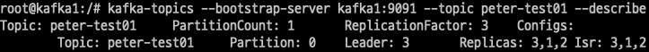

# 4장. 카프카의 내부 동작 원리와 구현

## 1. 카프카 리플리케이션

---

- 고가용성 분산 스트리밍 플렛폼 카프카는 무수히 많은 데이터 파이프라인의 정중앙에 위치하는 메인 허브 역할을 합니다.

→ 따라서 카프카는 초기 설계 단계에서부터 이러한 일시적인 하드웨어 이슈 등으로 브로커 한두 대에서 장애가 발생하더라도 중앙 데이터 허브로서 안정적인 서비스가 운영될 수 있도록 구상됐다.

### 1-1. 리플리케이션 동작 개요

---

- 카프카는 브로커의 장애에도 불구하고 연속적으로 안정적인 서비스 제공함으로써 데이터 유실을 방지하며 유연성을 제공한다.

- 카프카의 리플리케이션 동작을 위해 토픽 생성 시 필숫값으로 `replication factor`라는 옵션을 설정해야 한다.
    - 토픽의 이름은 peter-test01 이며, 카프카의 기본 도구인 `kafka-topics.sh` 명령어를 이용해 토픽을 생성, 파티션 수는 1, 리플리케이션 팩터 수는 3으로 설정한다.
        
        ```bash
        kafka-topics --bootstrap-server kafka1:9091 \
        --create --topic peter-test01 --partitions 1 \
        --replication-factor 3
        
        Created topic peter-test01.
        ```
        
- `describe` 옵션을 이용해 토픽의 상세보기를 출력
    
    ```bash
    kafka-topics --bootstrap-server kafka1:9091 --topic peter-test01 --describe
    ```
    
    
    
    1. peter-test01 토픽의 파티션 수인 1과 리플리케이션 팩터 수인 3이 표시되어 있다.
    2. peter-test01 토픽의 파티션0에 대한 상세 내용
        - 파티션0의 리더는 브로커3을 나타내고, 리플리케이션들은 브로커3, 1, 2에 있음을 나타내며,
        - 현재 동기화되고 있는 리플리케이션들은 브로커 3, 1, 2라는 의미
            
            → 실제로 리플리케이션되는 것은 토픽이 아니라 토픽을 구성하는 각각의 파티션들이라는 점
            
- 콘솔 프로듀서를 이용해 test message1이라는 메시지를 peter-test01 토픽으로 전송
    
    ```bash
    kafka-console-producer --bootstrap-server kafka1:9091 --topic peter-test01
    > message1
    >
    ```
    
- 메시지가 세그먼트 파일에 저장되어 있는지, 카프카에서 제공하는 `kafka-dump-log.sh`라는 명령어를 이용해 세그먼트 파일의 내용을 확인 👉 모든 브로커가 동일한 메시지를 갖고 있음
    
    ```bash
    kafka-dump-log --print-data-log --files /var/lib/kafka/data/peter-test01-0/00000000000000000000.log
    ```
    
    
    
    1. 시작 오프셋 위치는 0임을 알 수 있다.
    2. 메시지 카운트는 1임을 알 수 있다.
    3. 프로듀서를 통해 보낸 메시지는 test message1임을 알 수 있다.

<aside>
💡 N개의 리플리케이션이 있는 경우 N-1까지의 브로커 장애가 발생해도 메시지 손실 없이 안정적으로 메시지를 주고받을 수 있다.

</aside>

### 1-2. 리더와 팔로워

---

- 카프카는 내부적으로 모두 동일한 리플리케이션들을 리더와 팔로워로 구분하고, 각자의 역할을 분담시킨다.
- 리더: 리클리케이션 중 하나가 선정되며, 모든 읽기와 쓰기는 그 리더를 통해서만 가능
    
    
    
    4-1. 리더와 팔로워의 관계
    
    - 프로듀서는 모든 리플리케이션에 메시지를 보내는 것이 아니라 리더에게만 메시지를 전송
    - 컨슈머도 오직 리더로부터 메시지를 가져온다.
- 팔로워: 리더에 문제가 발생하거나 이슈가 있을 경우를 대비해 언제든지 새로운 리더가 될 준비를 해야 한다.
    - 컨슈머가 토픽의 메시지를 꺼내 가는 것과 비슷한 동작으로 지속적으로 파티션의 리더가 새로운 메시지를 받았는지 확인하고, 새로운 메시지가 있다면 해당 메시지를 리더로부터 복제한다.

### 1-3. 복제 유지와 커밋

---

- 리더와 팔로워는 ISR(In Sync Replica)이라는 논리적 그룹으로 묶여 있다.
    - 리더와 팔로워를 별도의 그룹으로 나누는 이유: 기본적으로 해당 그룹 안에 속한 팔로워들만이 새로운 리더의 자격을 가질 수 있기 때문
    - ISR 그룹에 속하지 못한 팔로워는 새로운 리더의 자격을 가질 수 없다.

- ISR 내의 팔로워들은 리더와의 데이터 일치를 유지하기 위해 지속적으로 리더의 데이터를 따라가게 되고, 리더는 ISR 내 모든 팔로워가 메시지를 받을 때까지 기다린다.
    - 팔로워가 네트워크 오류, 브로커 장애 등 여러 이유로 리더로부터 리플리케이션하지 못하는 경우, 이 팔로워에게 새로운 리더를 넘겨준다면 데이터의 정합성이나 메시지 손실 등의 문제가 발생할 수 있다.
    
    ❗따라서 파티션의 리더는 팔로워들이 뒤처지지 않고 리플리케이션 동작을 잘하고 있는지를 감시한다.
    
    💡잘 따라잡고 있는 팔로워들만이 ISR 그룹에 속하게 된다.
    

- 리더는 읽고 쓰는 동작은 물론, 팔로워가 리플리케이션 동작을 잘 수행하고 있는지도 판단한다.
    - 만약 팔로워가 특정 주기의 시간만큼 복제 요청을 하지 않는다면, 리더는 해당 팔로워가 리플리케이션 동작에 문제가 발생했다고 판단해 ISR 그룹에서 추방한다.

- ISR 내에서 모든 팔로워의 복제가 완료되면, 리더는 내부적으로 커밋되었다는 표시를 하게 된다.
    - 하이워터마크(high-water mark): 마지막 커밋 오프셋 위치
    - 커밋이 되었다: 리플리케이션 팩터 수의 모든 리플리케이션이 전부 메시지를 저장했음을 의미
        - 커밋된 메시지만 컨슈머가 읽어갈 수 있다.

- 커밋되지 않은 메시지를 컨슈머가 읽을 수 있게 허용한다면 동일한 토픽의 파티션에서 컨슘했음에도 메시지가 일치하지 않는 현상이 발생할 수 있다.
    
    
    
    4-2. 커밋 메시지 (리플리케이션 동작 전)
    

- 커밋된 위치
    - 모든 브로커는 재시작될 때, 커밋된 메시지를 유지하기 위해 로컬 디스크의 `replication-offset-checkpoint`라는 파일에 마지막 커밋 오프셋 위치를 저장한다.
        
        ```bash
        cat /var/lib/kafka/data/replication-offset-checkpoint
        ```
        
        - `[토픽 이름] [파티션 번호] [커밋된 오프셋 번호]`
            
            
            
            
            
            
            

<aside>
💡 만약 특정 토픽 또는 파티션에 복제가 되지 않거나 문제가 있다고 판단되는 경우, `replication-offset-checkpoint`라는 파일의 내용을 확인하고 리플리케이션되고 있는 다른 브로커들과 비교해 살펴보면, 어떤 브로커, 토픽, 파티션에 문제가 있는지를 파악할 수 있다.

</aside>

### 1-4. 리더와 팔로워의 단계별 리플리케이션 동작

---

- 카프카는 리더와 팔로워 간의 리플리케이션 동작을 처리할 때 서로의 통신을 최소화할 수 있도록 설계함으로써 리더의 부하를 줄였다.

- 리더와 팔로워 간의 리플리케이션
    1. 프로듀서가 토픽으로 메시지를 전송, 리더만 메시지를 저장
        - 나머지 팔로워들은 아직 리더에게 저장된 메시지를 리플리케이션하기 전
    2. 팔로워들은 리더에게 0번 오프셋 메시지 가져오기(fetch) 요청을 보낸 후 새로운 메시지가 있다는 사실을 인지하고 메시지를 리플리케이션 하는 과정
        - 리더는 모든 팔로워가 0번 오프셋 메시지를 리플리케이션하기 위한 요청을 보냈다는 사실을 알고 있다.
        - 하지만 리더는 팔로워들이 0번 오프셋에 대한 리플리케이션 동작을 성공했는지 실패했는지 여부를 알지 못한다.
            - 카프카의 경우에는 리더와 팔로워 사이에서 ACK를 주고받는 통신이 없다.
                
                → ACK 통신을 제거함으로써 리플리케이션 동작의 성능을 더욱 높였다.
                
    3. 리더는 1번 오프셋의 위치에 두 번째 새로운 메시지를 프로듀서로부터 받은 뒤 저장한다.
    4. 팔로워들은 리더에게 1번 오프셋에 대한 리플리케이션을 요청한다.
    5. 팔로워들로부터 1번 오프셋에 대한 리플리케이션 요청을 받은 리더는 팔로워들의 0번 오프셋에 대한 리플리케이션 동작이 성공했음을 인지하고, 오프셋 0에 대해 커밋 표시를 한 후 하이워터마크를 증가시킨다.
    6. 팔로워들로부터 1번 오프셋 메시지에 대한 리플리케이션 요청을 받은 리더는 응답에 0번 오프셋 메시지가 커밋되었다는 내용도 함께 전달한다.
    7. 리더의 응답을 받은 모든 팔로워는 0번 오프셋 메시지가 커밋되었다는 사실을 인지하게 되고, 리더와 동일하게 커밋을 표시한다. 그리고 1번 오프셋 메시지를 리플리케이션한다.

- 카프카에서 리더와 팔로워들의 리플리케이션 동작 방식은 리더가 푸시(push)하는 방식이 아니라 팔로워들이 풀(pull)하는 방식으로 동작하는데,
    - 풀 방식을 채택한 이유도 리플리케이션 동작에서 리더의 부하를 줄여주기 위해서다.

### 1-5. 리더에포크와 복구

---

- 리더에포크(leader epoch): 카프카의 파티션들이 복구 동작을 할 때 메시지의 일관성을 유지하기 위한 용도로 이용된다.
    - 컨트롤러에 의해 관리되는 32비트의 숫자로 표현된다.
    - 리더에포크 정보는 리플리케이션 프로토콜에 의해 전파되고, 새로운 리더가 변경된 후 변경된 리더에 대한 정보는 팔로워에게 전달된다.
    - 복구 동작 시 하이워터마크를 대체하는 수단으로도 활용된다.

- 리더에포크가 없다
    - 1️⃣ 리더에포크를 사용하지 않은 장애 복구 과정
        
        
        
        4-8. 리더에포크를 사용하지 않은 장애 복구 과정 (파티션 수는 1, 리플리케이션 팩터 수는 2, `min.insync.replicas`는 1)
        
        1. 리더는 프로듀서로부터 message1 메시지를 받았고, 0번 오프셋에 저장, 팔로워는 리더에게 0번 오프셋에 대한 가져오기 요청을 한다.
        2. 가져오기 요청을 통해 팔로워는 message1 메시지를 리더로부터 리플리케이션한다.
        3. 리더는 하이워터마크를 1로 올린다.
        4. 리더는 프로듀서로부터 다음 메시지인 message2를 받은 뒤 1번 오프셋에 저장한다.
        5. 팔로워는 다음 메시지인 message2에 대해 리더에게 가져오기 요청을 보내고, 응답으로 리더의 하이워터마크 변화를 감지하고 자신의 하이워터마크도 1로 올린다.
        6. 팔로워는 1번 오프셋의 message2 메시지를 리더로부터 리플리케이션한다.
        7. 팔로워는 2번 오프셋에 대한 요청을 리더에게 보내고, 요청을 받은 리더는 하이워터마크를 2로 올린다.
        8. 팔로워는 2번 오프셋인 message2 메시지까지 리플리케이션을 완료했지만, 아직 리더로부터 하이워터마크를 2로 올리는 내용은 전달받지 못한 상태
        9. 예상하지 못한 장애로 팔로워가 다운된다.
    - 2️⃣ 장애가 발생한 팔로워가 종료된 후 장애 처리가 완료된 상태
        
        
        
        4-9. 장애에서 복구된 팔로워의 상태(리더에포크 사용하지 않음)
        
        - 장애에서 복구된 팔로워는 카프카 프로세스가 시작되면서 내부적으로 메시지 복구 동작을 하게 된다.
        1. 팔로워는 자신이 갖고 있는 메시지들 중에서 자신의 워터마크보다 높은 메시지들은 신뢰할 수 없는 메시지로 판단하고 삭제한다. 따라서 1번 오프셋의 message2는 삭제된다.
        2. 팔로워는 리더에게 1번 오프셋의 새로운 메시지에 대한 가져오기 요청을 보낸다.
        3. 이 순간 리더였던 브로커가 예상치 못한 장애로 다운되면서, 해당 파티션에 유일하게 남아 있던 팔로워가 새로운 리더로 승격된다.
    - 3️⃣ 팔로워가 새로운 리더(뉴리더)로 승격된 후의 상태
        
        
        
        4-10. 팔로워가 새로운 리더로 승격된 후의 상태(리더에포크 사용하지 않음)
        
        - 뉴리더는 message2를 갖고 있지 않다.
            - 리더와 팔로워간의 리플리케이션이 있음에도 불구하고,
            - 리더가 변경되는 과정을 통해 최종적으로 1번 오프셋의 message2 메시지가 손실된 것
- 리더에포크 적용
    - 1️⃣ 팔로워가 장애로 종료된 후 막 복구된 상태 이후의 과정 (리플리케이션 동작 이후)
        
        
        
        4-11. 장애에서 복구된 팔로워의 상태(리더에포크 사용)
        
        - 앞선 동작에서는 카프카 프로세스가 시작되면서 복구 동작을 통해 자신의 하이워터마크보다 높은 메시지를 즉시 삭제했다.
            - 리더에포크를 사용하는 경우에는 하이워터마크보다 높은 메시지를 무조건 삭제하는 것이 아니라 리더에게 리더에포크 요청을 보낸다.
        1. 팔로워는 복구 동작을 하면서 리더에게 리더에포크 요청을 보낸다.
        2. 요청을 받은 리더는 리더에포크의 응답으로 ‘1번 오프셋의 message2까지’라고 팔로워에게 보낸다.
        3. 팔로워는 자신의 하이워터마크보다 높은 1번 오프셋의 message2를 삭제하지 않고, 리더의 응답을 확인한 후 message2까지 자신의 하이워터마크를 상향 조정한다.
    - 2️⃣ 리더가 예상치 못한 장애로 다운되면서 팔로워가 새로운 리더로 승격된 후의 상태
        
        
        
        4-12. 팔로워가 새로운 리더로 승격된 후의 상태(리더에포크 사용)
        
        - 리더에포크를 활용하는 경우에는 삭제 동작을 하기에 앞서 리더에포크 요청과 응답 과정을 통해 팔로워의 하이워터마크를 올릴 수 있었고, 메시지 손실은 발생하지 않았다.

- 리더에포크를 적용하지 않았을 때 발생할 수 있는 또 다른 예제
    - 팔로워가 먼저 복구되어 뉴리더가 되었고 구 리더였던 브로커가 장애에서 복구된 상태
        
        
        
        4-15. 구 리더의 장애 복구 과정(리더에포크 사용하지 않음)
        
    - 리더에포크를 이용해 복구: 뉴리더가 자신이 팔로워일 때의 하이워터마크와 뉴리더일 때의 하이워터마크를 알고 있다.
        
        
        
        4-16. 구 리더의 장애 복구 과정(리더에포크 사용)
        
        1. 구 리더였던 브로커가 장애에서 복구된다.
        2. peter-test01 토픽의 0번 파티션에 이미 리더가 있고 자신은 팔로워가 된다.
        3. 팔로워는 뉴리더에게 리더에포크 요청을 보낸다.
        4. 뉴리더는 0번 오프셋까지 유효하다고 응답한다.
        5. 팔로워는 메시지 일관성을 위해 로컬 파일에서 1번 오프셋인 message2를 삭제한다.(팔로워는 쓰기 권한이 없으므로, 리더에게 message2를 추가할 수 없다)
        6. 팔로워는 리더로부터 1번 오프셋인 message3을 리플리케이션하기 위해 준비한다.

- 리더에포크의 변화과정 실습
    - 토픽을 하나 생성
        
        ```bash
        kafka-topics --bootstrap-server kafka1:9091 --create --topic peter-test02 \
        --partitions 1 --replication-factor 2
        ```
        
    - 토픽 상세보기
        
        ```bash
        kafka-topics --bootstrap-server kafka1:9091 --topic peter-test02 --describe
        ```
        
        
        
        - 리더는 1번 브로커이며, 팔로워는 2번 브로커
    - 리더에포크 상태를 확인: `leader-epoch-checkpoint` 파일
        
        ```bash
        cat /var/lib/kafka/data/peter-test02-0/leader-epoch-checkpoint
        ```
        
        
        
        1. 1은 현재의 리더에포크 번호
        2. 첫 번째 0은 리더에포크 번호, 두 번째 0은 최종 커밋 후 새로운 메시지를 전송받게 될 오프셋 번호
        
        
        
        4-17. 리더에포크 상태(1)
        
    - 파티션의 변화를 주기 위해 콘솔 프로듀서를 이용해 메시지를 하나 전송
        
        ```bash
        kafka-console-producer --bootstrap-server kafka1:9091 --topic peter-test02
        >message1
        >
        ```
        
        - 리더에포크의 상태는 조금 전 확인한 사항과 달라진 것이 없다.
            
            ```bash
            root@kafka1:/# cat /var/lib/kafka/data/peter-test02-0/leader-epoch-checkpoint
            0
            1
            0 0
            ```
            
            ```bash
            root@kafka1:/# cat /var/lib/kafka/data/replication-offset-checkpoint | grep peter-test02
            peter-test02 0 1
            ```
            
        - 리플리케이션 동작으로 팔로워까지 저장된 상태
            
            
            
            4-18. 리더에포크 상태(2)
            
        - 리더에포크는 새로운 리더 선출이 발생하면, 변경된 정보가 업데이트된다.
    - 강제로 새로운 리더를 선출하도록 리더가 위치한 브로커1을 종료
        
        ```bash
        # docker 컨테이너에서 실행 시 아래와 같이 실패
        root@kafka1:/# systemctl stop kafka-server
        Failed to get D-Bus connection: Unknown error -1
        ```
        
        ```bash
        root@kafka1:/# ps -elf | grep kafka
        4 S root         1     0  2  80   0 - 1792509 futex_ 01:39 ?      00:06:23 /usr/bin/qemu-x86_64 /usr/bin/java java -Xmx1G -Xms1G -server -XX:+UseG1GC -XX:MaxGCPauseMillis=20 -XX:InitiatingHeapOccupancyPercent=35 -XX:+ExplicitGCInvokesConcurrent -XX:MaxInlineLevel=15 -Djava.awt.headless=true -Xloggc:/var/log/kafka/kafkaServer-gc.log -verbose:gc -XX:+PrintGCDetails -XX:+PrintGCDateStamps -XX:+PrintGCTimeStamps -XX:+UseGCLogFileRotation -XX:NumberOfGCLogFiles=10 -XX:GCLogFileSize=100M -Dcom.sun.management.jmxremote=true -Dcom.sun.management.jmxremote.authenticate=false -Dcom.sun.management.jmxremote.ssl=false -Djava.rmi.server.hostname=172.19.0.6 -Dcom.sun.management.jmxremote.local.only=false -Dcom.sun.management.jmxremote.rmi.port=9991 -Dcom.sun.management.jmxremote.port=9991 -Dcom.sun.management.jmxremote.port=9991 -Dkafka.logs.dir=/var/log/kafka -Dlog4j.configuration=file:/etc/kafka/log4j.properties -cp /usr/bin/../share/java/kafka/*:/usr/bin/../support-metrics-client/build/dependant-libs-2.12/*:/usr/bin/../support-metrics-client/build/libs/*:/usr/share/java/support-metrics-client/* io.confluent.support.metrics.SupportedKafka /etc/kafka/kafka.properties
        0 S root       857   402  1  80   0 - 1044794 futex_ 04:54 pts/0  00:00:13 /usr/bin/qemu-x86_64 /usr/bin/java java -Xmx512M -server -XX:+UseG1GC -XX:MaxGCPauseMillis=20 -XX:InitiatingHeapOccupancyPercent=35 -XX:+ExplicitGCInvokesConcurrent -XX:MaxInlineLevel=15 -Djava.awt.headless=true -Dcom.sun.management.jmxremote -Dcom.sun.management.jmxremote.authenticate=false -Dcom.sun.management.jmxremote.ssl=false -Dkafka.logs.dir=/var/log/kafka -Dlog4j.configuration=file:/etc/kafka/tools-log4j.properties -cp /usr/bin/../share/java/kafka/*:/usr/bin/../support-metrics-client/build/dependant-libs-2.12/*:/usr/bin/../support-metrics-client/build/libs/*:/usr/share/java/support-metrics-client/* kafka.tools.ConsoleProducer --bootstrap-server kafka1:9091 --topic peter-test02
        0 S root      1052   590  0  80   0 - 40269 pipe_r 05:13 pts/1    00:00:00 /usr/bin/qemu-x86_64 /bin/grep grep kafka
        **root@kafka1:/# kafka-server-stop**
        root@kafka1:/# ps -elf | grep kafka
        4 S root         1     0 91  80   0 - 1782067 futex_ 05:13 ?      00:00:34 /usr/bin/qemu-x86_64 /usr/bin/java java -Xmx1G -Xms1G -server -XX:+UseG1GC -XX:MaxGCPauseMillis=20 -XX:InitiatingHeapOccupancyPercent=35 -XX:+ExplicitGCInvokesConcurrent -XX:MaxInlineLevel=15 -Djava.awt.headless=true -Xloggc:/var/log/kafka/kafkaServer-gc.log -verbose:gc -XX:+PrintGCDetails -XX:+PrintGCDateStamps -XX:+PrintGCTimeStamps -XX:+UseGCLogFileRotation -XX:NumberOfGCLogFiles=10 -XX:GCLogFileSize=100M -Dcom.sun.management.jmxremote=true -Dcom.sun.management.jmxremote.authenticate=false -Dcom.sun.management.jmxremote.ssl=false -Djava.rmi.server.hostname=172.19.0.6 -Dcom.sun.management.jmxremote.local.only=false -Dcom.sun.management.jmxremote.rmi.port=9991 -Dcom.sun.management.jmxremote.port=9991 -Dcom.sun.management.jmxremote.port=9991 -Dkafka.logs.dir=/var/log/kafka -Dlog4j.configuration=file:/etc/kafka/log4j.properties -cp /usr/bin/../share/java/kafka/*:/usr/bin/../support-metrics-client/build/dependant-libs-2.12/*:/usr/bin/../support-metrics-client/build/libs/*:/usr/share/java/support-metrics-client/* io.confluent.support.metrics.SupportedKafka /etc/kafka/kafka.properties
        4 S root       398   343  0  80   0 - 40269 pipe_r 05:14 pts/0    00:00:00 /usr/bin/qemu-x86_64 /bin/grep grep kafka
        ```
        
        
        
    - 현재의 리더에포크 상태를 확인
        - 2번 브로커로 접속한 후 다음 명령어를 실행
            
            ```bash
            cat /var/lib/kafka/data/peter-test02-0/leader-epoch-checkpoint
            ```
            
            
            
            1. 현재의 리더에포크 번호. 브로커1이 종료되면서 새로운 리더 선출이 있었고, 리더에포크는 1에서 2로 변경됐다. 리더에포크 번호는 리더가 변경될 때마다 하나씩 숫자가 증가한다.
            2. 첫 번째 0은 리더에포크 번호, 두번째 0은 최종 커밋 후 새로운 메시지를 전송받게 될 오프셋 번호
            3. 첫 번째 6(책에서는 1)은 리더에포크 번호, 두번째 1은 최종 커밋 후 새로운 메시지를 전송 받게 될 오프셋 번호
        - 현재 상태를 다시 업데이트한 상태
            
            
            
            4-19. 리더에포크 상태(3)
            
            - 리더 브로커 1번이 다운되면서 리더에포크 번호는 1에서 2로, 1 증가했다.
                - 리더에포크는 하나씩 증가
            - 리더에포크 번호가 1이었을 때를 기준으로 가장 마지막에 커밋된 후 새로 메시지를 받게 될 오프셋 번호를 기록한다.
                - 가장 마지막에 커밋된 오프셋 번호는 0
            - 다운됐던 브로커1(구 리더)은  `leader-epoch-checkpoint` 파일에 기록된 정보를 이용해 복구 동작을 하게 된다.
                - 구 리더는 종료 직전 마지막 리더에포크 번호가 1이므로 뉴리더에게 1번 리더에포크에 대한 요청을 보내고,
                - 뉴리더는 1번 리더에포크의 최종 커밋 후 준비된 오프셋 위치가 1이라는 응답을 보낸다.
    - 종료됐던 브로커1을 정상화
        
        ```bash
        # linux
        root@kafka1:/# systemctl start kafka-server
        ```
        
        
        
    - 메시지 하나 더 보내고 브로커1 종료
        
        
        
        
        
        - 마지막 줄: 리더에포크 번호 2, 최종 커밋 오프셋 3
        - 브로커1 재시작(동기화가 안되어있음)
            
            
            
        - 메시지 하나 더 보내면
            
            ```bash
            root@kafka1:/# kafka-console-producer --bootstrap-server kafka1:9091 --topic peter-test02
            >message3or4
            ```
            
        - 이제 브로커 1, 2 둘 다 동기화 된다.
            
            
            

## 2. 컨트롤러

---

- 컨트롤러: 리더 선출을 맡고 있음. 카프카 클러스터 중 하나의 브로커가 컨트롤러 역할
    - 파티션의 ISR 리스트 중에서 리더를 선출
    - 리더를 선출하기 위한 ISR 리스트 정보는, 가용성 보장을 위해 주키퍼에 저장되어 있다.
    - 브로커가 실패하는 것을 예의주시하고 있으며, 만약 브로커의 실패가 감지되면 즉시 ISR 리스트 중 하나를 새로운 파티션 리더로 선출한다.
    - 새로운 리더의 정보를 주키퍼에 기록하고, 변경된 정보를 모든 브로커에게 전달한다.

- 리더가 없는 상태
    - 카프카 클라이언트인 프로듀서나 컨슈머가 해당 파티션으로 읽기나 쓰기가 불가능
    - 모든 읽기/쓰기 동작은 실패하게 되고, 클라이언트에 설정되어 있는 재시도 숫자만큼 재시도를 하게 된다.

- 1️⃣ 예기치 않은 장애로 인한 리더 선출 과정: 0번 파티션의 리더가 있는 1번 브로커를 강제로 종료하고, 새로운 파티션의 리더가 선출되는 과정
    
    
    
    4-20. 예기치 않은 장애로 인한 리더 선출 과정
    
    1. 파티션 0번의 리더가 있는 브로커 1번이 예기치 않게 다운된다.
    2. 주키퍼는 1번 브로커와 연결이 끊어진 후, 0번 파티션의 ISR에서 변화가 생겼음을 감지한다.
    3. 컨트롤러는 주키퍼 워치를 통해 0번 파티션에 변화가 생긴 것을 감지하고, 해당 파티션 ISR 중 3번을 새로운 리더로 선출한다.
    4. 컨트롤러는 0번 파티션의 새로운 리더가 3이라는 정보를 주키퍼에 기록한다.
    5. 이렇게 갱신된 정보는 현재 활성화 상태인 모든 브로커에게 전파된다.

- 2018년 11월 릴리스된 카프카 버전 1.1.0부터는 리더 선출 작업 속도가 빨라졌다.
    - 카프카 버전 1.0.0에서 6분 30초 소요되던 작업이, 불필요한 로깅을 없애고 주키퍼 비동기 API가 반영된 카프카 1.1.0에서는 약 3초 만에 완료됐다.

- 2️⃣ 제어된 종료 과정에서의 리더 선출 작업 👉 파티션들의 다운타임을 최소화 할 수 있다, 브로커는 자신의 모든 로그를 디스크에 동기화한 후 종료되므로, 이후 다시 브로커가 재시작할 때 로그 복구 시간이 짧다.
    
    
    
    4-21. 제어된 종료 과정
    
    1. 관리자가 브로커 종료 명령어를 실행하고, SIG_TERM 신호가 브로커에게 전달된다.
    2. SIG_TERM 신호를 받은 브로커는 컨트롤러에게 알린다.
    3. 컨트롤러는 리더 선출 작업을 진행하고, 해당 정보를 주키퍼에 기록한다.
    4. 컨트롤러는 새로운 리더 정보를 다른 브로커들에게 전송한다.
    5. 컨트롤러는 종료 요청을 보낸 브로커에게 정상 종료한다는 응답을 보낸다.
    6. 응답을 받은 브로커는 캐시에 있는 내용을 디스크에 저장하고 종료한다.
- 제어된 종료를 사용하려면  → `control.shutdown.enable = true` 설정이 브로커의 설정 파일인 `server.properties`에 적용되어야 한다.

- 카프카에서 제공하는 `kafka-configs.sh` 명령어를 이용하고 `--broker` 옵션과 확인하고자 하는 브로커 아이디를 명시하면 현재의 브로커 설정을 확인할 수 있다.
    
    ```bash
    kafka-configs --bootstrap-server kafka1:9091 --broker 1 --describe --all
    ```
    
    
    

## 3. 로그(로그 세그먼트)

---

- 카프카의 토픽으로 들어오는 메시지(레코드)는 세그먼트(segement, 로그 세그먼트라고도 함)라는 파일에 저장된다.
    - 메시지는 정해진 형식에 맞추어 순차적으로 로그 세그먼트 파일에 저장된다.
    - 메시지의 내용만 저장되는 것이 아니라 메시지의 키, 밸류, 오프셋, 메시지 크기 같은 정보가 함께 저장되며, 로그 세그먼트 파일들은 브로커의 로컬 디스크에 보관된다.
- 하나의 로그 세그먼트 크기가 너무 커져버리면 파일을 관리하기 어렵기 때문에, 로그 세그먼트의 최대 크기는 1GB가 기본값으로 설정되어 있다.
    - 1GB보다 커지는 경우에는 기본적으로 롤링(rolling) 전략을 적용한다.
        
        → 로그 세그먼트의 크기가 1GB에 도달하면 해당 세그먼트 파일을 클로즈(close)하고, 새로운 로그 세그먼트를 생성하는 방식
        
- 파일이 무한히 늘어날 경우를 대비해 로그 세그먼트에 대한 관리 계획을 수립해야 한다.
    - 로그 세그먼트 삭제
    - 컴팩션(compaction)

### 3-1. 로그 세그먼트 삭제

---

- 로그 세그먼트 삭제 옵션은 브로커의 설정 파일인 `server.properties`에서 `log.cleanup.policy`가 `delete`로 명시되어야 한다 👉 기본값

- 로그 세그먼트 삭제 실습
    - 토픽을 생성
        
        ```bash
        kafka-topics --bootstrap-server kafka1:9091 --create --topic peter-test03 \
        --partitions 1 --replication-factor 3
        ```
        
    - 토픽에 콘솔 프로듀서를 이용해 메시지를 전송
        
        ```bash
        kafka-console-producer --bootstrap-server kafka1:9091 --topic peter-test03
        >log1
        ```
        
    - 콘솔 컨슈머를 이용해 토픽의 메시지를 가져온다. `--from-beginning` 옵션을 추가해서 강제로 토픽의 처음부터 메시지를 가져올 수 있게 해보자.
        
        ```bash
        kafka-console-consumer --bootstrap-server kafka1:9091 --topic peter-test03 \
        --from-beginning
        ```
        
        
        
    - 토픽에 `retention.ms` 옵션을 조정해서 메시지를 삭제해보자. 카프카에서 기본 제공하는 도구 중 `kafka-configs.sh` 명령어를 이용
        
        ```bash
        [kafka-config](http://kafka-config.sh)s --bootstrap-server kafka1:9091 --topic peter-test03 \
        --add-config retention.ms=0 --alter
        ```
        
        - `retention.ms=0`: 로그 세그먼트 보관 시간이 해당 숫자보다 크면 세그먼트를 삭제
    - 설정한 내용이 잘 반영됐는지 확인
        
        ```bash
        kafka-topics --bootstrap-server kafka1:9091 --topic peter-test03 --describe
        ```
        
        
        
    - 삭제가 일어나기 전, 현재의 로그 세그먼트 상태
        
        
        
        - `00000000000000000000.index`: 로그 세그먼트에 저장된 위치와 오프셋 정보를 기록하는 파일
        - `00000000000000000000.log`: 실제 메시지들이 저장되는 파일
        - `00000000000000000000.timeindex`: 메시지의 타임스탬프를 기록하는 파일
    - 다시 로그 세그먼트 상태를 확인 → 보관 주기가 지나 모두 삭제되고 새로운 로그 세그먼트 파일이 생성
        
        
        
        - `00000000000000000000`으로 시작하는 파일은 모두 삭제되고, `00000000000000000001`로 시작하는 파일들이 새로 생성됐다.
    - `retention.ms` 옵션을 삭제
        
        ```bash
        [kafka-config](http://kafka-config.sh)s --bootstrap-server kafka1:9091 --topic peter-test03 \
        --delete-config retention.ms --alter
        ```
        
        
        

- 로그 세그먼트의 삭제 작업은 일정 주기를 가지고 체크 → 카프카의 기본값은 5분 주기
- 카프카에서는 로그 세그먼트 파일을 생성할 때 오프셋 시작 번호를 이용해 파일 이름을 생성하는 규칙
    - 2개의 메시지를 보내고 삭제하는 실습을 했다면 `00000000000000000002.log`와 같은 형태의 로그 세그먼트 파일이 생성됐을 것이다.
- 관리자가 토픽에 별도의 `retention.ms` 옵션을 설정하지 않으면, 카프카의 `server.properties`에 적용된 옵션값이 적용된다 → 카프카의 기본값은 7일
- `retention.bytes`라는 옵션을 이용해 지정된 크기를 기준으로도 로그 세그먼트를 삭제할 수 있다.

### 3-2. 로그 세그먼트 컴팩션

---

- 컴팩션(compaction): 로그를 삭제하지 않고 컴팩션하여 보관할 수 있다.
    - 로그 컴팩션은 기본적으로 로컬 디스크에 저장되어 있는 세그먼트를 대상으로 실행
    - 현재 활성화된 세그먼트는 제외하고 나머지 세그먼트들을 대상으로 컴팩션이 실행된다.
    - 카프카에서 로그 세그먼트를 컴팩션하면 메시지(레코드)의 키값을 기준으로 마지막의 데이터만 보관하게 된다.

- 로그 컴팩션 기능을 이용하는 대표적인 예제: 카프카의 `__consumer_offset` 토픽
    - 카프카의 내부 토픽
    - 컨슈머 그룹의 정보를 저장하는 토픽
    - 각 컨슈머 그룹의 중요한 정보는 해당 컨슈머 그룹이 어디까지 읽었는지를 나타내는 오프셋 커밋 정보인데, `__consumer_offset`에 키(컨슈머 그룹명, 토픽명)와 밸류(오프셋 커밋 정보) 형태로 메시지가 저장된다.
    
    ❗컨슈머 그룹은 항상 마지막으로 커밋된 오프셋 정보가 중요하므로, 과거에 커밋된 정보들은 삭제돼도 무방하다.
    

- 로그 컴팩션은 메시지의 키값을 기준으로 과거 정보는 중요하지 않고 가장 마지막 값이 필요한 경우에 사용한다.
- 로그 컴팩션 기능을 사용하고자 한다면, 카프카로 메시지를 전송할 때 키도 필숫값으로 전송해야 한다.
    - 밸류는 필숫값이지만 키는 필숫값이 아니다.

)](./images/4/Untitled%2034.png)

4-22. 로그 컴팩션 과정([출처](https://medium.com/swlh/introduction-to-topic-log-compaction-in-apache-kafka-3e4d4afd2262))

- 로그 컴팩션의 장점: 빠른 장애 복구
    - 장애 복구 시 전체 로그를 복구하지 않고, 메시지의 키를 기준으로 최신의 상태만 복구한다.
    - 키값을 기준으로 최종값만 필요한 워크로드에 적용하는 것이 바람직하다.

- 로그 컴팩션 작업이 실행되는 동안 브로커의 과도한 입출력 부하가 발생할 수 있으니 유의해야 한다.
    
    ❗반드시 브로커의 리소스 모니터링도 병행하여 로그 컴팩션을 사용하기를 권장
    

- 로그 컴팩션 관련 옵션
    
    
    | 옵션 이름 | 옵션값 | 적용 범위 | 설명 |
    | --- | --- | --- | --- |
    | cleanup.policy | compact | 토픽의 옵션으로 적용 | 토픽 레벨에서 로그 컴팩션을 설정할 때 적용하는 옵션 |
    | log.cleanup.policy | compact | 브로커의 설정 파일에 적용 | 브로커 레벨에서 로그 컴팩션을 설정할 때 적용하는 옵션 |
    | log.cleaner.min.compaction.lag.ms | 0 | 브로커의 설정 파일에 적용 | 메시지가 기록된 후 컴팩션하기 전 경과되어야 할 최소시간을 지정합니다. 만약 이 옵션을 설정하지 않으면 마지막 세그먼트를 제외하고 모든 세그먼트를 컴팩션 할 수 있습니다. |
    | log.cleaner.max.compaction.lag.ms | 92233720368… | 브로커에 설정 파일에 적용 | 메시지가 기록된 후 컴팩션하기 전 경과되어야 할 최대 시간을 지정 |
    | log.cleaner.min.cleanable.ratio | 0.5 | 브로커의 설정 파일에 적용 | 로그에서 압축이 되지 않은 부분을 더티(dirty)라고 표현합니다. ‘전체로그’ 대비 ‘더티’의 비율이 50%가 넘으면 로그 캠펴션이 실행됩니다. |

- 참고
    - [https://zeroco.tistory.com/106?category=1005456](https://zeroco.tistory.com/106?category=1005456)
    - [https://hoing.io/archives/57594](https://hoing.io/archives/57594)
