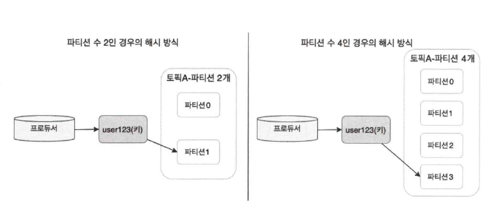

# 5장. 프로듀서의 내부 동작 원리와 구현

- 프로듀서가 전송하려는 메시지들은 프로듀서의 `send()` 메소드를 통해 시리얼라이저, 파티셔너를 거쳐 카프카로 전송된다.

## 1. 파티셔너

---

- 카프카의 토픽은 성능 향상을 위한 병렬 처리가 가능하도록 하기 위해 파티션으로 나뉘고, 최소 하나 또는 둘 이상의 파티션으로 구성된다.
- 카프카로 전송한 메시지는 해당 토픽 내 각 파티션의 로그 세그먼트에 저장된다.

- 파티셔너: 토픽으로 메시지를 보낼 때 해당 토픽의 어느 파티션으로 메시지를 보내야 할지를 결정
- 파티션을 결정하는 알고리즘: 메시지(레코드)의 키를 해시(hash) 처리해 파티션을 구하는 방식
    - 메시지의 키값이 동일하면 해당 메시지들은 모두 같은 파티션으로 전송된다.

- 토픽의 파티션을 늘릴 수 있는 기능
    - 파티션 수가 변경됨과 동시에, 메시지의 키와 매핑된 해시 테이블도 변경된다.
    - 동일한 메시지의 키를 이용해 메시지를 전송하더라도 파티션의 수를 늘린 후에는 다른 파티션으로 전송될 수 있다.



5-1. 파티션 수 증가에 따른 해시 변경 방식

<aside>
💡 메시지의 키를 이용해 카프카로 메시지를 전송하는 경우, 관리자의 의도와는 다른 방식으로 메시지 전송이 이뤄질 수 있으므로 되도록 파티션 수를 변경하지 않는 것을 권장

</aside>

### 1-1. 라운드 로빈 전략

---

- 프로듀서의 메시지 중 레코드(메시지)의 키값은 필숫값이 아니므로, 관리자는 별도의 레코드 키값을 지정하지 않고 메시지를 전송할 수 있다.
- 만약 키값을 지정하지 않는다면 키값은 `null`이 되고, 기본값인 라운드 로빈(round-robin) 알고리즘을 사용해 프로듀서는 목적지 토픽의 파티션들로 레코드들을 랜덤 전송한다.
- 파티셔너를 거친 후의 레코드들은 배치 처리를 위해 프로듀서의 버퍼 메모리 영역에서 잠시 대기한 후 카프카로 전송된다.
    - 배치 처리를 위해 잠시 메시지들이 대기하는 과정에서 라운드 로빈 전략은 효율을 떨어뜨릴 수 있다.
        
        
        
        5-2. 키값이 `null`인 라운드 로빈 전략
        
        - 레코드가 파티셔너를 거쳐 지나갔지만 카프카로 전송되지 못한 채 프로듀서 내에서 대기
            
            → 파티션별 최소 레코드 수의 기준인 3을 충족하지 못했기 때문
            

### 1-2. 스티키 파티셔닝 전략

---

- 라운드 로빈 전략에서 지연시간이 불필요하게 증가되는 비효율적인 전송을 개선하고자 2019년 출시된 아파치 카프카 2.4 버전부터는 스티키 파티셔닝 전략을 사용하게 된다.
- 스티키 파티셔닝: 하나의 파티션에 레코드 수를 먼저 채워서 카프카로 빠르게 배치 전송하는 전략
    
    
    
    5-3. 스티키 파티셔닝 전략
    
- 컨플루언트에서 공개한 [블로그 글](https://www.confluent.io/blog/apache-kafka-producer-improvements-sticky-partitioner/)에 따르면, 스티키 파티셔닝 전략을 적용함으로써 기본 설정에 비해 약 30% 이상 지연시간이 감소하고 프로듀서의 CPU 사용률도 줄어드는 효과를 얻을 수 있었다.

<aside>
💡 카프카로 전송하는 메시지의 순서가 그다지 중요하지 않은 경우라면 스티키 파티셔닝 전략을 적용하기를 권장한다.

</aside>

## 2. 프로듀서의 배치

---

- 카프카에서는 토픽의 처리량을 높이기 위한 방법으로 토픽을 파티션으로 나눠 처리하며, 카프카 클라이언트인 프로듀서에서는 처리량을 높이기 위해 배치 전송을 권장한다.
    
    
    
    5-4. 프로듀서의 배치 구성도
    
- 프로듀서는 배치 전송을 위해 다음과 같은 옵션들을 제공한다.
    - `buffer.memory`
        - 카프카로 메시지들을 전송하기 위해 담아두는 프로듀서의 버퍼 메모리 옵션 (기본값: 32MB)
    - `batch.size`
        - 배치 전송을 위해 메시지(레코드)들을 묶는 단위를 설정하는 배치 크기 옵션 (기본값: 16KB)
    - `linger.ms`
        - 배치 전송을 위해 버퍼 메모리에서 대기하는 메시지들의 최대 대기시간을 설정하는 옵션 (기본값: 0ms)
        - 기본값 0으로 설정하면, 배치 전송을 위해 기다리지 않고 메시지들이 즉시 전송된다.

- 카프카를 사용하는 목적에 따라 처리량을 높일지, 아니면 지연 없는 전송을 해야 할지 선택을 해야 한다.
- 사용자가 프로듀서의 높은 처리량을 목표로 배치 전송을 설정하는 경우 주의해야 할 사항 → 버퍼 메모리 크기가 충분히 커야 한다.
    - `buffer.meomry` 크기는 반드시 `batch.size`보다 커야 한다.
- 압축 기능을 같이 사용한다면, 프로듀서는 메시지들을 더욱 효율적으로 카프카로 전송할 수 있다.
    - 높은 압축률을 선호한다면 `gzip`, `zstd`
    - 낮은 지연시간을 선호한다면 `lz4`, `snappy`

## 3. 중복 없는 전송

---

- 메시지 시스템들의 메시지 전송 방식
    - 적어도 한 번 전송(at-least-once) 👉 카프카는 기본적으로 적어도 한 번 전송 방식을 기반으로 동작
        
        
        
        5-5. 적어도 한 번 전송 과정
        
        - 프로듀서 입장에서는 브로커가 메시지를 저장하고 ACK만 전송하지 못한 것인지, 메시지를 저장하지 못해서 ACK를 전송하지 않은 것인지는 정확히 알 수 없다.
        - 메시지B에 대한 ACK를 받지 못한 프로듀서는 적어도 한 번 전송 방식에 따라 메시지B를 다시 한번 전송
        - 네트워크의 회선 장애나 기타 장애 상황에 따라 일부 메시지 중복이 발생할 수는 있지만, 최소한 하나의 메시지는 반드시 보장한다는 것이 적어도 한 번 전송 방식
    - 최대 한 번 전송(at-most-once)
        
        
        
        5-6. 최대 한 번 전송 과정
        
        - 최대 한 번 전송은 ACK를 받지 못하더라도 재전송을 하지 않는다.
        - 프로듀서는 메시지의 중복 가능성을 회피하기 위해 재전송을 하지 않는다 → 일부 메시지의 손실을 감안하더라도 중복 전송은 하지 않는 경우
            - 높은 처리량을 필요로 하는 대량의 로그 수집이나 IoT 같은 환경에서 사용하곤 한다.
    - 정확히 한 번 전송(exactly-once) 👉 카프카의 0.1.1 버전에서 추가됐다.
        
        
        
        5-7. 중복 없는 전송 과정
        
        - 프로듀서가 재전송한 메시지B의 헤더에서 PID(0)와 메시지 번호(1)를 비교해서 메시지B가 이미 브로커에 저장되어 있는 것을 확인한 브로커는 메시지를 중복 저장하지 않고 ACK만 보낸다 → 브로커에 저장된 메시지는 중복을 피할 수 있게 된다.

- 중복 없는 전송의 핵심: PID와 메시지 번호(시퀀스 번호)
    - 프로듀서가 중복 없는 전송을 시작하면, 프로듀서는 고유한 PID를 할당받게 되고, 이 PID와 메시지에 대한 번호를 메시지의 헤더에 포함해 메시지를 전송한다.
    - 브로커에서는 각 메시지마다 PID 값과 시퀀스 번호를 메모리에 유지하게 되며, 이 정보를 이용해 브로커에 기록된 메시지들의 중복 여부를 알 수 있다.
        - PID는 사용자가 별도로 생성하는 것이 아니며 프로듀서에 의해 자동 생성된다.
            - 사용자에게 따로 노출되지 않는다.
        - 메시지마다 부여되는 시퀀스 번호는 0번부터 시작해 순차적으로 증가한다.
    - 프로듀서에서 시퀀스 번호를 메시지마다 순차적으로 증가시키는 방법과 동일하게, 브로커에서도 기록되는 메시지들에 대해 시퀀스 번호를 증가시킨다.
        
        → 프로듀서가 보낸 메시지의 시퀀스 번호가 브로커가 갖고 있는 시퀀스 번호보다 정확하게 하나 큰 경우가 아니라면, 브로커는 프로듀서의 메시지를 저장하지 않는다 👉 메시지 중복을 피할 수 있는 것
        
    - PID와 시퀀스 번호 정보는 브로커의 메모리에 유지되고, 리플리케이션 로그에도 저장된다.
        
        → 예기치 못한 브로커의 장애 등으로 리더가 변경되는 일이 발생하더라도 새로운 리더가 PID와 시퀀스 번호를 정확히 알 수 있으므로 중복 없는 메시지 전송이 가능
        
    - 컨플루언트 [블로그 글](https://www.confluent.io/blog/exactly-once-semantics-are-possible-heres-how-apache-kafka-does-it/)에 따르면, 중복 없는 전송을 적용한 후 기존 대비 최대 약 20% 정도만 성능이 감소했다.
    
    ❗프로듀서 전송 성능에 그다지 민감하지 않은 상황에서 중복 없는 메시지 전송이 필요다하면 이 방식을 설정해 적용할 것을 권장
    
    | 프로듀서 옵션 | 값 | 설명 |
    | --- | --- | --- |
    | enable.idempotence | true | 프로듀서가 중복 없는 전송을 허용할지 결정하는 옵션이다. 기본 값은 false이므로, 이 옵션을 설정하기 원한다면 true로 변경해야 한다. true로 변경 시 다음에 나오는 옵션들도 반드시 변경해야 한다. 그렇지 않으면 ConfigException이 발생한다. |
    | max.in.flight.requests.per.connection | 1 ~ 5 | ACK를 받지 않은 상태에서 하나의 커넥션에서 보낼 수 있는 최대 요청수이다. 기본 값은 5이며, 5 이하로 설정해야 한다. |
    | acks | all | 프로듀서 acks와 관련된 옵션으로서, 기본값은 1이며 all로 설정해야 한다. |
    | retries | 5 | ACK를 받지 못한 경우 재시도를 해야 하므로 0보다 큰 값으로 설정해야 한다. |
- 프로듀서의 설정과 내용 실습
    - 토픽 생성
        
        ```bash
        root@kafka1:/# kafka-topics --bootstrap-server kafka1:9091 --create --topic peter-test04 --partitions 1 --replication-factor 3
        Created topic peter-test04.
        ```
        
        
        
    - `vi` 설치
        
        ```bash
        root@kafka1:/# apt-get update
        root@kafka1:/# apt-get install vim
        ```
        
    - 중복 없는 전송을 위한 `producer.config` 파일 생성
        - `ack` 옵션을 추가 x → 중복 없는 전송을 위한 필숫값인 acks 옵션을 추가하지 않았을 때 👉 중복 없는 전송을 위한 일부 조건이 충족되지 않았기 때문에 `ConfigException`이 발생
            
            ```bash
            enable.idempotence=true
            max.in.flight.requests.per.connection=5
            retries=5
            ```
            
            - 프로듀서 설정 파일을 로드, `--producer.config`라는 옵션을 추가해 명령어를 입력
                
                ```bash
                root@kafka1:/# kafka-console-producer --bootstrap-server kafka1:9091 --topic peter-test04 --producer.config /producer.config
                org.apache.kafka.common.config.ConfigException: Must set acks to all in order to use the idempotent producer. Otherwise we cannot guarantee idempotence.
                	at org.apache.kafka.clients.producer.ProducerConfig.maybeOverrideAcksAndRetries(ProducerConfig.java:439)
                	at org.apache.kafka.clients.producer.ProducerConfig.postProcessParsedConfig(ProducerConfig.java:400)
                	at org.apache.kafka.common.config.AbstractConfig.<init>(AbstractConfig.java:110)
                	at org.apache.kafka.common.config.AbstractConfig.<init>(AbstractConfig.java:129)
                	at org.apache.kafka.clients.producer.ProducerConfig.<init>(ProducerConfig.java:481)
                	at org.apache.kafka.clients.producer.KafkaProducer.<init>(KafkaProducer.java:326)
                	at org.apache.kafka.clients.producer.KafkaProducer.<init>(KafkaProducer.java:298)
                	at kafka.tools.ConsoleProducer$.main(ConsoleProducer.scala:45)
                	at kafka.tools.ConsoleProducer.main(ConsoleProducer.scala)
                ```
                
        - `ack=all`을 추가한 후 콘솔 프로듀서를 다시 실행 → 메시지를 입력할 수 있는 `>` 커맨드가 나타난다. 메시지를 전송한 후 콘솔 프로듀서를 종료.
            
            ```bash
            root@kafka3:/var/lib/kafka/data/peter-test04-0# ls
            00000000000000000000.index  00000000000000000000.timeindex
            00000000000000000000.log    leader-epoch-checkpoint
            ```
            
            ```bash
            root@kafka1:/# kafka-console-producer --bootstrap-server kafka1:9091 --topic peter-test04 --producer.config /producer.config
            >exactly once1
            >
            ```
            
    - 브로커의 토픽 메시지가 저장된 경로로 이동(`/data/kafka-logs`) 👉 도커로 설치한 경우 `/var/lib/kafka/data`
        - `—-bootstrap-server` 다시보기
            - (참고) 토픽 생성 시 `--zookeeper`가 아니라 `--bootstrap-server` 옵션을 사용하는 이유는 카프카 2.1을 포함한 이전 버전에서는 일부 카프카 커맨드 라인 툴이 주키퍼와 직접 통신하여 명령을 실행했으나, 카프카 2.2 버전 이후로는 주키퍼와 통신하는 대신 카프카를 통해 토픽과 관련된 명령을 실행할 수 있게 되었기 때문
        - 주키퍼를 안끄고 도커 컨테이너 `stop` 했더니 카프카 클러스터 내 모든 브로커를 다 죽인후에야 마지막 `stop`한 브로커에서 snapshot 파일을 얻을 수 있었다…
        
        ```bash
        root@kafka1:/var/lib/kafka/data/peter-test04-0# ls
        00000000000000000000.index  00000000000000000000.timeindex  leader-epoch-checkpoint
        00000000000000000000.log    00000000000000000001.snapshot
        ```
        
    - 카프카의 `dump` 명령어를 이용해 snapshot 파일을 확인
        
        ```bash
        root@kafka1:/var/lib/kafka/data/peter-test04-0# kafka-dump-log --print-data-log --files /var/lib/kafka/data/peter-test04-0/00000000000000000001.snapshot
        Dumping /var/lib/kafka/data/peter-test04-0/00000000000000000001.snapshot
        producerId: 95001 producerEpoch: 0 coordinatorEpoch: -1 currentTxnFirstOffset: None firstSequence: 0 lastSequence: 0 lastOffset: 0 offsetDelta: 0 timestamp: 1663479722874
        ```
        

<aside>
💡 PID와 시퀀스 번호가 브로커에 저장된다

</aside>

## 4. 정확히 한 번 전송

---

- 카프카에서 정확히 한 번 전송: 트랜잭션과 같은 전체적인 프로세스 처리를 의미
    - 중복 없는 전송은 정확히 한 번 전송의 일부 기능
- 전체적인 프로세스를 관리하기 위해 카프카에서는 정확히 한 번 처리를 담당하는 별도의 프로세스가 있는데 이를 트랜잭션 API 라고 부른다.

### 4-1. 디자인

---

- 프로듀서가 카프카로 정확히 한 번 방식으로 메시지를 전송할 때, 프로듀서가 보내는 메시지들은 원자적으로(atomic) 처리되어 전송에 성공하거나 실패하게 된다.
- 이런 프로듀서의 전송을 위해 카프카에는 컨슈머 그룹 코디네이터와 동일한 개념으로 트랜잭션 코디네이터(transaction coordinator)라는 것이 서버 측에 존재한다.
    - 프로듀서에 의해 전송된 메시지를 관리하며, 커밋 또는 중단 등을 표시한다.
    - 카프카에서는 컨슈머 오프셋 관리를 위해 오프셋 정보를 카프카의 내부 토픽에 저장하는데, 트랜잭션도 동일하게 트랜잭션 로그를 카프카의 내부 토픽인 `__transaction_state`에 저장한다.
    - `__transaction_state`는 카프카의 내부 토픽이지만 이 역시 토픽이므로 파티션 수와 리플리케이션 팩터 수가 존재하며, 브로커의 설정을 통해 관리자가 설정할 수 있다.
        - 기본값
            - `transaction.state.log.num.partitions`=50
            - `transaction.state.log.replication.factor`=3
        - 프로듀서는 트랜잭션 관련 정보를 트랜잭션 코디네이터에게 알리고, 모든 정보의 로그는 트랜잭션 코디네이터가 직접 기록한다.
- 카프카 메시지를 다루는 클라이언트들은 해당 메시지들이 정상적으로 커밋된 것인지 또는 실패한 것인지 식별할 수 있어야 한다.
    - 이를 식별하기 위한 정보로서, 컨트롤 메시지라고 불리는 특별한 타입의 메시지가 추가로 사용된다.
    - 컨트롤 메시지는 페이로드에 애플리케이션 데이터(메시지의 밸류)를 포함하지 않으며, 애플리케이션들에게 노출되지 않는다.
    - 컨트롤 메시지는 오직 브로커와 클라이언트 통신에서만 사용된다.****

### 4-2. 프로듀서 예제 코드

---

- 트랜잭션 프로듀서 예제 코드
    
    ```java
    package com.jenny.kafka.chapter5;
    
    import org.apache.kafka.clients.producer.KafkaProducer;
    import org.apache.kafka.clients.producer.Producer;
    import org.apache.kafka.clients.producer.ProducerConfig;
    import org.apache.kafka.clients.producer.ProducerRecord;
    import org.apache.kafka.common.serialization.StringSerializer;
    
    import java.util.Properties;
    
    public class ExactlyOnceProducer {
        public static void main(String[] args) {
            String bootstrapServers = "kafka1:9091";
            Properties props = new Properties();
            props.setProperty(ProducerConfig.BOOTSTRAP_SERVERS_CONFIG, bootstrapServers);
            props.setProperty(ProducerConfig.KEY_SERIALIZER_CLASS_CONFIG, StringSerializer.class.getName());
            props.setProperty(ProducerConfig.VALUE_SERIALIZER_CLASS_CONFIG, StringSerializer.class.getName());
            // s: 1. 정확히 한번 전송을 위한 설정
            props.setProperty(ProducerConfig.ENABLE_IDEMPOTENCE_CONFIG, "true");
            props.setProperty(ProducerConfig.ACKS_CONFIG, "all");
            props.setProperty(ProducerConfig.MAX_IN_FLIGHT_REQUESTS_PER_CONNECTION, "5");
            props.setProperty(ProducerConfig.RETRIES_CONFIG, "5");
            props.setProperty(ProducerConfig.TRANSACTIONAL_ID_CONFIG, "peter-transaction-01");
            // e: 1. 정확히 한번 전송을 위한 설정
    
            Producer<String, String> producer = new KafkaProducer<>(props);
    
            // 2. 프로듀서 트랜잭션 초기화
            producer.initTransactions();
            // 3. 프로듀서 트랜잭션 시작
            producer.beginTransaction();
            try {
                for (int i = 0; i < 1; i++) {
                    ProducerRecord<String, String> record = new ProducerRecord<>("peter-test05", "Apache Kafka is a distributed streaming platform - " + i);
                    producer.send(record);
                    producer.flush();
                    System.out.println("Message sent successfully");
                }
            } catch (Exception e) {
                // 4. 프로듀서 트랜잭션 중단
                producer.abortTransaction();
                e.printStackTrace();
            } finally {
                // 5. 프로듀서 트랜잭션 커밋
                producer.commitTransaction();
                producer.close();
            }
        }
    }
    ```
    
- `TRANSACTIONAL_ID_CONFIG`: 중복 없는 전송과 정확히 한 번 전송의 옵션 설정에서 가장 큰 차이점이자 주의해야 할 설정
    - 프로듀서의 `TRANSACTIONAL_ID_CONFIG` 옵션은 실행하는 프로듀서 프로세스마다 고유한 아이디로 설정해야 한다.
- 2개의 프로듀서가 있다면 두 프로듀서마다 다른 아이디로 설정해야 한다.****

### 4-3. 단계별 동작

---


5-8. 트랜잭션 코디네이터 찾기

- 정확히 한 번 전송을 위해서는 트랜잭션 API 를 이용
    - 가장 먼저 수행하는 작업은 트랜잭션 코디네이터 찾기
- 프로듀서는 브로커에게 `FindCoordinatorRequest`를 보내서 트랜잭션 코디네이터의 위치를 찾는다.
- 컨슈머 코디네이터와 유사한 역할을 하는 트랜잭션 코디네이터는 브로커에 위치한다.
    - 주 역할은 PID(Producer ID)와 `transactional.id`를 매핑하고 해당 트랜잭션 전체를 관리하는 것
    - 만약 트랜잭션 코디네이터가 존재하지 않는다면 신규 트랜잭션 코디네이터가 생성된다.
- `__transaction_state` 토픽의 파티션 번호는 `transactional.id`를 기반으로 해시하여 결정되고, 이 파티션의 리더가 있는 브로커가 트랜잭션 코디네이터의 브로커로 최종 선정된다.

<aside>
💡 `transactional.id`가 정확히 하나의 코디네이터만 갖고 있다.

</aside>


5-9. 프로듀서 초기화

- 프로듀서는 `initTransactions()` 메소드를 이용해 트랜잭션 전송을 위한 `InitPidRequest`를 트랜잭션 코디네이터로 보낸다.
- 이때 TID(`transactional.id`)가 설정된 경우에는 `InitPidRequest`와 함께 TID가 트랜잭션 코디네이터에게 전송된다.
- 트랜잭션 코디네이터는 TID, PID를 매핑하고 해당 정보를 트랜잭션 로그에 기록한다.
- 그런 다음 PID 에포크를 한 단계 올리는 동작을 하게 되고, PID 에포크가 올라감에 따라 이전의 동일한 PID와 이전 에포크에 대한 쓰기 요청은 무시된다.


5-10. 트랜잭션 시작

- 프로듀서는 `beginTransaction()` 메소드를 이용해 새로운 트랜잭션의 시작을 알리게 된다.
- 프로듀서는 내부적으로 트랜잭션이 시작됐음을 기록하지만, 트랜잭션 코디네이터 관점에서는 첫 번째 레코드가 전송될 때까지 트랜잭션이 시작된 것은 아니다.


5-11. 트랜잭션 상태 추가

- 트랜잭션 코디네이터는 전체 트랜잭션을 관리한다.
    - 프로듀서는 토픽 파티션 정보를 트랜잭션 코디네이터에게 전달하고, 트랜잭션 코디네이터는 해당 정보를 트랜잭션 로그에 기록한다.
- TID 와 P0(파티션0)의 정보가 트랜잭션 로그에 기록되며, 트랜잭션의 현재 상태를 Ongoing 으로 표시
- 만약 트랜잭션 로그에 추가되는 첫 번째 파티션이라면, 트랜잭션 코디네이터는 해당 트랜잭션에 대한 타이머를 시작한다.
    - 기본값으로 1분 동안 트랜잭션 상태에 대한 업데이트가 없다면, 해당 트랜잭션은 실패로 처리된다.


5-12. 메시지 전송

- 이 단계에서 프로듀서는 대상 토픽의 파티션으로 메시지를 전송한다.
- P0(파티션0)으로 메시지를 전송했고, 해당 메시지에는 PID, 에포크, 시퀀스 번호가 함께 포함되어 전송된다.
    - 그림 5-12에서 브로커가 2개 있는 이유는 트랜잭션 코디네이터가 있는 브로커와 프로듀서가 전송하는 메시지를 받는 브로커가 서로 다르기 때문이다.


5-13. 트랜잭션 종료 요청

- 메시지 전송을 완료한 프로듀서는 `commitTransaction()` 메소드 또는 `abortTransaction()` 메소드 중 하나를 반드시 호출해야 하며, 해당 메소드의 호출을 통해 트랜잭션이 완료됨을 트랜잭션 코디네이터에게 알린다.
- 트랜잭션 코디네이터는 두 단계의 커밋 과정을 시작하게 되며, 첫 번째 단계로 트랜잭션 로그에 해당 트랜잭션에 대한 `PrepareCommit` 또는 `PrepareAbort`를 기록한다.


5-14. 사용자 토픽에 표시 요청

- 트린잭션 코디네이터는 두 번째 단계로서 트랜잭션 로그에 기록된 토픽의 파티션에 트랜잭션 커밋 표시를 기록한다.
    - 여기서 기록하는 메시지가 컨트롤 메시지
    - 이 메시지는 해당 PID의 메시지가 제대로 전송됐는지 여부를 컨슈머에게 나타내는 용도로도 사용된다.
    - 트랜잭션이 커밋이 끝나지 않은 메시지는 컨슈머에게 반환하지 않으며, 오프셋의 순서 보장을 위해 트랜잭션 성공 또는 실패를 나타내는 LSO(last stable offset)라는 오프셋을 유지하게 된다.


5-15. 트랜잭션 완료

- 트랜잭션 코디네이터는 완료됨(committed)이라고 트랜잭션 로그에 기록한다.
- 프로듀서에게 해당 트랜잭션이 완료됨을 알린 다음 해당 트랜잭션에 대한 처리는 모두 마무리된다.
- 트랜잭션을 이용하는 컨슈머는 `read_committed` 설정을 하면 트랜잭션에 성공한 메시지들만 읽을 수 있게 된다.

### 4-4. 예제 실습

---

- 정확히 한 번 전송 실습
    - 토픽 생성
        
        ```java
        root@kafka1:/# kafka-topics --bootstrap-server kafka1:9091 --create --topic peter-test05 --partitions 1 --replication-factor 3
        Created topic peter-test05.
        ```
        
    - `jar`로 빌드한 후 호스트 → 컨테이너 로 JAR 파일 복사
        
        ```java
        docker cp /Users/kim-yoonhee/IdeaProjects/kafka-study/build/libs/kafka-study-1.0-SNAPSHOT.jar a2e5a31f90a:/
        ```
        
    - Jar파일을 실행해서 트랜잭션 프로듀서를 이용한 메시지 전송
        - 컨슈머를 켜놓고 실행해야 한다.
            
            ```java
            kafka-console-consumer --bootstrap-server kafka1:9091 --topic peter-test05
            ```
            
        
        
        
        ```java
        Message sent successfully
        
        Deprecated Gradle features were used in this build, making it incompatible with Gradle 8.0.
        
        You can use '--warning-mode all' to show the individual deprecation warnings and determine if they come from your own scripts or plugins.
        
        See https://docs.gradle.org/7.4/userguide/command_line_interface.html#sec:command_line_warnings
        
        BUILD SUCCESSFUL in 1s
        2 actionable tasks: 1 executed, 1 up-to-date
        [main] INFO org.apache.kafka.clients.producer.ProducerConfig - ProducerConfig values: 
        	acks = -1
        	batch.size = 16384
        	bootstrap.servers = [0.0.0.0:9091]
        	buffer.memory = 33554432
        	client.dns.lookup = use_all_dns_ips
        	client.id = producer-peter-transaction-01
        	compression.type = none
        	connections.max.idle.ms = 540000
        	delivery.timeout.ms = 120000
        	enable.idempotence = true
        	interceptor.classes = []
        	internal.auto.downgrade.txn.commit = false
        	key.serializer = class org.apache.kafka.common.serialization.StringSerializer
        	linger.ms = 0
        	max.block.ms = 60000
        	max.in.flight.requests.per.connection = 5
        	max.request.size = 1048576
        	metadata.max.age.ms = 300000
        	metadata.max.idle.ms = 300000
        	metric.reporters = []
        	metrics.num.samples = 2
        	metrics.recording.level = INFO
        	metrics.sample.window.ms = 30000
        	partitioner.class = class org.apache.kafka.clients.producer.internals.DefaultPartitioner
        	receive.buffer.bytes = 32768
        	reconnect.backoff.max.ms = 1000
        	reconnect.backoff.ms = 50
        	request.timeout.ms = 30000
        	retries = 5
        	retry.backoff.ms = 100
        	sasl.client.callback.handler.class = null
        	sasl.jaas.config = null
        	sasl.kerberos.kinit.cmd = /usr/bin/kinit
        	sasl.kerberos.min.time.before.relogin = 60000
        	sasl.kerberos.service.name = null
        	sasl.kerberos.ticket.renew.jitter = 0.05
        	sasl.kerberos.ticket.renew.window.factor = 0.8
        	sasl.login.callback.handler.class = null
        	sasl.login.class = null
        	sasl.login.refresh.buffer.seconds = 300
        	sasl.login.refresh.min.period.seconds = 60
        	sasl.login.refresh.window.factor = 0.8
        	sasl.login.refresh.window.jitter = 0.05
        	sasl.mechanism = GSSAPI
        	security.protocol = PLAINTEXT
        	security.providers = null
        	send.buffer.bytes = 131072
        	socket.connection.setup.timeout.max.ms = 127000
        	socket.connection.setup.timeout.ms = 10000
        	ssl.cipher.suites = null
        	ssl.enabled.protocols = [TLSv1.2]
        	ssl.endpoint.identification.algorithm = https
        	ssl.engine.factory.class = null
        	ssl.key.password = null
        	ssl.keymanager.algorithm = SunX509
        	ssl.keystore.certificate.chain = null
        	ssl.keystore.key = null
        	ssl.keystore.location = null
        	ssl.keystore.password = null
        	ssl.keystore.type = JKS
        	ssl.protocol = TLSv1.2
        	ssl.provider = null
        	ssl.secure.random.implementation = null
        	ssl.trustmanager.algorithm = PKIX
        	ssl.truststore.certificates = null
        	ssl.truststore.location = null
        	ssl.truststore.password = null
        	ssl.truststore.type = JKS
        	transaction.timeout.ms = 60000
        	transactional.id = peter-transaction-01
        	value.serializer = class org.apache.kafka.common.serialization.StringSerializer
        
        [main] INFO org.apache.kafka.clients.producer.KafkaProducer - [Producer clientId=producer-peter-transaction-01, transactionalId=peter-transaction-01] Instantiated a transactional producer.
        [main] INFO org.apache.kafka.common.utils.AppInfoParser - Kafka version: 2.7.0
        [main] INFO org.apache.kafka.common.utils.AppInfoParser - Kafka commitId: 448719dc99a19793
        [main] INFO org.apache.kafka.common.utils.AppInfoParser - Kafka startTimeMs: 1663504645211
        [main] INFO org.apache.kafka.clients.producer.internals.TransactionManager - [Producer clientId=producer-peter-transaction-01, transactionalId=peter-transaction-01] Invoking InitProducerId for the first time in order to acquire a producer ID
        [kafka-producer-network-thread | producer-peter-transaction-01] INFO org.apache.kafka.clients.Metadata - [Producer clientId=producer-peter-transaction-01, transactionalId=peter-transaction-01] Cluster ID: QHoOqqyxSGmQKX9wDVuHnA
        [kafka-producer-network-thread | producer-peter-transaction-01] INFO org.apache.kafka.clients.producer.internals.TransactionManager - [Producer clientId=producer-peter-transaction-01, transactionalId=peter-transaction-01] Discovered transaction coordinator kafka1:9091 (id: 1 rack: null)
        [kafka-producer-network-thread | producer-peter-transaction-01] INFO org.apache.kafka.clients.producer.internals.TransactionManager - [Producer clientId=producer-peter-transaction-01, transactionalId=peter-transaction-01] ProducerId set to 108000 with epoch 6
        [main] INFO org.apache.kafka.clients.producer.KafkaProducer - [Producer clientId=producer-peter-transaction-01, transactionalId=peter-transaction-01] Closing the Kafka producer with timeoutMillis = 9223372036854775807 ms.
        [main] INFO org.apache.kafka.common.metrics.Metrics - Metrics scheduler closed
        [main] INFO org.apache.kafka.common.metrics.Metrics - Closing reporter org.apache.kafka.common.metrics.JmxReporter
        [main] INFO org.apache.kafka.common.metrics.Metrics - Metrics reporters closed
        [main] INFO org.apache.kafka.common.utils.AppInfoParser - App info kafka.producer for producer-peter-transaction-01 unregistered
        ```
        
    - 브로커에 접근하기 위해 kafka1 서버로 접근한 후 카프카의 전체 토픽 리스트를 확인
        
        ```java
        root@kafka1:/# kafka-topics --bootstrap-server kafka1:9091 --list
        __confluent.support.metrics
        __consumer_offsets
        __transaction_state
        peter-overview01
        peter-test01
        peter-test02
        peter-test03
        peter-test04
        peter-test05
        ```
        
        - 예전에는 확인할 수 없었던 `__transaction_state`라는 토픽이 있다.
            - 트랜잭션 로그를 기록하는 카프카의 내부 토픽
    - 콘솔 컨슈머로 해당 토픽의 내용을 읽기 위해서는 컨슈머 옵션을 하나 추가해야 한다.
        
        ```bash
        # consumer.config
        exclude.internal.topics=false
        ```
        
    - `__transaction_state` 토픽의 내용을 읽기
        
        ```bash
        root@kafka1:/# kafka-console-consumer --bootstrap-server kafka1:9091 --topic __transaction_state --consumer.config /consumer.config --formatter "kafka.coordinator.transaction.TransactionLog\$TransactionLogMessageFormatter" --from-beginning
        ```
        
        ```bash
        ...
        # 1
        peter-transaction-01::TransactionMetadata(transactionalId=peter-transaction-01, producerId=108000, producerEpoch=2, txnTimeoutMs=60000, state=Empty, pendingState=None, topicPartitions=Set(), txnStartTimestamp=-1, txnLastUpdateTimestamp=1663504274175)
        # 2
        peter-transaction-01::TransactionMetadata(transactionalId=peter-transaction-01, producerId=108000, producerEpoch=2, txnTimeoutMs=60000, state=Ongoing, pendingState=None, topicPartitions=Set(peter-test05-0), txnStartTimestamp=1663504274249, txnLastUpdateTimestamp=1663504274249)
        # 3
        peter-transaction-01::TransactionMetadata(transactionalId=peter-transaction-01, producerId=108000, producerEpoch=2, txnTimeoutMs=60000, state=PrepareCommit, pendingState=None, topicPartitions=Set(peter-test05-0), txnStartTimestamp=1663504274249, txnLastUpdateTimestamp=1663504274404)
        # 4
        peter-transaction-01::TransactionMetadata(transactionalId=peter-transaction-01, producerId=108000, producerEpoch=2, txnTimeoutMs=60000, state=CompleteCommit, pendingState=None, topicPartitions=Set(), txnStartTimestamp=1663504274249, txnLastUpdateTimestamp=1663504274442)
        ...
        ```
        
        1. 정확히 한 번 단계별 동작 중 트랜잭션 초기화에 해당하는 로그
            - PID는 108000이고 state=Empty이며 topicPartitions=Set()에도 아무 값이 없다.
        2. 정확히 한 번 단계별 동작 중 상태 표시 및 메시지 전송에 해당하는 로그 내용
            - state=Ongoing으로 변경됐고, 이를 통해 해당 트랜잭션이 시작됐음을 알 수 있다.
            - topicPartitions=Set(peter-test05-0)으로 업데이트되어 peter-test05 토픽의 0번 파티션에 트랜잭션이 진행되고 있음을 알 수 있다.
        3. 정확히 한 번 단계별 동작 중 트랜잭션 종료 요청에 해당하는 로그 내용
            - state=PrepareCommit으로 변경됐다.
            - 트랜잭션 프로듀서는 peter-test05 토픽의 0번 파티션으로 메시지 전송을 완료했으며, 트랜잭션을 종료하기 위해 트랜잭션 코디네이터에 트랜잭션 종료 요청을 보낸 상태
            - 트랜잭션 코디네이터는 두 단계 커밋 과정 중 1단계 커밋까지 완료한 상태
        4. 정확히 한 번 단계별 동작 중 마지막인 트랜잭션 완료에 해당하는 내용
            - state=CompleteCommit으로 변경됐고, 트랜잭션 프로듀서가 peter-test05 토픽으로 보낸 메시지에 대한 트랜잭션 단계가 최종적으로 완료됐음
            - 트랜잭션 코디네이터는 두 단계 커밋 과정 중 2단계 커밋까지 완료한 상태
    - peter-test05 토픽의 로그 파일 👉 추가된 오프셋 부분이 바로, 앞서 설명한 정확히 한 번 단계별 동작 중 사용자 토픽에 트랜잭션 완료 유무 표시와 관련된 내용
        
        ```bash
        root@kafka1:/# kafka-dump-log --print-data-log --files /var/lib/kafka/data/peter-test05-0/00000000000000000000.log
        # 1
        baseOffset: 1 lastOffset: 1 count: 1 baseSequence: 0 lastSequence: 0 producerId: 108000 producerEpoch: 2 partitionLeaderEpoch: 5 isTransactional: true isControl: false position: 78 CreateTime: 1663504274237 size: 120 magic: 2 compresscodec: NONE crc: 929661091 isvalid: true
        | offset: 1 CreateTime: 1663504274237 keysize: -1 valuesize: 52 sequence: 0 headerKeys: [] payload: Apache Kafka is a distributed streaming platform - 0
        # 2
        baseOffset: 2 lastOffset: 2 count: 1 baseSequence: -1 lastSequence: -1 producerId: 108000 producerEpoch: 2 partitionLeaderEpoch: 5 isTransactional: true isControl: true position: 198 CreateTime: 1663504274507 size: 78 magic: 2 compresscodec: NONE crc: 3655409043 isvalid: true
        | offset: 2 CreateTime: 1663504274507 keysize: 4 valuesize: 6 sequence: -1 headerKeys: [] endTxnMarker: COMMIT coordinatorEpoch: 0
        ```
        
        1. 트랜잭션 프로듀서가 메시지를 전송한 내용
            - 정확히 한 번 단계별 동작 중 메시지 전송에 해당하는 내용
            - 조금 전 트랜잭션 토픽에서 확인했던 PID 108000이 동일
            - 프로듀서 에포크는 2, 시퀀스 번호는 0
            - `isTransactional: true`라는 내용을 통해 해당 메시지가 트랜잭션 메시지임을 파악할 수 있다.
        2. 해당 오프셋의 메시지는 일반적인 프로듀서가 보낸 메시지와는 다른 형태로 저장되어 있다 →컨트롤 메시지
            - 1번 오프셋의 페이로드(payload)와 비교해보면, 페이로드가 존재하지 않으며 `endTxnMarker: COMMIT`이라는 내용을 확인할 수 있다.
            - 정확히 한 번 단계별 동작 중 사용자 토픽에 트랜잭션 완료 유무 표시와 관련된 내용
            - 트랜잭션 컨슈머의 경우 해당 메시지가 있어야만 앞의 메시지를 읽을 수 있다.

- 참고
    - [https://github.com/bingbingpa/dev-book/blob/master/kafka-dev-to-operation/ch05.md](https://github.com/bingbingpa/dev-book/blob/master/kafka-dev-to-operation/ch05.md)
    - [https://velog.io/@fj2008/프로듀서-내부동작원리](https://velog.io/@fj2008/%ED%94%84%EB%A1%9C%EB%93%80%EC%84%9C-%EB%82%B4%EB%B6%80%EB%8F%99%EC%9E%91%EC%9B%90%EB%A6%AC)
