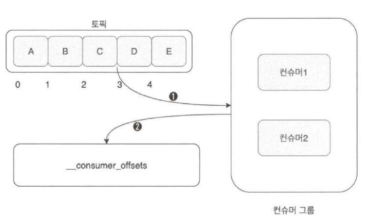

# 6장. 컨슈머의 내부 동작 원리와 구현

## 1. 컨슈머 오프셋 관리

---

- 컨슈머의 동작 중 가장 핵심은 바로 오프셋 관리
- 컨슈머는 카프카에 저장된 메시지를 꺼내오는 역할을 하기 때문에 컨슈머가 메시지를 어디까지 가져왔는지를 표시하는 것은 매우 중요하다.
- 오프셋(offset): 메시지의 위치를 나타내는 위치. 숫자 형태로 나타낸다.
- 컨슈머 그룹은 자신의 오프셋 정보를 카프카에서 가장 안전한 저장소인 토픽에 저장한다.
    - `__counsumer_offsets` 토픽에 각 컨슈머 그룹별로 오프셋 위치 정보가 기록된다.

### 기본동작

---



6-1. 컨슈머 기본 동작

- 컨슈머들은 지정된 토픽의 메시지를 읽은 뒤, 읽어온 위치의 오프셋 정보를 `__consumer_offsets`에 기록한다.
    - 컨슈머 그룹은 컨슈머 그룹, 토픽, 파티션 등의 내용을 통합해 기록한다.
- `__consumer_offsets` 토픽에 기록된 정보를 이용해 컨슈머 그룹은 자신의 그룹이 속해 있는 컨슈머의 변경이 발생하는 경우(컨슈머 장애 또는 컨슈머 이탈 등) 해당 컨슈머가 어느 위치까지 읽었는지를 추적할 수 있다.
- 저장되는 오프셋값은 컨슈머가 마지막까지 읽은 위치가 아니라 컨슈머가 다음으로 읽어야 할 위치를 말한다.
    - 그림 6-1로 예를 들면,
        1. 2번 오프셋 메시지 C까지 읽었고 그다음으로 읽어야할
        2. 3번 오프셋 위치를 `__consumer_offsets` 토픽에 저장하게 된다.

- `__consumer_offsets` 토픽은 내부 토픽이지만 파티션 수와 리플리케이션 팩터수는 브로커의 설정 파일인 `server.properties`에서 관리자가 원하는 값으로 변경할 수 있다.
    - `offsets.topic.num.partitions`: 기본값 50
    - `offsets.topic.replication.factor`: 기본값 30****

## 2. 그룹 코디네이터

---

- 컨슈머들은 하나의 컨슈머 그룹의 구성원으로 속하며, 컨슈머 그룹 내의 각 컨슈머들은 서로 자신의 정보를 공유하면서 하나의 공동체로 동작한다.
- 컨슈머 그룹 내의 컨슈머들은 언제든지 자신이 속한 컨슈머 그룹에서 떠날 수 있으며 새로운 컨슈머가 합류할 수도 있다.
    - 컨슈머 그룹은 이러한 변화를 인지하고 각 컨슈머들에게 작업을 균등하게 분배해야 한다.
        
        → 컨슈머 리밸런싱 / 컨슈머 리밸런싱이 일어났다
        

- 그룹 코디네이터(group coordinator): 안정적인 컨슈머 그룹 관리를 위해 별도의 코디네이터가 존재
    - 목적은 컨슈머 그룹이 구독한 토픽의 파티션들과 그룹의 멤버들을 트래킹(tracking)하는 것
    - 파티션 또는 그룹의 멤버에 변화가 생기면, 작업을 균등하게 재분배하기 위해 컨슈머 리밸런싱 동작이 발생
    - 그룹 코디네이터는 각 컨슈머 그룹별로 존재하며, 이러한 그룹 코디네이터는 카프카 클러스터 내의 브로커 중 하나에 위치한다.
        
        
        
        6-2. 그룹 코디네이터와 컨슈머 그룹 관계
        
    - 컨슈머 그룹이 브로커에 최초 연결 요청을 보내면 브로커 중 하나에 그룹 코디네이터가 생성되고, 이 그룹 코디네이터는 컨슈머 그룹의 컨슈머 변경과 구독하는 토픽 파티션 변경 등에 대한 감지를 시작한다.
    - 토픽의 파티션과 그룹의 멤버 변경이 일어나면 변경된 내용을 컨슈머들에게 알려주기도 한다.

### 컨슈머 그룹과 그룹 코디네이터가 서로 어떻게 동작하는지

---


6-3. 컨슈머 그룹 등록 과정

1. 컨슈머는 컨슈머 설정값 중에서 `bootstrap.brokers` 리스트에 있는 브로커에게 컨슈머 클라이언트와 초기 커넥션을 연결하기 위한 요청을 보낸다.
2. 해당 요청을 받은 브로커는 그룹 코디네이터를 생성하고 컨슈머에게 응답을 보낸다.
    - 컨슈머 그룹의 첫 번째 컨슈머가 등록될 때까지 아무 작업도 일어나지 않는다.
3. 그룹 코디네이터는 `group.initial.rebalance.delay.ms`의 시간 동안 컨슈머의 요청을 기다린다.
4. 컨슈머는 컨슈머 등록 요청을 그룹 코디네이터에게 보낸다. 이때 가장 먼저 요청을 보내는 컨슈머가 컨슈머 그룹의 리더가 된다.
5. 컨슈머 등록 요청을 받은 그룹 코디네이터는 해당 컨슈머 그룹이 구독하는 토픽 파티션 리스트 등 리더 컨슈머의 요청에 응답을 보낸다.
6. 리더 컨슈머는 정해진 컨슈머 파티션 할당 전략에 따라 그룹 내 컨슈머들에게 파티션을 할당한 뒤 그룹 코디네이터에게 전달한다.
7. 그룹 코디네이터는 해당 정보를 캐시하고 각 그룹 내 컨슈머들에게 성공을 알린다.
8. 각 컨슈머들은 각자 지정된 토픽 파티션으로부터 메시지를 가져온다.

- 컨슈머 그룹의 변화들은 컨슈머 코디네이터에게 컨슈머가 `join` 또는 `leave` 요청을 보냄으로써 자연스럽게 처리된다.
    - 컨슈머가 장애로 `leave` 요청을 보내지 못하고 종료되는 경우 어떻게 그룹 코디네이터는 어떻게 이를 감지할 수 있을까?

❗컨슈머들의 변경을 감지하기 위해 그룹 코디네이터와 컨슈머들은 서로 하트비트(heartbeat)를 주고받는다.

| 컨슈머 옵션 | 값 | 설명 |
| --- | --- | --- |
| heartbeat.inerval.ms | 3000 | 그룹 코디네이터와 하트비트 인터빌 시간이다. session.timout.ms보다 낮게 설정해야 하며, 3분의 1 수준이 적절하다. |
| session.timeout.ms | 1000 | 어떤 컨슈머가 특정 시간 안에 하트비트를 받지 못하면 문제가 발생했다고 판단해 컨슈머 그룹에서 해당 컨슈머는 제거되고 리밸런싱 동작이 일어난다. |
| max.poll.interval.ms | 300000 | 컨슈머는 주기적으로 poll()을 호출해 토픽으로부터 레코드들을 가져오는데, poll() 호출 후 최대 5분간 poll() 호출이 없다면 컨슈머가 문제가 있는 것으로 판단해 리밸런싱 동작이 일어난다. |
- 하트비트 옵션을 통해 컨슈머의 상태를 확인하며, 특정 컨슈머에 문제가 발생했다고 판단되면 컨슈머 리밸런싱 동작을 통해 컨슈머 그룹의 전체 균형을 다시 맞춘다.
- 컨슈머 리밸런싱 동작은 경우에 따라 매우 높은 비용이 지출되므로 가급적 리밸런싱이 자주 발생하지 않도록 주의해야 한다.

<aside>
💡 가능하면 기본 설정을 유지하기를 권장

</aside>

## 3. 스태틱 멤버십

---

- 일반적인 컨슈머 그룹 동작에서는 각 컨슈머를 식별하기 위해 엔티티 ID를 부여하게 된다.
    - 컨슈머 그룹 내에서 임시로 사용되는 값
    - 컨슈머가 재시작되면, 컨슈머 그룹 내의 동일한 컨슈머임에도 새로운 컨슈머로 인식해 새로운 엔티티 ID가 부여되고 이로 인해 컨슈머 그룹의 리밸런싱이 발생
- 아파치 카프카 2.3 버전부터 스태틱 멤버십(static membership)이라는 개념을 도입 → 불필요한 리밸런싱을 방어
    - 컨슈머 그룹 내에서 컨슈머가 재시작 등으로 그룹에서 나갔다가 다시 합류하더라도 리밸런싱이 일어나지 않게 한다.
    - 컨슈머마다 인식할 수 있는 ID를 적용함으로써 다시 합류하더라도 그룹 코디네이터가 기존 구성원임을 인식할 수 있게 하는 것
    - 스태틱 멤버십 기능이 적용된 컨슈머는 그룹에서 떠날 때 그룹 코디네이터에게 알리지 않으므로 불필요한 리밸런싱도 발생하지 않는다.
- 스태틱 멤버십을 적용하기 위한 옵션
    - 기본값이 null string 인 `group.instance.id`만 설정하면 스태틱 멤버십이 적용되지만, 아파치 카프카 버전이 2.3 이상이어야 한다.
    - 컨슈머 인스턴스별로 고유한 값을 입력해야 한다.
    - `session.timout.ms`를 기본값보다는 큰 값으로 조정해야 한다.
        - ex> 컨슈머 재시작 시간이 총 2분 소요된다면, `session.timout.ms` 값은 2분보다 큰 값으로 설정해야 불필요한 리밸런싱 동작을 사전에 방지할 수 있다.

### 스태틱 멤버십 동작 실습

---

- 총 3대의 브로커에서 두 번의 컨슈머 그룹을 실행한다.
    - 첫 번째로 실행하는 컨슈머 그룹은 전형적인 일반 컨슈머 그룹
        
        → 하나의 컨슈머가 종료되면 리밸런싱이 일어나야 한다.
        
    - 두 번째 컨슈머 그룹은 스태틱 멤버십이 적용된 컨슈머 그룹

- 파이썬 3를 설치 `// TODO`
    
    ```bash
    root@kafka1:/# apt-get install python3
    ...
    root@kafka1:/# python -m pip --version
    pip 8.1.2 from /usr/local/lib/python2.7/dist-packages (python 2.7)
    # 보류 ---
    # root@kafka1:/# apt-get install python3-pip # apt-get remove python3-pip
    # ...
    # root@kafka1:/# python3 -m pip --version
    # pip 1.5.6 from /usr/lib/python3/dist-packages (python 3.4)
    # -------
    root@kafka1:/# python --version
    Python 2.7.9
    root@kafka1:/# python3 --version
    Python 3.4.2
    ```
    
    ```bash
    python3 -m venv venv6 # 안된다넹..
    python3 -m pip install confluent-kafka
    python3 -m pip install librdkafka # 없다넹..
    ```
    
    - 삽질기
        
        ```bash
        root@kafka1:/# python3 -m pip install --upgrade pip
        # 했다가 아래 같은 오류가 뜸 ---
        root@kafka1:/# python3 -m pip install typing
        /usr/bin/python3: Error while finding spec for 'pip.__main__' (<class 'ImportError'>: No module named 'typing'); 'pip' is a package and cannot be directly executed
        # -------------------------------
        # 그래서 아래와 같이 살려냄
        root@kafka1:/# curl https://bootstrap.pypa.io/pip/3.4/get-pip.py -o get-pip.py
        root@kafka1:/# chmod 655 get-pip.py
        root@kafka1:/# python3 /get-pip.py
        root@kafka1:/# python3 -m pip --version
        pip 19.1.1 from /usr/local/lib/python3.4/dist-packages/pip (python 3.4)
        ```
        
        
        
    - 다시 지웠다가 설치!
        
        ```bash
        root@kafka1:/# apt-get update
        root@kafka1:/# apt-cache showpkg python3
        root@kafka1:/# apt-get install python3
        # https://github.com/confluentinc/confluent-kafka-python/issues/180
        root@kafka1:/# apt-get install librdkafka-dev
        # 최신버전 아니라서 안된다 .. 또다른 시도: https://jinyes-tistory.tistory.com/274
        root@kafka1:/librdkafka# apt-get install librdkafka-dev # 이제 이 에러도 해결!
        # 그래도 여전히 /tmp/pip-install-y0fv02ed/confluent-kafka/src/confluent_kafka/src/confluent_kafka.c:1633:17: error: ‘for’ loop initial declarations are only allowed in C99 or C11 mode
        #                     for(int i = 0; i < rd_extensions_size; i++) {
        #                     ^
        root@kafka1:/# apt install python3-dev
        ```
        
        ```bash
        docker cp /Users/kim-yoonhee/Downloads/confluent-kafka-1.9.2.tar.gz a2e5a31f90a:/
        ```
        
        ```bash
        root@kafka1:/# tar -xvzf confluent-kafka-1.9.2.tar.gz
        root@kafka1:/confluent-kafka-1.9.2# python3 setup.py install
        /confluent-kafka-1.9.2/src/confluent_kafka/src/confluent_kafka.c:1633:17: note: use option -std=c99, -std=gnu99, -std=c11 or -std=gnu11 to compile your code
        error: command 'x86_64-linux-gnu-gcc' failed with exit status 1
        root@kafka1:/confluent_kafka-1.9.2# vim setup.py
        # -----
        module = Extension('confluent_kafka.cimpl',
                           libraries=[librdkafka_libname],
                           sources=[os.path.join(ext_dir, 'confluent_kafka.c'),
                                    os.path.join(ext_dir, 'Producer.c'),
                                    os.path.join(ext_dir, 'Consumer.c'),
                                    os.path.join(ext_dir, 'Metadata.c'),
                                    os.path.join(ext_dir, 'AdminTypes.c'),
                                    os.path.join(ext_dir, 'Admin.c')],
                           extra_compile_args=['-std=gnu99'])
        # 추가 -
        root@kafka1:/librdkafka# python3 -m pip install confluent-kafka # 설치됨
        root@kafka1:/# git clone https://github.com/onlybooks/kafka2
        root@kafka1:/# cd kafka2/chapter6/
        root@kafka1:/kafka2/chapter6# python3 consumer_standard.py
        Traceback (most recent call last):
          File "consumer_standard.py", line 1, in <module>
            from confluent_kafka import Consumer
          File "/usr/local/lib/python3.4/dist-packages/confluent_kafka-1.9.2-py3.4-linux-x86_64.egg/confluent_kafka/__init__.py", line 19, in <module>
            from .deserializing_consumer import DeserializingConsumer
          File "/usr/local/lib/python3.4/dist-packages/confluent_kafka-1.9.2-py3.4-linux-x86_64.egg/confluent_kafka/deserializing_consumer.py", line 19, in <module>
            from confluent_kafka.cimpl import Consumer as _ConsumerImpl
        ImportError: /usr/local/lib/python3.4/dist-packages/confluent_kafka-1.9.2-py3.4-linux-x86_64.egg/confluent_kafka/cimpl.cpython-34m.so: undefined symbol: rd_kafka_AclBinding_destroy
        ```
        

<aside>
💡 컨슈머의 리밸런싱은 재시작되거나 그룹에서 떠나는 컨슈머만 대상으로 동작하는 것이 아니라, 컨슈머 그룹 내 전체 컨슈머를 대상으로 동작한다.

</aside>

- 스태틱 멤버십 동작
    - 컨슈머 프로세스를 종료했음에도 불구하고, 리밸런싱 동작이 일어나지 않는다.
    - 하지만 앞서 `session.timeout.ms`에 지정한 30여 초가 지난 뒤 다시 컨슈머 그룹 상세보기 명령어를 실행해보면 리밸런싱 동작이 일어나 새로운 파티션이 할당됐음을 알 수 있다.

👉 정리

- 표준 컨슈머를 사용하는 경우
    - 컨슈머의 오류가 발생해 해당 컨슈머를 잠시 제거하고, 오류 수정 후 다시 컨슈머 그룹에 합류하면 총 두 번의 리밸런싱이 발생한다.
- 스태틱 멤버십을 적용한 컨슈머를 활용하는 경우
    - `session.timeout.ms`에 지정된 시간을 넘어가지 않는다면 컨슈머를 잠시 제외하더라도 리밸런싱 동작이 발생하지 않게 된다.
        
        ❗`session.timeout.ms` 값은 컨슈머의 재시작 시간을 잘 고려한 다음에 설정하기
        

## 4. 컨슈머 파티션 할당 전략

---

- 컨슈머 그룹의 리더 컨슈머가 정해진 파티션 할당 전략에 따라 각 컨슈머와 대상 토픽의 파티션을 매칭시킨다.
- 파티션 할당 전략: 컨슈머 옵션의 `partion.assignment.strategy`로 표시
    
    
    | 파티션 할당 전략 | 설명 |
    | --- | --- |
    | 레인지 파티션 할당 전략 (RangeAssignor) | 파티션 할당 전략의 기본값으로서 토픽별로 할당 전략을 사용함. 동일한 키를 이용하는 2개 이상의 토픽을 컨슘할 때 유용함 |
    | 라운드 로빈 파티션 할당 전략 (RoundRobinAssignor) | 사용 가능한 파티션과 컨슈머들을 라운드 로빈으로 할당함. 균등한 분배 가능 |
    | 스티키 파티션 할당 전략 (StickyAssignor) | 컨슈머가 컨슘하고 있는 파티션을 계속 유지할 수 있음 |
    | 협력적 스티키 파티션 할당 전략 (CooperativeStickyAssignor)  | 스티키 방식과 유사하지만, 전체 일시 정지가 아닌 연속적인 재조정 방식임 |

### 4-1. ****레인지 파티션 할당 전략****

---

- 각 토픽별로 할당 전략을 사용하게 된다.
- 먼저 구독하는 토픽에 대한 파티션을 순서대로 나열한 후 컨슈머를 순서대로 정렬한다.
- 그런 다음 각 컨슈머가 몇 개의 파티션을 할당해야 하는지 전체 파티션 수를 컨슈머 수로 나눈다.
- 컨슈머 수와 파티션 수가 일치하면 균등하게 할당될 수 있지만 균등하게 나눠지지 않는 경우에는 앞쪽의 컨슈머들은 추가 파티션을 할당받게 된다.


6-8. 레인지 파티션 할당 전략

- 동일한 레코드(메시지) 키를 사용하고 하나의 컨슈머 그룹이 동일한 파티션 수를 가진 2개 이상의 토픽을 컨슘할 때 유용할 수 있다.****

### 4-2. 라운드 로빈 파티션 할당 전략

---

- 컨슘해야 하는 모든 파티션과 컨슈머 그룹 내 모든 컨슈머를 나열한 후 라운드 로빈으로 하나씩 파티션과 컨슈머를 할당하는 전략


6-9. 라운드 로빈 파티션 할당 전략

- 먼저 구독 대상 토픽의 전체 파티션을 나열한다.
- 전체 컨슈머들도 나열한다.
- 나열된 파티션을 컨슈머들과 하나씩 라운드 로빈 방식으로 일대일 매핑해나간다.

<aside>
💡 레인지 파티션 할당 전략에 비해 라운드 로빈 파티션 할당 전략 쪽이 파티션과 컨슈머를 더욱 균등하게 매핑한다.

</aside>

### 4-3. ****스티키 파티션 할당 전략****

---

- 재할당 작업이 발생하더라도 기존에 매핑됐던 파티션과 컨슈머를 최대한 유지하려고 하는 전략

- 스티키 파티션 할당 전략은 두 가지 목적으로 컨슈머에 파티션을 할당한다.
    1. 가능한 한 균형 잡힌 파티션 할당
    2. 재할당이 발생할 때 되도록 기존의 할당된 파티션 정보를 보장

👉 첫 번째 목적의 우선순위가 더 높다. 무조건 기존의 파티션과 컨슈머를 유지하지는 않는다.


6-10. 최초 스티키 파티션 할당 전략

- 최초의 배치 전략은 라운드 로빈 할당 전략과 매우 흡사하다.

- 컨슈머2가 컨슈머 그룹에서 떠났을 때
    - 라운드 로빈 파티션 할당 전략을 통해 리밸런싱이 일어난 후의 상황
        
        
        
        6-11. 라운드 로빈 파티션 할당 전략에서 컨슈머2가 제외된 상황
        
        1. 컨슈머2가 컨슈머 그룹에서 떠남
        2. 리밸런싱 동작이 일어남
        3. 모든 파티션을 순서대로 배치(토픽1-파티션0, 토픽1-파티션1, 토픽2-파티션0, 토픽2-파티션1, …)
        4. 모든 컨슈머를 순서대로 배치(컨슈머1, 컨슈머3)
        5. 라운드 로빈 파티션 할당 전략에 맞춰 하나씩 매핑
    - 스티키 파티션 할당 전략
        
        
        
        6-12. 스티키 파티션 할당 전략에서 컨슈머2가 제외된 상황
        
        - 컨슈머1과 컨슈머3에 이미 할당된 파티션은 유지되어 있고,
        - 컨슈머가 할당되지 않은 파티션들에 대해서만 컨슈머1과 컨슈머3에 할당됐다.

- 스티키 파티션 할당 전략의 재할당 동작 규칙 👉 최대한 컨슈머들의 균형을 맞추고 기존 컨슈머에 할당된 파티션을 최대한 유지함으로써 컨슈머에 새로 할당하는 파티션 수를 최소화한다.
    - 컨슈머들의 최대 할당된 파티션의 수의 차이는 1
    - 기존에 존재하는 파티션 할당은 최대한 유지함
    - 재할당 동작 시 유효하지 않은 모든 파티션 할당은 제거함
    - 할당되지 않은 파티션들은 균형을 맞추는 방법으로 컨슈머들에 할당

<aside>
💡 최소한의 움직임으로 컨슈머를 할당할 수 있으므로 라운드 로빈 할당 전략보다 효율적이다.

</aside>

### 4-4. 협력적 스티키 파티션 할당 전략

---

- 스티키 전략과 동일한 방식
    - 한 가지 차이점: 컨슈머 그룹 내부의 리밸런싱 동작이 한층 더 고도화됐다

- 지금까지의 컨슈머 리밸런싱 동작에서는 내부적으로 EAGER라는 리밸런스 프로토콜을 사용
    - EAGER 프로토콜은 컨슈머 리밸런싱 동작 시 컨슈머에 할당된 모든 파티션을 항상 취소했다.
- 리밸런싱 동작에서 모든 파티션을 항상 취소하는 이유
    1. 컨슈머들의 파티션 소유권 변경 때문
        - 하나의 컨슈머 그룹 내에서는 둘 이상의 컨슈머가 동일한 파티션을 소유할 수 없다.
    2. 그룹 내에서 여러 파티션들에 대해 소유권 변경 작업(새로운 파티션 할당 작업)이 동시에 이뤄져야 하므로 이러한 로직을 단순하게 구현하기 위해서

- 리밸런싱에서 모든 파티션 할당을 최소하는 동작은 리소스를 많이 사용하는 컨슈머 그룹에서는 큰 문제가 된다 → 컨슈머들의 다운타임
    
    ❗컨슈머의 다운타임 동안 LAG이 급격하게 증가된다.
    

👉

- 아파치 카프카 2.3 버전부터 카프카 커넥트에 새로운 협력적 스티키 파티션 할당 전략이 적용됐다.
- 아파치 카프카 2.4 버전부터 컨슈머 클라이언트에도 적용됐다.
- 2.5 버전에서 비로소 안정화됐다.

- 협력적 스티키는 내부 리밸런싱 프로토콜인 EAGER가 아닌 COOPERATIVE(협력적) 프로토콜을 적용하기 시작
    - 이 프로토콜은 리밸런싱이 동작하기 전의 컨슈머 상태를 유지할 수 있게 했다.

- 되도록 동작 중인 컨슈머들에게 영향을 주지 않는 상태에서 몇 차례에 걸쳐 리밸런싱이 이뤄진다.
    
    
    
    6-14. 협력적 스티키 리밸런싱 동작 과정
    
    - 리밸런싱 상세 동작 과정
        1. 컨슈머 그룹에 peter-kafka01 이 합류하면서 리밸런싱이 트리거된다(1. 감지 단계)
        2. 컨슈머 그룹 내 컨슈머들은 그룹 합류 요청과 자신들이 컨슘하는 토픽의 파티션 정보(소유권)를 그룹 코디네이터로 전송한다(1. 감지 단계)
        3. 그룹 코디네이터는 해당 정보를 조합해 컨슈머 그룹의 리더에게 전송한다(1. 감지 단계)
        4. 컨슈머 그룹의 리더는 현재 컨슈머들이 소유한 파티션 정보를 활용해 제외해야 할 파티션 정보를 담은 새로운 파티션 할당 정보를 컨슈머 그룹 멤버들에게 전달한다(2. 첫 번째 리밸런싱 단계)
        5. 새로운 파티션 할당 정보를 받은 컨슈머 그룹 멤버들은 현재의 파티션 할당 전략과 차이를 비교해보고 필요 없는 파티션을 골라 제외한다. 이전의 파티션 할당 정보와 새로운 파티션 할당 정보가 동일한 파티션들에 대해서는 어떤 작업도 수행할 필요가 없다(2. 첫 번째 리밸런싱 단계)
        6. 제외된 파티션 할당을 위해 컨슈머들은 다시 합류 요청을 한다. 여기서 두 번째 리밸런싱이 트리거된다(3. 두 번째 리밸런싱 단계)
        7. 컨슈머 그룹의 리더는 제외된 파티션을 적절한 컨슈머에게 할당한다(3. 두 번째 리밸런싱 단계)

- 협력적 스티키 파티션 할당 전략에서 중요한 점
    - 파티션 재배치가 필요하지 않은 컨슈머들은 다운타임 없이 계속 동작
    - 한 번이 아니라 두 차례의 리밸런싱이 일어났다.
- 한 번에 일괄 작업하는 EAGER 방식보다 COOPERATIVE 프로토콜 방식이 더 빠른 시간 안에 짧은 다운타임을 가지고 리밸런싱을 완료할 수 있다.****

## 5. 정확히 한 번 컨슈머 동작

---

- 컨슈머는 트랜잭션 코디네이터가 특수한 메시지를 표시한 레코드만 읽는다면, 정확히 한 번 읽을 수 있다.
- 트랜잭션 컨슈머 예제 코드
    
    ```java
    package com.jenny.kafka.chapter5;
    
    import org.apache.kafka.clients.consumer.ConsumerConfig;
    import org.apache.kafka.clients.consumer.ConsumerRecord;
    import org.apache.kafka.clients.consumer.ConsumerRecords;
    import org.apache.kafka.clients.consumer.KafkaConsumer;
    import org.apache.kafka.clients.producer.ProducerConfig;
    import org.apache.kafka.common.serialization.StringDeserializer;
    
    import java.util.Arrays;
    import java.util.Properties;
    
    public class ExactlyOnceConsumer {
        public static void main(String[] args) {
            String bootstrapServers = "0.0.0.0:9091";
            Properties props = new Properties();
            props.setProperty(ProducerConfig.BOOTSTRAP_SERVERS_CONFIG, bootstrapServers);
            props.setProperty(ConsumerConfig.KEY_DESERIALIZER_CLASS_CONFIG, StringDeserializer.class.getName());
            props.setProperty(ConsumerConfig.VALUE_DESERIALIZER_CLASS_CONFIG, StringDeserializer.class.getName());
            props.setProperty(ConsumerConfig.GROUP_ID_CONFIG, "peter-consumer-01");
            props.setProperty(ConsumerConfig.AUTO_OFFSET_RESET_CONFIG, "earliest");
            props.setProperty(ConsumerConfig.ENABLE_AUTO_COMMIT_CONFIG, "false");
            props.setProperty(ConsumerConfig.ISOLATION_LEVEL_CONFIG, "read_committed"); // 정확히 한번 전송을 위한 설정
    
            KafkaConsumer<String, String> consumer = new KafkaConsumer<>(props);
            consumer.subscribe(Arrays.asList("peter-test05"));
    
            try {
                while (true) {
                    ConsumerRecords<String, String> records = consumer.poll(1000);
                    for (ConsumerRecord<String, String> record : records) {
                        System.out.printf("Topic: %s, Partition: %s, Offset: %d, Key: %s, Value: %s\n",
                                record.topic(), record.partition(), record.offset(), record.key(), record.value());
                    }
                    consumer.commitAsync();
                }
            } catch (Exception e) {
                e.printStackTrace();
            } finally {
                consumer.close();
            }
        }
    }
    ```
    
- 비동기 가져오기 코드와 흡사하다.
    
    → 일반 컨슈머 코드에서 `ISOLATION_LEVEL_CONFIG`라는 설정만 추가하면 트랜잭션 컨슈머로 동작한다.
    
    - 트랜잭션 컨슈머는 트랜잭션 코디네이터와 통신하는 부분은 없으며 트랜잭션이 완료된 메시지만 읽을 수 있다.

- 실습 `// TODO`

- 트랜잭션 컨슈머라고 해서 정확히 한 번만 가져오는 것은 아니다.
    - 컨슈머는 트랜잭션 코디네이터와 통신하는 부분이 없으므로 정확하게 메시지를 한 번 가져오는지는 보장할 수 없다.
    - 컨슈머에 의해 컨슘된 메시지가 다른 싱크 저장소로 중복 저장될 수 있다.
- 컨슈머의 동작까지 정확히 한 번 처리가 가능해지려면
    - '컨슘 - 메시지 처리 - 프로듀싱' 동작이 모두 하나의 트랜잭션으로 처리돼야 한다.
    - 일부 컨슈머 애플리케이션에서 정확히 한 번을 지원하는 경우도 있다.

<aside>
💡 프로듀서-카프카 구간과 카프카-컨슈머 구간 모두에서 정확히 한 번 메시지 전송이 가능하다고 생각할 수 있지만 사실은 그렇지 않았다.

</aside>

- 참고
    - [https://github.com/bingbingpa/dev-book/blob/master/kafka-dev-to-operation/ch06.md](https://github.com/bingbingpa/dev-book/blob/master/kafka-dev-to-operation/ch06.md)
    - [https://velog.io/@fj2008/카프카-컨슈머의-내부동장-원리](https://velog.io/@fj2008/%EC%B9%B4%ED%94%84%EC%B9%B4-%EC%BB%A8%EC%8A%88%EB%A8%B8%EC%9D%98-%EB%82%B4%EB%B6%80%EB%8F%99%EC%9E%A5-%EC%9B%90%EB%A6%AC)
