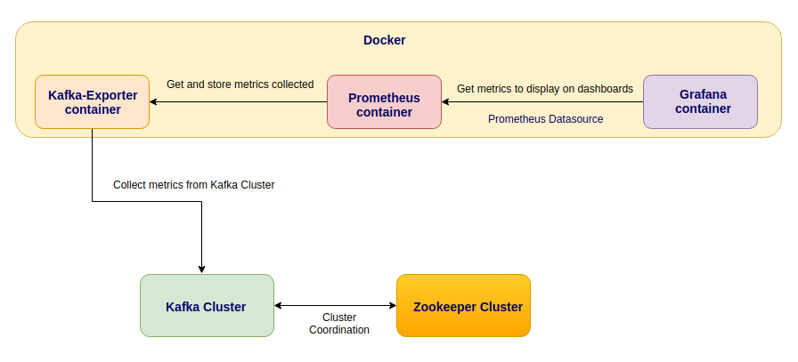

# 7장. 카프카 운영과 모니터링

- 카프카 모니터링: 단지 카프카만 모니터링하는 것이 아니라 카프카가 실행되고 있는 하드웨어의 리소스도 모니터링

## 1. 안정적인 운영을 위한 주키퍼와 카프카 구성

---

- 초기 구성 단계부터 관리자가 꼼꼼하게 단일 장애 지점(single point of failure)등을 제거하고 클러스터를 구성한다면, 더욱 안정적인 클러스터를 운영할 수 있다.

### 1-1. 주키퍼 구성

---

- 최근들어 아파치 카프카 오픈소스 진영에서는 카프카의 코디네이터 역할을 하는 주키퍼의 의존성을 제가하려는 움직임이 있다.
- 주키퍼: 파티션과 브로커의 메타데이터를 저장, 컨트롤러 서버를 선출
    
    👉 카프카 내부에서 처리함으로써 운영 효율성을 높일 수 있고, 효율적인 방식으로 더 많은 파티션을 처리할 수 있다.
    

- 주키퍼 서버 수량
    - 주키퍼는 기본적으로 쿼럼(과반수) 구성을 기반으로 동작하므로 반드시 홀수로 구성해야 한다.
        - 최소 수량: 3
    - 회사에서 핵심 중앙 데이터 파이프라인으로 카프카를 이용 중이고 카프카의 사용량도 높은 경우라면 안정성을 확보할 수 있도록 주키퍼는 5대로 구성하는 것을 권장
        - 카프카의 사용량은 다소 낮지만 회사에서 카프카가 매우 중요한 용도로 이용되는 경우에도 주키퍼는 5대로 구성해 안정성을 높이는 쪽을 추천
- 주키퍼 하드웨어
    - 주키퍼의 물리적인 메모리 크기는 4~8GB로 구성하고, 디스크는 240G 또는 480G SSD를 사용하는 것을 추천
    - 힙 메모리 크기는 일반적으로 1~2GB이며, 나머지는 운영체제 영역 등에서 사용하게 된다.
    - 주키퍼의 네트워크 카드는 1G 이더넷 카드로 구성하면 된다.
- 주키퍼 배치
    - 물리 서버를 배치하는 경우에는 일반적으로 데이터 센터 내에 랙 마운트를 하게 된다 → 각기 다른 랙에 분산 배치하는 방안을 권장
        - 하나의 랙에 모든 주키퍼 서버를 마운트해 배치하는 것은 매우 위험하다.
    - AWS → 2개 또는 3개의 가용 영역에 분산해 구성하는 것을 추천

### 1-2. 카프카 구성

---

- 카프카 서버 수량
    - 카프카는 주키퍼와 다르게 쿼럼 방식의 구성이 필요하지 않다.
    - 카프카에서 추천하는 안정적인 리플리케이션 팩터 수인 3으로 토픽을 구성하기 위해서는 최소 3대의 브로커가 필요하다.
    - 현재 꼭 필요한 수량만큼만 구성하는 편이 좋다 → 카프카의 장점 중 하나가 바로 손쉬운 서버 확장 😃
- 카프카 하드웨어
    - 주키퍼와 달리 카프카의 CPU 사용률은 높은 편. 최신의 고성능 CPU만 고집할 필요는 없으며 코어 수가 많은 CPU로 구성할 것을 권장한다.
    - 카프카에서 요구하는 JVM 힙 크기는 일반적으로 6GB → 이보다 큰 물리 메모리가 필요하다.
        - 카프카에서는 힙 크기를 제외한 나머지 물리 메모리는 모두 페이지 캐시로 사용해서 빠른 처리를 돕고있다.
        - 메모리를 조금 타이트하게 운영한다면 최소 32GB 이상 구성하는 것을 추천한다.
    - 디스크의 경우, 성능이 가장 낮은 SATA 디스크를 선택해도 괜찮다.
        - 순차적으로 쓰는 방식으로 로그를 기록하기 때문
        - 브로커 한 대에 하나의 물리적 디스크를 사용하는 것이 아니라 병렬 처리를 위해 서버에 약 10개 정도의 디스크를 장착한다.
        - 토픽의 보관 주기를 충분하게 설정하려면 4TB 용량 이상의 디스크로 선정하는 것을 추천
            - 토픽 파티션의 로그가 가득 차는 경우가 있음
    - AWS → EBS(Elastic Block Store)는 안정적이다.
    - 카프카의 네트워크 카드는 10G 이더넷 카드로 구성하는 것을 추천
        - 브로커 한 대당 네트워크 사용량 비율이 50%가 넘지 않도록 최대한 토픽을 분산해 운영해야 한다.
        - 네트워크 대역폭은 충분히 확보해둬야 한다.
            - 디스크의 장애 복구 또는 신규 브로커 추가로 인해 카프카 클러스터 사이에서는 대량의 데이터 이동이 발생하게 된다.
- 카프카 배치
    - 모든 카프카 서버를 하나의 랙에 마운트하는 것은 매우 위험하다.
        - 여러 랙에 분산시켜 카프카 서버를 배치하는 방식을 추천 → 전원 이중화, 스위치 이중화 등도 고려해서 분산 배치
    - AWS → 주키퍼와 동일하게 멀티 가용 영역으로 구성하는 것을 추천

## 2. 모니터링 시스템 구성

---

### 2-1. 애플리케이션으로서 카프카의 로그 관리와 분석

---

- 카프카는 애플리케이션 로그 관리를 위해 자바 기반의 로깅 유틸리티인 아파치 log4j를 이용한다.
    
    
    | 로그 레벨 | 설명 |
    | --- | --- |
    | TRACE | DEBUG보다 상세한 로그를 기록함 |
    | DEBUG | 내부 애플리케이션 상황에 대한 로그를 기록함(INFO 로그 레벨보다 상세한 로그 기록) |
    | INFO | 로그 레벨의 가본값이며, 일반적인 정보 수준의 로그를 기록함 |
    | WARN | INFO 로그 레벨보다 높은 개념으로, 경고 수준의 로그를 기록함 |
    | ERROR | 경고 수준을 넘어 런타임 에러나 예상하지 못한 에러 로그를 기록함 |
    | FATAL | 로그 레벨 중 최종 단계이며, 심각한 오류로 인한 애플리케이션 중지 등의 로그를 기록함 |
- 카프카에서 제공하는 log4j의 설정 변경을 통해 관리자는 언제든지 로그 레벨을 변경할 수 있다.
    
    ```bash
    cat /usr/local/kafka/config/log4j.properties
    
    ..
    # DEBUG로 변경
    log4j.logger.kafka=DEBUG
    log4j.logger.org.apache.kafka=DEBUG
    ```
    

- 카프카는 log4j를 통해 카프카 애플리케이션의 여러 가지 로그 파일들을 관리함
    
    
    | 로그 파일 이름 | 설명 |
    | --- | --- |
    | server.log | 브로커 설정 정보와 정보성 로그 등을 기록함. 브로커를 재시작하는 경우 브로커의 옵션 정보가 기록됨 |
    | state-change.log | 컨트롤러로부터 받은 정보를 기록함 |
    | kafka-request.log | 클라이언트로부터 받은 정보를 기록함 |
    | log-cleaner.log | 로그 컴팩션 동작들을 기록함 |
    | controller.log | 컨트롤러 관련 정보를 기록함 |
    | kafka-authorizer.log | 인증과 관련된 정보를 기록함 |
- 참고> 로그 확인해보기
    
    ```bash
    # kafka 토픽에 대한 정보 확인하기
    kafka-topics.sh --describe --topic test --bootstrap-server localhost:9092
    
    # kafka consumer 토픽에 대한 정보 확인하기
    kafka-console-consumer.sh --bootstrap-server localhost:9092 --topic test
    
    # 실행한 kafka에 대한 전체 로그 확인하기
    docker logs {kafka 이름}
    
    # applicaion.yml
    logging:
      level:
        root: info
        org:
          apache:
            kafka: info
    ```
    

### 2-2. JMX를 이용한 카프카 메트릭 모니터링

---

- JMX는 자바로 만든 애플리케이션의 모니터링을 위한 도구를 제공하는 자바 API로서, MBean(Managed Bean)이라는 객체로 표현된다.
- 준비 절차 → 최근 가장 많이 쓰이는 프로메테우스와 익스포터를 이용해 JMX 모니터링 시스템을 구성
    - 브로커에 JMX 포트를 오픈
    - JMX에서 제공하는 메트릭 정보를 관리자가 GUI 형태로 볼 수 있도록 구성
    
    
    

### 2-3. 카프카 익스포터

---

- 카프카 익스포터의 설치
    1. 카프카 익스포터 다운로드
    2. 카프카 익스포터 실행
    3. 프로메테우스 환경 설정 파일에서 카프카 익스포터 추가
    4. 그라파나에서 대시보드 추가

- Kafka-exporter 생성하기
    
    ```yaml
    version: '3.8'
    
    networks:
      kafka-net:
        driver: bridge
    
    services:
      zookeeper:
        image: 'bitnami/zookeeper:latest'
        environment:
          - 'ALLOW_ANONYMOUS_LOGIN=yes'
        ports:
          - '2181:2181'
        networks:
          - kafka-net
      kafka:
        image: 'bitnami/kafka:latest'
        environment:
          - KAFKA_CFG_ZOOKEEPER_CONNECT=zookeeper:2181
          - ALLOW_PLAINTEXT_LISTENER=yes
          - KAFKA_CFG_LISTENERS=PLAINTEXT://:9092
          - KAFKA_CFG_ADVERTISED_LISTENERS=PLAINTEXT://127.0.0.1:9092
        ports:
          - "9092:9092"
        networks:
          - kafka-net
        depends_on:
          - zookeeper
      kafka-exporter:
        image: "bitnami/kafka-exporter:latest"
        ports:
          - "9308:9308"
        command:
          - --kafka.server=kafka:9092
        networks:
          - kafka-net
    ```
    
- 프로메테우스 생성하기
    
    ```yaml
    scrape_configs:
      - job_name: 'kafka-exporter'
        static_configs:
          - targets: ['host.docker.internal:9308']
    ```
    

- 참고
    - [https://velog.io/@fj2008/카프카-운영모니터링](https://velog.io/@fj2008/%EC%B9%B4%ED%94%84%EC%B9%B4-%EC%9A%B4%EC%98%81%EB%AA%A8%EB%8B%88%ED%84%B0%EB%A7%81)
    - [https://github.com/jaero0725/kafka_study/blob/9ad87dd5e5b79967361fcc0877a9d065c688d9ba/07_카프카 운영과 모니터링.md](https://github.com/jaero0725/kafka_study/blob/9ad87dd5e5b79967361fcc0877a9d065c688d9ba/07_%EC%B9%B4%ED%94%84%EC%B9%B4%20%EC%9A%B4%EC%98%81%EA%B3%BC%20%EB%AA%A8%EB%8B%88%ED%84%B0%EB%A7%81.md)
