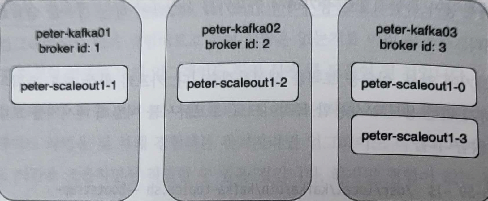

# 8장. 카프카 버전 업그레이드와 확장

## 1. 카프카 버전 업그레이드를 위한 준비

---

- 카프카의 버전을 확인하는 방법
    - `kafka-topics.sh` 명령어를 이용
        
        ```bash
        root@kafka1:/# kafka-topics --version
        5.5.1-ccs (Commit:3c4783aac9e33249)
        ```
        
    - 카프카 폴더의 `libs` 하위 디렉토리에서 kafka의 `jar` 파일을 이용
        
        ```bash
        ls -l /usr/local/kafka/libs/kafka_*
        ```
        

- 메이저 버전 업그레이드
    - 메시지의 포맷 변경, 브로커에서의 기본값 변화, 과거에는 지원됐던 명령어의 지원 종료, 일부 JMX 메트릭의 변화 등의 문제가 있을수 있음
- 마이너 버전 업그레이드
    - 메이저 버전 업그레이드에 비해 비교적 용이하게 업그레이드 할 수 있다.

- 카프카의 버전 업그레이드 방법
    - 다운타임을 가질 수 있는 경우
        - 현재 버전의 카프카를 모두 종료한 후 최신 버전의 카프카를 실행
    - 다운타임을 가질 수 없는 경우
        - 브로커 한 대씩 롤링 업그레이드

## 2. 주키퍼 의존성이 있는 카프카 롤링 업그레이드

---

- 토픽들을 먼저 삭제
    
    ```bash
    # 토픽 생성했었던 명령어
    kafka-topics --bootstrap-server kafka1:9091 \
    --create --topic peter-test01 --partitions 1 \
    --replication-factor 3
    ```
    
    ```bash
    # 토픽 삭제
    kafka-topics --bootstrap-server kafka1:9091 --delete --topic peter-test06
    ```
    
- 현재 설치된 카프카를 모두 종료
    
    ```bash
    sudo systemctl stop kafka-server
    ```
    
- 앤서블을 이용해 카프카 2.1 버전을 설치
    - 배포 서버인 peter-ansible01 에 접근한 후 앞서 설치를 진행했던 /home/ec2-user/kafka2 경로로 이동하고, 앤서블 명령어를 이용
        
        ```bash
        cd chapter2/ansible_playbook
        ansible-playbook -i hosts kafka2.1.yml
        ```
        

### 2-1. 최신 버전의 카프카 다운로드와 설정

---

- 현재 kafka 디렉토리는 kafka_2.12-2.1.0 으로 링크가 걸려 있다.
    - 이후 2.6 버전으로 업그레이드 시 kafka 디렉토리의 링크만 2.6으로 변경할 예정
- 새롭게 설치한 2.6 버전의 카프카 설정이 일치해야 하므로, 2.1 버전의 설정 파일을 2.6 버전 설정 파일 경로로 복사한다.
    
    ```bash
    sudo cp kafka_2.12-2.1.0/config/server.properties kafka_2.12-2.6.0/config/server.properties
    ```
    
    ```bash
    # 2.6 버전 업그레이드 전 설정 파일
    inter.broker.protocol.version=2.1 (브로커 간의 내부 통신)
    log.message.format.version=2.1 (메시지 포맷)
    ```
    

### 2-2. 브로커 버전 업그레이드

---

- 카프카를 종료한다.
    
    ```bash
    cd /usr/local/
    sudo systemctl stop kafka-server
    ```
    
- 2.1 버전으로 연결되어 있는 kafka 심볼릭 링크를 2.6 버전으로 변경
    
    ```bash
    sudo rm -rf kafka
    sudo ln -sf kafka_2.12-2.6.0 kafka
    ```
    
- 브로커를 실행한다.
    
    ```bash
    sudo systemctl start kafka-server
    ```
    

### 2-3. 브로커 설정 변경

---

- 현재 실행된 브로커들은 2.6 버전이지만, 앞서 브로커 설정을 통해 2.1 버전으로 통신하도록 설정된 상태

- 모든 브로커에 접속한 후 다음과 같이 `vi` 명령어를 이용해 프로토콜 버전과 메시지 포맷 버전의 내용을 삭제한다.
    - 따로 명시하지 않으면 기본값이 적용되므로 삭제하는 것을 추천
        
        ```bash
        sudo vi /usr/local/kafka/config/server.properties
        # 이 옵션들을 삭제
        inter.broker.protocol.version=2.1 (브로커 간의 내부 통신)
        log.message.format.version=2.1 (메시지 포맷)
        ```
        
- 변경된 버전으로 통신하려면 브로커를 재시작해야 한다.
    
    ```bash
    sudo systemctl restart kafka-server
    ```
    

### 2-4. 업그레이드 작업 시 주의사항

---

- 가장 추천하는 방법: 업그레이드를 하기에 앞서, 운영 환경과 동일한 카프카 버전으로 개발용 카프카를 구성해보고 개발용 카프카의 버전 업그레이드를 수행
- 되도록 카프카의 사용량이 적은 시간대를 골라 업그레이드 작업을 실시하는 것을 권장
    - 리플리케이션을 일치시키는 카프카의 내부 동작이 빠르게 이뤄진다.
- 프로듀서의 `ack=1` 옵션을 사용하는 경우 카프카의 롤링 재시작으로 인해 일부 메시지가 손실될 수 있다.

## 3. 카프카의 확장

---



8-3. peter-scaleout1 토픽 배치

- 앤서블 명령어를 이용해 kafka-scaleout.yml을 실행하면, peter-zk03 서버에 카프카가 설치된다.
    
    ```bash
    cd ansible_playbook
    ansible-playbook -i hosts kafka-scaleout.yml
    ```
    
    
    
    8-4. 4번 브로커(peter-zk03)를 추가한 상태
    

### 3-1. 브로커 부하 분산

---

- 전체 브로커들에게 토픽의 파티션을 고르게 부하 분산 → 모든 브로커에게 균등하게 파티션을 분산시켜야 한다.
- `kafka-reassign-partitions.sh`라는 도구를 이용
    
    ```bash
    # 분산시킬 대상 토픽을 추가해 작성
    # reassgin-partitions-topic.json
    {"topics":
      [{"topic": "peter-scaleout1"}],
      "version": 1
    }
    ```
    
    ```bash
    kafka-reassign-partitions --bootstrap-server kafka1:9091 --generate --topics-to-move-json-file reassgin-partitions-topic.json --broker-list "1,2,3,4"
    ```
    
    - 실행한 결과의 출력 내용: peter-scaleout1 토픽의 현재 설정된 파티션 배치를 가장 먼저 보여주고, 이후에 제안하는 파티션 배치가 출력됐다.
        - 제안된 파티션 배치의 설정을 복사한 후 새로운 move.json이라는 파일을 생성
            
            ```bash
            {
              "version": 1,
              "partitions": [
                {
                  "topic": "peter-scaleout1",
                  "partition": 0,
                  "replicas": [
                    2
                  ],
                  "log_dirs": [
                    "any"
                  ]
                },
                {
                  "topic": "peter-scaleout1",
                  "partition": 1,
                  "replicas": [
                    3
                  ],
                  "log_dirs": [
                    "any"
                  ]
                },
                {
                  "topic": "peter-scaleout1",
                  "partition": 2,
                  "replicas": [
                    4
                  ],
                  "log_dirs": [
                    "any"
                  ]
                },
                {
                  "topic": "peter-scaleout1",
                  "partition": 3,
                  "replicas": [
                    1
                  ],
                  "log_dirs": [
                    "any"
                  ]
                }
              ]
            }
            ```
            
    - `kafka-reassign-partitions.sh` 명령어와 `--reassignment-json-file` 옵션으로 move.json을 정의해 peter-scaleout1 토픽에 대해 파티션 배치를 실행한다.
        
        ```bash
        kafka-reassign-partitions --bootstrap-server kafka1:9091 --reassignment-json-file move.json --execute
        ```
        
    - 토픽 상세보기
        
        ```bash
        # peter-scaleout1 토픽의 파티션이 4번 브로커까지 고르게 배치됐는지를 확인
        kafka-topics --bootstrap-server kafka1:9091 --describe peter-scaleout1
        ```
        

<aside>
💡 브로커 간의 부하 분산 및 밸런스를 맞추려면 관리자는 기존 파티션들이 모든 브로커에 고르게 분산되도록 수동으로 분산 작업을 진행해야 한다.****

</aside>

### 3-2. 분산 배치 작업 시 주의사항

---

- 분산 배치 작업을 수행할 때는 버전 업그레이드 작업과 마찬가지로 카프카의 사용량이 낮은 시간에 진행하는 것을 추천****
    - 브로커 내부적으로 리플리케이션하는 동작이 일어나기 때문
    - 파티션들의 리플리케이션 동작이 일어나게 된다
        
        → 브로커에 부하를 줄 뿐만 아니라 리플리케이션으로 인한 네트워크 트래픽 사용량도 급증
        
- 파티션의 크기를 줄이고 난 후 재배치 작업을 진행한다면 기존 대비 브로커의 부하나 네트워크 사용량도 줄일 수 있으므로 더욱 효율적으로 재배치 작업을 진행할 수 있다.
    - 해당 토픽의 메시지들을 모든 컨슈머가 최근의 내용까지 모두 컨슘했고, 앞으로 재처리할 일이 없다면, 최근 메시지를 제외한 나머지 메시지들은 모두 삭제해도 무방할 것이다.
- 파티션 재배치 작업 시 여러 개의 토픽을 동시에 진행하지 않고, 단 하나의 토픽만 진행하는 것
    - 한 번에 하나의 토픽만 진행

- 참고
    - [https://github.com/Growth-Guild/kafka-study/blob/main/icarus8050/chapter_8/README.md](https://github.com/Growth-Guild/kafka-study/blob/main/icarus8050/chapter_8/README.md)
