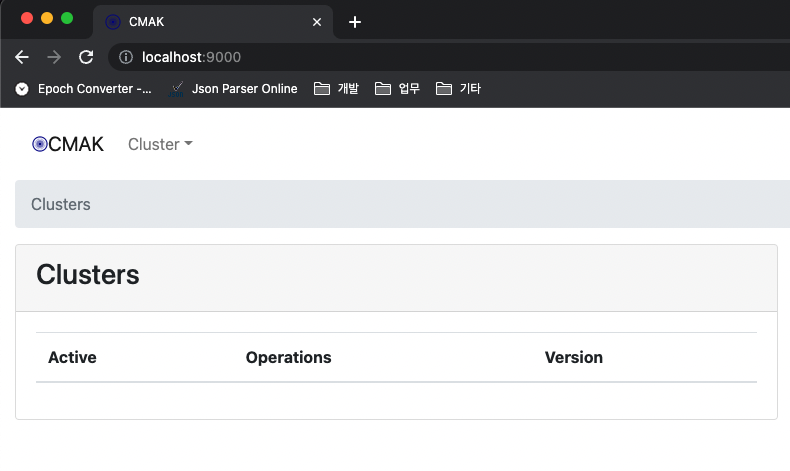

# 부록C. 도커를 이용한 카프카 설치

## 1. 도커 기반의 카프카 구성

---

- 주키퍼 구성 시의 과반수 방식에 따라 홀수를 유지해야 하므로 최소 3대로 앙상블(클러스터)을 구성해야 한다.
- 카프카는 과반수 방식 x
    - 리플리케이션 팩터 수인 3을 충족하기 위해 최소 3대의 클러스터 형태로 구성한다.

- 도커 설치
    - 맥OS에서 설치 방법: [https://docs.docker.com/desktop/install/mac-install/](https://docs.docker.com/desktop/install/mac-install/)
- 깃허브로부터 필요한 파일을 내려받기 위해 깃을 설치
    
    ```bash
    # linux
    sudo yum install -y git
    # macOS
    brew install git
    ---
    # 확인
    kim-yoonhee  ~/kafka  git --help
    사용법: git [-v | --version] [-h | --help] [-C <path>] [-c <name>=<value>]
               [--exec-path[=<path>]] [--html-path] [--man-path] [--info-path]
               [-p | --paginate | -P | --no-pager] [--no-replace-objects] [--bare]
               [--git-dir=<path>] [--work-tree=<path>] [--namespace=<name>]
               [--super-prefix=<path>] [--config-env=<name>=<envvar>]
               <command> [<args>]
    ..
    ```
    
- 도커 컴포즈를 설치한 후 실행 권한을 추가
    - 설치
        
        ```bash
        kim-yoonhee  ~/kafka  curl -L https://github.com/docker/compose/releases/latest/download/docker-compose-`uname -s`-`uname -m` > /usr/local/bin/docker-compose
        ```
        
    - 실행 권한 추가
        
        ```bash
        kim-yoonhee  ~/kafka  sudo chmod +x /usr/local/bin/docker-compose
        ```
        
    - 맥 OS 기준: Docker for Mac 설치 시 도커 엔진과 함께 도커 컴포즈도 설치된다.
    - 22년 8월 기준, 최신 도커 컴포즈는 v2.9 인 듯. 그냥 기존 설치된 v2.6.1 로 진행
        
        ```bash
        kim-yoonhee  ~/kafka  docker-compose --version
        Docker Compose version v2.6.1
        ```
        
- 깃 저장소 클론(`clone`)한 후 리눅스의 `cd` 명령어를 이용해 이동
    - 주키퍼와 카프카를 각각 1대씩 구성: `cd kafka2/appendix_C/single_zk_kafka`
    - 주키퍼와 카프카를 각각 3대씩 구성: `cd kafka2/appendix_C/cluster_zk_kafka`
    
    ```bash
    kim-yoonhee  ~/kafka  git clone https://github.com/onlybooks/kafka2
    'kafka2'에 복제합니다...
    remote: Enumerating objects: 298, done.
    remote: Counting objects: 100% (298/298), done.
    remote: Compressing objects: 100% (203/203), done.
    remote: Total 298 (delta 87), reused 257 (delta 58), pack-reused 0
    오브젝트를 받는 중: 100% (298/298), 27.57 MiB | 8.61 MiB/s, 완료.
    델타를 알아내는 중: 100% (87/87), 완료.
    
    kim-yoonhee  ~/kafka  cd kafka2/appendix_C/cluster_zk_kafka
    kim-yoonhee  ~/kafka/kafka2/appendix_C/cluster_zk_kafka   main  ll
    total 8
    -rw-r--r--  1 kim-yoonhee  staff   3.3K  8  7 21:10 docker-compose.yml
    ```
    
- 도커 컴포즈를 이용해 데몬으로 실행
    
    ```bash
    kim-yoonhee  ~/kafka/kafka2/appendix_C/cluster_zk_kafka   main  docker-compose up -d
    ```
    
- `kafka2/appendix_C/cluster_zk_kafka/docker-compose.yml`
    
    ```bash
    version: "3.5"
    services:
      zk1:
        image: confluentinc/cp-zookeeper:5.5.1
        restart: always
        hostname: zk1
        container_name: zk1
        ports:
          - "2181:2181"
        environment:
          - ZOOKEEPER_SERVER_ID=1
          - ZOOKEEPER_CLIENT_PORT=2181
          - ZOOKEEPER_TICK_TIME=2000
          - ZOOKEEPER_INIT_LIMIT=5
          - ZOOKEEPER_SYNC_LIMIT=2
          - ZOOKEEPER_SERVERS=zk1:2888:3888;zk2:2888:3888;zk3:2888:3888
      zk2:
        image: confluentinc/cp-zookeeper:5.5.1
        restart: always
        hostname: zk2
        container_name: zk2
        ports:
          - "2182:2182"
        environment:
          - ZOOKEEPER_SERVER_ID=2
          - ZOOKEEPER_CLIENT_PORT=2182
          - ZOOKEEPER_TICK_TIME=2000
          - ZOOKEEPER_INIT_LIMIT=5
          - ZOOKEEPER_SYNC_LIMIT=2
          - ZOOKEEPER_SERVERS=zk1:2888:3888;zk2:2888:3888;zk3:2888:3888
      zk3:
        image: confluentinc/cp-zookeeper:5.5.1
        restart: always
        hostname: zk3
        container_name: zk3
        ports:
          - "2183:2183"
        environment:
          - ZOOKEEPER_SERVER_ID=3
          - ZOOKEEPER_CLIENT_PORT=2183
          - ZOOKEEPER_TICK_TIME=2000
          - ZOOKEEPER_INIT_LIMIT=5
          - ZOOKEEPER_SYNC_LIMIT=2
          - ZOOKEEPER_SERVERS=zk1:2888:3888;zk2:2888:3888;zk3:2888:3888
    
      kafka1:
        image: confluentinc/cp-kafka:5.5.1
        restart: always
        hostname: kafka1
        container_name: kafka1
        ports:
          - "9091:9091"
          - "9991:9991"
        environment:
          KAFKA_BROKER_ID: 1
          KAFKA_ZOOKEEPER_CONNECT: zk1:2181,zk2:2182,zk3:2183
          KAFKA_LISTENERS: INTERNAL://kafka1:9091
          KAFKA_ADVERTISED_LISTENERS: INTERNAL://kafka1:9091
          KAFKA_LISTENER_SECURITY_PROTOCOL_MAP: INTERNAL:PLAINTEXT
          KAFKA_INTER_BROKER_LISTENER_NAME: INTERNAL
          KAFKA_OFFSETS_TOPIC_REPLICATION_FACTOR: 3
          KAFKA_TRANSACTION_STATE_LOG_MIN_ISR: 2
          KAFKA_TRANSACTION_STATE_LOG_REPLICATION_FACTOR: 3
          KAFKA_JMX_PORT: 9991
      kafka2:
        image: confluentinc/cp-kafka:5.5.1
        restart: always
        hostname: kafka2
        container_name: kafka2
        ports:
          - "9092:9092"
          - "9992:9992"
        environment:
          KAFKA_BROKER_ID: 2
          KAFKA_ZOOKEEPER_CONNECT: zk1:2181,zk2:2182,zk3:2183
          KAFKA_LISTENERS: INTERNAL://kafka2:9092
          KAFKA_ADVERTISED_LISTENERS: INTERNAL://kafka2:9092
          KAFKA_LISTENER_SECURITY_PROTOCOL_MAP: INTERNAL:PLAINTEXT
          KAFKA_INTER_BROKER_LISTENER_NAME: INTERNAL
          KAFKA_OFFSETS_TOPIC_REPLICATION_FACTOR: 3
          KAFKA_TRANSACTION_STATE_LOG_MIN_ISR: 2
          KAFKA_TRANSACTION_STATE_LOG_REPLICATION_FACTOR: 3
          KAFKA_JMX_PORT: 9992
      kafka3:
        image: confluentinc/cp-kafka:5.5.1
        restart: always
        hostname: kafka3
        container_name: kafka3
        ports:
          - "9093:9093"
          - "9993:9993"
        environment:
          KAFKA_BROKER_ID: 3
          KAFKA_ZOOKEEPER_CONNECT: zk1:2181,zk2:2182,zk3:2183
          KAFKA_LISTENERS: INTERNAL://kafka3:9093
          KAFKA_ADVERTISED_LISTENERS: INTERNAL://kafka3:9093
          KAFKA_LISTENER_SECURITY_PROTOCOL_MAP: INTERNAL:PLAINTEXT
          KAFKA_INTER_BROKER_LISTENER_NAME: INTERNAL
          KAFKA_OFFSETS_TOPIC_REPLICATION_FACTOR: 3
          KAFKA_TRANSACTION_STATE_LOG_MIN_ISR: 2
          KAFKA_TRANSACTION_STATE_LOG_REPLICATION_FACTOR: 3
          KAFKA_JMX_PORT: 9993
    
      kafka_manager:
        image: hlebalbau/kafka-manager:stable
        container_name: cmak
        ports:
          - "9000:9000"
        environment:
          ZK_HOSTS: "zk1:2181,zk2:2182,zk3:2183"
          APPLICATION_SECRET: "random-secret"
        command: -Dpidfile.path=/dev/null
    ```
    
- 프로세스를 확인하는 `ps` 명령어를 실행해서 현재 구성되어 있는 도커 프로세스를 확인한다.
    
    ```bash
    kim-yoonhee  ~/kafka/kafka2/appendix_C/cluster_zk_kafka   main  docker ps
    CONTAINER ID   IMAGE                             COMMAND                  CREATED              STATUS              PORTS                                                      NAMES
    c0c1e5ebb6dd   confluentinc/cp-zookeeper:5.5.1   "/etc/confluent/dock…"   About a minute ago   Up About a minute   2888/tcp, 0.0.0.0:2181->2181/tcp, 3888/tcp                 zk1
    10871d3547ee   hlebalbau/kafka-manager:stable    "/kafka-manager/bin/…"   About a minute ago   Up About a minute   0.0.0.0:9000->9000/tcp                                     cmak
    225fb742ded6   confluentinc/cp-kafka:5.5.1       "/etc/confluent/dock…"   About a minute ago   Up About a minute   0.0.0.0:9091->9091/tcp, 0.0.0.0:9991->9991/tcp, 9092/tcp   kafka1
    9271d1c5f099   confluentinc/cp-zookeeper:5.5.1   "/etc/confluent/dock…"   About a minute ago   Up About a minute   2181/tcp, 2888/tcp, 3888/tcp, 0.0.0.0:2183->2183/tcp       zk3
    2df020522425   confluentinc/cp-kafka:5.5.1       "/etc/confluent/dock…"   About a minute ago   Up About a minute   0.0.0.0:9093->9093/tcp, 9092/tcp, 0.0.0.0:9993->9993/tcp   kafka3
    4e3b3e86a594   confluentinc/cp-zookeeper:5.5.1   "/etc/confluent/dock…"   About a minute ago   Up About a minute   2181/tcp, 2888/tcp, 3888/tcp, 0.0.0.0:2182->2182/tcp       zk2
    2522afcd45a9   confluentinc/cp-kafka:5.5.1       "/etc/confluent/dock…"   About a minute ago   Up About a minute   0.0.0.0:9092->9092/tcp, 0.0.0.0:9992->9992/tcp             kafka2
    ```
    
    - 각 `STATUS` 항목에서 `Up`이라고 표시되면 정상적으로 실행된 것

- 도커 환경의 카프카에서만 아파치 카프카 기반이 아닌 컨플루언트 커뮤니티 버전을 이용한다.
    - 별도의 라이선스 요구 없이 간단한 카프카 구성과 카프카 테스트 환경 구성의 목적으로 사용할 수 있다.
- CMAK (Cluster Manager for Apache Kafka): 구 카프카 매니저
    - 웹 브라우저에서 도커가 실행된 IP 주소와 포트 번호 9000번 포트를 입력해 접근하면 CMAK 웹 UI 도 확인할 수 있다.
        
        
        
    - CMAK 에서 클러스터를 등록하기 위해 주키퍼의 주소를 입력해야 한다.
        - zk1:2181,zk2:2182,zk3:2183 로 입력
        
        
        
        
        
- 데몬으로 실행 후 종료해야 하는 경우
    
    ```bash
    kim-yoonhee  ~/kafka/kafka2/appendix_C/cluster_zk_kafka   main  docker-compose down
    ```
    

<aside>
💡 도커 기반으로 주키퍼 3대와 카프카 3대가 실행된 것을 확인할 수 있다.

</aside>

## 2. 메시지 보내고 받기

---

- 프로듀서가 카프카로 메시지를 전송할 때는 그냥 카프카로 전송하는 것이 아니라 카프카의 특정 토픽으로 전송한다.
- 토픽 생성
    - 도커에서 제공하는 컨테이너 내부 셸 명령어를 이용해 kafka 컨테이너의 셸로 진입한다.
        
        ```bash
        docker exec -it kafka1 /bin/bash
        ```
        
    - 카프카 셸에 접속한 후, `kafka-topics` 명령어를 이용해 peter-overview01 을 생성한다.
        
        ```bash
        root@kafka1:/# kafka-topics --bootstrap-server kafka1:9091 --create --topic peter-overview01 --partitions 2 --replication-factor 2
        Created topic peter-overview01.
        ```
        
        👉 프로듀서를 이용해 메시지를 보낼 준비가 된 것
        
- 새로운 터미널 창을 실행해 컨슈머 실행
    
    ```bash
    kafka-console-consumer --bootstrap-server kafka1:9091 --topic peter-overview01
    ```
    
- 토픽을 생성했던 터미널로 되돌아간 후 `kafka-console-producer` 명령어를 이용해 콘솔 프로듀서를 실행
    
    ```bash
    kafka-console-producer --bootstrap-server kafka1:9091 --topic peter-overview01
    >
    ```
    

- kafka1: producer, consumer 실행
    - producer
        
        
        
        - 한 번 보냈다가 끊고 다시 `kafka-console-producer`만 재실행해서 쳐봄
    - `kafka-console-consumer`측에서는 끊겼는지 아닌지 모르는 중
        
        
        
- kafka2: consumer 실행
    
    
    

- 참고
    - [https://blog.naver.com/occidere/221395731049](https://blog.naver.com/occidere/221395731049)
    - [https://githublab.com/repository/issues/boojongmin/memo/45](https://githublab.com/repository/issues/boojongmin/memo/45)
