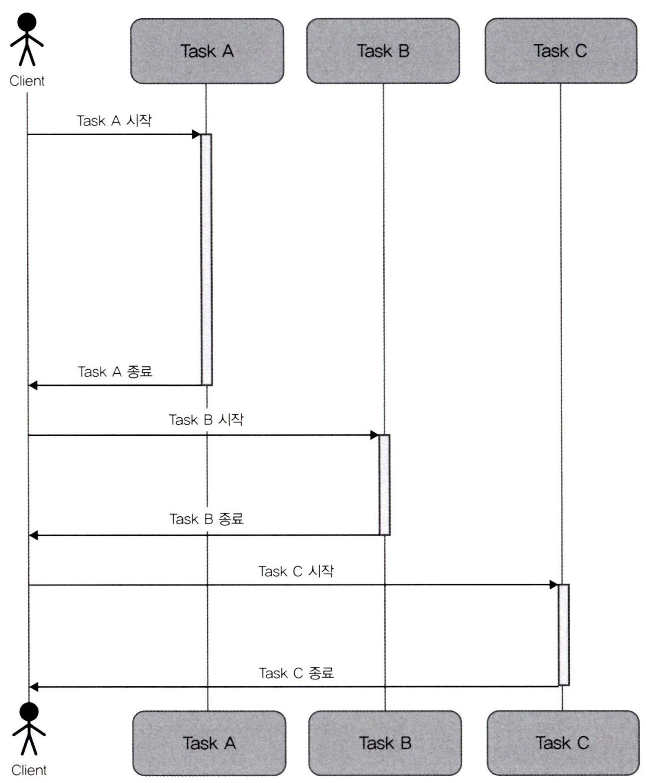

# 1장. 처음 만나는 Node.js

- Node.js: 크롬에 내장돼 있는 V8 자바스크립트 엔진 위에 구축된 자바스크립트 런타임(실행 환경)
    - HTTP를 주고받는 서버로서 사용자와 요청을 주고받는 네트워크 처리에 특화돼 있다.

## 1.1 언어로서의 Node.js 특징

---

- Node.js의 큰 특징
    - 비동기 이벤트 주도 런타임
    - 논블로킹 I/O와 싱글 스레드

### 1.1.1 Node.js와 이벤트 주도

---

- 동기 처리: 동시에 1개의 작업만 실행한다.
    - 프로그램은 기술한 순서대로 실행된다.
    - 실행하는 동안에는 그 처리가 완료될 때까지 다른 처리를 수행하지 않는다.
    
    
    
    그림 1-1 동기 처리
    
- 비동기 처리: 기술한 순서대로 실행된다고 단정할 수 없다. 실행한 작업이 완료되기 전에 다른 작업이 동작할 수도 있다.
    - 비동기 처리의 장점은 성능이다. 하지만 단점은 코드를 작성하기 어렵다.
    
    
    
    그림 1-2 비동기 처리
    

💡Node.js는 비동기의 장점을 최대한 활용하고 단점을 최소화할 수 있는 언어다.

- 자바스크립트와 비동기의 관계성
    - 자바스크립트: 웹 페이지에서 가벼운 동작을 다루기 위해 이용되던 프로그래밍 언어
        - 브라우저에서 발생하는 다양한 이벤트를 처리하는 것
        - 브라우저가 자바스크립트를 동작시킨다.
        
        → 임의의 시점에 임의의 이벤트가 발생하면 이에 대한 처리를 실행한다.
        
    - Node.js: 브라우저가 아닌 서버에서 동작한다.
        - OS에서 발생하는 다양한 이벤트를 처리하는 런타임
            - OS에도 브라우저처럼 다양한 이벤트(파일 읽기/쓰기, 네트워크 데이터 송수신, 키보드나 마우스의 입력 등)가 비동기로 발생하고, OS는 이를 처리한다.
        - OS와 런타임이 자바스크립트를 동작시킨다.
        
        → 비동기 이벤트 주도 자바스크립트 런타임
        
    - 성능이 뛰어난 비동기 처리를 쉽게 작성할 수 있다.
        - 자바스크립트는 원래 비동기를 중심으로 처리하는 특성을 갖는다.

### 1.1.2 Node.js와 싱글 스레드

---

- Node.js의 특징: 싱글 프로세스/싱글 스레드로 동작한다.

- 프로세스: 실행되고 있는 프로그램을 관리하는 단위
    - 어떤 프로그램을 실행하고 있는지에 관한 정보를 갖거나, 프로그램을 실행하기 위한 메모리를 확보하는 등의 작업을 수행한다.
- 스레드: 프로그램을 실행하는 스레드를 하나 이상 가진다.
    - 프로세스보다 가볍고, 같은 프로세스에 소속된 스레드는 같은 메모리 공간을 참조하므로 여러 스레드에서 같은 데이터를 참조할 수 있다.

💡Node.js는 기본적으로 하나의 프로세스에 대해 하나의 스레드를 생성해 싱글 스레드로 동작하는 애플리케이션이다.

### 1.1.3 이벤트 루프와 논블로킹 I/O

---

- 싱글 스레드보다 멀티스레드에 일반적으로 높은 성능을 기대할 수 있다.
    - 하지만 Node.js는 싱글 스레드라도 논블로킹 I/O라는 특징을 가지고 있어, 성능을 최대로 발휘할 수 있으며 작업을 효율적으로 처리할 수 있다.

- 블로킹 I/O 런타임: 입출력 중에는 다른 처리를 하지 않는다. 요청 처리가 종료될 때까지 I/O를 대기시킨다.
    - 요청 A가 서버 처리를 점유하고 종료할 때까지 요청 B는 결과를 반환하지 않는다.
    
    
    
    그림 1-3 I/O를 블로킹하는 경우
    
- Node.js: 논블로킹 I/O를 채택한다.
    - 다양한 I/O를 일정한 덩어리(이벤트)로 분할한다.
    - 각 이벤트를 잘게 쪼개어 실행함으로써 이벤트 중에 다른 이벤트를 블로킹하지 않고 처리할 수 있다.
    
    
    
    그림 1-4 논블로킹 I/O의 경우
    
    → 싱글 스레드여도 동시에 여러 요청을 처리할 수 있다.(논블로킹 I/O + 이벤트 루프 구조)
    

- 논블로킹 I/O를 코드로 확인하기
    
    ```jsx
    const { readFile } = require('fs');
    
    console.log('A');
    
    // _filname에는 자신의 파일 경로가 들어 있다.
    readFile(__filename, (err, data) => {
      // 파일 읽기를 마쳤을 때 호출된다・
      console.log('B');
    });
    
    console.log('C');
    ```
    
    - 실행 결과
        
        ```powershell
        $ node file.js
        A
        C
        B
        ```
        

- Node.js 내부에서는 큐에 집어넣은 작업을 꺼내기 위해 이벤트 루프(무한 루프)를 항상 동작시킨다.
    
    
    
    그림 **1-5** 이벤트 루프 관련 처리 이미지
    
    - 이벤트 루프는 대기중인 처리가 없으면 특별히 아무것도 처리하지 않는 아이들(idle) 상태가 된다.
    - 이벤트 루프가 멈추면 애플리케이션은 다음 처리를 할 수 없다.
        
        → 이벤트 루프를 얼마나 정지시키지 않는지가 매우 중요한 고려서항이 된다.
        

### 1.1.4 C10K 문제와 Node.js

---

- C10K 문제: 동시에 접속하는 클라이언트 수가 10K(1만) 개가 됐을 때 소프트웨어 성능이 제대로 발휘되지 않는 문제
    - prefork 타입의 아파치 HTTP 서버: prefork 수의 기본값이 64.
    - 동시 접속수가 이를 초과하면 더 이상의 프로세스를 할당할 수 없기 때문에 리소스 여유가 있더라도 서비스 응답이 악화되는 현상이 발생한다.

- C10K 문제에 대한 접근 방법
    - Node.js는 논블로킹 I/O와 싱글 프로세스/싱글 스레드라는 모델로 대응한다.
    - 여러 요청을 받아도 동시에 처리하는 능력이 뛰어나, 리소스를 효율적으로 활용할 수 있는 것이 특징이다.
    - 그러나 Node.js도 만능은 아니다.
        - 동영상 인코딩과 같은 CPU 중심 처리는 아무리 Node.js라 하더라도 여러 요청을 받는 용도로는 적합하지 않다.
        - 코드를 작성할 때 동기 처리를 회피하는 등 성능상 주의해야 할 점도 있다.

### 1.1.5 백엔드로서의 Node.js

---

- 익스프레스: 웹 애플리케이션 프레임워크. Node.js의 사실상 표준

## 1.2 프런트엔드/백엔드 모두에 필요하게 된 Node.js

---

### 1.2.1 개발 도구로서의 Node.js

---

- 당시 프론트엔드에는 각종 라이브러리를 얼마나 효율적으로 관리할 수 있을 것인가 하는 과제가 존재했다.

- npm 활용
    - npm (Node Package Manager): Node.js의 코드를 재이용할 수 있도록 한 패키지 관리자.
        - 코드를 호스팅하는 저장소와 이를 조작하는 CLI로 구성되며, npm을 사용해 패키지(라이브러리)를 설치하면 버전 관리와 재구축을 손쉽게 할 수 있다.

- 빌드의 필요성과 태스크 러너
    - 태스크 러너: 애플리케이션을 만드는 데 필요한 작업을 자동화하기 위해서 그런트나 걸프와 같은 Node.js로 만든 태스크 러너가 개발됐다.

- 트랜스파일러를 이용한 사양의 선점
    - 자바스크립트에는 표준 모듈 시스템이 없어 모듈이 늘어나는 개발 스타일과 호환성이 좋지 않았다.
    - ECMAScript(자바스크립트 표준)는 2011년에 ES5(ECMAScript v5) 버전을 표준으로 사용했다. 2015년에 ES6 버전이 등장했다.
        - 하지만 각 브라우저가 기능을 구현할 수 있을 때까지는 그저 사양에 불과했다.
    - 이러한 문제를 해결하기 위해 2014년에 바벨이라는 트랜스파일러가 등장했다.
    - 트랜스파일러: ES6으로 작성된 자바스크립트 코드를 ES5 자바스크립트 코드로 출력한다.
        - ES5 기반 브라우저에서 새로운 사양을 따르는 코드를 동작시킬 수 있게 한 것이다.

- 모듈 시스템
    - Node.js는 `require('module_name')`과 같은 형태로 모듈을 분할하는 CommonJS 스타일을 채택했다.
        - ES6에서도 `import`/`export` 사양이 정의돼 있었지만, 실제 브라우저로 구현하기 위해서는 문제점이 많았다.
    - 모듈 번들러: 파일(모듈)의 의존관계를 해결해 번들(결합)하는 것을 담당한다.
        - 웹팩, 브라우저리파이
        - Node.js를 이용해 구현됐다.

### 1.2.2 프런트엔드를 위한 백엔드로서의 Node.js

---

- SSR과 Node.js
    - SPA: 자바스크립트로 HTML을 구성함으로써 화면 이동 구현이나, 차이가 나는 부분만 렌더링하는 방식 등으로 빠른 속도의 사용자 경험을 연출할 수 있게 됐다.
        - 하지만 브라우저가 자바스크립트를 읽어서 실행하는 단계가 필요해서 초기 로딩이 느려진다.
        - 초기 로딩 속도를 포함해 튜닝을 하고 싶다면 서버 사이드에서 HTML을 구축해야 한다.
    - SSR: 프론트엔드에서 자바스크립트를 이용해 생성할 페이지를 서버 사이드에서 미리 렌더링해 HTML로 준비해두는 기술
        - 리소스가 한정된 스마트폰 환경 등에서는 SSR의 장점이 극대화된다.
        - 사실상 Node.js로만 구현할 수 있다.

- 프런트엔드를 위한 백엔드
    - BFF: 여러 API 등을 묶는 역할을 하는 백엔드
        - 프론트엔드 개발자가 유지보수하기 쉬운 환경임을 생각하면 Node.js를 채택하는 것이 합리적이다.

- 타입스크립트: 자바스크립트에 타입을 부여(정적 타입 도입)해 보다 안전하게 개발할 수 있고, 편집기의 강력한 도움을 받으며 개발할 수 있는 프로그래밍 언어
    - 자바스크립트로 트랜스파일할 수 있다. 빌드하는 언어다.
    - 자바스크립트: 스크립트 언어이며 빌드 단계를 거치지 않아도 코드를 실행할 수 있다.

- Node.js와 브라우저에서 동작하는 자바스크립트의 차이
    - Node.js는 자바스크립트라는 문법을 적용한 실행 환경
    - 브라우저에서 동작하는 자바스크립트와는 다른 API를 갖는다.
        - `setTimeout`이나 `fetch` 등 브라우저와 공통된 인터페이스를 가진 API라도 내부 동작은 다르기도 하다.
