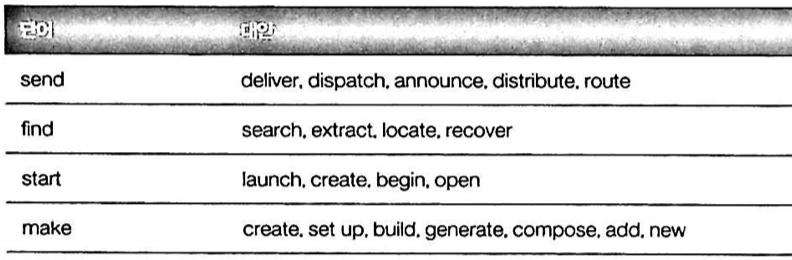

# 읽기 좋은 코드가 좋은 코드다

## 1. 코드는 이해하기 쉬워야 한다

- 무엇이 코드를 '더 좋게' 만드는가? → 가독성
- 가독성의 기본 정리: 가독성과 관련한 가장 중요한 통계적 사실
    - 이해를 위한 시간: 다른 사람이 코드를 이해하는 데 들이는 시간
- 분량이 적으면 항상 더 좋은가? → 이해를 위한 시간을 최소화하는게 더 좋은 목표다.


# Part 1. 표면적 수준에서의 개선

## 2. 이름에 정보 담기

- 특정한 단어 고르기: get 대신 fetch 나 download 를 사용하는 것이 더 나을 수 있다.
    - 매우 구체적인 단어를 선택하여 무의미한 단어를 피하는 것
        - stop() 대신 kill(), pause()
    - 더 화려한 단어 고르기

        

    - 재치 있는 이름보다 명확하고 간결한 이름이 더 좋다.

- 보편적인 이름 피하기 (혹은 언제 그런 이름을 사용해야 하는지 깨닫기)
    - tmp: 대상이 짧게 임시적으로만 존재하고, 임시적 존재 자체가 변수의 가장 중요한 용도일 때에 한해서 사용해야 한다.
    - retval: 정보를 제대로 담고 있지 않다. 대신 변수값을 설명하는 이름을 사용하라.
    - 루프반복자의 i, it 대신 더 명확한 의미를 드러내는 이름을 사용하자.

    → 보편적인 이름을 사용하려면, 꼭 그렇게 해야하는 이유가 있어야 한다.

- 추상적인 이름 대신 구체적인 이름 사용하기
    - serverCanStart() 보다 canListenOnPort()

- 접두사 혹은 접미사로 이름에 추가적인 정보 덧붙이기
    - 단위를 포함하는 값들: start 대신 start_ms

        

    - 다른 중요한 속성 포함하기: 위험한 요소 혹은 나중에 놀랄만한 내용이 있다면 변수명에 이를 포함해야 한다. 이스케이핑을 수행하는 변수 앞에 raw_ 를 붙인다.

        

- 이름이 얼마나 길어져도 좋은지 결정하기
    - 좁은 범위에서는 짧은 이름이 괜찮다.
    - 긴 이름 입력하기 - 더 이상 문제가 되지 않는다.
    - 약어와 축약형 기준
        - 축약이 나중에 일어날지 모르는 혼란을 무릅쓸만한 가치가 있을까?
        - 팀에 새로 합류한 사람이 의미하는 바를 이해할 수 있으면 그 이름은 괜찮은 것이다.
    - 불필요한 단어 제거하기: convertToString() 대신 toString()

- 추가적인 정보를 담을 수 있게 이를 구성하기
    - 밑줄과 대시, 대문자를 잘 이용하면 이름에 더 많은 정보를 담을 수 있다.
    - 클래스 멤버를 로컬 변수와 구분하기 위해 _ 를 붙일 수 있다.
    - 언어별 포맷팅 관습을 지키자.


## 3. 오해할 수 없는 이름들

- 본인이 지은 이름을 '다른 사람들이 다른 의미로 해석할 수 있을까?' 질문을 던져보며 철저하게 확인해야 한다.
    - filter(): 대상을 고르는 것인지 제거하는 것인지 불분명하다. select(), exclude() 가 더 낫다.

- 경계를 포함하는 한계값을 다룰 때는 min 과 max 를 사용하라: MIN_ITEMS_IN_CART
- 경계를 포함하는 범위에는 first, last 를 사용하라

    

- 경계를 포함하고/배제하는 범위에는 begin, end 를 사용하라

    

- 불리언 변수에 이름 붙이기: true, false 가 각각 무엇을 의미하는지 명확해야 한다.
    - 일반적으로 is, has, can, should 같은 단어를 더하면 의미가 더 명확해진다.
    - 의미를 부정하는 용어(disable_ssl)를 피하는 것이 좋다.
- 사용자의 기대에 부응하기: 사용자가 어떤 이름의 의미를 특정한 방식으로 이해해서 실제로 다른 의미가 있음에도 오해를 초래할 때가 있는데, 그것이 일반적인 의미를 갖도록 하는게 좋다.


## 4. 미학

- 좋은 소스코드는 '눈을 편하게' 해야 한다. 미학적으로 보기 좋은 코드가 사용하기 더 편리하다.
- 읽기 편한 소스코드를 작성하는 방법
    - 코드를 읽는 사람이 이미 친숙한, 일관성 있는 레이아웃을 사용하라.
        - 의미있는 순서를 선택하고 일관성 있게 사용하라: 코드의 순서가 코드의 정확성에 아무런 영향을 미치지 않는 경우, 한 곳에서 언급된 순서를 지키자.

            

            - 변수의 순서를 HTML 폼에 있는 `<input>` 필드의 순서대로 나열하라.
            - '가장 중요한 것'에서 시작해서 '가장 덜 중요한 것'까지 순서대로 나열하라.
            - 알파벳 순서대로 나열하라.
        - 개인적인 스타일 대 일관성: 스타일이 뒤섞이면 가독성에 영향을 준다. 일관성 있는 스타일은 '올바른' 스타일보다 더 중요하다.
    - 비슷한 코드는 서로 비슷해 보이게 만들어라.
        - 일관성과 간결성을 위해서 줄 바꿈을 재정렬하기

            

            - 주석 반복 제거하고자 좀 더 간결하게 개선해 볼 수 있다.

                

        - 메소드를 활용하여 불규칙성을 정리하라. 헬퍼 메소드 적용 효과.
            - 중복된 코드를 없애서 코드를 더 간결하게 한다.
            - 이름이나 에러 문자열 같은 테스트의 중요 부분들이 한 눈에 보이게 모아졌다. 수정 전에는 database_connection 이나 error 같은 토큰들과 섞인 채 흩어져 있었기 때문에 코드를 한 눈에 파악하기 어려웠다.
            - 새로운 테스트 추가가 훨씬 쉬워졌다.
        - 도움이 된다면 코드의 열을 맞춰라

            

            

            

    - 서로 연관된 코드는 하나의 블록으로 묶어라.
        - 선언문을 블록으로 구성하라
            - before

                

            

        - 코드를 '문단'으로 쪼개라
            - before

                

            

            - 각 문단의 주석 처리는 사용자가 코드를 훑어보는 데 도움을 준다.


## 5. 주석에 담아야 하는 대상

- 주석의 목적: 코드를 읽는 사람이 코드를 작성한 사람만큼 코드를 잘 이해하게 돕는다.
- 설명하지 말아야 하는 것
    - 코드에서 빠르게 유추할 수 있는 내용은 주석으로 달지 말라.
        - 설명 자체를 위한 설명을 달지 말라.
        - before

            

        

        - 함수의 선언과 주석 내용이 실질적으로 일치하는 경우, 주석을 삭제하거나 더 중요한 세부 사항을 적는 것이 낫다.
    - 나쁜 이름에 주석을 달지 마라 - 대신 이름을 고쳐라.
        - before

            

        

        - 좋은 이름은 함수가 사용되는 모든 곳에서 드러나므로 좋은 주석보다 더 낫다.
- 코딩을 수행하면서 머릿속에 있는 정보를 기록하기.
    - '감독의 설명'을 포함하라: 코드가 특정한 방식으로 작성된 이유를 설명해주는 내용
        - 중요한 통찰을 기록한 주석을 코드에 포함시켜야 한다.
        - 코드를 최적화 하느라 시간을 허비하지 않게 도와준다.

            

        - 오해의 소지로 인한 시간 허비 방지

            

        - 코드가 왜 훌륭하지 않은지도 설명할 수 있다.

            

            - 다음 사람에게 어떻게 수정해야 하는지 알려준다. 만약 이 주석이 없으면 많은 사람이 이 코드에 겁을 먹어 건드리지 않으려고 할 것이다.
    - 코드에 있는 결함을 설명하라
        - 코드는 지속적으로 진화하며, 그 과정 중에 버그를 갖게될 수 밖에 없다. 결함을 설명하는 것을 부끄러워할 필요는 없다.
        - 개선 아이디어 설명하기
            - 다음과 같이 개선이 필요할 때

                
              
            - 코드가 불완전할 때

                

        

    - 상수에 대한 설명
        - 상수에 별도의 설명이 필요한 경우

            

        - 상수의 특정한 값이 아무런 의미를 갖지 않음을 알려주는 주석

            

        - 신중하게 설정되었으니 변경하지 마라 표시

            

- 코드를 읽는 사람 입장에서 필요한 정보가 무엇인지 유추하기.
    - 나올 것 같은 질문 예측하기

        

    - 사람들이 쉽게 빠질 것 같은 함정을 경고하라
        - 함수의 '세부 사항'을 설명하는 주석

            

        - 함수의 단점을 주석으로 미리 알려주자

            

    - '큰 그림'에 대한 주석
        - 상위 레벨 주석

            

        - 파일 레벨 주석

            

    - 요약 주석
        - 함수 내부에서 '큰 그림'을 설명하는 방식.
        - 더 아래의, 하위 레벨 주석: 코드의 내용을 간결하게 요약한다.

            


## 6. 명확하고 간결한 주석 달기

- 주석은 높은 '정보 대 공간' 비율을 갖춰야 한다.
    - 주석을 간결하게 하라
    - 모호한 대명사는 피하라. ex> it, this
        - 혼동의 여지가 조금이라도 있으면 대명사를 원래 명사로 대체하자.
    - 엉터리 문장을 다듬어라
        - before: `// 이 URL을 전에 이미 방문했는지에 따라서 다른 우선순위를 부여한다.`
        - `// 전에 방문하지 않은 URL에 높은 우선순위를 부여하라.`
    - 함수의 동작을 명확하게 설명하라
        - before: `// 이 파일에 담긴 줄 수를 반환한다.`
        - `// 파일 안에 새 줄을 나타내는 바이트('\n')가 몇 개 있는지 샌다.`
    - 코너케이스를 설명해주는 입/출력 예를 사용하라
        - 주석을 작성하는 데 신중하게 선택된 입/출력 예는 천 마디 말보다 위력적이다.
        - 지나치게 간단한 입출력 예는 별로 유용하지 않다.
        - before

            

        

    - 코드의 의도를 명시하라
        - before

            

        

    - 이름을 가진 함수 파라미터(Named Function Parameter) 주석
        - 의미가 불분명한 함수의 인수를 설명하라.

        

    - 정보 축약형 단어를 사용하라
        - before

            

        


# Part 2. 루프와 논리를 단순화하기

## 7. 읽기 쉽게 흐름제어 만들기

- 흐름을 제어하는 조건과 루프 그리고 여타 요소를 최대한 ‘자연스럽게’ 만들도록 노력하라.
    - 코드를 읽다가 다시 되돌아가서 코드를 읽지 않아도 되게끔 만들어야 한다.

- 조건문에서 인수의 순서
    - 왼쪽: 값이 더 유동적인 ‘질문을 받는’ 표현
    - 오른쪽: 더 고정적인 값으로, 비교대상으로 사용되는 표현
    - ex> `if (length > 10)`
- `if/else` 블록의 순서
    - 부정이 아닌 긍정을 다루어라.
        - 즉 `if(!debug)`가 아니라 `if(debug)`를 선호하자.
    - 간단한 것을 먼저 처리하라.
        - 이렇게 하면 동시에 같은 화면에 `if`와 `else`구문을 나타낼 수도 있다.
        - 두 개의 주문을 동시에 보는 게 더 좋다.
    - 더 흥미롭고, 확실한 것을 먼저 다루어라.
        - before

          

      

    - 그러나, 부정부터 다루어야 더 단순하고 흥미로우면서 동시에 위험해지는 경우도 있다.

      

        - 이 경우에는 상세 내용을 따지고 난 뒤 판단을 내려야 한다.
- 삼항 연산자(`?:`)를 이용하는 조건문 표현
    - 삼항 연산자가 읽기 편하고 간결한 경우: 매우 간단할 때만 사용해야 한다.
        - before

            ```java
            if (hour >= 12) {
                time_str += "pm";
            } else {
                time_str += "am";
            }
            ```

        ```java
        time_str += (hour >= 12) ? "pm" : "am";
        ```

    - 복잡해지는 경우: 간단한 두 값에서 선택하는 문제가 아닌 경우.

        ```java
        return exp >= 0 ? m + (1 << exp) : m / (1 << -exp);
        ```

        - 코드를 이렇게 작성하는 것은 그저 '모든 것을 한 줄에 쓰기'다. → `if/else`문이 낫다.
- `do/while` 루프를 피하라: 조건이 '눈에 뜨이는 곳에 미리' 나타나는 것이 좋다.
    - `if`, `while`, `for`문의 동작 원리는 모두 코드를 위에서 아래로 읽는다.
    - 그러나 `do/while`은 역순이라 코드를 두 번 읽어야 해서 부자연스럽다.
- 함수 중간에서 반환하기
    - 함수 중간에서 반환하는 것이 바람직할 때도 있어, 완전히 허용되어야 한다.

      

        - 위의 함수를 중간에서 반환하는 보호장치 없이 구현하면 매우 부자연스러워질 것이다.
    - 반환 포인트를 하나만 두려는 건 함수의 끝부분에서 실행되는 클린업(cleanup) 코드의 호출을 보장하려는 의도다.
        - 언어 차원에서 제공하는 더 정교한 클린업 코드를 실행시키는 방법을 사용하자.

      

- 악명 높은 `goto`는 피하는 게 낫다.
- 중첩을 최소화하기
    - 코드의 중첩이 일어날 때마다 코드를 읽는 사람의 '정신적 스택'에 추가적인 조건이 입력된다.
    - 함수 중간에서 반환하여 중첩을 제거하라
        - before

          

      

    - 루프 내부에 있는 중첩 제거하기 - 루프 중간에서 반환하기
        - before

          

      

        - `if/return`을 함수의 보호 장치로 사용했듯이, `if/continue`도 루프의 보호 장치로 사용할 수 있다.

- 실행 흐름을 따라올 수 있는가?
    - 눈에 보이는 코드의 '뒤에서' 실행되는 몇 가지

      

  → 이러한 구조가 차지하는 비율이 너무 높지 않아야 한다.


## 8. 거대한 표현을 잘게 쪼개기

---

## 9. 변수와 가독성

---

# Part 3. 코드 재작성하기

---

## 10. 상관없는 하위문제 추출하기

---

## 11. 한번에 하나씩

---

## 12. 생각을 코드로 만들기

---

## 13. 코드 분량 줄이기

---

# Part 4. 선택된 주제들

---

## 14. 테스트와 가독성

---

## 15. '분/시간 카운터' 를 설계하고 구현하기

---
