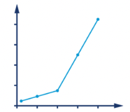

# Chapter 1. 성능과 최적화

## 1. 자바 성능: 잘못된 방법

---

- 자바 초창기에 메서드 디스패치 성능은 정말 최악이었다.
    - 메서드를 잘게 나누지 말고 하나의 덩치 큰 메서드로 작성하는게 좋다고 권고
        
        → 현대 JIT(적시) 컴파일러와는 어울리지 않는 퇴물이 됐다.
        
    - 시간이 지나면서 가상 디스패치 성능은 엄청나게 좋아짐
    - 최신 JVM에서는 자동 인라이닝 덕분에 가상 디스패치조차 대부분의 호출부(콜 사이트)에서 사라지게 됐다.

- 우수한 성능 목표를 달성하기 위해 필요한 여러 가지 단면
    - 전체 소프트웨어 수명주기의 성능 방법론
    - 성능과 연관된 테스트 이론
    - 측정, 통계, 툴링(도구 선정)
    - (시스템+데이터) 분석 스킬
    - 하부 기술과 메커니즘(장치, 수단)

## 2. 자바 성능 개요

---

> 자바는 블루 칼라 언어입니다. 박사 학위 논문 주제가 아니라 일을 하려고 만든 언어죠. - 제임스 고슬링
> 
- 자바는 처음부터 지극히 실용적인 언어
    - 개발 환경이 ‘충분히 빠르다면’ 개발자 생산성이 높아지는 대가로 어느 정도의 성능 희생은 감수할 만하다는 입장이었다.
        
        → 자바 환경이 고성능 컴퓨팅 애플리케이션에 적합한 수준에 이른 건 비교적 최근에 핫스팟 같은 정교한 JVM이 성숙했기 때문이다.
        
    - 관리되는 서브시스템(하위계)
        - 개발자가 일일이 용량을 세세하게 관리하는 부담을 덜어주고, 대신 저수준으로 제어 가능한 일부 기능을 포기하자는 발상
        - ex> 메모리 관리
            - JVM이 탈착형 가비지 수집 서브시스템 형태로 메모리를 자동 관리하는 덕분에 프로그래머는 수동으로 메모리를 의식하며 개발할 필요가 없다.
        
        <aside>
        💡 JVM 전반에 걸쳐 등장하는 관리되는 서브시스템은 그 존재 자체로 JVM 애플리케이션의 런타임 동작에 복잡도를 유발한다.
        
        </aside>
        

- JVM 애플리케이션의 성능 측정값
    - 정규 분포를 따르지 않는 경우가 많아서 기초 통계 기법(ex> 표준편차, 분산)만 갖고는 측정 결과를 제대로 처리하기에 역부족이다. 대부분 암묵적으로 정규 분포를 전제로 하기 때문.
        - ex> JVM 애플리케이션에서 특이점(아웃라이어)은 매우 중요한 의미를 내포할 수 있다.
            
            → 측정값을 샘플링(표본 추출)하면 특이점을 일으킨 가장 중요한 이벤트가 묻혀버릴 가능성이 크다.
            
    - 자바 성능 측정값 때문에 판단이 흐려지기 쉬우므로 조심해야 한다.
        - 환경이 복잡해질수록 시스템을 개별적으로 따로 떼어내 생각하기는 몹시 어렵다.
    - 측정하는 행위 자체도 오버헤드(과부하)를 일으키며, 너무 자주 샘플링하거나 매번 결과를 기록하는 것 역시 성능 결과 수치에 적잖은 영향을 끼친다.

## 3. 성능은 실험과학이다

---

> 소프트웨어 산업의 가장 경이적인 성과는 하드웨어 산업에서 꾸준히 이루어낸 혁신을 끊임없이 무용지물로 만들고 있는 것이다. - 헨리 페트로스키
> 
- 성능은 원하는 결과를 얻기 위한, 일종의 실험과학
    - 원하는 결과를 정의한다.
    - 기존 시스템을 측정한다.
    - 요건을 충족시키려면 무슨 일을 해야 할지 정한다.
    - 개선 활동을 추진한다.
    - 다시 테스트한다.
    - 목표가 달성됐는지 판단한다.

## 4. 성능 분류

---

- 일반적인 기본 성능 지표
    - 처리율
    - 지연
    - 용량
    - 사용률
    - 효율
    - 확장성
    - 저하

### 4-1. 처리율

---

- 처리율: (서브)시스템이 수행 가능한 작업 비율을 나타낸 지표

- 처리율이 실제 성능을 반영하는 의미 있는 지표가 되려면
    - 수치를 얻은 기준 플랫폼에 대해서도 내용을 기술해야 한다.
        - 하드웨어 스펙
        - OS
        - 소프트웨어 스택
        - 테스트한 시스템이 단일 서버인지, 클러스터 환경인지 등
    - 트랜잭션(또는 작업 단위)은 테스트할 때마다 동일해야 한다.
    - 실행 간 워크로드 역시 일정하게 유지해야 한다.

### 4-2. 지연

---

- 지연: 종단 시간이라고도 하며, 대개 그래프에서 워크로드에 비례하는 함수로 표시한다.

### 4-3. 용량

---

- 용량: 시스템이 보유한 작업 병렬성의 총량, 즉 시스템이 동시 처리 가능한 작업 단위(즉, 트랜잭션) 개수를 말한다.
    - 처리율과 밀접한 연관이 있다.

### 4-4. 사용률

---

- 사용률: 워크로드에 따라서 리소스별로 들쑥날쑥할 수 있다.

### 4-5. 효율

---

- 효율: 처리율을 리소스 사용률로 나눈 값으로 측정한다.

### 4-6. 확장성

---

- 확장성: 리소스 추가에 따른 처리율 변화
    - 궁극적으로는 정확히 리소스를 투입한 만큼 처리율이 변경되는 형태를 지향한다.

### 4-7. 저하

---

- 저하: 시스템이 풀 가동된 상태면 처리율이 더는 늘어나지 않는, 즉 지연이 증가하는 양상

### 4-8. 측정값 사이의 연관 관계

---

- 다양한 성능 측정값은 어떤 식으로든 서로 연결돼 있다.

## 5. 성능 그래프 읽기

---

- 성능 엘보: 부하가 증가하면서 예기치 않게 저하(여기서는 지연)가 발생한 그래프
    
    
    
    1-1. 성능 엘보
    

- 클러스터에 장비를 추가함에 따라 거의 선형적으로 처리율이 확장되는, 운이 아주 좋은 케이스
    - 환경이 극단적으로 순조로울 때나 가능하다.
    
    
    
    1-2. 준-선형적 확장
    

- 근본적으로 확장성에는 제약이 따른다.
    - 태스크를 처리할 때 프로세서 개수를 늘려도 실행 속도를 최대 어느 정도까지 높일 수 있는지를 나타낸 그래프
    
    
    
    1-3. 암달의 법칙
    

- JVM 가비지 수집 서브시스템의 메모리 사용 패턴은 그 하부 기술 때문에 부하가 별로 없는 건강한 애플리케이션도 ‘톱니’ 모양을 나타낸다.
    
    
    
    1-4. 건강한 메모리 사용 현황
    

- 피보나치 수열을 계산하는 애플리케이션을 실행하여 얻은 그래프
    - 애플리케이션에서 메모리 할당률을 성능 튜닝할 때 아주 중요한 메모리 그래프
    - 90초 부근에서 갑자기 할당률이 급격히 떨어지고 있다.
        - 이 지점에서 애플리케이션에 심각한 가비지 수집 문제가 발생했고 가비지 수집 스레드들이 서로 CPU 경합을 벌인 탓에 메모리를 충분히 할당받지 못했다.
    - 할당 서브시스템도 4GB/s라는 미친 속도로 메모리를 할당하고 있다.
        - 최신 시스템 대부분의 권장 최대 용량을 훨씬 웃도는 수준
    
    
    
    1-5. 문제가 있는 할당률 분포
    
    - 시스템 리소스가 누수될 때 흔히 나타나는 징후
        - 부하가 증가하면서 지표(여기서는 지연)가 차츰 악화되다가 결국 시스템 성능이 급락하는 변곡점에 이르게 된다.
        
        
