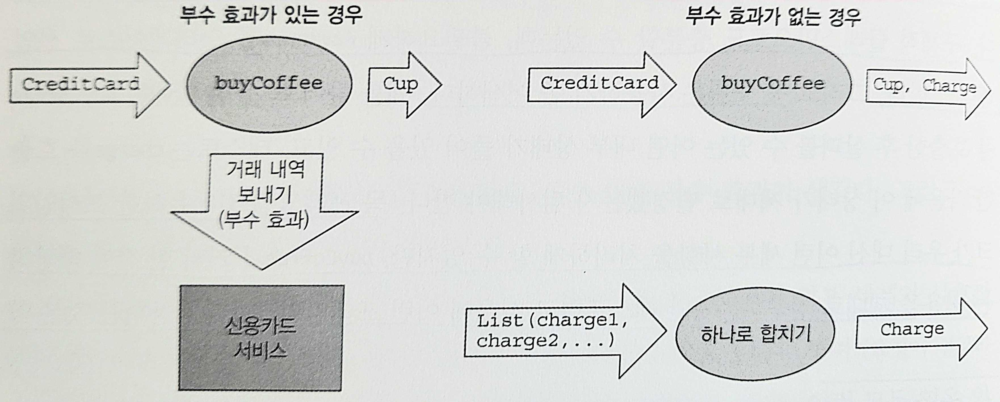

# 1장. 함수형 프로그래밍이란?

- 명령형(imperative): 컴퓨터에게 정해진 명령이나 지시를 하나하나 내린다.
    - 각 명령 단계마다 시스템의 상태를 바꾸고 있는 것
    - 프로그램이 커지고 더 복잡해짐에 따라, 이런 단순해 보이는 방식이 정반대의 결과를 가져온다.
- 함수형(Functional): 명령형 스타일의 대안
    - 부수 효과를 완전히 없애는 것은 함수형 프로그래밍을 뒷받침하는 핵심 개념이다.
        - 이를 통해 맨 처음 프로그래밍 여행을 시작했을 때와 같은 '단순성'이라는 안전한 위치로 돌아간다.
    - 순수 함수를 통해 프로그램을 구성한다.
- 순수 함수: 부수 효과가 없는 함수
    - 모듈성으로 인해 테스트하고, 재사용하고, 병렬화하고, 일반화하고, 결과를 추론하기가 더 쉽다. 버그가 발생할 가능성이 훨씬 더 낮다.
- 부수 효과: 결과를 반환하는 것 외에 무언가 다른 일을 하는 함수
    - 변경이 일어나는 블록 외부 영역에 있는 변수를 변경한다.
    - 데이터 구조를 인플레이스(in-place)로 변경한다.(즉, 메모리의 내용을 직접 변경한다)
    - 객체의 필드를 설정한다.
    - 예외를 던지거나 예외를 발생시키면서 프로그램을 중단시킨다.
    - 콘솔에 출력을 하거나 사용자 입력을 읽는다.
    - 파일을 읽거나 쓴다.
    - 화면에 무언가를 그린다.

# 1. FP의 장점: 간단한 예제

---

## 1.1 부수 효과가 있는 프로그램

---

- ex> 커피 판매를 처리하는 프로그램
    
    ```kotlin
    class Cafe {
        fun buyCoffee(cc: CreditCard): Coffee {
            val cup = Coffee() // 새로운 커피를 한 잔 초기화한다
            cc.charge(cup.price) // 커피 가격을 신용카드로 청구한다. 부수 효과!
            return cup // 커피를 반환한다
        }
    }
    ```
    
    - 신용카드를 청구하려면 외부 세계와 상호작용이 필요하다.
    - 이런 모든 일은 외부에서 부수적으로 벌어지고 우리가 만든 함수는 단지 Coffee를 반환하기만 한다.
    
    → 부수 효과로 인해 이 코드는 테스트하기 어렵고, 테스트가 진짜로 신용카드사에 접속해 비용을 청구하는 것은 바라지 않는다!
    
    - CreditCard는 신용카드사에 접속해 비용을 청구하는 방법을 알고 있어서는 안 되며, 내부 시스템에서 이 청구 기록을 어떻게 영속화하는지에 대해서도 알면 안 된다.

💡CreditCard가 이런 관심사를 알지 못하게 하고, buyCoffee에 Payments 객체를 넘김으로써 이 코드를 좀 더 모듈화하고 테스트성을 향상시킬 수 있다.

```kotlin
class Cafe {
    fun buyCoffee(cc: CreditCard, p: Payments): Coffee {
        val cup = Coffee()
        p.charge(cc, cup.price) // 부수 효과!
        return cup
    }
}
```

- 여전히 부수 효과가 일어나지만, 이제 최소한 약간의 테스트성은 얻을 수 있다. Payments를 인터페이스로 선언할 수 있고, 이 인터페이스에 대해 테스트에 적합한 목(mock) 구현을 작성할 수 있다.
- 하지만 이렇게 해도 이상적이지는 않다.
    - 구체적 클래스만으로도 충분할 수 있는데, 불필요하게 Payments를 인터페이스로 선언해야만 한다.
    - 목 구현은 사용하기 좀 어색하다. 목 프레임워크나 유사한 프레임워크가 우리 대신 이런 세부 사항을 처리하게 할 수 있지만, buyCoffee가 커피 한 잔에 해당하는 비용을 제대로 청구하는지만 테스트하고 싶은데 이런 프레임워크까지 사용하는 것은 약간 과잉인 것처럼 보인다.
    - buyCoffee를 재사용하기가 어렵다. 고객이 커피를 12잔 주문 → buyCoffee를 12번 호출하는 형태로 그냥 재사용할 수 있어야 한다. 이런 식으로 호출하면 신용카드사에 12번 연결 → 수수료가 더 많이 들 수 있음

→ buyCoffees를 새로 작성

🥲 로직을 하나 더 만들어내는 일이 단순하지 않을 수 있고, 코드 재사용성과 합성성을 잃어버림

## 1.2 함수형 해법: 부수 효과 제거하기

---

- 함수형 해법은 부수 효과를 제거하고 buyCoffee가 Coffee와 함께 청구할 금액을 반환하게 하는 것이다.
    
    
    
    1.1 buyCoffee를 부수 효과를 써서 호출하는 경우와 부수 효과 없이 호출하는 경우의 비교
    
    ```kotlin
    fun buyCoffee(cc: CreditCard): Pair<Coffee, Charge> {
        val cup = Coffee()
        return Pair(cup, Charge(cc, cup.price))
    }
    ```
    
    - 금액 청구를 만드는 관심사와 청구를 처리하거나 해석하는 관심사를 분리했다.
    
    ```kotlin
    data class Charge(val cc: CreditCard, val amount: Float) { // 생성자와 불변 필드가 있는 데이터 클래스 선언
        fun combine(other: Charge): Charge = // 같은 신용카드에 대한 청구를 하나로 묶음
            if (cc == other.cc) // 같은 카드인지 검사함. 같은 카드가 아닌 경우 예외를 발생시킴
                Charge(cc, amount + other.amount) // 이 Charge와 다른 Charge의 금액을 합산한 새로운 Charge를 반환
            else throw Exception(
                "Cannot combine charges to different cards"
            )
    }
    ```
    
    - 어떤 Charge 인스턴스를 다른 Charge 인스턴스와 합치는 편리 메서드(handy method)도 제공한다.
    - 예외 발생은 이상적이지 않지만, 4장에서 오류 상황을 함수형으로 처리하는 접근 방법을 살펴본다.

```kotlin
class Cafe {
    fun buyCoffee(cc: CreditCard): Pair<Coffee, Charge> = TODO()

    fun buyCoffees(
        cc: CreditCard,
        n: Int
    ): Pair<List<Coffee>, Charge> {

        val purchases: List<Pair<Coffee, Charge>> =
            List(n) { buyCoffee(cc) } // 자체적으로 초기화되는 리스트를 생성한다

        val (coffees, charges) = purchases.unzip() // Pair의 리스트를 두 리스트로 분리한다

        return Pair(
            coffees,
            charges.reduce { c1, c2 -> c1.combine(c2) }
        ) // coffees를 한 Charge로 합친 출력을 생성한다
    }
}
```

- 이제는 buyCoffees 함수를 정의할 때 직접 buyCoffee를 재사용할 수 있다.
- Payments 인터페이스에 대한 복잡한 목 구현을 정의하지 않아도 이 두 함수를 아주 쉽게 테스트할 수 있다!
    - 물론 여전히 실제 금액을 청구하기 위해 Payments 클래스가 필요하지만, Cafe는 이에 대해 알 필요가 없다.
- Charge를 일급 시민 값(first-class value)으로 만들면 장점: 청구 금액을 처리하는 비즈니스 로직을 더 쉽게 조립할 수 있다.

- 커피숍에서 모든 주문을 하나로 묶어 청구하기
    
    ```kotlin
    fun List<Charge>.coalesce(): List<Charge> =
        this.groupBy { it.cc }.values
            .map { it.reduce { a, b -> a.combine(b) } }
    ```
    
    - 이 함수는 청구 금액의 리스트를 취해서 사용한 신용카드에 따라 그룹으로 나누고, 각 그룹의 청구 금액을 하나로 합쳐서 카드마다 하나씩 (합쳐진) 청구를 만들어낸다.
    - 이 코드는 완전히 재사용이 가능하고 추가 목 객체나 인터페이스를 사용하지 않아도 테스트하기 쉽다.
- FP를 적용할 때 생겨나는 스타일은 상당히 어렵지만, 아주 아름답고 응집력이 높은 프로그래밍 방법

<aside>
💡 실제 세계에서는 어떻게 해야 할까?

- 어느 시점에는 외부 세계에 대한 부수 효과를 실제로 사용해야만 한다.
- 함수형 해법이 없는 경우에는 효과가 발생하지만 관찰 가능(observable)하지 않도록 코드의 구조를 만드는 방법
    - 함수 본문에 지역적으로 선언된 데이터를 변화시킬 수 있다.
    - 내부 함수에서 파일에 데이터를 기록할 수 있다.
    
    → 완전히 받아들일 수 있는 시나리오들
    
</aside>

# 2. 정확히 (순수) 함수란 무엇인가?

---

- FP: 순수 함수를 사용해 프로그래밍 하는 것
- 순수 함수: 부수 효과가 없다.
    - 주어진 입력으로부터 결과를 계산하는 것 외에 다른 어떤 관찰 가능한 효과가 없다면 이 함수에 아무런 부수 효과가 없다고 말한다.


1.2 순수 함수는 그 함수가 기술하는 일만 하고 다른 부수 효과는 없다.

- 순수 함수에 대한 개념을 참조 투명성(Referential Transparency)이라는 개념을 사용해 형식화할 수 있다.
    - 참조 투명성은 식의 일반적인 특성으로 꼭 함수에만 국한되지 않는다.
- 참조 투명한 식
    - 프로그램의 의미를 변경하지 않으면서 식을 그 결과값으로 치환할 수 있다.
    - 어떤 함수를 참조 투명한 인자를 사용해 호출한 결과가 참조 투명하다.

<aside>
💡 참조 투명성과 순수성

- 어떤 식 e가 있는데, 모든 프로그램 p에 대해 p 안의 e를 e를 평가한 결과로 치환해도 p의 의미에 영향을 끼치지 않으면 e가 참조 투명하다고 한다.
- 모든 참조 투명한 x에 대해 어떤 함수 f가 있어서 식 f(x)가 참조 투명하다면 함수 f도 참조 투명하다.
</aside>

# 3. 참조 투명성, 순수성, 치환 모델

---

```kotlin
fun buyCoffee(cc: CreditCard): Coffee {
    val cup = Coffee()
    cc.charge(cup.price)
    return cup
}
```

- 참조 투명성 정의에 따르면, buyCoffee()가 순수 함수가 되기 위해서는 p가 무엇이든 관계없이 p(buyCoffee(aliceCreditCard))가 p(Coffee())와 똑같이 작동해야 한다.
    - 이 코드에서는 분명히 이런 관계가 성립하지 않는다.
- 참조 투명성은 함수가 수행하는 모든 일이 함수의 반환값에 의해 표현돼야 한다는 사실을 강제한다.
    - 이런 제약을 도입하면 치환 모델(substitution model)을 통해 자연스럽고 단순하게 프로그램 평가에 대한 추론이 가능해진다.
    - ex> `String`의 `reversed()`

- 참조 투명하지 않은 함수 👉  프로그램의 동작에 대해 추론하기가 훨씬 더 어려워진다.
    - ex> `StringBuilder` 클래스에 정의된 `append` 함수
        - `StringBuilder`에 작용하며 객체 내부를 변화시킨다. 호출될 때마다 `StringBuilder`의 이전 상태가 파괴된다.
        
        → 부수 효과가 참조 투명성을 깬다.
        
        
        
        1.4 `StringBuilder`에 대해 `append()`을 여러 번 호출하면 결코 같은 결과가 생기지 않는다.
        

- 치환 모델 👉 평가의 효과가 어느 지역(어떤 식을 평가하면 그 평가가 해당 식에만 영향을 끼침)에 한정되기 때문에 추론하기가 훨씬 쉽다.
    - 사용하는 함수가 어떤 일을 하는지 이해하기 위해 함수 실행 이전이나 이후에 일어날 수 있는 상태 변경을 머릿속으로 추적할 필요는 없다.

- 모듈적인 프로그램은 프로그램 전체와 별개로 각 부분을 나눠서 이해하고 재사용할 수 있는 구성 요소로 이뤄진다. → 구성 요소들을 서로 합성 가능(composable)하다.

- 순수 함수: 모듈적이며 합성적이다.
    - 입력은 오직 한 가지 방법, 즉 함수에 (호출 시) 전달되는 인자를 통해서만 얻어진다.
    - 출력은 계산된 결과를 반환하는 것으로만 이뤄진다.
        - 계산 로직을 둘러싼 환경에 생기는 부수 효과에 전혀 신경 쓰지 않고 계산 로직을 재사용할 수 있다.
        - ex> buyCoffee 예제
            - 출력에 수행하는 지불 처리라는 부수 효과를 없앰 → 함수의 로직을 테스트나 이후의 합성(buyCoffees나 coalesce를 작성할 때처럼)에 더 쉽게 사용할 수 있게 됐다.

# 요약

---

- 함수형 프로그래밍은 코드 모듈성을 높여준다.
- 순수 함수로 인해 얻어지는 모듈성은 테스트 가능성, 코드 재사용, 병렬성, 일반화 가능성 등을 더 향상시켜준다.
- 모듈적인 함수형 코드에 대해 추론하기가 더 쉽다.
- 함수형 프로그래밍은 온전히 순수 함수만 사용하는 방향으로 우리를 이끌어준다.
- 순수 함수는 부수 효과가 없는 함수라고 정의할 수 있다.
- 부수 효과가 있는 함수는 결과를 반환하는 일 외에 다른 일을 하는 함수다.
- 함수가 하는 일이 그 함수의 반환값만으로 표현될 수 있을 때 이런 함수를 '참조 투명하다'라고 말한다.
- 치환 모델을 사용하면 함수의 참조 투명성을 증명할 수 있다.