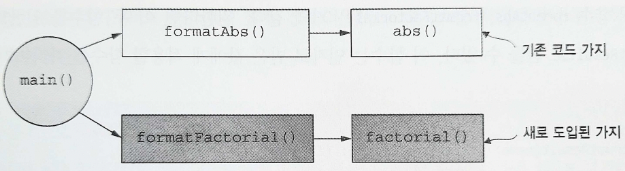

# 2장. 코틀린으로 함수형 프로그래밍 시작하기

- 함수형 프로그램을 작성하는 몇 가지 기본 기법
    - 꼬리 재귀 함수를 사용해 루프를 작성하는 방법
    - 고차 함수(High Order Function)
        - 다른 함수를 인자로 받고 출력으로 함수를 반환할 수 있는 함수

# 1. 고차 함수: 함수를 함수에 넘기기

---

- 함수도 값이며 다른 타입(정수, 문자열, 리스트 등)의 값과 마찬가지로 함수를 변수에 대입하거나 데이터 구조에 저장하거나 함수의 인자로 넘길 수 있다.
- ex> 어떤 수의 절댓값과 다른 수의 계승(팩토리얼)을 출력하는 프로그램
    
    ```kotlin
    object Chapter2Example1 {
        private fun abs(n: Int) =
            if (n < 0) -n
            else n
    
        fun formatAbs(x: Int): String {
            val msg = "The absolute value of %d is %d"
            return msg.format(x, abs(x))
        }
    }
    
    fun main() {
        println(Chapter2Example1.formatAbs(-42))
    }
    ```
    
    → 계승 계산은 인덱스 변수를 변이시키면서 루프를 사용해야 하는데, 순수 함수에서는 변이를 사용할 수 없다.
    
    💡먼저 루프를 함수로 작성하는 방법을 살펴보자.
    

## 1.1 잠시 돌아가기: 루프를 함수적으로 작성하는 방법

---

- n의 계승을 계산하는 새 함수를 추가함으로써 새 동작을 도입한다.
    - 재귀(recursion)를 통해 순수 함수로 루프를 작성할 수 있다.
    
    ```kotlin
    fun factorial(i: Int): Int {
        fun go(n: Int, acc: Int): Int = // 내부 또는 지역 함수 정의
            if (n <= 0) acc
            else go(n - 1, n * acc)
        return go(i, 1) // 정의한 지역 함수를 호출함
    }
    ```
    
    <aside>
    💡 함수형 프로그램에서는 지역 정수나 지역 문자열 변수를 정의하는 것보다 지역 함수를 정의하는 게 더 이상하다고 간주해서는 안 된다.
    
    </aside>
    

- `tailrec`이  붙은 경우 컴파일러는 재귀 호출이 꼬리 위치인 경우에 한해 `while` 루프로 작성했을 때와 같은 종류의 바이트 코드를 토해낸다.
    - 재귀 호출에서 반환된 다음에 수행해야 하는 추가 작업이 없는 경우에만 이런 최적화(꼬리 호출 제거)를 적용할 수 있다.
    
    ```kotlin
    fun factorial(i: Int): Int {
        tailrec fun go(n: Int, acc: Int): Int = // tailrec 변경자는 꼬리 호출을 제거하라고 컴파일러에 명령한다.
            if (n <= 0) acc
            else go(n - 1, n * acc) // 이 함수의 마지막 재귀 호출이 꼬리 위치에 있다.
        return go(i, 1)
    }
    ```
    
    - 재귀 함수의 앞에 `tailrec`을 붙이면 컴파일러가 경고를 표시한다.

### 연습문제 2.1

---

- n번째 피보나치 수를 얻기 위한 재귀 함수를 작성하라. 처음 두 피보나치 수는 0과 1이다. n번째 피보나치 수는 자신 바로 앞의 두 피보나치 수의 합이다. 피보나치 수열은 0, 1, 1, 2, 3, 5, 8, 13, 21 등이다. 여러분의 함수 정의는 지역적인 꼬리 재귀 함수를 사용해야만 한다.
    
    ```kotlin
    fun fib(i: Int): Int =
        SOLUTION_HERE()
    
    fun SOLUTION_HERE(
        message: String = "please complete the exercise!"
    ): Nothing = TODO(message)
    ```
    

<aside>
💡 SOLUTION_HERE() 함수는 코틀린에서 앞으로 작성해야 할 부분을 표시하기 위해 사용하는 내장 함수인 TODO() 함수의 별명일 뿐이다. 계산 과정에서 이 함수는 `NotImplementedError`를 던진다.

- 구현이 되지 않은 코드는 항상 컴파일되지만 프로그램을 평가하자마자 예외를 던진다.
- 이런 함수는 빌드를 깨거나 컴파일에 영향을 끼치지 않으면서 나중에 주의를 환기시켜주는 메모를 작성하는 코드에 남길 때 도움이 되는 방법을 제공한다.
</aside>

## 1.2 첫 번째 고차 함수 작성하기

---

- 이제 n번째 계승을 계산하는 factorial이라는 함수가 있으므로, 절댓값 출력을 표시하는 코드에 이 계승 함수를 도입할 수 있다. formatFactorial을 더 만들자.
    
    
    
    2.1 계승과 관련된 함수를 추가함으로써 프로그램에 새로운 동작을 도입함
    
    ```kotlin
    object Chapter2Example2 {
    
        private fun abs(n: Int): Int =
            if (n < 0) -n
            else n
    
        private fun factorial(i: Int): Int { // 계승 함수를 추가하면서 private으로 마크함
            fun go(n: Int, acc: Int): Int =
                if (n <= 0) acc
                else go(n - 1, n * acc)
            return go(i, 1)
        }
    
        fun formatAbs(x: Int): String {
            val msg = "The absolute value of %d is %d"
            return msg.format(x, abs(x))
        }
    
        fun formatFactorial(x: Int): String { // formatFactorial 함수를 추가한다. 디폴트는 public임
            val msg = "The factorial of %d is %d"
            return msg.format(x, factorial(x))
        }
    }
    
    fun main() {
        println(Chapter2Example2.formatAbs(-42))
        println(Chapter2Example2.formatFactorial(7)) // main 메서드에서 formatFactorial을 호출
    }
    ```
    
- 두 함수 formatAbs, formatFactorial은 거의 같다. 원한다면 이 두 함수를 일반화해서 formatResult로 만들 수 있다.
    
    ```kotlin
    fun formatResult(name: String, n: Int, f: (Int) -> Int): String {
        val msg = "The %s of %d is %d."
        return msg.format(name, n, f(n))
    }
    
    fun main() {
        println(formatResult("factorial", 7, ::factorial))
        println(formatResult("absolute value", -42, ::abs))
    }
    ```
    
    - formatResult 함수는 f라는 이름의 다른 함수를 파라미터로 받는 고차 함수다.

<aside>
💡 함수를 값으로 다루기

- 코틀린은 함수 파라미터를 전달하는 몇 가지 방법을 제공한다.
    - 함수를 참조로 넘기는 방법 (위의 예시 방법)
    - 함수를 익명으로 넘기는 방법
        - `fun(n: Int): Int { return if (n < 0) -n else n }`
        - `{ n -> if (n < 0) -n else n }`
        - 람다 함수의 인자가 단 하나뿐이면, 편리한 암시적 파라미터인 `it`으로 대신할 수 있다.
            - `{ if (it < 0) -it else it }`
- 코틀린 컴파일러는 람다의 타입을 추론해준다.
</aside>

# 2. 다형적 함수: 타입에 대해 추상화하기

---

- 다형적(polymorphic) 함수: 어떤 타입이 주어지든 관계없이 동작하는 코드

## 2.1 다형적 함수 예제

---

- ex> 단형적 함수 `findFirst`: `String` 값으로 이뤄진 `Array`에서 특정 `String`을 찾는 일에 특화된 함수
    
    ```kotlin
    fun findFirst(ss: Array<String>, key: String): Int {
        tailrec fun loop(n: Int): Int =
            when {
                n >= ss.size -> -1 // 키를 찾지 못한 채로 루프 끝에 도달하면 -1을 반환
                ss[n] == key -> n // 키를 찾으면 키의 위치를 반환
                else -> loop(n + 1) // 카운터 값을 증가시키면서 재귀적으로 함수를 호출
            }
        return loop(0) // 카운터를 0으로 설정해 루프를 시작
    }
    ```
    
- 어떤 A 타입의 값을 찾기 위한 함수를 인자로 받을 경우 findFirst 함수의 모양
    
    
    
    2.2 추상 타입을 도입하면서 단형적 함수를 다형적 함수로 변환하기
    
    ```kotlin
    fun <A> findFirst(xs: Array<A>, p: (A) -> Boolean): Int { // 원소 타입이 A인 배열에 적용함. 배열의 각 원소에 작용하는 술어 함수를 파라미터로 받음
        tailrec fun loop(n: Int): Int =
            when {
                n >= xs.size -> -1
                p(xs[n]) -> n // 술어 함수를 배열 원소에 적용하기
                else -> loop(n + 1)
            }
        return loop(0)
    }
    ```
    
- 다형적 함수를 메서드로 작성하기 위해서는 홑꺽쇠표(`<`와 `>`) 안에 타입 파라미터를 콤마로 나열한다.
    - 타입 파라미터 이름은 관습적으로 <A, B, C>처럼 짧은 한 글자짜리 대문자로만 이뤄진 이름을 사용한다.
    - 타입 파라미터 목록은 타입 변수(type variable)를 도입한다.

### 연습문제 2.2

---

- isSorted를 구현하라. 이 함수는 List<A> 타입의 단일 연결 리스트를 받아서 이 리스트가 주어진 비교 함수에 맞춰 적절히 정렬돼 있는지를 검사한다. 이 함수의 앞에는 두 가지 확장 프로퍼티 정의가 있다. head 프로퍼티는 리스트의 첫 번째 원소를 반환하며, tail 프로퍼티는 List<A>에서 첫 번째 원소를 제외한 나머지 리스트를 반환한다.
    
    ```kotlin
    val <T> List<T>.tail: List<T>
        get() = drop(1)
    
    val <T> List<T>.head: T
        get() = first()
    
    fun <A> isSorted(aa: List<A>, order: (A, A) -> Boolean): Boolean =
        SOLUTION_HERE()
    ```
    

## 2.2 익명 함수를 사용해 고차 함수 호출하기

---

- 고차 함수를 사용할 때 인자로 이름이 붙어 있는 함수를 제공하는 대신에 함수 리터럴을 사용할 수 있으면 편리할 때가 많다.
    
    ```kotlin
    >>> findFirst(arrayOf(7, 9, 13), { i: Int -> i == 9 })
    ```
    
    - `arrayOf(7, 9, 13)`은 배열을 만들어내는 내장 함수다.
        - 이 함수는 세 정수로 이뤄진 새로운 배열을 생성한다.
    - 검사하는 술어로 함수 리터럴을 전달할 수 있다.
        - `{ i: Int -> i == 9 }`라는 구문을 함수 리터럴이나 익명 함수라고 한다.
        - 코틀린이 문맥에서 함수의 입력값 타입을 추론할 수 있는 경우에는 `{ x, y → x < y }`처럼 함수 인자에 대한 타입 애너테이션을 생략해도 된다.

# 3. 타입에 맞춰 구현하기

---

- ex> 함수 시그니처에 의해 구현이 하나로 정해지는 함수
    - 이 함수는 부분 적용(partial application)을 수행하는 고차 함수다.
    
    ```kotlin
    fun <A, B, C> partial1(a: A, f: (A, B) -> C): (B) -> C = TODO()
    ```
    
    - 컴파일이 되는 구현은 단 하나뿐이라는 사실이 드러나며, 이 사실은 함수 시그니처에서 논리적으로 추론할 수 있다.
    - 우리가 반환해야 하는 대상의 타입: `(B) → C`
        
        ```kotlin
        fun <A, B, C> partial1(a: A, f: (A, B) -> C): (B) -> C =
            { b: B -> TODO() }
        ```
        
        - B는 어디서 온 것일까? 방금 작성한 코드는 'B 타입의 값 b를 인자로 받는 함수'라는 말을 적은 것이다.
        
        <aside>
        💡 반환할 내부 함수의 영역에는 외부 함수(partial1)의 a가 여전히 속해 있다. 이런 경우를 내부 함수가 자신의 환경을 포함한다고 말하기도 한다.
        
        </aside>
        
    - 이 익명 함수가 반환해야 하는 값은 무엇일까?
        - C 타입 값을 얻는 유일한 방법은 f 함수에 A와 B 타입 값을 넘기는 것뿐이다.
        
        ```kotlin
        fun <A, B, C> partial1(a: A, f: (A, B) -> C): (B) -> C =
            { b: B -> f(a, b) }
        ```
        
        → 결과적으로 인자를 두 개 받아서 부분적으로 적용해 돌려주는 고차 함수가 생겼다.
        
    - 여기서 b에 대한 타입 애너테이션이 불필요하다.
        - 코틀린이 추론할 수 있는 경우라면 함수 리터럴에 대한 타입 애너테이션을 생략할 것이다.
        
        ```kotlin
        fun <A, B, C> partial1(a: A, f: (A, B) -> C): (B) -> C =
            { b -> f(a, b) }
        ```
        

### 연습문제 2.3

---

- 다른 예제로 커링(currying)을 살펴보자. 커링은 인자를 두 개 받는 함수 f를 받아서 첫 번째 인자를 f에 부분 적용한 새 함수를 돌려주는 함수다.
    
    ```kotlin
    fun <A, B, C> curry(f: (A, B) -> C): (A) -> (B) -> C =
        SOLUTION_HERE()
    ```
    

### 연습문제 2.4

---

- curry 변환의 역변환인 uncurry를 구현하라. `->`가 오른쪽 결합이므로 `(A) -> ((B) -> C)`를 `(A) -> (B) -> C`라고 적을 수 있다.
    
    ```kotlin
    fun <A, B, C> uncurry(f: (A) -> (B) -> C): (A, B) -> C =
        SOLUTION_HERE()
    ```
    
- 함수 합성(functional composition): 한 함수의 출력을 다른 함수의 입력으로 넣는다.

### 연습문제 2.5

---

- 두 함수를 합성하는 고차 함수를 작성하라.
    
    ```kotlin
    fun <A, B, C> compose(f: (B) -> C, g: (A) -> B): (A) -> C =
        SOLUTION_HERE()
    ```
    
- 함수형 프로그래밍에서는 큰 코드 기반에서도 여기서 보여준 원칙을 완전히 똑같이 적용할 수 있다.
- 다형성 고차 함수는 특정 도메인을 다루지 않고 다양한 문맥에서 발생할 수 있는 전형적인 패턴만 추상화하므로, 결국에는 적용할 수 있는 폭이 더 넓어진다.

# 요약

---

- 고차 함수는 다른 함수를 파라미터로 받는다.
- 꼬리 호출 재귀(tail call recursion)를 사용해 루프를 함수적으로 작성할 수 있다.
- 컴파일러는 (`tailrec` 변경자를 붙인 함수에서) 꼬리 호출 제거에 실패하면 경고를 표시해준다.
- 함수에 타입 변수를 추가하면 제네릭 함수인 다형적 함수를 작성할 수 있다.
- 익명 함수를 고차 함수의 인자로 넘길 수 있다.
- 메서드 시그니처의 타입을 보면 다형적 함수의 구현 방향을 정할 수 있다.
