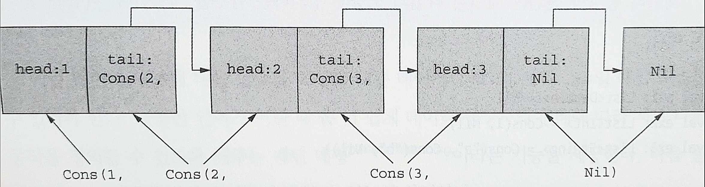

# 3장. 함수형 데이터 구조

# 1. 함수형 데이터 구조 정의하기

---

- 함수형 데이터 구조는 순수 함수만으로 조작된다.
    - 단일 연결 리스트는 단순하고 추론하기 쉬우며, 이를 통해 불변 데이터 구조에 깔린 원칙을 더 잘 이해할 수 있으므로 훌륭한 예제다.
        - 
    
    ```kotlin
    sealed class List<out A> // 데이터 타입에 대한 봉인된 정의
    
    object Nil : List<Nothing>() // List의 Nil(빈 리스트) 구현
    
    data class Cons<out A>(val head: A, val tail: List<A>) : List<A>() // Cons도 List를 구현함
    ```
    
    - `sealed`를 클래스 선언 앞에 붙이면, 해당 클래스를 상속한 모든 구현이 같은 모듈의 같은 패키지 안에 있어야만 한다.
        - 봉인된 클래스는 디폴트로 추상 클래스다 → 자신을 인스턴스화 할 수는 없다.
    
    
    
    3.1 단일 연결 리스트. 각각의 꼬리는 다음 리스트 원소에 연결돼 있다.
    
    - 봉인된 List 클래스 다음에는 두 가지 구현이 있다.
        - Nil로 표현되는 빈 리스트
        - 데이터 생성자 Cons에 의해 표현되는 비어 있지 않은 리스트
    - 함수가 다형적일 수 있는 것처럼, 데이터 타입도 다형적일 수 있다.
    - 데이터 생성자 선언은 데이터 타입의 모양을 정의하는 함수를 제공한다.
        
        ```kotlin
        val ex1: List<Double> = Nil
        val ex2: List<Int> = Cons(1, Nil)
        val ex3: List<String> = Cons("a", Cons("b", Nil))
        ```
        
    - List가 A라는 타입에 대해 파라미터화돼 있으므로, Nil과 Cons는 모두 서로 다른 A 타입에 대해 인스턴스화될 수 있는 다형적 함수다.

- 이런 데이터 구조에 대한 함수를 작성할 때는 데이터가 Nil일 때와 Cons일 때를 구분할 수 있어야 한다.
    - 다양한 언어가 이럴 때 좀 더 쉽게 데이터 생성자의 형태에 따라 서로 다른 동작을 정의할 수 있도록 해주는 패턴 매칭이라는 기능을 제공한다.

# 2. 함수적 데이터 구조 다루기

---

- 3.1절에서 정의한 List를 매칭이라는 기법을 사용해 해석하고 처리하는 방법을 살펴본다.
    
    ```kotlin
    sealed class List<out A> { // List 데이터 구조를 정의함
        companion object { // 함수가 포함된 동반 객체
            fun <A> of(vararg aa: A): List<A> { // 팩토리 도우미 함수
                val tail = aa.sliceArray(1 until aa.size)
                return if (aa.isEmpty()) Nil else Cons(aa[0], of(*tail))
            }
    
        }
    }
    ```
    
    - `companion object` 블록 안에 정의된 함수는 자바의 정적(`static`) 메서드와 비슷하게 호출될 수 있다.
        - of 메서드를 사용해 파라미터 값으로부터 새 List를 만들어낼 수 있다.
        
        ```kotlin
        >>> List.of(1, 2)
        Cons(head=1, tail=Cons(head=2, tail=Nil))
        ```
        
        - `vararg` 키워드: 한정된 파라미터를 받는다. 가변 개수 인자를 받는 함수라는 뜻이다. `Array<A>`로 사용할 수 있다.
        - 스프레드 연산자(`*`): 배열을 가변 개수 인자 함수로 전달

- 동반 객체 안에 이 두 함수(sum과 product)를 추가하자.
    
    ```kotlin
    fun sum(ints: List<Int>): Int =
        when (ints) {
            is Nil -> 0
            is Cons -> ints.head + sum(ints.tail)
        }
    
    fun product(doubles: List<Double>): Double =
        when (doubles) {
            is Nil -> 1.0
            is Cons ->
                if (doubles.head == 0.0) 0.0
                else doubles.head * product(doubles.tail)
        }
    ```
    
    - 이들은 모두 재귀적인 정의며, List와 같은 재귀적인 데이터 타입에 대한 연산을 작성할 때는 재귀적인 정의가 일반적이라는 사실을 알아두라.

<aside>
💡 동반 객체로 구현한 싱글턴

- 클래스 안에 있는 `companion object` 블록은 이름이 붙은 인스턴스가 단 하나뿐인 동시에 같은 이름의 `class`이기도 한 싱글턴 객체를 선언하고 만든다.
- 코틀린 싱글턴은 객체 본문에서 스레드 안전성을 보장하기 위해 2중 검사 잠금을 하지 않아도 되며, 자바보다 훨씬 안전하다. 자바에서 `static` 멤버로 정의할 법한 부분을 코틀린 동반 객체 안에 정의하는 경우가 종종 있다.
- 동반 객체를 선언하면 데이터 타입과 같은 이름의 (싱글턴) 객체가 생기고 그 안에 해당 데이터 타입 값에 적용할 수 있는 여러 가지 편의 메서드를 추가할 수 있다.
    - 동반 객체를 사용하면 그 안에 들어 있는 모든 함수가 리스트와 관련 있는 함수라는 사실을 더 명확히 보여준다.
</aside>

- 코틀린에서는 `when` 식을 통해 매칭을 수행한다.
    - 컴파일러가 `when`의 모든 가지에 있는 조건이 인자로 받은 값에 대해 평가할 수 있는 모든 경우를 처리한다고 증명할 수 없는 한, `else`가 꼭 필요하다.

## 2.1 타입으로 매칭하기 위한 '`when`'

---

- `is` 키워드를 사용하면 각 논리 가지에서 구체적인 타입을 검사할 수 있다.
    - 추가로 타입이 일치하면 대상 값이 각 가지에 필요한 구체적 타입으로 스마트캐스트가 된다.
    - 클래스 계층에 있는 여러 하위 타입이 서로 다른 필드가 담긴 데이터 생성자로 이뤄져 있을 때 소중한 역할을 한다.
    
    ```kotlin
    val ints = List.of(1, 2, 3, 4) // 추상 List 선언
    
    fun sum(xs: List<Int>): Int =
        when (xs) {
            is Nil -> 0 // Nil 구현과 매치
            is Cons -> xs.head + sum(xs.tail) // Cons 구현으로 스마트캐스트
        }
    
    fun main() = println(sum(ints)) // 리스트에 대해 sum 함수 호출
    ```
    
    - List의 경우 봉인된 클래스이고 Nil과 Cons 구현밖에 존재하지 않으므로 `else`를 추가할 필요가 없다.

## 2.2 `if`-`else`를 대신하는 `when`

---

- 이런 방식으로 사용할 때는 `when` 키워드 뒤에 파라미터가 필요하지 않다.
    
    ```kotlin
    val x = Random.nextInt(-10, 10)
    val y: String =
        if (x == 0) { // x가 0인지 검사
            "x is zero"
        } else if (x < 0) { // x가 음수인지 검사
            "is negative"
        } else { // 다른 경우는 x는 양수일 수밖에 없음
            "x is positive"
        }
    ```
    
    ```kotlin
    val x = Random.nextInt(-10, 10)
    val y: String =
        when { // when에 파라미터를 전달하지 않음
            x == 0 -> // if-else 식을 대신하는 논리 가지들
                "x is zero"
    
            x < 0 -> // if-else 식을 대신하는 논리 가지들
                "x is negative"
    
            else -> // 모든 경우를 처리하는 else 가지
                "x is positive"
        }
    ```
    

## 2.3 패턴 매칭은 무엇이며 코틀린 매칭과 어떤 차이가 있나?

---

- 코틀린의 매칭은 완전하지 않고, 다른 언어들이 제공하는 매칭과 비슷한 프로그램 요소와 비교하면 모자란 점이 많다.
    - 하스켈, 스칼라, 러스트 등의 언어는 패턴 매칭이라는 기능을 제공한다.
    - 패턴 매칭은 코틀린 매칭과 비슷하지만, 의미론적으로도 더 낫고 할 수 있는 일도 더 많으며 코틀린의 매칭보다 더 쓰기 편하다.

- 패턴 매칭을 사용하면 논리 식과 어떤 패턴을 일치시킬 뿐 아니라 식으로부터 값을 추출할 수도 있다.
    - 추출, 또는 구조 분해는 FP에서 특히 대수적 데이터 타입을 다룰 때 중요한 역할을 한다.
- 코틀린 `when`을 사용해 작성한 코드와 패턴 매칭 기법을 적용해 코틀린으로 작성할 경우 '이랬으면 좋을 텐데' 하고 바라는 코드를 자세히 살펴보자.
    
    ```kotlin
    fun sum(xs: List<Int>): Int =
        when (xs) {
            is Nil -> 0
            is Cons -> xs.head + sum(xs.tail) // Cons를 매칭한 다음에 xs가 스마트캐스트되므로 head와 tail을 볼 수 있음
        }
    ```
    
    - 문제는 매칭이 이뤄진 다음에 xs 내부 값을 xs.haed와 xs.tail로 접근한다는 점이다.
    - List가 Cons로 스마트캐스트된다는 사실을 명시하지는 않았기 때문에 xs의 타입이 모호해 보여서 혼란을 야기할 수 있다.
    - 코틀린도 패턴 매칭을 지원한다면 다음과 같은 코틀린 의사코드로 같은 함수를 작성할 수 있을 것이다.
        
        ```kotlin
        fun sumSudo(xs: List<Int>): Int =
            when (xs) {
                is Nil -> 0 // 첫 번째 패턴 Nil. 뽑아내는 값 없음
                is Cons(head, tail) -> head + sum(tail) // 두 번째 패턴 Cons(head, tail). head와 tail을 뽑아냄
            }
        ```
        

- 패턴 매칭이 있는지 여부는 이런 류의 매칭이 필요한 코드에 접근하는 방식에 큰 영향을 끼친다.
- 패턴 매칭이 있다면 일치가 일어난 xs에 접근할 필요가 없고, 필드에 접근하기 위해 스마트캐스트를 쓸 필요도 없다.

# 3. 함수형 데이터 구조 안의 데이터 공유

---

- 데이터 공유: 리스트가 불변이므로 실제로는 xs를 복사할 필요가 없다. 단지 xs를 재사용하면 된다.
- 불변 데이터를 공유하면 함수를 더 효율적으로 구현할 수 있는 경우가 자주 있다.
    - 향후 다른 코드에서 데이터를 변경할지도 모른다는 걱정을 하지 않고 데이터를 반환할 수 있으며,
    - 데이터 변경이나 오염을 피하기 위해 비관적으로 복사본을 만들 필요가 없다. 데이터 구조가 불변이기 때문에 복사본은 불필요하다.
- 함수형 데이터 구조는 영속적(persistent)이다.
    - 존재하는 (함수적 데이터 구조에 대한) 참조가 데이터 구조에 대한 연산을 수행한 다음에도 결코 바뀌지 않고 원래대로 남는다는 뜻
    
    
    
    3.2 공통 데이터 구조를 사용하면서 단일 연결 리스트에서 데이터 공유하기
    

- 리스트를 여러 가지 방법으로 변경하는 함수를 몇 가지 구현해보자.
    - 첫 번째 접근 방법은 sum이나 product처럼 List 동반 객체 안에 함수를 위치시키는 방법이다.
        
        ```kotlin
        fun <A> tail(xs: List<A>): List<A> = TODO()
        
        >>> val xs = List.of(1, 2, 3, 4)
        >>> List.tail(xs)
        ```
        
    - 다른 접근 방법은 확장 메서드를 사용하는 것이다.
        
        ```kotlin
        fun <A> List<A>.tail(): List<A> = TODO()
        
        >>> val xs.tail()
        ```
        

### 연습문제 3.1

---

- List의 첫 번째 원소를 제거하는 tail 함수를 구현하라. 이 함수는 상수 시간에 실행이 끝나야 한다. List가 Nil일 때 선택할 수 있는 여러 가지 처리 방법을 생각해보라. 다음 장에서 이 경우(함수가 정상 작동하지 못하는 경우)를 다시 살펴본다.
    
    ```kotlin
    fun <A> tail(xs: List<A>): List<A> =
        SOLUTION_HERE()
    ```
    

### 연습문제 3.2

---

- 연습문제 3.1과 같은 아이디어를 사용해 List의 첫 원소를 다른 값으로 대치하는 setHead 함수를 작성하라.
    
    ```kotlin
    fun <A> setHead(xs: List<A>, x: A): List<A> =
        SOLUTION_HERE()
    ```
    

## 3.1 데이터 공유의 효율

---

- 데이터 구조의 불변성으로 인해 데이터 공유를 사용할 때 연산을 더 효율적으로 구현할 수 있는 경우가 자주 있다.

### 연습문제 3.3

---

- tail을 더 일반화해서 drop 함수를 작성하라. drop은 리스트 맨 앞부터 n개 원소를 제거한다. 이 함수는 삭제할 원소의 개수에 비례해 시간이 걸린다는 사실(따라서 전체 List를 복사할 필요가 없다)을 알아두라.
    
    ```kotlin
    fun <A> drop(l: List<A>, n: Int): List<A> =
        SOLUTION_HERE()
    ```
    

### 연습문제 3.4

---

- dropWhile을 구현하라. 이 함수는 List의 맨 앞에서부터 주어진 술어를 만족(술어 함수가 `true`를 반환)하는 연속적인 원소를 삭제한다. (다른 말로 하면, 이 함수는 주어진 술어를 만족하는 접두사를 List에서 제거한다)
    
    ```kotlin
    fun <A> dropWhile(l: List<A>, f: (A) -> Boolean): List<A> =
        SOLUTION_HERE()
    ```
    

- 데이터 공유를 쓰는 더 놀라운 예제로 한 리스트의 모든 원소를 다른 리스트 뒤에 덧붙이는 다음 함수를 들 수 있다.
    
    ```kotlin
    fun <A> append(a1: List<A>, a2: List<A>): List<A> =
        when (a1) {
            is Nil -> a2
            is Cons -> Cons(a1.head, append(a1.tail, a2))
        }
    ```
    
    - 이 정의는 첫 번째 리스트의 원소를 소진할 때까지만 값을 복사한다.
    - 이 함수의 실행 시간과 메모리 사용량은 a1의 길이에 의해서만 결정된다.
    
    → 같은 기능을 배열로 구현한다면 두 배열의 모든 원소를 결과 배열에 복사해야 한다. 이런 경우 불변 연결 리스트가 배열보다 훨씬 효율적이다!
    

### 연습문제 3.5

---

- 코드가 리스트를 연결하는 코드의 경우처럼 항상 제대로 작동하는 것은 아니다. 어떤 List에서 마지막 원소를 제외한 나머지 모든 원소로 이뤄진 (순서는 동일한) 새 List를 반환하는 init 함수를 정의하라. 예를 들어 List(1, 2, 3, 4)에 대해 init은 List(1, 2, 3)을 돌려줘야 한다. 이 함수를 tail처럼 상수 시간에 구현할 수 없는 이유는 무엇일까?
    
    ```kotlin
    fun <A> init(l: List<A>): List<A> =
        SOLUTION_HERE()
    ```
    
    - 단일 연결 리스트의 구조로 인해 어떤 Cons의 tail을 변경할 때마다 해당 Cons가 리스트의 맨 마지막에 위치한 Cons라 할지라도, 더 앞에 있던 모든 Cons 객체를 복사해야만 한다.

<aside>
💡 여러 다른 연산을 효율적으로 제공하는 순수 함수형 데이터 구조를 작성하는 것은 데이터 공유를 영리하게 활용할 방법을 찾아내는 것과 같다.

</aside>

# 4. 리스트에 대한 재귀와 이를 고차 함수로 일반화하는 방법

---

- sum과 product 구현을 다시 보자. 이 두 함수는 수행하는 일과 처리 방법이 매우 비슷하다.
    - 이들의 공통점을 뽑아내어 두 함수에 대한 고차 함수를 만들어보자.
    
    ```kotlin
    fun sum(xs: List<Int>): Int = when (xs) {
        is Nil -> 0
        is Cons -> xs.head + sum(xs.tail)
    }
    
    // AS-IS
    // fun product(doubles: List<Double>): Double =
    //     when (doubles) {
    //         is Nil -> 1.0
    //         is Cons ->
    //             if (doubles.head == 0.0) 0.0
    //             else doubles.head * product(doubles.tail)
    //     }
    fun product(xs: List<Double>): Double = when (xs) {
        is Nil -> 1.0
        is Cons -> xs.head * product(xs.tail)
    }
    ```
    
- 하위식이 어떤 지역 변수들을 참조한다고 가정하자. 그런 경우 이 하위식을 각 식이 참조하는 변수들을 인자로 받는 함수로 바꿀 수 있다.
    
    ```kotlin
    fun <A, B> foldRight(xs: List<A>, z: B, f: (A, B) -> B): B =
        when (xs) {
            is Nil -> z
            is Cons -> f(xs.head, foldRight(xs.tail, z, f))
        }
    
    fun sum2(ints: List<Int>): Int =
        foldRight(ints, 0, { a, b -> a + b })
    
    fun product2(dbs: List<Double>): Double =
        foldRight(dbs, 1.0, { a, b -> a * b })
    ```
    
    - foldRight는 원소의 구체적 타입에 따른 특별한 처리를 하지 않는다.
        
        💡일반화를 하는 과정에서는 반환할 값이 리스트의 원소와 같은 타입일 필요가 없다는 사실을 알았다!
        
    - foldRight가 하는 일을 묘사하는 한 가지 방법은 foldRight에 전달된 인자로 리스트 생성자를 대치하는 것이다.
        
        ```kotlin
        Cons(1, Cons(2, Nil))
        f   (1, f   (2, z  ))
        ```
        
    - foldRight는 리스트의 맨 끝까지 모든 원소를 순회하고(순회 과정에서 스택에 프레임을 쌓아야 한다), 그 후 익명 함수를 적용하면서 한 값으로 축약된다는 사실을 알아두라.

### 연습문제 3.6

---

- foldRight로 구현된 product가 리스트 원소로 0.0을 만나면 재귀를 즉시 중단하고 결과를 돌려줄 수 있는가? 즉시 결과를 돌려줄 수 있거나 돌려줄 수 없는 이유는 무엇인가? 긴 리스트에 대해 쇼트 서킷을 제공할 수 있으면 어떤 장점이 있을지 생각해보라. 5장에서는 이 질문이 내포하고 있는 의미를 더 자세히 살펴본다.

### 연습문제 3.7

---

- 다음과 같이 Nil과 Cons를 foldRight에 넘길 때 각각 어떤 일이 벌어지는지 살펴보라. (여기서는 Nil as List<Int>라고 타입을 명시해야 한다. 그렇지 않으면 코틀린이 foldRight의 B 타입 파라미터를 List<Nothing>으로 추론한다.)
    
    ```kotlin
    foldRight(
        Cons(1, Cons(2, Cons(3, Nil))),
        Nil as List<Int>,
        { x, y -> Cons(x, y) }
    )
    ```
    
- 이 결과가 foldRight와 List 데이터 생성자 사이에 존재하는 관계를 어떻게 보여주는지와 관련해 여러분의 생각을 말하라. 이 문맥에서 단순히 Nil을 전달하는 것은 A의 타입 정보가 부족하기 때문에 충분하지 않다. 그로 인해 Nil as List<Int>라고 적을 필요가 있다. 이런 코드는 번잡스럽기 때문에 동반 객체 안에 이를 회피하기 위해 다음과 같은 편의 메서드를 추가할 수 있다.
    
    ```kotlin
    fun <A> empty(): List<A> = Nil
    ```
    
- 이제부터 모든 예제 코드와 연습문제에서 빈 리스트를 표현하기 위해 이 메서드를 사용할 것이다.

### 연습문제 3.8

---

- foldRight를 사용해 리스트 길이를 계산하라.
    
    ```kotlin
    fun <A> length(xs: List<A>): Int =
        SOLUTION_HERE()
    ```
    

### 연습문제 3.9

---

- 우리가 구현한 foldRight는 꼬리 재귀가 아니므로 리스트가 긴 경우 `StackOverflowError`를 발생시킨다.(이를 stack-safe하지 않다고 말한다) 정말 우리 구현이 스택 안전하지 않은지 확인하라. 그 후 다른 리스트 재귀 함수 foldLeft를 2장에서 설명한 기법을 사용해 꼬리 재귀로 작성하라. 다음은 foldLeft의 시그니처다.
    
    ```kotlin
    tailrec fun <A, B> foldLeft(xs: List<A>, z: B, f: (B, A) -> B): B =
        SOLUTION_HERE()
    ```
    

### 연습문제 3.10

---

- foldLeft를 사용해 sum, product, 리스트 길이 계산 함수를 작성하라.
    
    ```kotlin
    fun sumL(xs: List<Int>): Int =
        SOLUTION_HERE()
    
    fun productL(xs: List<Double>): Double =
        SOLUTION_HERE()
    
    fun <A> lengthL(xs: List<A>): Int =
        SOLUTION_HERE()
    ```
    

### 연습문제 3.11

---

- 리스트 순서를 뒤집은 새 리스트를 반환하는 함수를 작성하라. 이 함수를 접기 연산을 사용해 작성할 수 있는지 살펴보라.
    
    ```kotlin
    fun <A> reverse(xs: List<A>): List<A> =
        SOLUTION_HERE()
    ```
    

### 연습문제 3.12

---

- 어려움: foldLeft를 foldRight를 사용해 작성할 수 있는가? 반대로 foldRight를 foldLeft를 사용해 작성할 수 있는가? foldRight를 foldLeft로 구현하면 foldRight를 꼬리 재귀로 구현할 수 있기 때문에 유용하다. 이 말은 큰 리스트를 스택 오버플로를 일으키지 않고 foldRight로 처리할 수 있다는 뜻이다.
    
    ```kotlin
    fun <A, B> foldLeftR(xs: List<A>, z: B, f: (B, A) -> B): B =
        SOLUTION_HERE()
    
    fun <A, B> foldRightL(xs: List<A>, z: B, f: (A, B) -> B): B =
        SOLUTION_HERE()
    ```
    

### 연습문제 3.13

---

- append를 foldLeft나 foldRight를 사용해 구현하라.
    
    ```kotlin
    fun <A> append(a1: List<A>, a2: List<A>): List<A> =
        SOLUTION_HERE()
    
    fun <A> appendL(a1: List<A>, a2: List<A>): List<A> =
        SOLUTION_HERE()
    ```
    

### 연습문제 3.14

---

- 어려움: 리스트가 원소인 리스트를 단일 리스트로 연결해주는 함수를 작성하라. 이 함수의 실행 시간은 모든 리스트의 길이 합계에 선형으로 비례해야 한다. 이 책에서 지금까지 정의한 함수를 활용하라.
    
    ```kotlin
    fun <A> concat(lla: List<List<A>>): List<A> =
        SOLUTION_HERE()
    
    fun <A> concat2(lla: List<List<A>>): List<A> =
        SOLUTION_HERE()
    ```
    

## 4.1 리스트에 작용하는 다른 함수들

---

### 연습문제 3.15

---

- 정수로 이뤄진 리스트를 각 원소에 1을 더한 리스트로 변환하는 함수를 작성하라. 이 함수는 순수 함수이면서 새 List를 반환해야 한다.
    
    ```kotlin
    fun increment(xs: List<Int>): List<Int> =
        SOLUTION_HERE()
    ```
    

### 연습문제 3.16

---

- List<Double>의 각 원소를 `String`으로 변환하는 함수를 작성하라. d`.toString()`을 사용하면 `Double` 타입인 d를 String으로 바꿀 수 있다.
    
    ```kotlin
    fun doubleToString(xs: List<Double>): List<String> =
        SOLUTION_HERE()
    ```
    

### 연습문제 3.17

---

- 리스트의 모든 원소를 변경하되 리스트 구조는 그대로 유지하는 map 함수를 작성하라. 다음은 map의 시그니처다. (표준 라이브러리에서 `map`과 `flatMap`은 List의 메서드다.)
    
    ```kotlin
    fun <A, B> map(xs: List<A>, f: (A) -> B): List<B> =
        SOLUTION_HERE()
    ```
    

### 연습문제 3.18

---

- 리스트에서 주어진 술어를 만족하지 않는 원소를 제거해주는 filter 함수를 작성하라. 이 함수를 사용해 List<Int>에서 홀수를 모두 제거하라.
    
    ```kotlin
    fun <A> filter(xs: List<A>, f: (A) -> Boolean): List<A> =
        SOLUTION_HERE()
    ```
    

### 연습문제 3.19

---

- map처럼 작동하지만 인자로 (단일 값이 아니라) 리스트를 반환하는 함수를 받는 flatMap 함수를 작성하라. 이때 인자로 전달된 함수가 만들어낸 모든 리스트의 원소가 (순서대로) 최종 리스트 안에 삽입돼야 한다. 다음은 flatMap의 시그니처다.
    
    ```kotlin
    fun <A, B> flatMap(xa: List<A>, f: (A) -> List<B>): List<B> =
        SOLUTION_HERE()
    ```
    
- 예를 들어 flatMap(List.of(1, 2, 3), { i -> List.of(i, i) })의 결과는 List(1, 1, 2, 2, 3, 3)이어야 한다.

### 연습문제 3.20

---

- flatMap을 사용해 filter를 구현하라.
    
    ```kotlin
    fun <A> filter2(xa: List<A>, f: (A) -> Boolean): List<A> =
        SOLUTION_HERE()
    ```
    

<aside>
💡 함수의 마지막 파라미터로 람다가 오는 경우

- 코틀린에서는 고차 함수에 람다를 전달하는 경우에 대한 '문법 설탕(syntactic sugar)'을 제공한다. 고차함수의 여러 파라미터 중에서 맨 마지막 파라미터가 람다라면 그 람다를 파라미터 목록 밖에 위치시킬 수 있다.
</aside>

### 연습문제 3.21

---

- 두 리스트를 받아서 서로 같은 위치(인덱스)에 있는 원소들을 더한 값으로 이뤄진 새 리스트를 돌려주는 함수를 작성하라. 예를 들어 List(1, 2, 3)과 List(4, 5, 6)은 List(5, 7, 9)가 된다.
    
    ```kotlin
    fun add(xa: List<Int>, xb: List<Int>): List<Int> =
        SOLUTION_HERE()
    ```
    

### 연습문제 3.22

---

- 연습문제 3.21에서 작성한 함수를 일반화해 정수 타입(리스트의 원소 타입)이나 덧셈(대응하는 원소에 작용하는 연산)에 한정되지 않고 다양한 처리가 가능하게 하라. 이 일반화한 함수에는 zipWith라는 이름을 붙여라.
    
    ```kotlin
    fun <A> zipWith(xa: List<A>, xb: List<A>, f: (A, A) -> A): List<A> =
        SOLUTION_HERE()
    ```
    

## 4.2 코틀린 표준 라이브러리의 리스트

---

- 이미 구현된 `List`가 코틀린 표준 라이브러리 안에 들어 있다. 코틀린은 우리가 작성한 것 같은 불변 `List` 대신 읽기 전용 `List`를 제공한다.
    - 내부적으로 가변 리스트를 사용하며, 이 가변 리스트는 java.util.ArrayList와 같다.
        - 자바와의 상호운용성을 살리려는 실용적인 목적하에 이뤄졌다.

- 코틀린에서 읽기 전용 리스트와 가변 리스트의 유일한 차이는 가변 버전이 `MutableList`를 구현해 리스트의 원소를 추가하고, 변경하고, 삭제하는 연산을 제공한다는 점뿐이다.
    - `List`에는 이런 변이 연산이 들어 있지 않다.
    
    
    
    3.3 가변 컬렉션과 읽기 전용 컬렉션 사이의 관계를 보여주는 코틀린 표준 라이브러리 컬렉션 상속 계층 구조
    

- 코틀린 컬렉션의 메서드는 `List<A>`에 정의돼 있다.
    - `fun take(n: Int): List<A>`: `this`에서 최초 n개의 원소로만 이뤄진 리스트를 돌려준다.
    - `fun takeWhile(f: (A) -> Boolean): List<A>`: `this`에 술어 f를 통과하는 원소들로 이뤄진 가장 긴 접두사가 들어 있는 리스트를 반환한다.
    - `fun all(f: (A) -> Boolean): Boolean`: `this`의 모든 원소가 술어 f를 만족하는 경우에만 `true`를 반환한다.
    - `fun any(f: (A) -> Boolean): Boolean`: `this`의 모든 원소 중 하나라도 f를 만족하면 `true`를 반환한다.

## 4.3 단순한 요소들로부터 리스트 함수를 합성하는 데 따른 비효율

---

- `List`에서 리스트 관련 연산과 알고리즘을 아주 일반적인 함수를 사용해 기술할 수 있음에도 불구하고, 이런 식으로 범용 함수로 구현한 결과가 항상 효율적이지 않다는 문제가 있다.
    - 같은 입력을 여러 번 순회하면서 처리하는 것 vs 빠른 종료를 위해 명시적으로 재귀적 루프를 작성하는것

### 연습문제 3.23

---

- 어려움: 어떤 `List`가 다른 `List`를 부분열로 포함하는지 검사하는 hasSubSequence를 구현하라. 예를 들어 List(1, 2, 3, 4)의 부분 시퀀스는 List(1, 2), List(2, 3), List(4) 등이 있다. 효율적인 동시에 간결한 순수 함수형 해법을 찾아내기는 어려울 수도 있다. 그래도 괜찮다. 가장 자연스럽게 떠오르는 아이디어로 함수를 구현하라. 5장에서 이 함수 구현을 다시 살펴보면, 바라건대 이를 더 개선할 수 있을 것이다.
- 힌트: 코틀린에서 두 값 x와 y가 동등한지 비교하려면 `x == y`를 쓴다.
    
    ```kotlin
    tailrec fun <A> startsWith(l1: List<A>, l2: List<A>): Boolean =
        SOLUTION_HERE()
    ```
    

# 5. 트리

---

- 지금까지 살펴본 List 데이터 구조와 구현은 대수적 데이터 타입(ADT)에 속한다.
    - ADT: 하나 이상의 데이터 생성자로 정의된 데이터 타입. 0개 이상의 인자를 받을 수 있다.
        - 코틀린에서는 기반 클래스나 인터페이스를 봉인시키는 방법으로만 ADT를 만들 수 있다.
        - (봉인된) 데이터 타입이 각각의 데이터 생성자의 합 또는 합집합이라고 말하고, 각 데이터 생성자는 자신의 인자들의 곱이라고 말한다.
- 대수가 수학의 토대이듯, 대수적 데이터 타입은 함수형 프로그래밍 언어의 토대다.
    - ADT를 FP의 기본 빌딩 블록이면서 우리가 프로그램을 실행할 때 작용해야 할 대상을 제공하는 존재라고 볼 수 있다.

<aside>
💡 ADT와 캡슐화

- 타입의 내부 표현을 공개하므로 ADT가 캡슐화에 위배돼서 ADT를 반대할 수도 있다.
- FP에서는 캡슐화를 다른 방식으로 접근하며, 보통 공개적으로 노출했을 때 버그를 야기하거나 불변 조건을 위배하는 상황이 발생할 수 있는 가변 상태를 쓰지 않는다.
</aside>

```kotlin
sealed class Tree<out A>

data class Leaf<A>(val value: A) : Tree<A>()

data class Branch<A>(val left: Tree<A>, val right: Tree<A>) : Tree<A>()
```

- 매칭을 사용하면 우리 ADT의 각 원소에 대한 연산을 쉽게 작성할 수 있다.

### 연습문제 3.24

---

- 트리 안에 들어 있는 노드의 개수를 반환하는 size 함수를 작성하라.
    
    ```kotlin
    fun <A> size(tree: Tree<A>): Int =
        SOLUTION_HERE()
    ```
    

### 연습문제 3.25

---

- Tree<Int>에서 가장 큰 원소를 돌려주는 maximum 함수를 작성하라.
- 힌트: 코틀린은 두 값의 최댓값을 결정해주는 `maxOf`라는 내장 함수를 제공한다. 예를 들어 x와 y 중 최댓값은 `maxOf(x, y)`이다.
    
    ```kotlin
    fun maximum(tree: Tree<Int>): Int =
        SOLUTION_HERE()
    ```
    

### 연습문제 3.26

---

- 트리 뿌리(root)에서 각 잎까지의 경로 중 가장 길이가 긴 값을 돌려주는 depth 함수를 작성하라.
    
    ```kotlin
    fun depth(tree: Tree<Int>): Int =
        SOLUTION_HERE()
    ```
    

### 연습문제 3.27

---

- List에 정의했던 map과 대응하는 map 함수를 정의하라. 이 map은 트리의 모든 원소를 주어진 함수를 사용해 변환한 새 함수를 반환한다.
    
    ```kotlin
    fun <A, B> map(tree: Tree<A>, f: (A) -> B): Tree<B> =
        SOLUTION_HERE()
    ```
    

### 연습문제 3.28

---

- Tree에서 size, maximum, depth, map을 일반화해 이 함수들의 유사한 점을 추상화한 새로운 fold 함수를 작성하라. 그리고 더 일반적인 이 fold 함수를 사용해 size, maximum, depth, map을 재구현하라. List의 오른쪽/왼쪽 폴드와 여기서 정의한 fold 사이에 유사점을 찾아낼 수 있는가?
    
    ```kotlin
    fun <A, B> fold(ta: Tree<A>, l: (A) -> B, b: (B, B) -> B): B =
        SOLUTION_HERE()
    
    fun <A> sizeF(ta: Tree<A>): Int =
        SOLUTION_HERE()
    
    fun maximumF(ta: Tree<Int>): Int =
        SOLUTION_HERE()
    
    fun <A> depthF(ta: Tree<A>): Int =
        SOLUTION_HERE()
    
    fun <A, B> mapF(ta: Tree<A>, f: (A) -> B): Tree<B> =
        SOLUTION_HERE()
    ```
    

<aside>
💡 표준 라이브러리의 대수적 데이터 타입

- `Pair`와 `Triple`은 두 값 또는 세 값을 연속으로 저장하는 간단한 튜플 클래스다. `Pair`나 `Triple`, 데이터 클래스는 모두 대수적 데이터 타입이다.
</aside>

# 요약

---

- 불변 데이터 구조는 순수 함수를 통해 처리할 수 있는 데이터 구조다.
- 봉인된 클래스는 구현 개수가 정해져 있으므로 데이터 구조의 문법이 제한된다.
- `when` 구조를 사용하면 데이터 구조의 타입과 매칭해서 적절한 출력 평가 방법을 택할 수 있다.
- 코틀린의 매칭 기능은 데이터 구조를 처리할 때 도움이 되지만, 다른 함수형 언어가 제공하는 패턴 매칭만큼 유용하지는 않다.
- 불변 데이터 구조를 사용해 데이터를 공유하면 데이터 구조의 내용을 (방어적으로) 복사하지 않아도 데이터 구조에 안전하게 접근할 수 있다.
- 리스트 연산은 제귀적인, 일반화된 고차 함수를 통해 표현된다. 이런 고차 함수는 코드 재사용성과 모듈화를 촉진한다.
- 코틀린 표준 라이브러리의 리스트는 읽기 전용이지만 불변인 것은 아니다. 이로 인해 순수 함수가 이들 함수를 다뤄도 데이터 오염이 일어날 수 있다.
- 대수적 데이터 타입(ADT)은 불변 데이터 구조를 부르는 형식적인 명칭이며, 코틀린에서는 데이터 클래스, `Pair`, `Triple`을 통해 ADT(그중에서도 곱 타입)를 표현할 수 있다.
- 이번 장에서 `List`와 `Tree`는 ADT의 예다.
