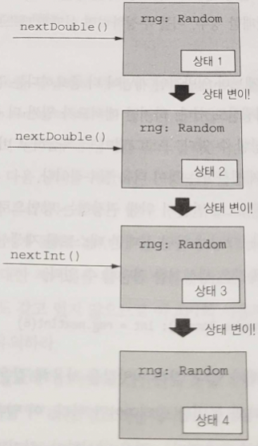

# 6장. 순수 함수형 상태

- 프로그램 상태를 다루는 일은 어려운 일이며, 함수형 프로그래밍에서는 더 어렵다.
    - 함수형 프로그래밍에서는 불변성과 부수 효과 근절 같은 원칙을 높이 평가하기 때문이다.
    
    → 프로그램에 대해 추론하고 유지보수하기가 더 어려워지는 등 가변 상태에는 상당한 비용이 따른다.
    

- 순수 함수형 방식으로 프로그램 상태를 다루는 설계 패턴
    - 상태를 결정적(deterministic) 방식으로 처리할 수 있고, 그에 따라 프로그램을 더 쉽게 테스트하고 프로그램에 대해 더 쉽게 추론할 수 있다.
    - 프로그램 상태를 일련의 변환이 일어나는 동안 문맥을 따라 전달되는 전이(transition)나 동작(action)으로 바라봄
        - 상태 기계(state machine)와 연관된 복잡성을 가둬 지역화할 수 있다.
        - 상태 동작들의 전달을 암시적으로 백그라운드에서 진행하는 고차 콤비네이터 함수를 통해 감출 수 있다.

# 1. 부수 효과를 사용해 난수 생성하기

---

- ex> 의사(pseudo) 난수 생성기를 사용해 난수를 생성하는 전형적인 명령형 해법
    
    ```kotlin
    val rng = kotlin.random.Random // 현재 시스템 시간에 의해 시드가 정해진 새 난수 생성기를 만듦
    println(rng.nextDouble())
    println(rng.nextDouble())
    return rng.nextInt(6) // 0부터 5 사이의 난수를 얻음
    ```
    
    - rng라는 객체에는 매번 (난수 관련 함수가) 호출될 때마다 갱신되는 내부 상태가 존재한다.
    
    → 부수 효과로 상태 갱신이 일어나기 때문에 참조 투명하지 않다.
    

- 메서드가 참조 투명하지 않다: 테스트, 합성, 모듈화를 하기 어렵고 쉽게 병렬화할 수 없다는 것
    
    
    
    6.1 Random 클래스를 사용해 상태를 변경하면서 의사 난수 생성하기
    

- 테스트 가능성
    
    ```kotlin
    fun rollDie(): Int { // 1 이상 6 이하인 난수를 반환해야만 함
        val rng = kotlin.random.Random
        return rng.nextInt(6) // 0부터 5 사이의 난수를 반환
    }
    ```
    
    - 프로그램이 더 복잡하고 버그가 더 미묘하면 미묘할수록, 버그를 안정적으로 재생산하는 것이 더욱 필수적이다.

- 테스트를 더 결정적으로 만들기 위해 권장하는 방법: 난수 생성기를 전달하게 코드를 바꾸는 방법
    - 실패한 테스트를 재생산하기 위해 테스트를 실패하게 만든 난수 생성기와 똑같은 생성기를 전달할 수 있다.
    
    ```kotlin
    fun rollDie2(rng: kotlin.random.Random): Int = rng.nextInt(6)
    ```
    
    - 매번 `nextInt`를 호출할 때마다 난수 생성기의 이전 상태는 파괴된다.

# 2. 순수 함수형 난수 생성기

---

- 상태 갱신을 명시화함으로써 참조 투명성을 회복시킬 수 있다.
    
    ```kotlin
    interface RNG {
        fun nextInt(): Pair<Int, RNG>
    }
    ```
    
- 이 함수는 (`kotlin.random.Random`처럼) 생성한 난수를 반환하고 어떤 내부 상태를 그 자리에서 변이시키지 않고, 난수와 새 상태를 함께 돌려준다.

→ 😃 이런 설계는 다음 상태를 계산하는 관심사와 새 상태를 프로그램의 다른 부분과 의사소통하는 관심사를 분리하는 효과가 있다.

- 전역적인 가변 메모리는 전혀 쓰이지 않았다.(단지 다음 상태를 호출자에게 돌려줄 뿐)

```kotlin
data class SimpleRNG(val seed: Long) : RNG {
    override fun nextInt(): Pair<Int, RNG> {
        val newSeed =
            (seed * 0x5DEECE66DL + 0xBL) and
                    0xFFFFFFFFFFFFL // 현재 씨앗값을 사용해 새로운 씨앗값을 생성함. and는 비트 AND임
        val nextRNG = SimpleRNG(newSeed) // 다음 상태는 새로운 씨앗값으로부터 생성한 RNG 인스턴스임
        val n = (newSeed ushr 16).toInt() // n 값은 새 의사 난수 정수임. ushr은 msb에 0을 채워 넣는 오른쪽 이진 시프트임
        return n to nextRNG // 반환값은 의사 난수 정수와 다음 RNG 상태가 들어 있는 Pair<Int, RNG>
    }
}
```

```kotlin
>>> val rng = SimpleRNG(42) // SimpleRNG를 초기화하기 위해 임의의 값을 택함

>>> val (n1, rng2) = rng.nextInt() // nextInt가 반환한 Pair<Int, RNG>를 구조 분해

>>> println("n1:$n1;  rng2:$rng2")

n1:16159453; rng2:SimpleRNG(seed=1059025964525)

>>> val (n2, rng3) = rng2.nextInt()

>>> println("n2:$n2;  rng3:$rng3")

n2:-1281479697; rng3:SimpleRNG(seed=197491923327988)
```

- 이 명령 시퀀스를 원하는 만큼 반복해 실행할 수 있고, 항상 같은 값들을 얻는다.

# 3. 상태가 있는 API를 순수 함수형 API로 만들기

---

<aside>
💡 순수 함수를 사용해 다음 상태를 계산하는 경우, 데이터를 제자리에서 변이시키지 않기 때문에 효율이 저하될 수 있다.

- 하지만 효율성 저하의 영향을 효율적인 순수 함수형 데이터 구조를 활용하는 방법으로 경감시킬 수 있다.
- 경우에 따라서는 참조 투명성을 깨지 않으면서 데이터를 제자리에서 변이시킬 수도 있다.
</aside>

- ex> 수 시퀀스를 만들어내는 데이터 저장소
    
    ```kotlin
    class Repository
    
    class MutatingSequencer {
        private var repo: Repository = TODO()
        fun nextInt(): Int = TODO()
        fun nextDouble(): Double = TODO()
    }
    ```
    
    - nextInt와 nextDouble은 각각의 방식으로 repo를 변경한다.
- 상태 전이를 명시적으로 기술하게 만들면, 기계적으로 이 인터페이스를 순수 함수형 인터페이스로 변경할 수 있다.
    
    ```kotlin
    interface StateActionSequencer {
        fun nextInt(): Pair<Int, StateActionSequencer>
        fun nextDouble(): Pair<Double, StateActionSequencer>
    }
    ```
    
    - 프로그램의 나머지 부분에서 계산된 다음 상태를 전달할 책임을 호출자 쪽에서 져야 한다.

- ex> 순수 RNG 인터페이스로 다시 돌아가서 이전의 RNG를 재활용한다면 항상 이전에 생성했던 것과 똑같은 값을 생성할 것이다.
    
    ```kotlin
    fun randomPair(rng: RNG): Pair<Int, Int> {
        val (i1, _) = rng.nextInt()
        val (i2, _) = rng.nextInt()
        return i1 to i2
    }
    ```
    
    - 서로 다른 두 수를 만들어내고 싶다면, 첫 번째로 nextInt를 호출한 결과로 받은 RNG를 두 번째 Int를 생성할 때 사용해야 한다.
        
        ```kotlin
        fun randomPair2(rng: RNG): Pair<Pair<Int, Int>, RNG> {
            val (i1, rng2) = rng.nextInt()
            val (i2, rng3) = rng2.nextInt() // 여기서 rng 대신 rng2를 씀
            return (i1 to i2) to rng3 // 난수를 생성한 후 마지막 상태로 rng3를 반환해서 호출자가 계속 난수를 생성할 수 있게 함
        }
        ```
        

### 연습문제 6.1

---

- RNG.nextInt를 사용해 0 이상 `Int.MAX_VALUE` 이하의 정수 난수를 생성하는 함수를 작성하라.
    - 팁: 각 음수를 서로 다른 양수로 매핑해야 한다. nextInt가 `Int.MIN_VALUE`를 반환하는 경우(이렇게 정상에 속하기는 하지만 아주 극단적인 경우를 코너케이스라고 함), 이 값에 대응하는 양수가 없으므로 이를 감안해 처리해야 한다.
    
    ```kotlin
    fun nonNegativeInt(rng: RNG): Pair<Int, RNG> =
        SOLUTION_HERE()
    ```
    

### 연습문제 6.2

---

- 0 이상 1 미만(1을 포함하지 않는다는 데 주의하라)의 Double을 생성하는 함수를 작성하라. 여러분이 이미 개발한 함수와 더불어 최대 정수 값을 얻는 `Int.MAX_VALUE`와 `Int` 타입의 x를 `Double`로 변환하는 x.toDouble()을 사용할 수 있다.
    
    ```kotlin
    fun double(rng: RNG): Pair<Double, RNG> =
        SOLUTION_HERE()
    ```
    

### 연습문제 6.3

---

- Pair<Int, Double>, Pair<Double, Int>, Triple<Double, Double, Double>을 생성하는 함수를 만들라. 여러분이 이미 작성한 함수를 재사용할 수 있어야 한다.
    
    ```kotlin
    fun intDouble(rng: RNG): Pair<Pair<Int, Double>, RNG> =
        SOLUTION_HERE()
    
    fun doubleInt(rng: RNG): Pair<Pair<Double, Int>, RNG> =
        SOLUTION_HERE()
    
    fun double3(rng: RNG): Pair<Triple<Double, Double, Double>, RNG> =
        SOLUTION_HERE()
    ```
    

### 연습문제 6.4

---

- 난수 정수의 리스트를 생성하는 함수를 작성하라.
    
    ```kotlin
    fun ints(count: Int, rng: RNG): Pair<List<Int>, RNG> =
        SOLUTION_HERE()
    ```
    

# 4. 상태 동작을 전달하는 암시적 접근 방법

---

- 현재까지는 가변 상태를 사용한 접근 방법에서 상태를 명시적으로 전달하는 순수 함수적 방법으로 옮겨왔으며, 순수 함수적 방법을 통해 부수 효과를 피할 수 있다.
- 상태를 함께 전달하는 방식은 순차적이며 오류를 저지르기도 쉬운 코드인 것은 물론이고 불필요하게 지루하고 복잡한 느낌이 든다.
- 공통패턴
    - 우리가 만든 함수는 항상 어떤 타입 A에 대해 `(RNG) → Pair<A, RNG>` 타입의 함수였다.
    - 어떤 RNG 상태를 다음 RNG 상태로 변환하기 때문에 이런 타입의 함수를 상태 동작(state action)이나 상태 전이(state transition)라고 한다.
        - 상태 동작은 콤비네이터를 통해 조합할 수 있다.

```kotlin
typealias Rand<A> = (RNG) -> Pair<A, RNG>
```

- 이 값은 실제로는 상태 동작이다.
- 메서드를 이 새 타입의 값으로 변환할 수 있다.
    
    ```kotlin
    val intR: Rand<Int> = { rng -> rng.nextInt() }
    ```
    
- 우리는 모든 상태 전달을 알아서 수행해주는 일종의 도메인 특화 언어(DSL)를 만들게 된다.
    
    ```kotlin
    fun <A> unit(a: A): Rand<A> = { rng -> a to rng }
    ```
    
    ```kotlin
    fun <A, B> map(s: Rand<A>, f: (A) -> B): Rand<B> =
        { rng ->
            val (a, rng2) = s(rng)
            f(a) to rng2
        }
    
    fun nonNegativeEven(): Rand<Int> =
        map(::nonNegativeInt) { it - (it % 2) }
    ```
    

### 연습문제 6.5

---

- map을 사용해 double을 더 우아한 방법으로 정의하라. double에 대해서는 연습문제 6.2를 참고하라.
    
    ```kotlin
    fun doubleR(): Rand<Double> =
        SOLUTION_HERE()
    ```
    

## 4.1 상태 동작 조합을 통해 더 큰 능력 발휘하기

---

- 상태 전이를 감춤으로써 단일 상태 동작을 다루는 API를 개발했다.
    - 여러 상태 동작을 활용하면서 상태 전이를 뒤로 감출 수 있으면 더 큰 능력을 발휘할 수 있다.

### 연습문제 6.6

---

- 다음 시그니처에 맞춰 map2 구현을 작성하라. 이 함수는 ra와 rb라는 두 동작과 이 두 동작의 결과를 조합하는 f라는 함수를 받아서 두 동작의 결과를 조합한 새 동작을 반환한다.
    
    ```kotlin
    fun <A, B, C> map2(
        ra: Rand<A>,
        rb: Rand<B>,
        f: (A, B) -> C
    ): Rand<C> =
        SOLUTION_HERE()
    ```
    

- ex> A 타입의 값을 생성하는 동작과 B 타입의 값을 생성하는 동작이 있으면 이 둘을 조합해 A와 B의 Pair를 생성하는 동작을 만들 수 있다.
    
    ```kotlin
    fun <A, B> both(ra: Rand<A>, rb: Rand<B>): Rand<Pair<A, B>> =
        map2(ra, rb) { a, b -> a to b }
    ```
    
    - both를 사용해 연습문제 6.3에서 본 intDouble과 doubleInt를 더 간결하게 작성할 수 있다.
        
        ```kotlin
        val intR: Rand<Int> = { rng -> rng.nextInt() }
        
        val doubleR: Rand<Double> =
            map(::nonNegativeInt) { i ->
                i / (Int.MAX_VALUE.toDouble() + 1)
            }
        
        val intDoubleR: Rand<Pair<Int, Double>> = both(intR, doubleR)
        
        val doubleIntR: Rand<Pair<Double, Int>> = both(doubleR, intR)
        ```
        

### 연습문제 6.7

---

- 어려움: 여러분이 두 RNG 전이를 조합할 수 있다면, RNG로 이뤄진 리스트를 조합할 수도 있어야 한다. 전이의 List를 단일 전이로 조합하는 sequence를 구현하라. 이 구현을 사용해 연습문제 6.4에서 작성했던 ints 함수를 다시 구현하라. 이 문제를 단순화하고자, x를 n번 반복한 리스트를 생성하는 ints를 재귀를 사용해 구현한 것도 정답으로 인정할 수 있다.
    
    ```kotlin
    fun <A> sequence(fs: List<Rand<A>>): Rand<List<A>> =
        SOLUTION_HERE()
    ```
    
    - sequence()를 구현하고 나서 이를 fold를 사용해 재구현해보라.
        
        ```kotlin
        fun <A> sequence2(fs: List<Rand<A>>): Rand<List<A>> =
            SOLUTION_HERE()
        
        fun ints2(count: Int, rng: RNG): Pair<List<Int>, RNG> = SOLUTION_HERE()
        ```
        

## 4.2 상태 동작을 내포시켜서 재귀적으로 재시도하기

---

- 기존 상태를 변이하던 방식을 상태 동작을 명시적으로 전달하는 방식으로 개선했고, 그 후 이런 상태 전이를 뒤에 감추는 더 우아한 API를 개발했다.
    
    → 명시적으로 RNG 값을 언급하거나 전달하지 않는 구현을 목표로 점차 코드를 개선하고 있다.
    

- 하지만 map과 map2를 사용해도 쉽게 작성할 수 없는 함수도 있다.
- ex> nonNegativeLessThan
    - 0 이상, n 미만인 정수를 생성한다.
    - 구현하려는 첫 번째 시도로, n으로 나눠서 음이 아닌 양수를 생성하는 코드를 작성하기 쉽다.
        
        ```kotlin
        fun nonNegativeLessThan(n: Int): Rand<Int> =
            map(::nonNegativeInt) { it % n }
        ```
        
    
    → 32비트 정수에 들어맞는 n의 배수 중 최댓값을 넘어서는 수를 반환한다면, 그보다 더 작은 수를 얻기 위해 생성기를 재시도해야 한다.
    
    ```kotlin
    fun nonNegativeLessThan(n: Int): Rand<Int> =
            map(::nonNegativeInt) { i ->
                val mod = i % n
                if (i + (n - 1) - mod >= 0) mod
                else nonNegativeLessThan(n)(???) // 반환받은 Int가 32비트 Int 범위 안에 들어가는 n의 배수 중 최댓값보다 크면 재귀적으로 재시도, nonNegativeLessThan(n)의 타입이 틀려서 컴파일에 실패함
            }
    ```
    
    - nonNegativeInt가 반환한 RNG를 재귀적인 nonNegativeLessThan 호출에 전달해서 모든 처리가 연쇄적으로 이뤄지게 하고 싶다.
        
        ```kotlin
        fun nonNegativeIntLessThan(n: Int): Rand<Int> =
            { rng ->
                val (i, rng2) = nonNegativeInt(rng)
                val mod = i % n
                if (i + (n - 1) - mod >= 0)
                    mod to rng2
                else nonNegativeIntLessThan(n)(rng2)
            }
        ```
        

### 연습문제 6.8

---

- flatMap을 구현하고 이를 사용해 nonNegativeIntLessThan을 구현하라.
    
    ```kotlin
    fun <A, B> flatMap(f: Rand<A>, g: (A) -> Rand<B>): Rand<B> =
        SOLUTION_HERE()
    ```
    

### 연습문제 6.9

---

- map과 map2를 flatMap을 활용해 재구현하라. map이나 map2보다 flatMap이 더 강력하다는 이야기를 할 때 이런 재구현이 가능하다는 사실을 언급할 수 있다.
    
    ```kotlin
    fun <A, B> mapF(ra: Rand<A>, f: (A) -> B): Rand<B> =
        SOLUTION_HERE()
    
    fun <A, B, C> map2F(
        ra: Rand<A>,
        rb: Rand<B>,
        f: (A, B) -> C
    ): Rand<C> =
        SOLUTION_HERE()
    ```
    

## 4.3 콤비네이터 API를 초기 예제에 적용하기

---

- 상태를 전달하려는 노력을 전혀 하지 않고도 알아서 매끄럽게 상태를 전달하는 콤비네이터를 채택한 깔끔한 API를 달성할 수 있었다.
- 순수 함수형 API를 사용하면 더 테스트하기 좋은 주사위 굴림 코드를 작성할 수 있을까?
    
    ```kotlin
    fun rollDie(): Rand<Int> = // 1 차이 나는 오류
        nonNegativeIntLessThan(6)
    
    >>> val zero = rollDie(SimpleRNG(5)).first
    zero: Int = 0
    ```
    
    - 버그 수정
        
        ```kotlin
        fun rollDieFix(): Rand<Int> =
            map(nonNegativeIntLessThan(6)) { it + 1 }
        ```
        

- 콤비네이터를 사용하면 더 이상 프로그램에서 난수 생성기를 명시적으로 전달할 필요가 없으므로 프로그램의 복잡도가 현저히 감소한다.

# 5. 일반적인 상태 동작 타입

---

- 콤비네이터가 특정 도메인에 한정되지 않는다는 사실을 알 수 있고, 임의의 상태를 전달하기 위해 이 콤비네이터를 활용할 수 있다.
- RNG를 S로 바꿔서 더 일반적인 시그니처를 map에 부여할 수 있다.
    
    ```kotlin
    fun <S, A, B> map(
        sa: (S) -> Pair<A, S>,
        f: (A) -> B
    ): (S) -> Pair<B, S> = TODO()
    ```
    
    ```kotlin
    typealias State<S, A> = (S) -> Pair<A, S>
    ```
    
    - 여기서 State는 어떤 상태를 동반하는 계산이나 상태 동작, 상태 전이를 뜻하며 심지어 문(statement)을 뜻하기도 한다.
- 이를 자체적인 클래스로 분리하면서 내부의 함수를 감싸고 run이라는 이름을 붙이자.
    
    ```kotlin
    data class State<S, out A>(val run: (S) -> Pair<A, S>)
    ```
    
    - 범용으로 쓸 수 있는 타입이 단 하나뿐이라는 점과, 이 타입을 사용하면 상태를 사용하는 프로그램의 공통 패턴을 잡아낼 수 있는 범용 함수를 작성할 수 있다.
    
    ```kotlin
    interface RNG {
        fun nextInt(): Pair<Int, RNG>
    }
    
    typealias Rand<A> = State<RNG, A>
    ```
    

### 연습문제 6.10

---

- unit, map, map2, flatMap, sequence 함수를 일반화하라. 이때 State 데이터 클래스의 메서드로 추가할 수 있다면 메서드로 추가하라. 클래스에 추가하는 대신 동반 객체에 추가하는 편이 더 적절하다면 그렇게 해도 좋다.
    - 항상 메서드가 동반 객체나 데이터 타입 중 어디에 있어야 할지 심사숙고하라. map처럼 데이터 타입의 인스턴스에 대해 작용하는 메서드인 경우, 분명 이를 클래스 수준에 놓는 게 적절하다. unit 메서드처럼 값을 만들어내는 경우나 map2나 sequence처럼 여러 인스턴스에 대해 작용하는 메서드인 경우 이들을 동반 객체에 넣는 게 더 적합할 것이다. 이런 선택은 종종 개인의 취향에 따라 달라질 수 있고, 구현을 누가 제공하느냐에 따라 달라질 수 있다.
    
    ```kotlin
    data class State<S, out A>(val run: (S) -> Pair<A, S>) {
    
        companion object {
            fun <S, A> unit(a: A): State<S, A> =
                SOLUTION_HERE()
    
            fun <S, A, B, C> map2(
                ra: State<S, A>,
                rb: State<S, B>,
                f: (A, B) -> C
            ): State<S, C> =
                SOLUTION_HERE()
    
            fun <S, A> sequence(fs: List<State<S, A>>): State<S, List<A>> =
                SOLUTION_HERE()
        }
    
        fun <B> map(f: (A) -> B): State<S, B> =
            SOLUTION_HERE()
    
        fun <B> flatMap(f: (A) -> State<S, B>): State<S, B> =
            SOLUTION_HERE()
    }
    ```
    

# 6. 순수 함수형 명령형 프로그래밍

---

- 겉보기에 명령형처럼 보이는 함수형 코드를 작성하는 방법을 보여준다.
- 명령형 프로그래밍 패러다임에서 프로그램은 문(statement)으로 이뤄진 시퀀스다.
    - 각 문은 프로그램 상태를 변경한다.
    - 우리의 '문'은 실제로는 State로 정의한 상태 동작, 즉 함수라는 점이 다를 뿐이다.
    - 함수이므로 각 '문'은 현재 프로그램 상태를 인자로 받고, 각 '문'은 값을 반환함으로써 프로그램 상태에 원하는 정보를 기록한다.

<aside>
💡 명령형 프로그래밍과 함수형 프로그래밍은 정반대의 접근 방법인가?

- 절대 그렇지 않다! 함수형 프로그래밍은 부수 효과가 없는 프로그래밍일 뿐이라는 점을 기억하라.
- 명령형 프로그래밍은 프로그램 상태를 변경하는 문을 사용하는 프로그래밍 방식이다.
- 함수형 프로그래밍은 명령형 프로그램 작성을 훌륭히 지원한다.
    - 추가로 참조 투명하기 때문에 명령형 프로그램에 대해 등식적인 추론이 가능해진다는 장점도 생긴다.
</aside>

<aside>
💡 애로우의 State 클래스에서는 상태 타입 인자가 첫 번째로 나타난다.

</aside>

- ex> 선언
    - 여기서는 구현보다 타입 시그니처에 신경을 쓸 것이다.
    
    ```kotlin
    interface RNG {
        fun nextInt(): Pair<Int, RNG>
    }
    
    val int: State<RNG, Int> = TODO() // 난수 정수를 하나 생성하는 State<RNG, Int>
    
    fun ints(x: Int): State<RNG, List<Int>> = TODO() // x개의 난수 정수를 생성하는 State<RNG, List<Int>>를 반환
    
    fun <A, B> flatMap(
        s: State<RNG, A>,
        f: (A) -> State<RNG, B>
    ): State<RNG, B> = TODO() // State<RNG, A>에 대해 A를 State<RNG, B>로 변환하는 함수를 적용해주는 flatMap 함수
    
    fun <A, B> map(
        s: State<RNG, A>,
        f: (A) -> B
    ): State<RNG, B> = TODO() // State<RNG, A>에 대해 A를 B로 변환하는 함수를 적용해주는 map 함수
    ```
    
    ```kotlin
    val ns: State<RNG, List<Int>> =
        flatMap(int) { x -> // int는 정수 하나를 생성함
            flatMap(int) { y -> // int는 정수 하나를 생성함
                map(ints(x)) { xs -> // ints(x)는 길이가 x인 난수 정수 리스트를 생성함
                    xs.map { it % y } // 리스트의 모든 원소를 y로 나눈 나머지로 대치함
                }
            }
        }
    ```
    
    - flatMap과 map 호출이 여러 단계로 내포돼 있기 때문에 여기서 어떤 일이 벌어지는지가 분명하지 않다.
    - `for` 컴프리헨션은 일련의 flatMap 호출을 풀어서 6.17의 코드를 일련의 명령형 선언처럼 보이는 코드로 다시 작성할 수 있게 해준다.
        - 구조 분해가 일어나는 모든 지점은 flatMap 호출을 암시한다.
    
    ```kotlin
    val ns2: State<RNG, List<Int>> =
        State.fx(Id.monad()) { // 코드 블록을 State.fx(Id.monad())에 전달함으로써 for 컴프리헨션을 시작함
            val x: Int = int.bind() // x라는 이름의 Int에 int를 바인드
            val y: Int = int.bind() // y라는 이름의 Int에 int를 바인드
            val xs: List<Int> = ints(x).bind() // 길이가 x인 List<Int>에 ints(x)를 바인드
            xs.map { it % y } // xs의 모든 원소를 y로 나눈 나머지로 대치하고 결과를 반환함
        }
    ```
    
    - `State.fx`를 호출하면서 `Id.monad()`를 넘겨 `for` 컴프리헨션을 시작한다.
        - 이 호출이 있어야 명령형 코드 블록으로 작동하는 익명 함수를 전달할 수 있고 이 명령형 코드 블록의 맨 끝에서 최종 결과를 값으로 반환한다는 사실을 언급하는 것으로 충분하다.

- `for` 컴프리헨션(또는 flatMap)을 활용하는 명령형 프로그래밍을 더 편하게 하기 위해
    
    ```kotlin
    fun <S> modify(f: (S) -> S): State<S, Unit> =
        State.fx(Id.monad()) { // State에 대한 for 컴프리헨션을 설정함
            val s: S = get<S>().bind() // 현재 상태를 얻어서 s에 대입
            set(f(s)).bind() // s에 f를 적용한 새 상태를 설정
        }
    ```
    
    - 이 메서드는 f 함수를 통해 상태를 변경하는 State 동작을 반환한다.
    
    ```kotlin
    fun <S> get(): State<S, S> =
        State { s -> Tuple2(s, s) }
    ```
    
    ```kotlin
    fun <S> set(s: S): State<S, Unit> =
        State { Tuple2(s, Unit) }
    ```
    

### 연습문제 6.11

---

- 어려움/선택적: State 사용 경험을 얻기 위해, 간단한 캔디 자판기를 모델링하는 유한 상태 오토마톤(finite state automaton)을 구현하자. 이 자판기에는 두 가지 입력이 존재한다. 즉, 동전을 집어 넣을 수도 있고 캔디를 빼내기 위해 동그란 손잡이를 돌릴 수도 있다. 자판기의 상태는 잠겨 있거나 잠겨 있지 않는 등 두 가지다. 그리고 캔디가 몇 개 남았는지와 동전이 몇 개 들어 있는지를 추적한다.
    
    ```kotlin
    sealed class Input
    
    object Coin : Input()
    object Turn : Input()
    
    data class Machine(
        val locked: Boolean,
        val candies: Int,
        val coins: Int
    )
    ```
    
    - 이 자판기의 규칙은 다음과 같다.
        - 잠긴 자판기에 동전을 넣었는데, 남은 캔디가 있으면 자판기 잠금이 풀린다.
        - 잠금이 풀린 자판기에서 손잡이를 돌리면 캔디가 나오고 잠긴 상태로 바뀐다.
        - 잠긴 자판기에서 손잡이를 돌리거나, 잠금이 풀린 자판기에서 동전을 넣으면 아무일도 벌어지지 않는다.
        - 캔디가 떨어진 자판기는 모든 입력을 무시한다.
    - simulateMachine 메서드는 입력 리스트를 바탕으로 자판기를 동작시키고, 마지막에 자판기에 남은 동전과 캔디 갯수를 반환한다. 예를 들어 입력 Machine에 동전이 10개, 캔디가 5개 있었고, 성공적으로 캔디 4개 구입했다면 출력은 (14, 1)이 돼야 한다. 다음 선언에 여러분의 구현을 채워 넣어라.
        
        ```kotlin
        fun simulateMachine(
            inputs: List<Input>
        ): State<Machine, Tuple2<Int, Int>> =
            SOLUTION_HERE()
        ```
        

# 7. 결론

---

- 상태를 인자로 받고 결과와 새 상태를 함께 돌려주는 순수 함수를 사용하자.
- 나중에 부수 효과를 사용하는 명령형 API를 마주하게 되면, 순수 함수형 버전을 구현하고 이 순수 함수형 API를 여기서 작성한 함수들을 활용해 더 편리하게 처리할 수 있는지 고려해보라.

# 요약

---

- 상태를 명시적으로 갱신하면 참조 투명성을 회복할 수 있다.
    - 상태를 변경하면 참조 투명성을 잃어버린다.
- 기존 상태를 변경하는 대신 새 상태를 매번 계산하면, 상태가 있는 API를 순수 함수형으로 만들 수 있다.
- 이전 상태를 기초로 새 상태를 계산하는 함수를 상태 동작이나 상태 전이라고 한다.
- 콤비네이터를 사용하면 반복적인 상태 전이 패턴을 추상화할 수 있고, 더 나아가 필요할 때 내포된 상태 동작을 조합할 수도 있다.
- `for` 컴프리헨션을 사용하면 상태 전이를 처리할 때 명령형 스타일을 채택할 수 있다.
- 애로우는 이번 장에서 다룬 모든 개념을 모델링하는 데이터 타입과 적절한 State API를 제공한다.
