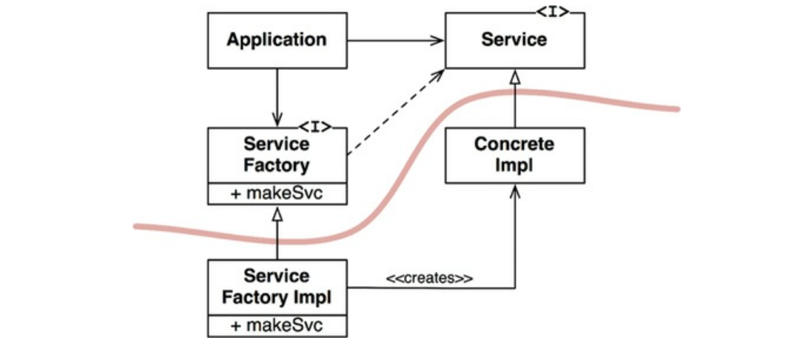

# Chapter 11. DIP: 의존성 역전 원칙

- 의존성 역전 원칙에서 말하는 ‘유연성이 극대화된 시스템’이란 소스 코드 의존성이 추상에 의존하며 구체에는 의존하지 않는 시스템이다.
    - DIP를 논할 때 운영체제나 플랫폼 같이 안정성이 보장된 환경에 대해서는 무시하는 편이다.
    - 우리가 의존하지 않도록 피하고자 하는 것은 바로 변동성이 큰 구체적인 요소다.
    - 이 구체적인 요소는 우리가 열심히 개발하는 중이라 자주 변경될 수밖에 없는 모듈들이다.

## 안정된 추상화

---

- 안정된 소프트웨어 아키텍처란 변동성이 큰 구현체에 의존하는 일은 지양하고, 안정된 추상 인터페이스를 선호하는 아키텍처라는 뜻이다.
    - 인터페이스는 구현체보다 변동성이 낮다.
    - 인터페이스를 변경하지 않고도 구현체에 기능을 추가할 수 있는 방법을 찾기 위해 노력한다 → 소프트웨어 설계의 기본

- 구체적인 코딩 실천법
    - 변동성이 큰 구체 클래스를 참조하지 말라.
        - 대신 추상 인터페이스를 참조하라.
        - 언어가 정적 타입이든 동적 타입이든 관계없이 모두 적용된다.
        - 객체 생성 방식을 강하게 제약하며, 일반적으로 추상 팩토리를 사용하도록 강제한다.
    - 변동성이 큰 구체 클래스로부터 파생하지 말라.
        - 정적 타입 언어에서 상속은 소스 코드에 존재하는 모든 관계 중에서 가장 강력한 동시에 뻣뻣해서 변경하기 어렵다. 따라서 상속은 아주 신중하게 사용해야 한다.
        - 동적 타입 언어라면 문제가 덜 되지만, 의존성을 가진다는 사실에는 변함이 없다.
    - 구체 함수를 오버라이드 하지 말라.
        - 대체로 구체 함수는 소스 코드 의존성을 필요로 한다. 따라서 구체 함수를 오버라이드 하면 이러한 의존성을 제거할 수 없게 되며, 실제로는 그 의존성을 상속하게 된다.
        - 이러한 의존성을 제거하려면, 차라리 추상 함수로 선언하고 구현체들에서 각자의 용도에 맞게 구현해야 한다.
    - 구체적이며 변동성이 크다면 절대로 그 이름을 언급하지 말라.
        - DIP 원칙을 다른 방식으로 풀어쓴 것이다.

## 팩토리

---

- 변동성이 큰 구체적인 객체는 특별히 주의해서 생성해야 한다.
- 자바 등 대다수의 객체 지향 언어에서 이처럼 바람직하지 못한 의존성을 처리할 때 추상 팩토리를 사용하곤 한다.

- 추상 팩토리를 사용한 구조
    
    
    
    11-1. 의존성을 관리하기 위해 추상 팩토리 패턴을 사용한다.
    
    - ConcreteImpl에 대해 소스 코드 의존성을 만들지 않으면서 이 목적을 이루기 위해 Application은 ServiceFactory 인터페이스의 makeSvc 메서드를 호출한다.

- 의존성 역전
    - 소스 코드 의존성은 제어흐름과는 반대 방향으로 역전된다.

## 구체 컴포넌트

---

- DIP 위배를 모두 없앨 수는 없다.
- 하지만 DIP를 위배하는 클래스들은 적은 수의 구체 컴포넌트 내부로 모을 수 있고, 이를 통해 시스템의 나머지 부분과는 분리할 수 있다.

## 결론

---

- 그림 11-1의 곡선은 이후의 장에서는 아키텍처 경계가 될 것이다.
- 의존성은 이 곡선을 경계로, 더 추상적인 엔티티가 있는 쪽으로만 향한다.
