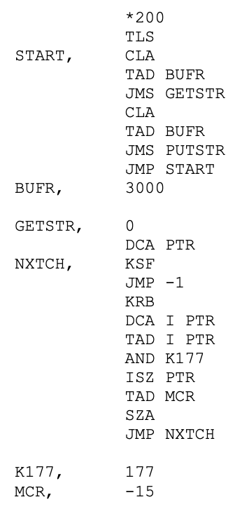

# Chapter 12. 컴포넌트

- 컴포넌트는 시스템의 구성 요소로 배포할 수 있는 가장 작은 단위다.
    - 잘 설계된 컴포넌트라면 반드시 독립적으로 배포 가능한, 따라서 독립적으로 개발 가능한 능력을 갖춰야 한다.

## 컴포넌트의 간략한 역사

---

- 소프트웨어 개발 초창기에는 메모리에서의 프로그램 위치와 레이아웃을 프로그래머가 직접 제어했다.
    - 프로그램의 시작부에는 프로그램이 로드될 주소를 선언하는 오리진(origin) 구문이 나와야 했다.

- ex> PDP-9 프로그램
    - 키보드로부터 문자열을 입력받아 버퍼에 저장하는 GETSTR이라는 이름의 서브루틴을 포함한다.
    - 그리고 이 GETSTR을 검사하는 간단한 단위 테스트 프로그램도 포함한다.
        
        
        
        - `*200` 명령어: 메모리 주소 200에 로드할 코드를 생성하라고 컴파일러에 알려준다.
            - 프로그램을 로드할 메모리의 위치를 정하는 일
        - 프로그램의 위치가 한번 결정되면, 재배치가 불가능했다.

- 라이브러리 함수에 접근
    - 라이브러리 함수의 소스 코드를 애플리케이션 코드에 직접 포함시켜 단일 프로그램으로 컴파일했다.
    - 라이브러리는 바이너리가 아니라 소스코드 형태로 유지되었다.
    
    → 메모리가 너무 작아서 소스 코드 전체를 메모리에 상주시킬 수가 없었다. 결국 컴파일러는 느린 장치를 이용해서 소스 코드를 여러 차례 읽어야만 했다.
    

- 컴파일 시간을 단축시키기 위해 프로그래머는 함수 라이브러리의 소스 코드를 애플리케이션 코드로부터 분리했다.
    - 함수 라이브러리를 개별적으로 컴파일하고, 컴파일된 바이너리를 메모리의 특정 위치(ex> 2000)에 로드했다.
    - 함수 라이브러리에 대한 심벌 테이블을 생성한 후, 이를 이용해 애플리케이션 코드를 컴파일했다.
    - 애플리케이션을 실행해야 한다면 바이너리 함수 라이브러리를 로드한 다음 애플리케이션을 로드했다.
        
        
        
        12-1. 초기의 메모리 배치
        

- 하지만 애플리케이션은 점점 커졌고, 결국 할당된 공간을 넘어서게 되었다.
    - 애플리케이션을 두 개의 주소 세그먼트로 분리하여 함수 라이브러리 공간을 사이에 두고 오가며 동작하게 배치해야 한다.
        
        
        
        12-2. 애플리케이션을 두 개의 주소 세그먼트로 분리
        
    - 프로그램과 라이브러리가 사용하는 메모리가 늘어날수록 이와 같은 단편화는 계속될 수밖에 없었다.

## 재배치성

---

- 해결책은 재배치가 가능한 바이너리(relocatable binary)였다.
    - 지능적인 로더를 사용해서 메모리에 재배치할 수 있는 형태의 바이너리를 생성하도록 컴파일러를 수정하자는 것
    - 로더는 재배치 코드가 자리할 위치 정보를 전달받았다. 재배치 코드에는 로드한 데이터에서 어느 부분을 수정해야 정해진 주소에 로드할 수 있는지를 알려주는 플래그가 삽입되었다.
    - 플래그는 바이너리에서 참조하는 메모리의 시작 주소
    
    → 프로그래머는 함수 라이브러리를 로드할 위치와 애플리케이션을 로드할 위치를 로더에게 지시할 수 있게 되었다.
    

- 컴파일러는 재배치 가능한 바이너리 안의 함수 이름을 메타데이터 형태로 생성하도록 수정되었다.
- 링킹 로더: 외부 정의를 로드할 위치가 정해지기만 하면 로더가 외부 참조를 외부 정의에 링크시킬 수 있게 된다.
    - 프로그램이 라이브러리 함수를 호출한다면 컴파일러는 라이브러리 함수 이름을 외부 참조로 생성
    - 라이브러리 함수를 정의하는 프로그램이라면 컴파일러는 해당 이름을 외부 정의로 생성

## 링커

---

- 1960년대 말과 1970년대 추가 되자 프로그래머들은 더 큰 야심을 품었고, 프로그램도 훨씬 커지게 되었다.
- 마침내 로드와 링크가 두 단계로 분리되었다.
    - 프로그래머가 느린 부분, 즉 링크 과정을 맡았는데, 링커라는 별도의 애플리케이션으로 이 작업을 처리하도록 만들었다. 링크가 완료된 재배치 코드를 만들어 줌.
    - 한번 만들어둔 실행 파일은 언제라도 빠르게 로드할 수 있게 되었다.

- 1980년대가 되었다. 프로그래머는 C나, 또 다른 고수준 언어를 사용하기 시작했다. 프로그래머는 더 큰 야심을 품었고, 프로그램도 더 커졌다.
    - 로드 시간은 여전히 빨랐지만, 컴파일-링크 시간이 병목 구간이었다.
- 무어가 등장했고, 1980년대 후반에 들어서자 전투가 벌어졌다. 승자는 무어였다.
    - 컴퓨터 속도, 메모리, 집적도가 매 18개월마다 두 배로 증가한다는 주장이다.

- 컴포넌트 플러그인 아키텍처가 탄생했다.
    - 컴퓨터와 장치가 빨라져서 또다시 로드와 링크를 동시에 할 수 있게 되었다.
    
    → 오늘날에는 `.jar` 파일, DLL, 공유 라이브러리를 기존 애플리케이션에 플러그인 형태로 배포하는 것이 일상적인 일이 되었다.
    

## 결론

---

- 런타임에 플러그인 형태로 결합할 수 있는 동적 링크 파일이 이 책에서 말하는 소프트웨어 컴포넌트에 해당한다.
