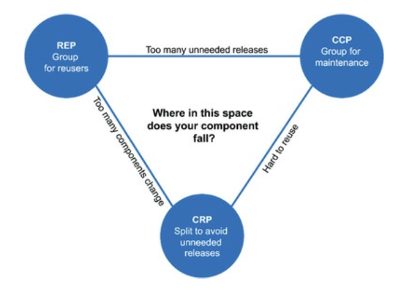

# Chapter 13. 컴포넌트 응집도

## REP: 재사용/릴리스 등가 원칙

---

- REP(Reuse/Release Equivalence Principle): 재사용 단위는 릴리스 단위와 같다.
    - 소프트웨어 컴포넌트가 릴리스 절차를 통해 추적 관리되지 않거나 릴리스 번호가 부여되지 않는다면 해당 컴포넌트를 재사용하고 싶어도 할 수도 없고, 하지도 않을 것이다.

- 단일 컴포넌트는 응집성 높은 클래스와 모듈들로 구성되어야 함
    - 하나의 컴포넌트로 묶인 클래스와 모듈은 버전 번호가 같아야 하며, 동일한 릴리스로 추적 관리되고, 동일한 릴리스 문서에 포함되어야 한다.

## CCP: 공통 폐쇄 원칙

---

- CCP(Common Closure Principle): 동일한 이유로 동일한 시점에 변경되는 클래스를 같은 컴포넌트로 묶어라. 서로 다른 시점에 다른 이유로 변경되는 클래스는 다른 컴포넌트로 분리하라.
- 단일 책임 원칙(SRP)을 컴포넌트 관점에서 다시 쓴 것
    - 단일 컴포넌트는 변경의 이유가 여러 개 있어서는 안 된다.

- 대다수의 애플리케이션에서 유지보수성은 재사용성보다 훨씬 중요하다.
    - CCP는 같은 이유로 변경될 가능성이 있는 클래스는 모두 한곳으로 묶을 것을 권한다.
- 개방 폐쇄 원칙(OCP)과도 밀접하게 관련되어 있다.
    - 동일한 유형의 변경에 대해 닫혀 있는 클래스들을 하나의 컴포넌트로 묶음으로써 OCP에서 얻은 교훈을 확대 적용한다.

### SRP와의 유사성

---

- SRP: 서로 다른 이유로 변경되는 메서드를 서로 다른 클래스로 분리하라
- CCP: 서로 다른 이유로 변경되는 클래스를 서로 다른 컴포넌트로 분리하라

→ 동일한 시점에 동일한 이유로 변경되는 것들을 한데 묶어라. 서로 다른 시점에 다른 이유로 변경되는 것들은 서로 분리하라.

## CRP: 공통 재사용 원칙

---

- CRP(Common Reuse Principle): 컴포넌트 사용자들을 필요하지 않는 것에 의존하게 강요하지 말라.
    - CRP도 클래스와 모듈을 어느 컴포넌트에 위치시킬지 결정할 때 도움되는 원칙이다.
    - 같이 재사용되는 경향이 있는 클래스와 모듈들은 같은 컴포넌트에 포함해야 한다고 말한다.
- CRP는 강하게 결합되지 않은 클래스들을 동일한 컴포넌트에 위치시켜서는 안 된다고 말한다.

### ISP와의 관계

---

- ISP: 사용하지 않은 메서드가 있는 클래스에 의존하지 말라
- CRP: 사용하지 않는 클래스를 가진 컴포넌트에 의존하지 말라

→ 필요하지 않은 것에 의존하지 말라.

## 컴포넌트 응집도에 대한 균형 다이어그램

---

- 응집도에 관한 세 원칙이 서로 상충된다.
    - 다이어그램의 각 변은 반대쪽 꼭지점에 있는 원칙을 포기했을 때 감수해야 할 비용을 나타낸다.
    
    
    
    13-1. 결합도 원칙들의 균형 다이어그램
    
    - REP와 CCP는 포함(inclusive) 원칙이다. 두 원칙은 컴포넌트를 더욱 크게 만든다.
    - CRP는 배제(exclusive) 원칙이며, 컴포넌트를 더욱 작게 만든다.

- 시간이 흐르면서 개발팀이 주의를 기울이는 부분 역시 변한다.
    - ex> 프로젝트 초기에는 CCP가 REP보다 훨씬 더 중요함
        - 개발 가능성(developability)이 재사용성보다 더욱 중요하기 때문이다.
    - 프로젝트가 성숙하고, 그 프로젝트로부터 파생된 또 다른 프로젝트가 시작되면, 프로젝트는 삼각형에서 점차 왼쪽으로 이동해 간다.
- 프로젝트의 컴포넌트 구조는 시간과 성숙도에 따라 변한다.

## 결론

---

- 어느 클래스들을 묶어서 컴포넌트로 만들지를 결정할 때, 재사용성과 개발 가능성이라는 상충하는 힘을 반드시 고려해야 한다.
