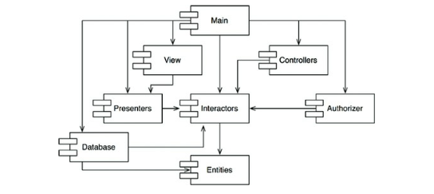

# Chapter 14. 컴포넌트 결합

## ADP: 의존성 비순환 원칙

---

- ADP(Acyclic Dependencies Principle): 컴포넌트 의존성 그래프에 순환이 있어서는 안 된다.

- ‘숙취 증후군(the morning after syndrome)’ 해결책
    - 주 단위 빌드(weekly build)
    - 의존성 비순환 원칙(Acyclic Dependencies Principle)

### 주 단위 빌드(weekly build)

---

- 주 단위 빌드: 중간 규모의 프로젝트에서는 흔하게 사용된다.
    - 장점: 5일 중 4일 동안 개발자를 고립된 세계에서 살 수 있게 보장해 준다.
    - 단점: 금요일에 통합과 관련된 막대한 업보를 치러야 한다.

- 개발보다 통합에 드는 시간이 늘어나면서 팀의 효율성도 서서히 나빠진다.
    - 효율성을 유지하기 위해 빌드 일정을 계속 늘려야 하고, 빌드 주기가 늦어질수록 프로젝트가 감수할 위험은 커진다.
    - 통합과 테스트를 수행하기가 점점 더 어려워지고, 팀은 빠른 피드백이 주는 장점을 잃는다.

### 순환 의존성 제거하기

---

- 이 문제의 해결책은 개발 환경을 릴리스 가능한 컴포넌트 단위로 분리하는 것이다.
    - 컴포넌트는 개별 개발자 또는 단일 개발팀이 책임질 수 있는 작업 단위가 된다.
    - 개발자가 해당 컴포넌트가 동작하도록 만든 후, 해당 컴포넌트를 릴리스하여 다른 개발자가 사용할 수 있도록 만든다.

- 이 같은 작업 절차는 단순하며 합리적이어서 널리 사용되는 방식이다.
    
    → 하지만 이 절차가 성공적으로 동작하려면 컴포넌트 사이의 의존성 구조를 반드시 관리해야 한다.
    
    - 의존성 구조에 순환이 있어서는 안 된다.

- 비순환 방향 그래프(Directed Acyclic Graph): 어느 컴포넌트에서 시작하더라도, 의존성 관계에는 순환이 없다.
    
    
    
    14-1. 전형적인 컴포넌트 다이어그램
    
    - 시스템 전체를 릴리스해야 할 때가 오면 릴리스 절차는 상향식으로 진행된다.

### 순환이 컴포넌트 의존성 그래프에 미치는 영향

---

- 순환 의존성이 발생한다.
    - ex> Entities의 User 클래스가 Authorizer의 Permissions 클래스를 사용한다.
        
        
        
        14-2. 순환 의존성
        
        - 이 순환은 즉각적인 문제를 일으킨다.
            - ex> Entities, Authorizer, Interactors는 사실상 하나의 거대한 컴포넌트가 되어 버린다.
    - 문제점
        - 해당 컴포넌트의 개발자들은 모두 서로에게 얽매이게 되는데, 모두 항상 정확하게 동일한 릴리스를 사용해야 하기 때문이다.
        - 여러 클래스 중 하나에 간단한 단위 테스트를 실행하는 데 왜 이렇게도 많고 다양한 라이브러리와 다른 사람들의 많은 작업물을 포함해야만 하는지가 궁금할 것이다.
        - 컴포넌트를 어떤 순서로 빌드해야 올바를지 파악하기가 상당히 힘들어진다.

### 순환 끊기

---

- 다시 DAG(Directed Acyclic Graph)로 원상복구 주요 메커니즘
    - 의존성 역전 원칙(DIP)을 적용한다.
        
        
        
        14-3. Entities와 Authorizer 사이의 의존성을 역전시킨다.
        
    - Entities와 Authorizer가 모두 의존하는 새로운 컴포넌트를 만든다. 그리고 두 컴포넌트가 모두 의존하는 클래스들을 새로운 컴포넌트로 이동시킨다.
        
        
        
        14-4. Entities와 Authorizer 모두가 의존하는 새로운 컴포넌트
        

### 흐트러짐(Jitters)

---

- 요구사항이 변경되면 컴포넌트 구조도 변경될 수 있다.
    - 따라서 의존성 구조에 순환이 발생하는지를 항상 관찰해야 한다.
    - 순환이 발생하면 어떤 식으로든 끊어야 한다.

## 하향식(top-down) 설계

---

- 컴포넌트 구조는 하향식으로 설계될 수 없다.
    - 컴포넌트는 시스템에서 가장 먼저 설계할 수 있는 대상이 아니며, 오히려 시스템이 성장하고 변경될 때 함께 진화한다.
- 컴포넌트 의존성 다이어그램은 애플리케이션의 빌드 가능성(buildability)과 유지보수성(maintainability)을 보여주는 지도와 같다.

- 의존성 구조와 관련된 최우선 관심사는 변동성을 격리하는 일이다.
    - 컴포넌트 의존성 그래프는 자주 변경되는 컴포넌트로부터 안정적이며 가치가 높은 컴포넌트를 보호하려는 아키텍트가 만들고 가다듬게 된다.
- 애플리케이션이 계속 성장함에 따라 우리는 재사용 가능한 요소를 만드는 일에 관심을 기울이기 시작한다.
    - 이 시점이 되면 컴포넌트를 조합하는 과정에 공통 재사용 원칙이 영향을 미치기 시작한다.

- 아직 아무런 클래스도 설계하지 않은 상태에서 컴포넌트 의존성 구조를 설계하려고 시도한다면 상당히 큰 실패를 맛볼 수 있다.

## SDP: 안정된 의존성 원칙

---

- SDP(Stable Dependencies Principle): 안정성의 방향으로(더 안정된 쪽에) 의존하라.
    - 변경하기 어려운 모듈이 변경하기 쉽게 만들어진 모듈에 의존하지 않도록 만들 수 있다.

### 안정성

---

- 안정성은 변화가 발생하는 빈도와는 직접적인 관련이 없다.
    
    → 변경을 만들기 위해 필요한 작업량과 관련된다.
    

- 소프트웨어 컴포넌트를 변경하기 어렵게 만드는 요인: 컴포넌트의 크기, 복잡도, 간결함 등.
    - 변경하기 어렵게 만드는 확실한 방법 하나는 수많은 다른 컴포넌트가 해당 컴포넌트에 의존하게 만드는 것이다.

- X는 안정된 컴포넌트 → 독립적이다.
    - 세 컴포넌트를 책임진다.
    - 반대로 X는 어디에도 의존하지 않으므로 X가 변경되도록 만들 수 있는 외적인 영향이 전혀 없다.
    
    
    
    14-5. X는 안정된 컴포넌트다.
    
- Y는 상당히 불안정한 컴포넌트 → 의존적이다.
    - 어떤 컴포넌트도 Y에 의존하지 않으므로 Y는 책임성이 없다.
    - Y는 세 개의 컴포넌트에 의존하므로 변경이 발생할 수 있는 외부 요인이 세 가지다.
    
    
    
    14-6. Y는 상당히 불안정한 컴포넌트다.
    

### 안정성 지표

---

- 컴포넌트로 들어오고 나가는 의존성의 개수를 세어 보는 방법: 컴포넌트가 위치상 어느 정도의 안정성을 가지는지 계산할 수 있다.
    - Fan-in: 안으로 들어오는 의존성. 이 지표는 컴포넌트 내부의 클래스에 의존하는 컴포넌트 외부의 클래스 개수를 나타낸다.
    - Fan-out: 바깥으로 나가는 의존성. 이 지표는 컴포넌트 외부의 클래스에 의존하는 컴포넌트 내부의 클래스 개수를 나타낸다.
    - I(불안정성): `I = Fan-out / (Fan-in + Fan-out)`. 이 지표는 [0, 1] 범위의 값을 갖는다.
        - `I=0`이면 최고로 안정된 컴포넌트라는 뜻이다.
            - 자신에게 의존하는 컴포넌트가 있으므로 해당 컴포넌트는 변경하기가 어렵지만, 해당 컴포넌트를 변경하도록 강제하는 의존성은 갖지 않는다.
        - `I=1`이면 최고로 불안정한 컴포넌트라는 뜻이다.
            - 책임성이 없으며 의존적이다.
        
        
        
        14-7. 예제
        

- SDP에서 컴포넌트의 I 지표는 그 컴포넌트가 의존하는 다른 컴포넌트들의 I보다 커야 한다고 말한다.

### 모든 컴포넌트가 안정적이어야 하는 것은 아니다

---

- 모든 컴포넌트가 최고로 안정적인 시스템이라면 변경이 불가능하다 → 바람직한 상황이 아니다.

- 세 컴포넌트로 구성된 시스템이 가질 수 있는 이상적인 구조
    - 불안정한 컴포넌트도 있고 안정된 컴포넌트도 존재하는 상태다.
    
    
    
    14-8. 세 컴포넌트로 구성된 시스템의 이상적인 구성
    
- SDP가 어떻게 위배될 수 있는지를 보여준다.
    
    
    
    14-9. SDP 위배
    
    
    
    14-10. Stable 내부의 클래스 U가 Flexible 내부의 클래스 C를 사용한다.
    
    → DIP를 도입하면 이 문제를 해결할 수 있다.
    
    
    
    14-11. C는 US 인터페이스를 구현한다.
    

### 추상 컴포넌트

---

- 추상 컴포넌트는 상당히 안정적이며, 따라서 덜 안정적인 컴포넌트가 의존할 수 있는 이상적인 대상이다.

## SAP: 안정된 추상화 원칙

---

- SAP(Stable Abstractions Principle): 컴포넌트는 안정된 정도만큼 추상화되어야 한다.

### 고수준 정책을 어디에 위치시켜야 하는가?

---

- 시스템에는 자주 변경해서는 절대로 안 되는 소프트웨어도 있다.
    - 고수준 아키텍처나 정책 결정과 관련된 소프트웨어
        
        → 이처럼 업무 로직이나 아키텍처와 관련된 결정에는 변동성이 없기를 기대한다.
        

- 고수준 정책을 안정된 컴포넌트에 위치시키면, 그 정책을 포함하는 소스 코드는 수정하기가 어려워진다.
    
    → 시스템 전체 아키텍처가 유연성을 잃는다.
    
- 컴포넌트가 최고로 안정된 상태이면서도(`I=0`) 동시에 변경에 충분히 대응할 수 있을 정도로 유연하게 만들 수 있을까?
    
    → 해답은 개방 폐쇄 원칙(OCP)
    
    - 어떤 클래스가 이 원칙을 준수하는가?
        
        → 추상 클래스
        

### 안정된 추상화 원칙

---

- 안정된 추상화 원칙(Stable Abstractions Principle): 안정성(stability)과 추상화 정도(abstractness) 사이의 관계를 정의한다.

- 안정적인 컴포넌트라면 반드시 인터페이스와 추상 클래스로 구성되어 쉽게 확장할 수 있어야 한다.
    - 안정된 컴포넌트가 확장이 가능해지면 유연성을 얻게 되고 아키텍처를 과도하게 제약하지 않게 된다.
    - 의존성은 추상화의 방향으로 향하게 된다.

### 추상화 정도 측정하기

---

- A 지표는 컴포넌트의 추상화 정도를 측정한 값이다. 이 값은 컴포넌트의 클래스 총 수 대비 인터페이스와 추상 클래스의 개수를 단순히 계산한 값이다.
    - Nc: 컴포넌트의 클래스 개수
    - Na: 컴포넌트의 추상 클래스와 인터페이스의 개수
    - A: 추상화 정도. `A = Na / Nc`

### 주계열 (Main Sequence)

---

14-12. `A/I` 그래프

- 궤적은 컴포넌트가 절대로 위치해서는 안 되는 영역, 다시 말해 배제할 구역을 찾는 방식으로 추론할 수 있다.
    
    
    
    14-13. 배제 구역
    

### 고통의 구역

---

- 고통의 구역(Zone of Pain): (0, 0) 주변 구역에 위치한 컴포넌트
    - 이 컴포넌트는 매우 안정적이며 구체적이다.
    - 바람직한 상태가 아닌데, 뻣뻣한 상태이기 때문이다.
    - 추상적이지 않으므로 확장할 수 없고, 안정적이므로 변경하기도 상당히 어렵다.
        - ex> 데이터베이스 스키마
            - 변동성이 높기로 악명이 높으며, 극단적으로 구체적이며, 많은 컴포넌트가 여기에 의존한다.
        - ex> 구체적인 유틸리티 라이브러리
            - String은 변동성이 없다.
    
    → 변동성이 없는 컴포넌트는 (0, 0) 구역에 위치했더라도 해롭지 않다.
    

- 고통의 구역에서 문제가 되는 경우는 변동성이 있는 소프트웨어 컴포넌트다.
    - 변동성이 크면 클수록 수반되는 고통은 더욱 ‘고통’스럽다.

### 쓸모없는 구역

---

- 쓸모없는 구역(Zone of Uselessness): (1, 1) 주변의 컴포넌트
    - 이 영역도 바람직하지 않은데, 여기 위치한 컴포넌트는 최고로 추상적이지만, 누구도 그 컴포넌트에 의존하지 않기 때문이다.
    - 누구도 구현하지 않은 채 남겨진 추상 클래스인 경우가 많다.

- 이같이 쓸모없는 엔티티가 존재한다는 사실은 바람직한 상황이 아님은 분명하다.

### 배제 구역 벗어나기

---

- 주계열에 위치한 컴포넌트는 자신의 안정성에 비해 ‘너무 추상적’이지도 않고, 추상화 정도에 비해 ‘너무 불안정’하지도 않다.
    - 컴포넌트가 위치할 수 있는 가장 바람직한 지점은 주계열의 두 종점이다.
    - 컴포넌트는 주계열 바로 위에 또는 가깝게 위치할 때 가장 이상적이다.

### 주계열과의 거리

---

- 이상적인 상태로부터 컴포넌트가 얼마나 멀리 떨어져 있는지 측정하는 지표
    - D: 거리. `D = |A + I - 1|`
    
    
    
    14-14. 컴포넌트 산점도
    

## 결론

---

- 의존성 관리 지표는 설계의 의존성과 추상화 정도가 내가 ‘훌륭한’ 패턴이라고 생각하는 수준에 얼마나 잘 부합하는지를 측정한다.
