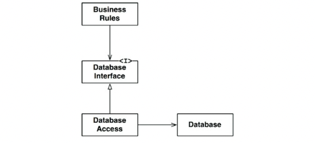

# Chapter 17. 경계: 선 긋기

- 경계: 소프트웨어 요소를 서로 분리하고, 경계 한편에 있는 요소가 반대편에 있는 요소를 알지 못하도록 막는다.
- 아키텍트의 목표: 필요한 시스템을 만들고 유지하는 데 드는 인적 자원을 최소화하는 것
    - 결합(coupling): 인적 자원의 효율을 떨어뜨리는 요인
    - 좋은 시스템 아키텍처: 결정을 가능한 한 최후의 순간에 내릴 수 있게 해주며, 결정에 따른 영향이 크지 않게 만든다.

## 두 가지 슬픈 이야기

---

- 비극: 아키텍트가 너무 이르게 결정을 내림으로써 개발 비용을 엄창나게 가중시킨 사례
- 실수: 엄청난 양의 인적 시간에 따른 비용이 SOA의 소용돌이에 휩쓸려 떠내려갔다.

## FitNesse

---

- 초기
    - 요구에 특화된, 우리만의 웹 서버를 직접 작성하자
        - 기본 뼈대만 갖춘 웹 서버는 단순한 단일 소프트웨어이기에 구현이 간단
        - 어떤 웹 프레임워크를 사용할지에 대한 결정을 훨씬 나중으로 연기할 수 있도록 해주었기 때문
    - 데이터베이스에 대해 고민하지 말자
        - 모든 데이터 접근 영역과 데이터 저장소 영역 사이에 인터페이스를 추가하는 간단한 설계 방식을 사용

- 개발 초기
    - 업무 규칙과 데이터베이스 사이에 경계선을 그었다.
        - 업무 규칙은 데이터 접근 메서드 외에는 데이터베이스에 관해서 어떤 것도 알지 못하게 되었다.
        
        → 결정을 늦추고 연기하는 데 도움이 되었고, 궁극적으로는 시간을 엄청나게 절약해주었으며, 골치를 썩지 않게 해주었다.
        
    
    → 좋은 아키텍처라면 반드시 해야 하는 일
    

## 어떻게 선을 그을까? 그리고 언제 그을까?

---

- 관련이 있는 것과 없는 것 사이에 선을 긋는다.
- 업무 규칙이 알아야 할 것
    - 데이터를 가져오고 저장할 때 사용할 수 있는 함수 집합이 있다는 사실
    
    → 함수 집합을 통해서 우리는 데이터베이스를 인터페이스 뒤로 숨길 수 있다.
    
    
    
    17-1. 인터페이스 뒤로 숨은 데이터페이스
    
    
    
    17-2. 경계선
    

- 두 컴포넌트 사이에 이러한 경계선을 그리고 화살표의 방향이 BusinessRules를 향하도록 만들었으므로, BusinessRules에서는 어떤 종류의 데이터베이스도 사용할 수 있음
    
    → 데이터베이스에 대한 결정은 연기할 수 있으며, 데이터베이스를 결정하기에 앞서 업무 규칙을 먼저 작성하고 테스트하는 데 집중할 수 있음을 의미한다.
    

## 입력과 출력은?

---

- 모델: 인터페이스를 전혀 필요로 하지 않는다.
    - 중요한 것: 업무 규칙

- GUI와 BusinessRules 컴포넌트가 경계선에 의해 분할된다.
    
    
    
    17-4. GUI와 BusinessRules 컴포넌트 사이의 경계
    

- 경계와 화살표를 이와같이 그릴 수 있으므로, GUI는 다른 종류의 인터페이스로 얼마든지 교체할 수 있으며 BusinessRules는 전혀 개의치 않는다.

## 플러그인 아키텍처

---

- 소프트웨어 개발 기술의 역사: 플러그인을 손쉽게 생성하여, 확장 가능하며 유지보수가 쉬운 시스템 아키텍처를 확립할 수 있게 만드는 방법에 대한 이야기
    - 선택적이거나 또는 수많은 다양한 형태로 구현될 수 있는 나머지 컴포넌트로부터 핵심적인 업무 규칙은 분리되어 있고, 또한 독립적이다.
        
        
        
        17-5. 업무 규칙에 플러그인 형태로 연결하기
        

## 플러그인에 대한 논의

---

17-6. ReSharper는 비주얼 스튜디오에 의존한다.

- 경계: 변경의 축이 있는 지점에 그어진다.
    - 경계의 한쪽에 위치한 컴포넌트는 경계 반대편의 컴포넌트와는 다른 속도로, 그리고 다른 이유로 변경된다.
- 단일 책임 원칙: 어디에 경계를 그어야 할지를 알려준다.

## 결론

---

- 경계선을 그리려면 먼저 시스템을 컴포넌트 단위로 분할해야 한다.
- 그런 다음 컴포넌트 사이의 화살표가 특정 방향, 즉 핵심 업무를 향하도록 이들 컴포넌트의 소스를 배치한다.

→ 의존성 역전 원칙과 안정된 추상화 원칙을 응용한 것
