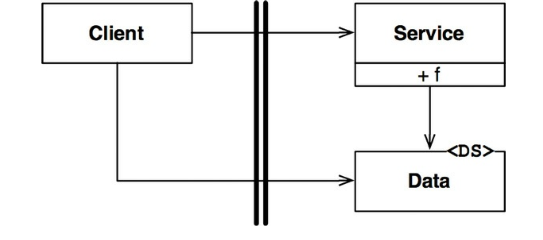

# Chapter 18. 경계 해부학

- 시스템 아키텍처는 일련의 소프트웨어 컴포넌트와 그 컴포넌트들을 분리하는 경계에 의해 정의된다.

## 경계 횡단하기

---

- 적절한 위치에서 경계를 횡단하게 하는 비결: 소스 코드 의존성 관리

## 두려운 단일체

---

- 소스 수준 분리 모드
    - 아키텍처 경계 중에서 가장 단순하며 가장 흔한 형태
    - 물리적으로 엄격하게 구분되지 않는 형태
    - 배포 관점에서 볼 때 단일체는 경계가 드러나지 않는다.
    - 그 안에 포함된 다양한 컴포넌트를 개발하고 바이너리로 만드는 과정을 독립적으로 수행할 수 있게함
        
        → 대단히 가치 있는 일
        

- 그림 18.1: 제어흐름은 왼쪽에서 오른쪽으로 경계를 횡단한다.
    
    
    
    18-1. 제어흐름은 경계를 횡단할 때 저수준에서 고수준으로 향한다.
    
- 동적 다형성을 사용하여 제어흐름과는 반대 방향으로 의존성을 역전시킬 수 있다.
    
    
    
    18-2. 제어흐름과는 반대로 경계를 횡단한다.
    

- 정적 링크된 모노리틱 구조의 실행 파일이라도 이처럼 규칙적인 방식으로 구조를 분리하면 프로젝트를 개발, 테스트, 배포하는 작업에 큰 도움이 된다.
- 단일체에서
    - 컴포넌트 간 통신은 매우 빠르고 값싸다.
    - 경계를 가로지르는 통신은 상당히 빈번할 수 있다.

## 배포형 컴포넌트

---

- 배포 수준 결합 분리 모드
    - 아키텍처의 경계가 물리적으로 드러날 수도 있는데 그중 가장 단순한 형태는 동적 링크 라이브러리다.
        - ex> .NET `DLL`, 자바 `jar` 파일, 루비 젬(`Gem`), 유닉스 공유 라이브러리 등
    - 컴포넌트는 바이너리와 같이 배포 가능한 형태로 전달된다.
    - 배포과정에서만 차이가 날 뿐, 배포 수준의 컴포넌트는 단일체와 동일하다.

- 배포형
    - 컴포넌트의 경계를 가로지르는 통신은 순전히 함수 호출에 지나지 않으므로 매우 값싸다.
    - 경계를 가로지르는 통신은 매우 빈번할 것이다.

## 스레드

---

- 스레드는 아키텍처 경계도 아니며 배포 단위도 아니다.
    - 실행 계획과 순서를 체계화하는 방법에 가깝다.

## 로컬 프로세스

---

- 로컬 프로세스: 주로 명령행이나 그와 유사한 시스템 호출을 통해 생성된다.
    - 훨씬 강한 물리적 형태를 띠는 아키텍처 경계
    - 동일한 프로세서 또는 하나의 멀티코어 시스템에 속한 여러 프로세서들에서 실행되지만, 각각이 독립된 주소 공간에서 실행된다.
    - 운영체제에서 제공하는 통신 기능을 이용하여 서로 통신한다.
    - 단일체나 바이너리 컴포넌트의 경우와 동일하다.

- 로컬 프로세스
    - 고수준 프로세스의 소스 코드가 저수준 프로세스의 이름, 물리 주소, 레지스트리 조회 키를 절대로 포함해서는 안 된다.
    - 경계를 지나는 통신 → 제법 비싼 작업에 속한다.
        - ex> 운영체제 호출, 데이터 마샬링 및 언마샬링, 프로세스 간 문맥 교환 등
    - 통신이 너무 빈번하게 이뤄지지 않도록 신중하게 제한해야 한다.

## 서비스

---

- 서비스는 프로세스로, 일반적으로 명령행 또는 그와 동등한 시스템 호출을 통해 구동된다.
    - 물리적인 형태를 띠는 가장 강력한 경계
    - 물리적으로 동일한 프로세서나 멀티코어에서 동작할 수도 있고, 아닐수도 있다.
    - 모든 통신이 네트워크를 통해 이뤄진다고 가정한다.

- 서비스
    - 경계를 지나는 통신은 함수 호출에 비해 매우 느리다. 가능하다면 빈번하게 통신하는 일을 피해야 한다.
        - 지연(latency)에 따른 문제를 고수준에서 처리할 수 있어야 한다.
    - 이를 제외하고는 로컬 프로세스에 적용한 규칙이 서비스에도 그대로 적용된다.
        - 저수준 서비스는 반드시 고수준 서비스에 ‘플러그인’되어야 한다.
        - 고수준 서비스의 소스 코드에는 저수준 서비스를 특정 짓는 어떤 물리적인 정보(ex> URI)도 절대 포함해서는 안 된다.

## 결론

---

- 대체로 한 시스템 안에서도 통신이 빈번한 로컬 경계와 지연을 중요하게 고려해야 하는 경계가 혼합되어 있음
