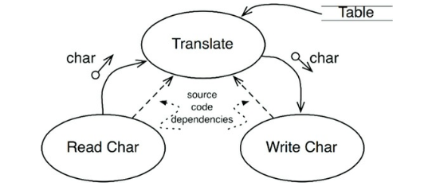

# Chapter 19. 정책과 수준

- 소프트웨어 시스템이란 정책을 기술한 것이다.
    - 소프트웨어 아키텍처를 개발하는 기술에는 정책을 신중하게 분리하고, 정책이 변경되는 양상에 따라 정책을 재편성하는 일도 포함된다.
    - 좋은 아키텍처: 저수준 컴포넌트가 고수준 컴포넌트에 의존하도록 설계되어야 한다.

## 수준

---

- 수준(level): 입력과 출력까지의 거리
    - 시스템의 입력과 출력 모두로부터 멀리 위치할수록 정책의 수준은 높아진다.
    - 간단한 암호화 프로그램: 프로그램을 제대로 설계했다면 소스 코드 의존성은 곧은 점선처럼 표시되어야 한다.
        
        
        
        19-1. 간단한 암호화 프로그램
        
        - 번역 컴포넌트는 이 시스템에서 최고 수준의 컴포넌트인데, 입력과 출력에서부터 가장 멀리 떨어져 있기 때문이다.

- 소스 코드 의존성은 그 수준에 따라 결합되어야 하며, 데이터 흐름을 기준으로 결합되어서는 안 된다.
    - ex> 잘못된 아키텍처
        
        ```jsx
        function encrypt() {
          while(true)
            writeChar(translate(readChar()));
        }
        ```
        
        - 고수준인 encrypt 함수가 저수준인 readChar와 writeChart 함수에 의존하기 때문이다.
        
        → 개선해본 모습: 입력과 출력에 변화가 생기더라도 암호화 정책은 거의 영향을 받지 않음
        
        
        
        19-2. 시스템의 더 나은 아키텍처를 보여주는 클래스 다이어그램
        
        - 경계로 묶인 영역이 이 시스템에서 최고 수준의 구성 요소다.
        - ConsoleReader와 ConsoleWriter는 클래스
            - 입력과 출력에 가깝기 때문에 저수준이다.

- 정책을 컴포넌트로 묶는 기준: 정책이 변경되는 방식에 달려있다.
    - 단일 책임 원칙(SRP)과 공통 폐쇄 원칙(CCP)에 따르면 동일한 이유로 동일한 시점에 변경되는 정책은 함께 묶인다.
- 저수준 컴포넌트가 고수준 컴포넌트에 플러그인되어야 한다 → 변경의 영향도를 줄일 수 있다.
    
    
    
    19-3. 저수준 컴포넌트는 고수준 컴포넌트에 플러그인되어야 한다.
    

## 결론

---

- 정책에 대한 논의는 단일 책임 원칙, 개방 폐쇄 원칙, 공통 폐쇄 원칙, 의존성 역전 원칙, 안정된 의존성 원칙, 안정된 추상화 원칙을 모두 포함한다.
