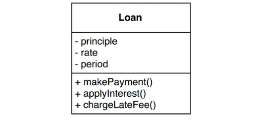

# Chapter 20. 업무 규칙

- 핵심 업무 규칙: 사업적으로 수익을 얻거나 비용을 줄일 수 있는 규칙 또는 절차
    - 사람이 수동으로 직접 수행하더라도 마찬가지
    - 사업 자체에 핵심적이며, 규칙을 자동화하는 시스템이 없더라도 업무 규칙은 그대로 존재하기 때문
- 핵심 업무 데이터: 핵심 업무 규칙은 보통 데이터를 요구한다.
    - 시스템으로 자동화되지 않은 경우에도 존재하는 그런 데이터

→ 엔티티: 핵심 규칙과 핵심 데이터는 본질적으로 결합되어 있기 때문에 객체로 만들 좋은 후보가 된다.

## 엔티티

---

- 엔티티는 컴퓨터 시스템 내부의 객체로서, 핵심 업무 데이터를 기반으로 동작하는 일련의 조그만 핵심 업무 규칙을 구체화한다.
    - 핵심 업무 데이터를 직접 포함하거나 핵심 업무 데이터에 매우 쉽게 접근할 수 있다.
    - 인터페이스: 핵심 업무 데이터를 기반으로 동작하는 핵심 업무 규칙을 구현한 함수들로 구성된다.
    - ex> 대출을 뜻하는 Loan 엔티티
        
        
        
        20-1. UML 클래스로 표현한 Loan 엔티티
        
        - 세 가지의 핵심 업무 데이터를 포함
        - 데이터와 관련된 세 가지 핵심 업무 규칙을 인터페이스로 제공

- 유일한 요구 조건: 핵심 업무 데이터와 핵심 업무 규칙을 하나로 묶어서 별도의 소프트웨어 모듈로 만들어야 한다는 것
    - 업무에서 핵심적인 개념을 구현하는 소프트웨어는 한데 모으고, 구축 중인 자동화 시스템의 나머지 모든 고려사항과 분리시킨다.
    - 엔티티는 순전히 업무에 대한 것이며, 이외의 것은 없다.

## 유스케이스

---

- 자동화된 시스템이 동작하는 방법을 정의하고 제약함으로써 수익을 얻거나 비용을 줄이는 업무 규칙도 존재한다.
    - 자동화된 시스템의 요소로 존재해야만 의미가 있으므로 수동 환경에서는 사용될 수 없다.

- 유스케이스: 자동화된 시스템이 사용되는 방법을 설명한다.
    - 사용자가 제공해야 하는 입력, 사용자에게 보여줄 출력, 그리고 해당 출력을 생성하기 위한 처리 단계를 기술한다.
    - 애플리케이션에 특화된 업무 규칙을 설명한다.
    - 엔티티 내부의 핵심 업무 규칙을 어떻게, 그리고 언제 호출할지를 명시하는 규칙을 담는다.
    - 사용자 인터페이스를 기술하지 않는다.
        
        
        
        20-2. 유스케이스 예제
        
    - 객체다.
        - 애플리케이션에 특화된 업무 규칙을 구현하는 하나 이상의 함수를 제공한다.
    - 입력 데이터, 출력 데이터, 유스케이스가 상호작용하는 엔티티에 대한 참조 데이터 등의 데이터 요소를 포함한다.

- 엔티티는 고수준이며, 유스케이스는 저수준
    - 유스케이스는 단일 애플리케이션에 특화되어 있으며, 따라서 해당 시스템의 입력과 출력에 보다 가깝게 위치하기 때문

## 요청 및 응답 모델

---

- 유스케이스는 단순한 요청 데이터 구조를 입력으로 받아들이고, 단순한 응답 데이터 구조를 출력으로 반환한다.
    - 이들 데이터 구조는 어떤 것에도 의존하지 않는다.

## 결론

---

- 업무 규칙은 소프트웨어 시스템이 존재하는 이유다.
    - 수익을 내고 비용을 줄이는 코드를 수반한다.
    - 사용자 인터페이스나 데이터베이스와 같은 저수준의 관심사로 인해 오염되어서는 안 되며, 원래 그대로의 모습으로 남아 있어야 한다.
    - 시스템에서 가장 독립적이며 가장 많이 재사용할 수 있는 코드여야 한다.
