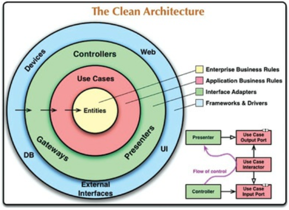

# Chapter 22. 클린 아키텍처

- 이들의 목표는 모두 같은데, 바로 관심사의 분리(separation of concerns)다.
    - 소프트웨어를 계층으로 분리함으로써 관심사의 분리라는 목표를 달성할 수 있었다.
    - 이들 아키텍처는 모두 시스템이 다음과 같은 특징을 지니도록 만든다.
        - 프레임워크 독립성
        - 테스트 용이성
        - UI 독립성
        - 데이터베이스 독립성
        - 모든 외부 에이전시에 대한 독립성

22-1. 클린 아키텍처

## 의존성 규칙

---

- 소스 코드 의존성은 반드시 안쪽으로, 고수준의 정책을 향해야 한다.

### 엔티티

---

- 엔티티는 전사적인 핵심 업무 규칙을 캡슐화한다.
- 엔티티는 메서드를 가지는 객체이거나 일련의 데이터 구조와 함수의 집합일 수도 있다.

### 유스케이스

---

- 유스케이스 계층의 소프트웨어는 애플리케이션에 특화된 업무 규칙을 포함한다.
- 유스케이스 계층의 소프트웨어는 시스템의 모든 유스케이스를 캡슐화하고 구현한다.

### 인터페이스 어댑터

---

- 인터페이스 어댑터 계층은 일련의 어댑터들로 구성된다.
    - 어댑터: 데이터를 유스케이스와 엔티티에게 가장 편리한 형식에서 데이터베이스나 웹 같은 외부 에이전시에게 가장 편리한 형식으로 변환한다.

### 프레임워크와 드라이버

---

- 프레임워크와 드라이버 계층은 모든 세부사항이 위치하는 곳이다.

### 원은 네 개여야만 하나?

---

- 가장 바깥쪽 원은 저수준의 구체적인 세부사항으로 구성된다.
- 안쪽으로 이동할수록 소프트웨어는 점점 추상화되고 더 높은 수준의 정책들을 캡슐화한다.

### 경계 횡단하기

---

- 우리는 동적 다형성을 이용하여 소스 코드 의존성을 제어흐름과는 반대로 만들 수 있고, 이를 통해 제어흐름이 어느 방향으로 흐르더라도 의존성 규칙을 준수할 수 있다.

### 경계를 횡단하는 데이터는 어떤 모습인가

---

- 경계를 가로지르는 데이터는 흔히 간단한 데이터 구조로 이루어져 있다.
    - 기본적인 구조체나 간단한 데이터 전송 객체 등 원하는 대로 고를 수 있다.
    - 또는 함수를 호출할 때 간단한 인자를 사용해서 데이터로 전달할 수도 있다. 그게 아니라면 데이터를 해시맵으로 묶거나 객체로 구성할 수도 있다.
- 중요한 점은 격리되어 있는 간단한 데이터 구조가 경계를 가로질러 전달된다는 사실이다.

## 전형적인 시나리오

---

22-2. 데이터베이스를 사용하는, 웹 기반 자바 시스템의 전형적인 시나리오

- 모든 의존성은 경계선을 안쪽으로 가로지르며, 따라서 의존성 규칙을 준수한다.

## 결론

---

- 소프트웨어를 계층으로 분리하고 의존성 규칙을 준수한다면 본질적으로 테스트하기 쉬운 시스템을 만들게 될 것이며, 그에 따른 이점을 누릴 수 있다.
    - 데이터베이스나 웹 프레임워크와 같은 시스템의 외부 요소가 구식이 되더라도, 이들 요소를 아단스럽지 않게 교체할 수 있다.
