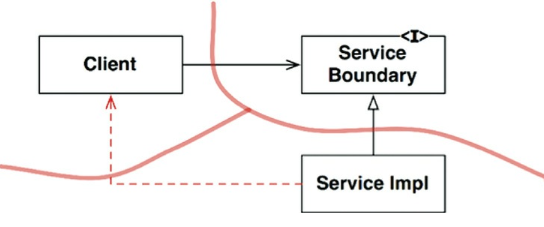

# Chapter 24. 부분적 경계

## 마지막 단계를 건너뛰기

---

- 부분적 경계를 생성하는 방법 하나: 독립적으로 컴파일하고 배포할 수 있는 컴포넌트를 만들기 위한 작업은 모두 수행한 후, 단일 컴포넌트에 그대로 모아만 두는 것
- 부분적 경계를 만들려면 완벽한 경계를 만들 때 만큼의 코드량과 사전 설계가 필요하다.
    - 다수의 컴포넌트를 관리하는 작업은 하지 않아도 된다.
    - 추적을 위한 버전 번호도 없음
    - 배포 관리 부담도 없다.
    
    → 이 차이는 가볍지 않다.
    

- 마지막 단계를 건너뛰는 이 접근법이 지닌 위험
    - 시간이 흐르면서, 별도로 분리한 웹 컴포넌트가 재사용될 가능성은 전혀 없을 것임
    - 웹 컴포넌트와 위키 컴포넌트 사이의 구분도 약화되기 시작했다.
    - 의존성은 잘못된 방향으로 선을 넘기 시작했다.

## 일차원 경계

---

- 완벽한 형태의 아키텍처 경계는 양방향으로 격리된 상태를 유지해야 하므로 쌍방향 Boundary 인터페이스를 사용한다.
    
    
    
    24-1. 전략(Strategy) 패턴
    
    - 이 방식이 미래에 필요할 아키텍처 경계를 위한 무대를 마련한다는 점은 명백하다.

## 퍼사드

---

- 이보다 훨씬 더 단순한 경계는 퍼사드 패턴
    - 이 경우에는 심지어 의존성 역전까지도 희생한다.
    - 경계는 Facade 클래스로만 간단히 정의된다.
    - Facade 클래스에는 모든 서비스 클래스를 메서드 형태로 정의하고, 서비스 호출이 발생하면 해당 서비스 클래스로 호출을 전달한다.
    - 클라이언트는 이들 서비스 클래스에 직접 접근할 수 없다.
        
        
        
        24-2. 퍼사드(Facade) 패턴
        
    - 정적 언어였다면 서비스 클래스 중 하나에서 소스 코드가 변경되면 Client도 무조건 재컴파일해야 할 것이다.

## 결론

---

- 아키텍처 경계가 언제, 어디에 존재해야 할지, 그리고 그 경계를 완벽하게 구현할지 아니면 부분적으로 구현할지를 결정하는 일 또한 아키텍트의 역할이다.
