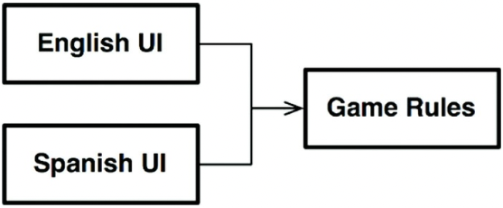

# Chapter 25. 계층과 경계

- 시스템이 세 가지 컴포넌트(UI, 업무 규칙, 데이터베이스)로만 구성된다고 생각하기 쉽다.
    - 하지만 대다수의 시스템에서 컴포넌트의 개수는 이보다 훨씬 많다.

## 움퍼스 사냥 게임

---

- 소스코드 의존성을 적절히 관리하면, UI 컴포넌트가 어떤 언어를 사용하더라도 게임 규칙을 재사용할 수 있다.
    
    
    
    25-1. UI 컴포넌트가 어떤 언어를 사용하더라도 게임 규칙을 재사용할 수 있다.
    
- 우리는 게임 규칙이 다양한 종류의 데이터 저장소에 대해 알지 않기를 원한다.
    - 의존성 규칙을 준수할 수 있도록 의존성이 적절한 방향을 가리키게 만들어야 한다.
        
        
        
        25-2. 의존성 규칙 준수하기
        

## 클린 아키텍처?

---

- 이 변경의 축에 의해 정의되는 아키텍처 경계가 잠재되어 있을 수도 있다. 아마도 해당 경계를 가로지르는, 그래서 언어를 통신 메커니즘으로부터 격리하는 API를 생성해야 할 수도 있다.
    
    
    
    25-3. 개선된 다이어그램
    
    - 점선으로 된 테두리는 API를 정의하는 추상 컴포넌트를 가리키며, 해당 API는 추상 컴포넌트 위나 아래의 컴포넌트가 구현한다.

- 이러한 변형들을 모두 제거하고 순전히 API 컴포넌트만 집중하면 다이어그램을 단순화할 수 있다.
    
    
    
    25-4. 단순화된 다이어그램
    
- 이 구성은 데이터 흐름을 두 개의 흐름으로 효과적으로 분리한다.
    - 왼쪽의 흐름은 사용자와의 통신에 관여하며, 오른쪽의 흐름은 데이터 영속성에 관여한다.

## 흐름 횡단하기

---

- 움퍼스 사냥 게임을 네트워크상에서 여러 사람이 함께 플레이할 수 있게 만든다고 해보자.
    - 네트워크(Network) 컴포넌트를 추가해야 한다.
        
        
        
        25-5. Network 컴포넌트 추가하기
        
- 시스템이 복잡해질수록 컴포넌트 구조는 더 많은 흐름으로 분리될 것이다.

## 흐름 분리하기

---

- 게임 규칙 중 일부는 지도와 관련된 메커니즘을 처리한다.
- 하지만 이보다 더 높은 수준에는 또 다른 정책 집합이 존재한다.
    - 고수준 정책에서는 플레이어의 상태를 관리한다.
    - 게임이 끝났을 때 플레이어의 승리 여부도 해당 정책에서 결정한다.
        
        
        
        25-6. 고수준의 정책은 플레이어를 관리한다.
        

- 대규모의 플레이어가 동시에 플레이할 수 있는 버전
    - MoveManagement는 플레이어의 컴퓨터에서 직접 처리되지만 PlayerManagement는 서버에서 처리된다.
    - MoveManagement와 PlayerManagement 사이에는 완벽한 형태의 아키텍처 경계가 존재한다.
        
        
        
        25-7. 마이크로서비스 API 추가하기
        

## 결론

---

- 아키텍처 경계가 어디에나 존재한다.
    - 아키텍처 경계가 언제 필요한지를 신중하게 파악해내야 한다.
    - 이러한 경계를 제대로 구현하려면 비용이 많이 든다.
    - 이러한 경계가 무시되었다면 나중에 다시 추가하는 비용이 크다.
- 추상화가 필요하리라고 미리 예측해서는 안 된다.
    - 오버 엔지니어링이 언더 엔지니어링보다 나쁠 때가 훨씬 많기 때문이다.
- 프로젝트 초반에는 구현할 경계가 무엇인지와 무시할 경계가 무엇인지를 쉽게 결정할 수 없다. 대신 지켜봐야 한다. 시스템이 발전함에 따라 주의를 기울여야 한다.
- 첫 조짐이 보이는 시점이 되면, 해당 경계를 구현하는 비용과 무시할 때 감수할 비용을 가늠해 본다. 그리고 결정된 사항을 자주 검토한다.
    - 우리의 목표는 경계의 구현 비용이 그걸 무시해서 생기는 비용보다 적어지는 바로 그 변곡점에서 경계를 구현하는 것이다.
