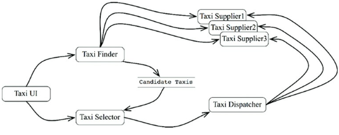

# Chapter 27. ‘크고 작은 모든’ 서비스들

- 서비스 지향 ‘아키텍처’와 마이크로서비스 ‘아키텍처’는 최근에 큰 인기를 끌고 있다.
    - 서비스를 사용하면 상호 결합이 철저하게 분리되는 것처럼 보인다.
        - 일부만 맞는 말이다.
    - 서비스를 사용하면 개발과 배포 독립성을 지원하는 것처럼 보인다.
        - 일부만 맞는 말이다.

## 서비스 아키텍처?

---

- 서비스 그 자체로는 아키텍처를 정의하지 않는다.
    - 시스템의 아키텍처는 의존성 규칙을 준수하며 고수준의 정책을 저수준의 세부사항으로부터 분리하는 경계에 의해 정의된다.
- 결국 서비스는 프로세스나 플랫폼 경계를 가로지르는 함수 호출에 지나지 않는다.

## 서비스의 이점?

---

- 서비스 아키텍처라는 통설
    - 이점을 하나씩 따져보자.

### 결합 분리의 오류

---

- 시스템을 서비스들로 분리함으로써 얻게 되리라 예상되는 큰 이점 하나는 서비스 사이의 결합이 확실히 분리된다는 점
    - 꼭 그런 것만은 아니다.
    - 프로세서 내의 또는 네트워크 상의 공유 자원 때문에 결합될 가능성이 여전히 존재한다. 서로 공유하는 데이터에 의해 이들 서비스는 강력하게 결합되어 버린다.
- 인터페이스가 잘 정의되어 있어야 한다는 이점
    - 명백히 사실이다. 하지만 함수의 경우에도 전혀 다르지 않다.
    - 서비스 인터페이스가 함수 인터페이스보다 더 엄밀하거나, 더 엄격하고, 더 잘 정의되는 것은 아니다.

### 개발 및 배포 독립성의 오류

---

- 또 다른 이점은 전담팀이 서비스를 소유하고 운영한다는 점
    - 개발 및 배포 독립성은 확장 가능한 것으로 간주된다.
    - 극히 일부일 뿐이다.
        - 대규모 엔터프라이즈 시스템은 서비스 기반 시스템 이외에도, 모노리틱 시스템이나 컴포넌트 기반 시스템으로도 구축할 수 있다.
            - 서비스는 확장 가능한 시스템을 구축하는 유일한 선택지가 아니다.
        - ‘결합 분리의 오류‘에 따르면 서비스라고 해서 항상 독립적으로 개발하고, 배포하며, 운영할 수 있는 것은 아니다.
            - 데이터나 행위에서 어느 정도 결합되어 있다면 결합된 정도에 맞게 개발, 배포, 운영을 조정해야만 한다.

## 야옹이 문제

---

- 확장 가능한 시스템을 구축하고 싶었기에, 우리는 수많은 작은 마이크로 서비스를 기반으로 구축하기로 결정했다.
    
    
    
    27-1. 택시 통합 서비스를 구현하기 위해 배치된 서비스들
    
- 도시에 야옹이를 배달하는 서비스를 제공하겠다는 계획
    - 이 기능을 구현하려면 이들 서비스 중 어디를 변경해야 할까?
        - 전부다.
    - 이 서비스들은 모두 결합되어 있어서 독립적으로 개발하고, 배포하거나, 유지될 수 없다.
        
        → 횡단 관심사(cross-cutting concern)가 지닌 문제
        
        - 모든 소프트웨어 시스템은 서비스 지향이든 아니든 이 문제에 직면하게 마련이다.
    - 서비스 다이어그램에서 묘사된 것과 같은 종류의 기능적 분해는 새로운 기능이 기능적 행위를 횡단하는 상황에 매우 취약하다.

## 객체가 구출하다

---

- 컴포넌트 기반 아키텍처
    - SOLID 설계 원칙을 잘 들여다보면, 다형적으로 확장할 수 있는 클래스 집합을 생성해 새로운 기능을 처리하도록 함
        
        
        
        27-2. 객체 지향 방식으로 횡단 관심사를 처리하기
        
        - 배차에 특화된 로직 부분은 Rides 컴포넌트로 추출되고, 야옹이에 대한 신규 기능은 Kittens 컴포넌트에 들어갔다.
            - 이 두 컴포넌트는 기존 컴포넌트들에 있는 추상 기반 클래스를 템플릿 메서드나 전략 패턴 등을 이용해서 오버라이드 한다.
        - 이 전략을 따르더라도 야옹이 기능을 구현하려면 TaxiUI는 어쩔 수 없이 변경해야만 한다.
            - 하지만 그 외의 것들은 변경할 필요가 없다.
            
            → 따라서 야옹이 기능은 결합이 분리되며, 독립적으로 개발하여 배포할 수 있다.
            
    
    ## 컴포넌트 기반 서비스
    
    ---
    
    - 서비스는 SOLID 원칙대로 설계할 수 있으며 컴포넌트 구조를 갖출 수도 있다.
        - 자바의 경우, 서비스를 하나 이상의 jar 파일에 포함되는 추상 클래스들의 집합이라고 생각하라.
            - 새로운 기능 추가 혹은 기능 확장은 새로운 jar 파일로 만든다.
            - 이때 새로운 jar 파일을 구성하는 클래스들은 기존 jar 파일에 정의된 추상 클래스들을 확장해서 만들어진다.
            
            → 새로운 기능을 추가하는 행위가 개방 폐쇄 원칙을 준수하게 된다.
            
            
            
            27-3. 각 서비스의 내부는 각자의 방식대로 컴포넌트를 설계할 수 있으며, 파생 클래스를 만들어서 신규 기능을 추가할 수 있다.
            

## 횡단 관심사

---

- 아키텍처 경계가 서비스 사이에 있지 않다.
    - 오히려 서비스를 관통하며, 서비스를 컴포넌트 단위로 분할한다.
    
    
    
    27-4. 서비스 내부는 의존성 규칙도 준수하는 컴포넌트 아키텍처로 설계해야 한다.
    

## 결론

---

- 서비스는 시스템의 확장성과 개발 가능성 측면에서 유용하지만, 그 자체로는 아키텍처적으로 그리 중요한 요소는 아니다.
