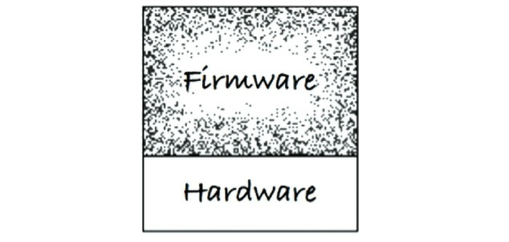

# Chapter 29. 클린 임베디드 아키텍처

- 소프트웨어는 닳지 않지만, 펌웨어와 하드웨어에 대한 의존성을 관리하지 않으면 안으로부터 파괴될 수 있다.
- ROM에 상주하는 코드만이 펌웨어는 아니다.
    - 저장되는 위치가 펌웨어를 정의하지는 않는다.
    - 무엇에 의존하는지, 그리고 하드웨어 발전에 맞춰 수정하기가 얼마나 어려운지에 따라 정의된다.
- 우리가 정말로 원하는 건 펌웨어는 더 적게 만들고, 소프트웨어는 더 많이 만드는 것이다.
- 펌웨어를 수없이 양산하는 일을 멈추고, 코드에게 유효 수명을 길게 늘릴 수 있는 기회를 주어라.

## 앱-티튜드 테스트

---

- 왜 잠재적인 임베디드 소프트웨어는 그렇게도 많이 펌웨어로 변하는가?
    - 임베디드 코드가 동작하게 만드는 데 대부분의 노력을 집중하고, 오랫동안 유용하게 남도록 구조화하는 데는 그리 신경 쓰지 않기 때문으로 보인다.

- 소프트웨어를 구축하는 세 가지 활동
    - 먼저 동작하게 만들어라
        - 소프트웨어가 동작하지 않는다면 사업은 망한다.
    - 그리고 올바르게 만들어라
        - 코드를 리팩터링해서 당신을 포함한 나머지 사람들이 이해할 수 있게 만들고, 요구가 변경되거나 요구를 더 잘 이해하게 되었을 때 코드를 개선할 수 있게 만들어라.
    - 그리고 빠르게 만들어라
        - 코드를 리팩터링해서 ‘요구되는’ 성능을 만족시켜라.

- 임베디드 전문인지와 관계없이, 프로그래머가 오직 앱이 동작하도록 만드는 일만 신경 쓴다면 자신의 제품과 고용주에게 몹쓸 짓을 하는 것이다.

## 타깃-하드웨어 병목현상

---

- 임베디드 개발자들은 임베디드가 아니었다면 다루지 않아도 될 특수한 관심사를 많이 가지고 있다.
    - 제한된 메모리 공간, 실시간성 제약과 처리완료 시간, 제한된 입출력, 특이한 사용자 인터페이스, 여러 센서와 실제 세상과의 상호작용 등
- 임베디드가 지닌 특수한 문제 중 하나는 타깃-하드웨어 병목현상이다.
    - 임베디드 코드가 클린 아키텍처 원칙과 실천법을 따르지 않고 작성된다면, 대개의 경우 코드를 테스트할 수 있는 환경이 해당 특정 타깃으로 국한될 것이다.

### 클린 임베디드 아키텍처는 테스트하기 쉬운 임베디드 아키텍처다

---

- 계층
    - 무엇을 어디에 위치시킬지, 그리고 한 모듈이 다른 모듈에 대해 어디까지 알게 할지를 신중하게 처리하지 않는다면, 완성된 코드는 변경하기가 매우 어렵게 된다.
        
        
        
        29-2. 하드웨어는 시스템의 나머지 부분으로부터 반드시 분리되어야 한다.
        
        - 사용자가 변경을 요청할 때나 버그를 고쳐야 할 때도 마찬가지다.
    - 소프트웨어와 펌웨어가 서로 섞이는 일은 안티 패턴이다.
        - 기기를 외부적으로 테스트할 수 있게 구성하지 않았다면 지루한 수동 테스트를 비켜갈 방법이 없다.

- 하드웨어는 세부사항이다
    - 소프트웨어와 펌웨어 사이의 경계는 코드와 하드웨어 사이의 경계와는 달리 잘 정의하기가 대체로 힘들다.
        
        
        
        29-3. 소프트웨어와 펌웨어 사이의 경계는 코드와 하드웨어 사이의 경계보다는 조금 흐릿하다.
        
    - 임베디드 소프트웨어 개발자가 해야 할 일 하나는 이 경계를 분명하게 만드는 것이다.
        
        → 소프트웨어와 펌웨어 사이의 경계는 하드웨어 추상화 계층(Hardware Abstraction Layer)이라고 부른다.
        
        
        
        29-4. 하드웨어 추상화 계층
        

### HAL 사용자에게 하드웨어 세부사항을 드러내지 말라

---

- 클린 임베디드 아키텍처로 설계된 소프트웨어는 타깃 하드웨어에 관계없이 테스트가 가능하다.
    - HAL을 제대로 만들었다면, HAL은 타깃에 상관없이 테스트할 수 있는 경계층 또는 일련의 대체 지점을 제공한다.

- 프로세서는 세부사항이다
    - 모든 소프트웨어는 반드시 프로세서에 독립적이어야 함이 분명하지만, 모든 펌웨어가 그럴 수는 없다.
    - 클린 임베디드 아키텍처라면 이들 장치 접근 레지스터를 직접 사용하는 코드는 소수의, 순전히 펌웨어로만 한정시켜야 한다.
        - 레지스터를 알고 있는 것은 모두 펌웨어가 되어야 하며, 따라서 실리콘 칩에 종속된다.

- 운영체제는 세부사항이다
    - 작성한 코드의 수명을 늘리려면, 무조건 운영체제를 세부사항으로 취급하고 운영체제에 의존하는 일을 막아야 한다.
    - 소프트웨어는 운영체제를 통해 운영 환경이 제공하는 서비스에 접근한다.
        - OS는 소프트웨어를 펌웨어로부터 분리하는 계층이다.
            
            
            
            29-5. 운영체제를 추가
            
    - 클린 임베디드 아키텍처는 운영체제 추상화 계층(Operating System Abstraction Layer)을 통해 소프트웨어를 운영체제로부터 격리시킨다.
        
        
        
        29-6. 운영체제 추상화 계층
        
        - OSAL을 정의하는 일은 결국 애플리케이션에서도 공통 구조를 가지도록 힘쓰는 일
        - OSAL은 테스트 지점을 만드는 데 도움이 되며, 그 덕분에 소프트웨어 계층의 귀중한 애플리케이션 코드를 타깃이나 OS에 관계없이 테스트할 수 있게 된다.

### 인터페이스를 통하고 대체 가능성을 높이는 방향으로 프로그래밍하라

---

- 계층형 아키텍처는 인터페이스를 통해 프로그래밍하자는 발상을 기반으로 한다.
- 경험법칙에 따르면 인터페이스 정의는 헤더 파일에 해야한다.
    - 헤더 파일에는 함수 선언과 그 함수에서 사용하는 상수와 구조체 이름만 포함시켜야 한다.
    - 오직 구현체에서만 필요한 데이터 구조, 상수, 타입 정의들로 인터페이스 헤더 파일을 어지럽히지 말라. 원치 않는 의존성을 만들어낼 것이다.
- 클린 임베디드 아키텍처에서는 모듈들이 인터페이스를 통해 상호작용하기 때문에 각각의 계층 내부에서 테스트가 가능하다.

### DRY 원칙: 조건부 컴파일 지시자를 반복하지 말라

---

- 하드웨어 추상화 계층이 있다면 하드웨어 유형은 HAL 뒤에 가려진 세부사항이 될 것이다.
    - 이 HAL이 조건부 컴파일 대신 사용할 수 있는 일련의 인터페이스를 제공한다면, 우리는 링커 또는 어떤 형태의 실시간 바인딩을 사용해서 소프트웨어를 하드웨어와 연결할 수 있다.

## 결론

---

- 클린 임베디드 아키텍처는 제품이 장기간 생명력을 유지하는 데 도움을 준다.