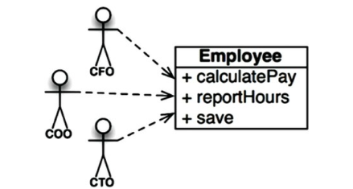

# Chapter 7. SRP: 단일 책임 원칙

- 하나의 모듈은 하나의, 오직 하나의 액터에 대해서만 책임져야 한다.

## 징후 1: 우발적 중복

---

- ex> 급여 애플리케이션의 Employee 클래스 → SRP를 위반. 세 가지 메서드가 서로 매우 다른 세 명의 액터를 책임지기 때문이다.
    
    
    
    7-1. Employee 클래스
    
    - calculatePay(): 회계팀에서 기능을 정의하며, CFO 보고를 위해 사용한다.
    - reportHours(): 인사팀에서 기능을 정의하고 사용하며, COO 보고를 위해 사용한다.
    - save(): DBA가 기능을 정의하고, CTO 보고를 위해 사용한다.

- SRP는 서로 다른 액터가 의존하는 코드를 서로 분리하라고 말한다.

## 징후 2: 병합

---

- 소스 파일에 다양하고 많은 메소드를 포함하면 병합이 자주 발생
    - 특히 이들 메서드가 서로 다른 액터를 책임진다면 병합이 발생할 가능성은 확실히 더 높다.
    - 병합에는 항상 위험이 뒤따르게 된다.

## 해결책

---

- 이 문제의 해결책은 다양한데, 그 모두가 메서드를 각기 다른 클래스로 이동시키는 방식이다.
- 1️⃣ 데이터와 메서드를 분리하는 방식
    
    
    
    7-3. 새 클래스는 서로의 존재를 알지 못한다.
    
    - 장점: ‘우연한 중복’을 피할 수 있다.
    - 단점: 개발자가 세 가지 클래스를 인스턴스화하고 추적해야 한다.
- 2️⃣ 파사드 패턴: [https://wildeveloperetrain.tistory.com/99](https://wildeveloperetrain.tistory.com/99)
    
    
    
    7-4. 퍼사드(Facade) 패턴
    
    - EmployeeFacade: 코드는 거의 없다. 세 클래스의 객체를 생성하고, 요청된 메서드를 가지는 객체로 위임하는 일을 책임진다.
- 3️⃣ 가장 중요한 업무 규칙을 데이터와 가깝게 배치하는 방식
    
    
    
    7-5. 가장 중요한 메서드는 기존의 Employee 클래스에 그대로 유지하되, Employee 클래스를 덜 중요한 나머지 메서드들에 대한 퍼사드로 사용한다.
    

## 결론

---

- 단일 책임 원칙은 메서드와 클래스 수준의 원칙이다.
