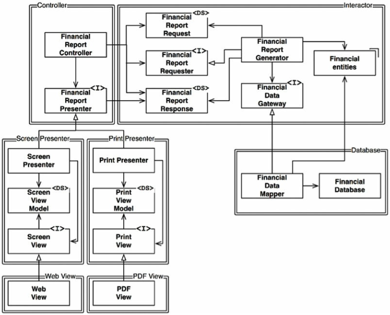

# Chapter 8. OCP: 개방-폐쇄 원칙

- 소프트웨어 개체는 확장에는 열려 있어야 하고, 변경에는 닫혀 있어야 한다.

## 사고 실험

---

- SRP 적용하기
    - ex> 재무데이터 → 재무 분석기 → 보고서용 재무 데이터 → 웹에 표시/프린터로 출력

- 새로 조직화한 구조에서는 행위가 확장될 때 변경이 발생하지 않음을 보장해야 한다.
    - 책임을 분리했다면, 두 책임 중 하나에서 변경이 발생하더라도 다른 하나는 변경되지 않도록 소스 코드 의존성도 확실히 조직화해야 한다.

- 네 가지 컴포넌트
    
    
    
    8-2. 처리 과정을 클래스 단위로 분할하고, 클래스는 컴포넌트 단위로 분리한다.
    
- 모든 컴포넌트 관계는 단방향으로 이루어진다.
    
    
    
    8-3. 컴포넌트 관계는 단방향으로만 이루어진다.
    
- Interactor는 OCP를 가장 잘 준수할 수 있는 곳에 위치한다.
    - 업무 규칙을 포함하기 때문. 애플리케이션에서 가장 높은 수준의 정책을 포함한다.
    - 이외의 컴포넌트는 모두 주변적인 문제를 처리한다.
- 컴포넌트 계층구조를 이와 같이 조직화하면 저수준 컴포넌트에서 발생한 변경으로부터 고수준 컴포넌트를 보호할 수 있다.

## 방향성 제어

---

- FinancialDataGateway 인터페이스
    - FinancialReportGenerator와 FinancialDataMapper 사이에 위치 → 의존성을 역전시키기 위해서
    - 없었다면, 의존성이 Interactor 컴포넌트에서 Database 컴포넌트로 바로 향하게 된다.
- FinancialReportPresenter 인터페이스와 2개의 View 인터페이스도 같은 목적을 가진다.

## 정보 은닉

---

- FinancialReportRequester 인터페이스
    - FinancialReportController가 Interactor 내부에 대해 너무 많이 알지 못하도록 막기 위해서 존재한다.
    - 없었다면, Controller는 FinancialEntities에 대해 추이 종속성을 가지게 된다.

- 추이 종속성을 가지게 되면, 소프트웨어 엔티티는 ‘자신이 직접 사용하지 않는 요소에는 절대로 의존해서는 안 된다’는 소프트웨어 원칙을 위반하게 된다.

## 결론

---

- OCP의 목표는 시스템을 확장하기 쉬운 동시에 변경으로 인해 시스템이 너무 많은 영향을 받지 않도록 하는 데 있다.
    - 이러한 목표를 달성하려면 시스템을 컴포넌트 단위로 분리하고, 저수준 컴포넌트에서 발생한 변경으로부터 고수준 컴포넌트를 보호할 수 있는 형태의 의존성 계층구조가 만들어지도록 해야 한다.
