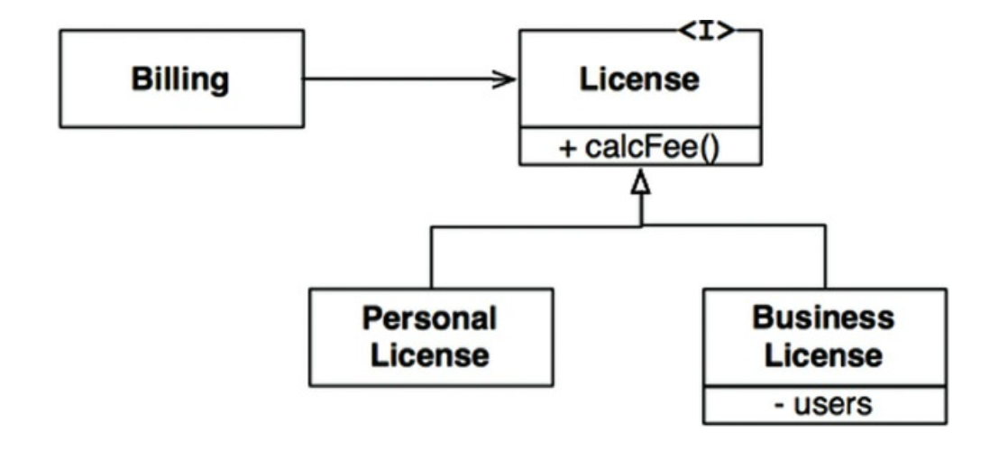

# Chapter 9. LSP: 리스코프 치환 원칙

- 리스코프 치환 원칙
    - S 타입의 객체 o1 각각에 대응하는 T 타입 객체 o2가 있고, T 타입을 이용해서 정의한 모든 프로그램 P에서 o2의 자리에 o1을 치환하더라도 P의 행위가 변하지 않는다면, S는 T의 하위 타입이다.

## 상속을 사용하도록 가이드하기

---

9-1. License와 파생 클래스는 LSP를 준수한다.

- 이들 하위 타입은 모두 License 타입을 치환할 수 있다.

## 정사각형/직사각형 문제

---

9-2. 악명 높은 정사각형/직사각형 문제

- Square는 Rectangle의 하위 타입으로는 적합하지 않음 → LSP 위반
    - Rectangle의 높이와 너비는 서로 독립적으로 변경될 수 있는 반면,
    - Square의 높이와 너비는 반드시 함께 변경되기 때문이다.

## LSP와 아키텍처

---

- 아키텍처 관점에서 LSP를 이해하는 최선의 방법은 이 원칙을 어겼을 때 시스템 아키텍처에서 무슨 일이 일어나는지 관찰하는 것이다.

## LSP 위배 사례

---

- 아키텍트는 이 같은 버그로부터 시스템을 격리해야 한다.
- 또한 아키텍트는 REST 서비스들의 인터페이스가 서로 치환 가능하지 않다는 사실을 처리하는 중요하고 복잡한 매커니즘을 추가해야 한다.

## 결론

---

- LSP는 아키텍처 수준까지 확장할 수 있고, 반드시 확장해야만 한다.
    - 치환 가능성을 조금이라도 위배하면 시스템 아키텍처가 오염되어 상당량의 별도 매커니즘을 추가해야 할 수 있기 때문이다.
