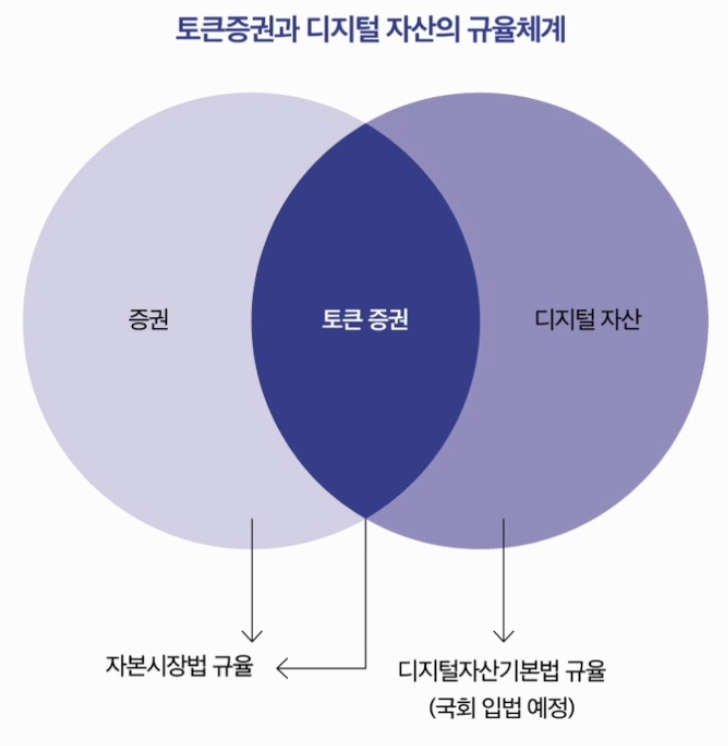

# 1장. 한국형 STO 토큰증권의 개념과 원리

## 1. 한국 STO를 어떻게 알아볼까?

---

- STO(토큰증권)는 나라별로 제도·기술 적용 방식이 다르고, 사업 전개 속도도 차이가 큼.
- STO는 “새로운 금융시장” 성격이 강해서 향후 3~5년간 제도·시장 변화가 많을 가능성이 큼.(2023년 기준)
- 한국형 STO를 이해하고 방향을 예측하려면 아래를 순서대로 봐야 한다는 문제의식:
    1. 2023년 2월 금융위·금감원·거래소·예탁결제원이 발표한 토큰증권 발행·유통 규율체계 정비방안이 한국형 STO의 핵심 기준
    2. 국내 증권사 등 주요 플레이어(사업자)가 어떻게 대응하는지
    3. 미국·일본·싱가포르 등 해외 STO와 비교(제도·시장 구조가 다르므로 단순 비교 금지)
    4. 국가별로 다른 법·제도 장치를 이해해야 한국 STO를 제대로 해석 가능
    5. 한국형 STO의 세무(과세)·자본시장법 관련 쟁점은 변동성이 크므로 지속 확인 필요
    6. 블록체인 기술과 국가별 시스템 차이, 그리고 확장 가능성까지 함께 봐야 함

- 결론: 한국 STO는 금융당국 정책 발표/가이드라인을 꾸준히 추적하는 게 중요하다.

## 2. STO 토큰증권이란?

---

- STO(Security Token Offering) / 토큰증권: 주식·채권·부동산 등 전통 금융자산을 블록체인 기반 디지털 토큰 형태로 발행해 소유·거래를 가능하게 하는 개념.
- 기대효과로 제시된 방향:
    - 자산을 블록체인에 “표현”해 거래 효율성을 높이고
    - 프로세스 투명성/안전성을 강화
    - 기존 금융시스템과 블록체인을 결합해 소유권·거래 관리 방식을 새롭게 만든다
- 코인(가상자산)과의 차이(한국 금융당국 관점 강조):
    - 토큰증권은 발행 단계부터 일정 수준의 자산가치/담보/구조가 갖춰진 상품을 엄격 심사·승인하는 “증권” 성격
    - 반면 초기 코인은 발행·유통 구조가 훨씬 느슨했고 담보/기초자산이 없는 경우가 많음
    - 유통도 정부의 감시·감독 체계 아래에서 이뤄지는 구조
    - 그래서 업비트·빗썸 같은 코인거래소에서 토큰증권을 거래하지 못하게 하고, 코인 시장과 철저히 분리하려는 방향이 나타남

## 3. 한국형 STO 제도 방향

---

- 한국형 STO 시장의 큰 특징(금융당국 발표 검토 결과):
    1. 발행(issuer)과 유통(distribution)을 분리하려는 구조
        - 현재 일부 플랫폼(예: 음원/그림 투자 등)은 한 곳이 “모집-매매중개-정산”까지 모두 하는데,
        - 토큰증권은 투자자 보호를 위해 발행과 유통을 동시에 수행하지 못하게 하는 방향을 검토/강조
        - 대형 증권사가 발행·유통을 모두 하면 신규 진입 기업이 불리해질 수 있어, 시장 참여 기회를 넓히려는 의도도 언급
    2. 토큰증권은 새로운 증권 상품으로서 ‘투자계약증권’ 성격이 중요하게 다뤄짐
    3. 토큰증권을 거래할 별도의 장외거래소(전용 거래 인프라)를 신설하고, 입법·시행령 등을 거쳐 기준에 맞춰 운영한다는 계획

## 4. 금융위원회 발표 한국 STO 구조

---

- 2023년 2월 발표한 정비방안의 핵심 메시지:
    - “증권에 해당하는 디지털 자산”에는 현행 증권 규제(자본시장법 등)를 전면 적용
    - 다만 디지털 자산이 증권인지 판단이 어려운 문제가 있어 증권 여부 판단 원칙을 제시(특히 투자계약증권 적용례 부족 문제)
    - 발표 이후 개별 사안별로 “증권 해당 여부”를 판단하고 후속조치를 진행
    - 디지털 자산 전반은 (자본시장법 + 향후 디지털자산기본법 등)으로 시장 전체 규율체계를 만들어간다는 구도

- “증권” 영역은 자본시장법 규율
- “디지털 자산” 영역은 별도 체계(입법 예정)로 규율
- “토큰증권”은 겹치는 지점으로, 증권 규율을 기반으로 하되 디지털 자산 특성도 고려하는 구조로 설명

## 5. 금융위원회 발표 한국 STO 발행과 유통 구조

---

- 발행(issuer): 토큰증권을 만들고 발행하는 주체
- 계좌관리기관(증권사·은행 등):
    - [1] 분산원장 방식의 계좌관리를 허용(즉, 토큰증권의 계좌/권리 기록을 분산원장 형태로 관리 가능)
- 발행인 계좌관리기관 신설:
    - [2] 요건을 갖추지 못한 발행인이 직접 계좌관리를 못할 때를 대비한 장치로, 발행 측 계좌관리 기능을 수행하는 주체(개념적으로 “발행 단계의 관리 인프라” 보강)
- 총량 관리: 예탁결제원(KSD):
    - 토큰증권의 발행 총량/정합성(중복발행 방지 등)을 관리하는 축
- 유통(거래)
    - 상장시장: 한국거래소(KRX) (대상: 예시로 비금전신탁 수익증권, 투자계약증권 등)
    - 장외시장: 장외거래 중개업자 신설
        - [3] 장외에서 투자자 간 거래를 중개하는 별도 주체를 둠

- 2023년 2월 ‘토큰증권 발행·유통 규율체계 정비방안’의 핵심은 발행과 유통을 “역할 분리”하는 것.
- 미국처럼 한 주체가 발행·유통을 함께 하는 모델도 있지만, 한국은 발행/계좌관리/유통(거래)을 서로 다른 사업자가 맡는 구조를 지향.
- 제도 방향
    - 2023.4.7 국회 세미나에서 금융위 측이 “발행과 유통은 분리” 입장을 명확히 함.
    - 이유:
        - 특정 주체(특히 대형 증권사)의 독점 우려 완화,
        - 시장 투명성 강화,
        - 투자자 보호 목적.
    - 장외거래 중개업자는 신규 라이선스/기준으로 선정·허가.
        - 기존 코인 거래소 업자의 참여는 불허 입장도 언급.

## 6. 금융위원회 발표 한국 STO 상품

---

- STO 대상에 포함되는 증권 유형
    
    
    
    - 정형적인 증권: 주식(지분증권), 채권(채무증권), ELS, DR 등
    - 비정형적인 증권: (비금전신탁) 수익증권, 투자계약증권
        - 비정형: “현재 전통시장에 실무적으로 발행·유통이 활발하지 않았던 형태”로 설명되는 맥락
- 수익증권·투자계약증권을 넣는 의미
    - 다양한 수익사업권/지적재산권/문화콘텐츠 등 “기초자산을 쪼개 투자”하는 구조를 증권으로 제도화하려는 의도.
    - 예시: “회사 주식이 아니라 특정 프로젝트(앨범 등)에만 투자하는 상품” 같은 형태가 가능해짐.
- 투자계약증권 제도화의 목적(감독당국 설명 요지)
    - 현재 시범/샌드박스 형태로 운영되던 조각투자·공동투자를 제도권으로 끌어와
        - 사전 심사(검증·안전장치 확인)
        - 계약/정산 구조 명확화
        - 거래를 통한 환금(회수) 가능성 제고
            
            를 통해 투자자 보호를 강화.
            
    - 제도가 정착될수록 투자자들은 조각투자 상품을 볼 때 “STO로 승인된 구조인지”를 중요한 판단 기준으로 보게 될 가능성이 큼.
    - 시장 기대 효과로는, 기존엔 기관/전문투자자 중심이던 ‘좋은 조건의 투자 기회’가 개인 투자자에게도 확대될 수 있다는 언급.

## 7. 토큰증권 생태계

---

1. STO 기초자산(토큰화 대상 실물/권리)
    - 부동산, 미술, 음원, 저작권 등 실물 가치가 있는 자산.
    - 유동화가 어렵고 접근성이 낮았던 자산일수록, 이를 발굴·구조화하는 자산 소싱 역량이 중요해진다고 봄.
2. 토큰증권 발행사(발행 프로토콜/플랫폼)
    - 블록체인 기반 네트워크(메인넷)·프로토콜(규칙)을 구성하고 실제 토큰을 발행.
    - 실물 기반 자산은 법적 정의/권리관계가 중요하므로,
        - KYC(고객확인), AML(자금세탁방지) 등 준법 기능을 담을 수 있는
        - 적합한 검증인/노드 구성 같은 인프라가 중요해질 수 있다고 설명.
3. 토큰증권 유통 플랫폼(2차 거래)
    - 발행된 증권형 토큰이 거래되는 시장 인프라.
    - 국내는 투자매매/중개업자 라이선스 보유 주체 중심으로 제한하는 방향(전통 금융권 준하는 기능 요구).

## 8. 수익증권, 투자계약증권

---

- STO 대상의 수익증권·투자계약증권은 현재 시장에서 다양한 형태로 나타나는 ‘조각투자’ 상품을 증권으로 정리하는 축.
- 지금은 법규상 형태가 명확히 고정되지 않아 샌드박스/시범 형태로 운영되던 것들이 많았음.

- 당국이 보는 쟁점/사례
    - 예: 음원 조각투자처럼 “권리 구조가 지적재산권 전체 소유인지/수익참가인지”가 불명확하면 제도권 편입 과정에서 검토/제한이 발생할 수 있음.
    - 방향: 검토 후에는 제도권 안으로 편입해 투자자 보호 장치(심사, 기준, 공시/계약 구조 등)를 갖춘 형태로 운영.

- 감독·심사 쪽 메시지
    - 2023.8.10 금융감독원에서 투자계약증권 관련 업무 교육/심사 체계를 다루며,
        - 신청·주요 심사 기준,
        - 법률 검토 의견서,
        - 피해대책 등
        - 심사 비용/기간 등의 요소가 언급됨.
    - 실무 담당자 메시지 요지: 투자자 안정성을 최우선 과제로 둔다.

## 9. 디지털 자산의 증권 판단 예시

---

- 증권에 해당할 가능성이 높은 경우
    - 사업 지분·배당·잔여재산 분배 같은 권리가 붙는 경우(지분증권 성격)
    - 일정 기간 후 원금 상환처럼 채무 관계가 있는 경우(채무증권 성격)
    - 신탁의 수익을 받을 권리가 있는 경우(수익증권 성격)
    - 기초자산 가격/지표 변동에 연동해 정해진 산식대로 지급(파생결합증권 성격)
    - 새로 발행될 증권을 청약·취득할 권리가 붙는 경우
    - 다른 증권에 대한 계약상 권리/지분 관계가 있는 경우(예: DR 등 유사 구조)
    - 특히 투자계약증권 판단 관련:
        - 발행인이 투자자 자금으로 사업을 수행하고, 그 결과 수익을 투자자에게 귀속
        - 투자자가 받는 금전이 ‘노동의 대가’처럼 보이더라도 실질이 사업성과에 연동된 분배이면 증권 가능성↑
        - 투자자 모집 단계에서 발행인의 노력·경험·능력을 강조하며 성공/수익을 약속하는 구조면 더 증권 가능성↑
- 증권에 해당할 가능성이 낮은 경우
    - 발행인이 없거나, 투자자 권리에 대응하는 의무 이행 주체가 없는 경우
    - 디지털 자산에 표시된 권리 자체가 없거나, 사업 수익에 대한 권리가 없는 경우
    - 재화/서비스 이용(소비) 목적(현재 또는 미래 사용권)으로 발행·사용되는 경우
    - 지급결제/교환 매개로 쓰이지만 가치 안정화 목적이고 상환 약속이 없는 경우(가치저장/교환 목적)
    - 투자자가 사업 운영에 일상적으로 참여해 정보비대칭이 거의 없는 경우
    - 투자자가 사업 성패를 좌우하는 역할/용역을 제공하고 그 대가만 받는 경우(투자라기보다 용역)
    - 실물 자산에 대한 공유권 표시 정도만 있고, 발행인의 가치상승 기여·이익 귀속 약정이 없는 경우

- 핵심 요약: “권리(지분/상환/수익분배/연동지급)가 있느냐”, “수익이 내 노력보다 발행인 사업성과에서 오느냐”가 갈림길.

## 10. 토큰증권과 코인의 차이

---

- STO(토큰증권)
    - 기존 금융자산(주식, 부동산, 각종 권리 등)을 블록체인으로 토큰화해 발행하는 증권형 디지털 자산
    - 일반적으로 규제기관 감독을 받고, 투자자 보호/규제 준수를 전제로 설계됨
- 코인(Coin)
    - 특정 블록체인 네트워크/플랫폼에서 사용되는 디지털 화폐/자산
    - 주로 지불 수단, 네트워크 사용(수수료), 교환 등 목적
    - 한국 제도 설계에서는 코인 시장과 STO 시장을 유통 인프라까지 분리하려는 기조가 강함.(코인거래소와 STO 거래가 겹치지 않도록)
- (참고) 스위스 FINMA 분류 언급의 의미
    
    
    
    - 해외 분류에서 “자산형 토큰”은 STO와 유사할 수 있지만,
    - 한국은 발행 단계부터 제도적으로 구분하고 유통 구조도 다르게 가져갈 수 있다는 점을 강조.

## 11. STO 관련 주요 개정 법안

---

- 한국형 STO를 제도화하려면 법 개정이 필요하다는 설명.
- 큰 틀은 “완전히 새 법을 만든다”라기보다, 아래를 통해 제도에 편입하는 흐름.
    - 자본시장법 일부 개정(발행·유통 규율 반영)
    - 토큰증권을 위한 전자증권법(또는 전자등록 관련 체계) 개정
- 유통 측면에서도 자본시장법 개정 + 장외거래중개업자 신설(시행령 등 하위규정 포함) 같은 절차가 필요.
- 다만 당시 기준으로는 장외거래중개업자 허가 요건(시설/규모/인력 등)은 구체 발표 전이라는 언급.
- 정책 메시지로는 “중소기업 등도 참여 기회를 주겠다”, “기존 코인 거래소는 허가하지 않을 것” 같은 발언이 포함됨.

- 발행: 토큰증권 수용, 발행인 계좌관리기관 도입, 전문투자자 사모, 소액공모 제도 손질, 공모 간주 관련 규정 등
- 유통: 투자계약증권 유통 제도 적용, 장외거래중개 인가 신설, 소액투자자 매출공시 면제, 디지털증권시장 신설 등
    
    → 각각이 자본시장법/시행령/전자증권법/하위규정 개정과 연결됨
    

## 12. STO 관련 제도화 및 법안 진행상황

---

- 정책 발표 → 관련법 정비 → 감독·심사 체계 준비 → 실제 승인 사례 등장
    - 2023.2 금융위·금감원·KRX·KSD: 토큰증권 발행·유통 규율체계 정비방안 발표
    - 가상자산 이용자 보호법 제정(2023.7 제정, 2024.7 시행)
        - STO 법은 아니지만 디지털자산 규율 정비 흐름의 배경으로 같이 언급됨
    - 2023.8.1 금감원: 투자계약증권 발행 대비 공시·심사체계 개편 및 토큰증권 발행 기준 관련 안내
    - 2023.8.10 금감원: 금융/관련 업계 대상 실무·제도 설명/교육
    - 2023.7~ 토큰증권 관련 입법예고/개정안 발의(전자등록/전자시장법 등):
        - 분산원장 기반 발행인 계좌관리기관 정의·등록요건
        - 투자계약증권 유통규제, 장외거래, 투자한도 등
    - “현재는 실물발행 또는 법적으로 인정되는 방식으로만 발행 가능”이라는 전제
    - 실제 승인/진행 사례(투자계약증권 중심)가 등장:
        - 2023.12 미술품 투자계약증권 발행 승인 및 청약 진행
        - 2024.1 추가 승인 예정/사례(미술품 등) 언급

- 결론: 개정안 통과 전에도 감독당국·거래소 등이 개정안 통과 후를 대비한 실질 준비를 진행 중

## 13. 발행인 계좌관리기관 허가 기준

---

- 토큰증권 유통 체계는 기존 제도권 증권시장 수준의 규제 요건이 적용될 전망.
- 금융당국이 채권중개전문회사 등 기존 사례를 참고해 유통 사업자 인가요건을 정할 가능성이 크고, 결과적으로 증권사 등 인프라를 가진 기존 사업자가 유리할 수 있다는 관측.
- 발행인 계좌관리기관(안) 요건
    
    
    

- 핵심 요약: 발행인이 직접 등록/관리하려면 분산원장·인력·배상·총량관리 체계를 갖춰야 한다.

## 14. 장외거래중개업 허가 기준

---

- 토큰증권 발행 체계의 핵심 중 하나가 ‘발행인 계좌관리기관’ 도입이고,
- 토큰증권은 일정 요건을 갖춘 발행인이 직접 증권을 등록할 수 있게 되는 방향.
    
    → 기존 조각투자 플랫폼 등도 발행을 하려면 계좌관리기관 라이선스가 필요해질 수 있음.
    

- 장외거래중개업 요건(안)
    
    
    
    
    
- 업무기준
    - 중개신청/취소/정정 절차
    - 체결 원칙, 착오매매 정정
    - 체결내역 통지, 기록 작성·유지
    - 발행인 현황 공시, 불량회원 제재
    - 이상거래 적출 기준 등

- 핵심 요약: “장외거래소/중개는 ‘거래소처럼’ 운영하되, 이해상충·리스크를 강하게 통제한다.”

## 15. 한국 STO 사업 성공 요건들

---

1. 신규 증권 상품 발굴
    - 장기적으로 영화/엔터/미술품 등 다양한 상품군 필요
    - 기존 조각투자사와 제휴 또는 협업 강화
    - 유망한 자산 보유사 발굴 및 제휴를 통한 상품 발굴
2. 경쟁력 있는 파트너 제휴
    - 발행사 관점: 유통사/계좌관리기관/기술회사 등과 협력
    - 유통사 관점: 자산보유사/발행사/기술사/증권사/은행 등과 협력
    - 혁신금융서비스, 글로벌 진출 등 장기 전략을 공유할 파트너십 구축
3. 유동성 확보를 위한 적극적 협력
    - 발행사: 발행한 상품이 유통시장에서 활발히 거래되어 현금화가 잘 되게 해야 추가 발행이 가능
    - 유통사: 초기에는 회원(투자자) 확보가 거래소 가치와 시장 점유의 핵심 자산
4. 지속적인 전문 기술회사 제휴
    - 대용량 거래, 개인정보 보호, 해킹 방지, 거래 신뢰성 등 안정성 기술
    - 상품/계약 형태별로 다른 정산(수익배분 등)을 처리할 정산 시스템과 회계·기술 역량

## 16. 전통적인 증권과 토큰증권의 차이

---

- 증권은 회사/정부가 자금 조달 또는 투자기회 제공을 위해 발행하는 금융상품(주식·채권·파생 등).
- 토큰증권도 본질적으로는 증권과 동일하게 발행–거래–결제/정산 절차를 거치며,
- 차이는 “형태/기술”:
    - 전통 증권은 전자증권 등 기존 인프라에서 기록·이전
    - 토큰증권은 실물 토큰이 따로 없고, 발행·거래 기록이 분산원장 네트워크에서 처리됨
- 규제는 원칙적으로 자본시장법상 동일 규율을 받으며 위반 시 처벌 가능.
- 또한 투자자 보호 관점에서 발행 규모/유통 단계의 투자한도는 중요한 변수이고, 구체 수치는 논의·조정 여지가 남아 있다는 뉘앙스.

## 17. 기존 증권과 토큰증권의 비교

---

- 1차 발행
    - 발행
        - 기존: 발행인이 발행 규모 결정, 주관사가 발행 주관
        - 토큰증권: 발행인이 발행 규모 + 발행 플랫폼사 결정 / 발행 플랫폼이 발행 주관 역할
    - 청약·배정
        - 기존: 투자자가 주관사 계좌로 공모 청약, 주관사가 배정
        - 토큰증권: 투자자가 공모가로 청약(적격투자자 중심 허용 등 검토)
            - 발행플랫폼이 스마트계약 등으로 배정 수행
    - 명의 변경
        - 양쪽 모두: 명의개서대리인이 주주명부 관리·기록
- 2차 시장
    - 주문·체결
        - 기존: 거래소 상장 증권을 브로커-딜러 통해 주문
        - 토큰증권: 발행 플랫폼에서 거래 플랫폼으로 토큰 연결
            - 거래 플랫폼(ATS 등)에서 상장/관리, 투자자는 ATS에서(브로커-딜러 통해) 주문
    - 청산
        - 기존: 중앙청산소를 통한 청산, 소유변동내역 장부에 기록
        - 토큰증권: 중앙청산소를 통한 청산, 소유변동내역 분산원장에 기록

## 18. STO 시장에 대한 증권사 견해

---

- 증권사가 STO에 관심이 큰 이유
    - 핵심 동기는 플랫폼(증권사 비즈니스) 활성화.
    - 코인 시장 열기 때 고객이 가상자산 거래소로 이동하면서 증권사가 고객을 일부 잃었고, STO가 이를 되돌릴 새 투자상품/새 시장이 될 수 있다고 봄.
    - 특히 증권사 입장에서는 미래의 핵심 고객인 20~30대를 조기에 확보해야 하는데, 최근 몇 년간 이 연령대가 학생 때부터 가상자산 거래소로 유입되는 경향이 있어 STO가 대안 상품이 될 수 있다는 분석.

- 현장 의견 공통점(요약)
    1. 모든 증권사가 STO 사업에 참여해야 한다는 분위기
    2. 법무팀 중심으로 STO 사업을 검토하는 곳이 많음(규제/법적 리스크가 핵심)
    3. 블록체인+IT 결합 사업이라 수익성/비즈니스 모델 예측이 어렵고, 내부 시스템을 갖춘 실질 투자는 아직 미정인 곳이 많다
    4. STO 시장 대비를 위해 다양한 협의체를 MOU 형태로 준비 중
    5. STO 관련 스타트업 지분 투자/인수도 진행되는 흐름

## 19. 증권사의 STO 활동 현황

---

- 2023년 상반기 기준, KB증권·NH투자증권·신한투자증권 등 대형사가 중심이 되어 협의체/얼라이언스/비전그룹 형태로 파트너를 모으는 전략이 두드러짐.
- 협의체의 목적은 대체로
    - 안전한 자산의 토큰화,
    - 참여 기업 확대,
    - STO 발행 비용 절감,
    - 자금 모집 기회 제공,
    - 유통 솔루션·블록체인 컨설팅/연동 지원 등.

- 증권사 STO 활동 현황
    
    
    
    - 신한투자증권: ‘STO 얼라이언스’ 구성(가장 먼저 시작한 사례로 언급)
    - NH투자증권: ‘STO 비전그룹’ 출범
        - 조각투자 사업자(투게더아트, 트레저러 등), 비상장주식중개업자(서울거래비상장), 블록체인 기술 기업(블록오디세이, 파라메타), 실물평가사(한국기업평가) 등 참여 언급
    - KB증권: ‘ST 오너스’ 구성
        - 참여사: 스탁키퍼(한우), 서울옥션블루(미술품), 펀더풀(공연/전시), 하이카이브(실물자산 기반 STO 플랫폼), 웹툰올, 알엔알(영화 콘텐츠) 등 + 기술기업(SK C&C, EQBR, 하이파이브랩, 웨이브릿지) 등
    - 그 외 흐름
        - 한국투자증권: 카카오뱅크·토스뱅크와 ‘한국투자 ST 프렌즈’ 구성 등
        - 키움/대신/하나 등도 조각투자 플랫폼 투자, 업무협약, 인수 추진 등 언급
        - 표에는 추가로 미래에셋(디지털자산 TF, 신탁사 협약), 한화(파트너십), SK/유진(협업) 등이 정리돼 있음

## 20. 투자계약증권 신청서 작성

---

- 2023.8.10 금감원 ‘투자계약증권 발행·심사 설명회’ 내용을 정리한 파트.
    1. 조각투자(뮤직카우·미술품·한우 등)는 투자계약증권으로 판단하는 방향
    2. 증권신고서는 서면 접수 불가, 전자(다트/DART)로만 제출
    3. 제출된 신청 건에 대해 주로 보는 것
        - (1) 공동사업구조 등 투자계약 해당 여부 자체 검토
        - (2) 다른 증권 형태로 발행 가능한지 검토
        - (3) 투자자 보호체계 구축 여부 검토
    4. 심사 포인트
        - 형식 적합성, 중요사항 누락 여부
        - 기재 내용의 허위 여부
        - 특히 투자자 보호 관련 기재를 중심으로 심사
        - 자진정정/정정요구/서식 미준수/중요사항 누락 등이 있으면 청약 일정이 지연될 수 있음
    5. 투자자 보호를 위한 작성 지침(중요 항목)
        1. 소유권자임을 법적으로 입증하는 방법 + 기초자산 보관 위치 확인 방법
            - 도산 위험에 대해 법적 절연(도산절연) 여부와 미비 시 발생 가능한 투자위험을 상세 기재
        2. 투자자 예치금은 외부 금융기관의 투자자 명의 계좌에 별도 예치/신탁 등 관리 방식 기재
        3. 유통시장은 중선위 결정에 따른 시장 폐쇄 및 폐쇄 시 투자자 보호방안 기재
        4. 가치평가법, 투자위험, 매각기간 등 투자 판단 핵심정보를 신고서에 적정 기재 + 발행인의 광고 기준 기재
        5. 발행사/공동사업자 과실로 손실 발생 시 피해보상 체계(손해배상 지급 기준 등) 기재
        6. 사업 중단/부도/폐업 대비: 독립된 제3자가 자산 보관·관리·처분·청산을 수행하는 체계 등 구체 기재
        7. 1~6 관련해 업계 표준안/가이드라인(유사 기준 포함) 제시

## 21. 투자계약증권 신청 시 중요 포인트

---

1. 객관적 가치평가에 기반한 공모가격 산정
    - 원칙: 외부평가기관(회계법인, 감정평가법인 등)의 가치평가(발행인 평가에 대한 2차 검증 포함)를 거쳐 공모가 결정
    - 기초자산 특성상 예외적으로 내부평가를 했다면 사유와 타당성을 상세 기재
2. 가치평가의 객관성·전문성 근거 제시
    - 내부 전문인력, 평가 근거, 외부 검증 내역, 신뢰 가능한 통계자료 등 제시
        - ex> 소 조각투자처럼 시세 변동이 크면 몇 년치 시세 반영
3. 변호사 법률검토의견서 필수
    - 투자계약증권 해당 여부
    - 공동사업구조의 적법성/법률 리스크
    - 신고서 기재 내용(계약·배분 등)이 관련 법규 및 계약서류와 부합하며 진실·정확하다는 의견을 요약 기재 + 전문 첨부
4. 사업 중단·부도·폐업 대비 구제방안이 핵심 심사 기준
    - 이런 상황을 대비한 계약 내용이 정리돼 있는지,
    - 실현 가능성이 있는 방식인지가 중요하며,
    - 관련 내용이 변호사 의견서에도 포함돼야 한다는 취지

## 22. 열매컴퍼니 1호 투자계약증권

---

- 승인/모집 시작: 2023년 12월 15일, 미술품 투자계약증권 발행을 위한 증권신고서 승인 → “투자계약증권 1호” 투자금 모집 진행.
- 기초자산(투자 작품): 쿠사마 야요이 〈호박〉(2001년작)
- 모집 조건
    - 모집금액: 12억 3,200만 원
    - 주당 공모가: 10만 원
    - 개인 청약한도: 300주
    - 청약기간: 2023년 12/18 ~ 12/22
- 청약 결과
    - 청약률: 650.23%
    - 목표액(12.32억)은 청약 개시 1시간 만에 달성
    - 총 청약신청: 72억 980만 원(7만 2,098주)
    - 경쟁률: 6.5 : 1
    - 최소 40만 원(4주) 이상 신청 시 1주 배정 가능
- 후속 승인 대기 상품(2024년 1월 기준 언급)
    - 서울옥션블루(그림) 7억
    - 투게더아트(그림) 11억 1,820만
    - 스탁키퍼(송아지) 8억 6,680만
- 한계/시사점
    - 당시에는 발행만 가능(2차 유통 인프라 부재) → 배당이나 기초자산 매각 외에는 투자자 수익 실현 경로가 제한
    - 향후 STO 장외거래소가 운영되면 정산 방식 다양화, 가격상승 차익, 정산 전 현금화(유동성) 가능성이 열릴 수 있음

## 23. 1호 투자계약증권 신청 서류 내용과 구성

---

- 서류 분량: 약 300쪽
- 큰 구성
    1. 증권신고서 + 대표이사 확인 등
    2. 제1부: 모집/매출 관련 일반사항
    3. 제2부: 발행인 관련 사항(회사/재무 등 회계보고서 성격)

- 제1부(모집/매출) 핵심 기재 항목
    1. 공모개요, 공모방법, 공모가 결정방법, 모집/매출 절차, 인수 관련
    2. 증권의 주요 권리 내용
    3. 투자위험요소(사업위험/회사위험/기타위험)
    4. 인수인의 의견(분석기관의 평가의견)
    5. 자금의 사용 목적
        - 자금의 사용 목적/비용 신고 내용
            
            
            
    - 그 밖에 투자자 보호를 위한 필요 사항

## 24. 한국 STO 시장의 예측 문제와 해결 과제

---

1. 블록체인 기술 특성을 반영한 토큰증권의 발행·유통 절차/세부규제 정비 필요
    - 금융위 발표는 과거 “한 업체가 코인 발행·유통을 동시에 관리”하며 생긴 문제를 의식해 발행과 유통의 분리를 명확히 함.
        
        → 다만 이로 인해 예결원 관여 확대에 따른 비효율/고비용 같은 부작용 가능성도 있어 대응방안이 필요하다고 봄.
        
    - 투자위험 공시/규제 기준이 과도하게 엄격하면 시장 형성이 막혀 활성화에 약점이 될 수 있음.
    - 예탁결제원(KSD)의 선관주의 의무 내용·수준을 규정할 필요.
    - 토큰증권의 선의취득(개인키 탈취 등) 이슈에 대한 해결방안 등 지속적인 제도 보완 필요.
    - 토큰증권의 저가 증권화 시 투기적 요소(‘Penny Stock Rule’ 같은 문제) 및 주체별 책임 이슈 대비.
    - 시장이 커질수록 증권성 판단 심사/공시 방안도 더 체계적 관리장치가 필요(안정적·투명한 시장을 위해).
2. STO 자금조달 효율성 + 투자자 보호 강화를 위한 제도적 정비 필요
    - 자본시장법·전자증권법 체계 안에서 STO의 취지와 기술적 특성을 반영한 제도 설계가 필요.
        
        (토큰증권이 전자증권보다 더 다양한 기술 기능을 담을 수 있으니 제도적 가이드/유도 필요)
        
    - 비효율적 미러링 방식을 피하기 위한 법·제도 정비 필요.
    - 개인 투자한도/범위 제한은 초기 금융위 가이드가 있으나, 시장 형성에 영향이 커 재논의 중(한도가 너무 낮으면 시장 형성 제약).
    - 자본시장법상 발행공시(증권신고서 제출) 및 부정거래행위 규정, 사업자 규제, 유통공시 규제의 적용 방안 마련 필요.
    - 예치/신탁 등 투자자 보호 장치를 시스템적으로 갖추는 방안 필요.
    - KRX(한국거래소) 디지털자산 시장으로 토큰증권을 이관할 때 생기는 기술·제도 이슈도 계속 검토 중이며, 최종안 도출엔 시간이 필요 → 지속적 연구 필요.

## 투자계약증권 주요 Q&A

---

- 금감원 2023.8.10 설명회 요지
1. 투자계약증권 실물 발행이 반드시 필요한가?
    - 필수 아님. 법령상 실물증권 발행은 의무가 아니고, 미발행(무권화) 상태여도 투자계약서·공증 등으로 투자자 권리 확인 가능.
    - 오히려 실물은 용지/규격 표준 부재로 위·변조 우려, 업체별 형식 차이로 투자자 혼란 가능성이 있어 주의.
2. 발행 시 배정 방식에 제한이 있는가?
    - 조각투자 특성(소액 다수, 공동소유권 부여)상 선착순/비례배정처럼 소수에게 집중될 수 있는 방식은 부적절.
    - 1인당 투자한도 등 집중 방지 장치 마련이 바람직.
3. 발행 시 청약기간에 제한이 있는가?
    - 청약기간은 자율 설정 가능.
    - 다만 너무 장기로 잡으면 청약기간 중 기초자산 가치 변동, 결산기 도래로 인한 추가서류 제출 이슈가 생길 수 있어 고려 필요.
4. 발행시점이 달라도 동일 신고서에 여러 건을 포함할 수 있나?(= 기초자산 종류가 같으면 동일 신고서 가능?)
    - 기초자산 개별 특성 외 투자위험 기재 등 핵심 내용이 같고 투자자 오해 우려가 없으면 가능.
    - 예시
        1. 동일 미술가의 다른 작품들을 한 신고서 안에서 각각 투자계약증권으로 발행 가능(발행시점 달라도 가능)
        2. 기초자산 종류가 동일하고 투자자 보호상 우려가 없으면 동일 신고서 제출 가능
        3. 투자자 혼동을 줄이기 위해 동일 신고서 내 합산 발행은 5개 이하가 바람직
5. 기초자산이 물건에만 한정되나? 채권적 청구권도 가능한가?
    - 무조건 가능하진 않음.
    - 해당 권리가 도산절연 등 요건을 충족하여 투자계약증권으로 인정될 수 있는 구조여야 함.
6. 사업운영인력과 투자자보호 인력의 겸직은 가능한가?
    - 발행인 임직원 겸직에 대한 사전적 일률 규제는 없음.
    - 다만 겸직으로 이해상충이 있다고 판단되면, 이해상충 가능성과 관리방안(통제/분리 등)을 공시해야 함.
7. 발행인이 내부전문인력으로 자체평가를 한 경우 2차 검증은 필수인가?
    - 원칙: 2차 검증은 필수이며 외부기관이 수행해야 함.
    - “외부 자문위원이 포함된 내부 심의위원회”는 외부기관으로 보지 않음.
    - 다만 신뢰성 높은 공공/국가·공공기관 관리 통계자료 등 객관자료가 있으면 예외적으로 외부검증 요구가 완화될 수 있다는 취지(예: 한우 관련 공신력 자료).
8. 외부감사보고서는 어떤 기준으로 제출?
    - 기본적으로 주식/채권 증권신고서의 외부감사보고서 첨부 기준과 동일.
    - 최근 사업연도 감사보고서 등, 결산/반기 시점 경과 시 필요한 추가 보고서가 달라질 수 있음.
9. 감사보고서 외에 추가 첨부서류가 있나?
    - 주관이 있는 경우: 주관회사의 주의의무 이행서류도 첨부 필요.
    - 그 외 기본 첨부서류(정관 등)는 DART 첨부서류 목록에 따라 반영.
10. 분·반기 검토보고서는 어떤 기준으로 제출?
    - 증권신고서 제출 후 청약일 전에 분·반기 검토보고서가 확정되면 정정신고서로 추가해야 함.
    - 분·반기 재무제표 확정기한은 결산일 후 45일이므로, 청약일 기준으로 45일을 넘기면 해당 검토보고서 추가가 사실상 필요
    - 제출일/청약일에 따라 필요 여부 예시
        
        
        
11. 청약금(또는 청약증거금) 보관계좌도 발행인과 도산절연이 필요한가?
    - 예치금 계좌와 마찬가지로 청약금 보관계좌도 도산절연 구조를 갖추는 것이 증선위 결정 취지에 부합.
12. 수수료가 향후 발생/변동 가능하면 “추후 결정/변동 가능”으로 적어도 되나?
    - 원칙: 신고서 제출 시점에 수수료는 확정하여 기재하는 것이 바람직.
    - 다만 투자자 동의 절차 등을 거쳐 업무방식 변경으로 일부 수수료가 변동될 수 있으면, 변동 가능성과 사유를 기재할 수 있음.
13. 과세 관련 기재는 어느 수준으로 해야 하나? (사례/유권해석 불확실)
    - 유사 성격의 펀드 신고서/투자설명서의 과세 기재 수준을 참고.
    - 유권해석 전 제출이 불가피하면
        - 유사 사례, 세무자문 결과 등으로 합리적 예측 정보 제공
        - 향후 유권해석 결과에 따라 과세가 달라질 수 있음을 고지
14. “도산절연이 제대로 안 될 때의 위험을 기재”하라는 건 도산절연이 필수는 아니라는 뜻?
    - 아님. 도산절연 장치는 반드시 필요.
    - 위험기재 요구는 투자자에게 도산절연의 중요성, 법적 유효성 검토 필요성을 알리라는 취지.
15. 분쟁처리기구에 외부 전문위원이 포함돼야 하나?
    - 분쟁처리기구는 상설조직이 아니라, 자체 해결이 어려운 사정이 있을 때 구성하는 성격 → 외부 전문가 포함이 바람직.
    - 회사 사외이사는 외부 전문위원으로 보기 어렵다는 취지.
16. 공동사업자 범위는 어디까지 포함?
    - 발행인 외에도 공동사업 목적 달성을 위해 위탁 형태 등으로 업무를 담당하는 회사 등이 포함될 수 있음.
    - 다만 투자계약증권 특성과 무관하게 일반 증권업무를 지원하는 기관(예: 청약증거금 관리기관)은 포함 필요 없음.
17. 공동사업구조 관련 법률관계 기재 수준은?
    - 투자계약증권의 비정형성을 고려하면 핵심사항에 해당.
    - 민법 등 권리·의무관계의 근거가 되는 법률조항/관련 판례 등을 근거로 상세히 기재하고, 필요 시 소관부처 유권해석 요청도 고려.
18. 법률 준수를 위해 신고서 기재를 생략할 수 있나?
    - 기초자산/개인정보 등 관련 법률이 허용하는 범위 내에서, 투자자에게 최대한 충실한 공시정보를 제공해야 함(투자자 보호 우선).
    - 필요 시 소관부처 유권해석 요청 고려.
