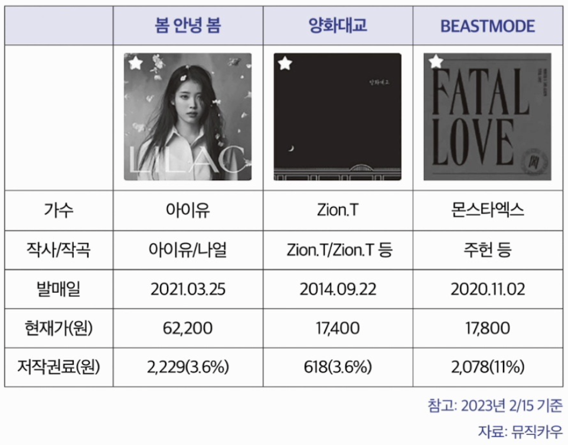

# 2장. STO 토큰증권 국가별 동향

## 1. STO 뮤직카우(비상장)

---

- 2016년 설립, 세계 최초 음악 저작권 거래 플랫폼.
- 음악저작권뿐 아니라 B2C 포함 대체자산 플랫폼 중 초기 이용자/규모가 큰 편이라는 포지션.
- 2022.3 금융당국이 투자계약증권으로 판단 → 2022.9 혁신금융서비스 지정, 샌드박스(사업재편) 기간을 거침.
- 향후 수익증권 형태로 음악저작권 발행·유통, 기존 발행분도 수익증권 형태로 전환/발행 방향.
- 음악저작권은 거래/현금흐름 데이터가 풍부해서 STO 요건에 맞는 자산군이고, 뮤직카우는 제도 정착의 “기준 사례”가 될 가능성을 시사.
    
    <aside>
    💡
    
    2025~2026 현황: 뮤직카우는 국내 조각투자 종목의 98%, 거래대금의 73%를 점유(1,100여 종목, 누적 거래액 4,000억원+). NXT 컨소시엄(넥스트레이드 주도)에 합류하여 2026.2.13 장외거래중개업 예비인가 선정됨. NXT는 2026년 4분기 시장 개설 목표
    
    </aside>

## 2. 뮤직카우 주요 수익원

---

- 조각투자 플랫폼에서 발생하는 수수료
- 뮤직카우가 저작권을 매입해 수취하는 저작권료 수익
- 장기적으로 음악저작권 기반 금융상품으로 확장 계획
- 2022년 설립한 현지 자회사를 통해 미국 확장 준비 언급

## 3. 뮤직카우 최근 투자처와 주요 주주

---

- 투자유치 타임라인
    - 2018.08 Pre-A
    - 2019.01 시리즈 A(하나금융투자 등)
    - 2020.05 시리즈 B(LB인베스트먼트 등, 70억)
    - 2021.06 프리 시리즈 C(한국산업은행 등, 240억)
    - 2022.04 시리즈 D(스틱인베스트먼트 등)
    - 2022.08 시리즈 D(키움증권)
- 주요 주주: 키움증권, 스틱인베스트먼트, 한국산업은행, LB인베스트먼트, 한화자산운용 등

- 뮤직카우 공모상품 사례
    
    
    
    - 투자 대상이 “음원 저작권”이고 수익원은 저작권료 현금흐름이라는 점을 직관적으로 설명.

## 4. STO 루센트블록(비상장)

---

- 2018년 설립, 부동산 수익증권 조각투자 플랫폼(‘소유’).
- 부동산 관리서비스까지 포함해 부동산 종합금융 솔루션 지향.
- 2021.4.14 혁신금융서비스 지정.
- 라이선스 확보 + 전자증권법 하 안전 관리 구조를 “초기부터” 구축했다는 설명.
- 계좌관리기관(하나증권), 신탁(하나자산신탁) 등과 협력 + 자체 플랫폼 분산원장에 거래정보 저장, 예탁원에도 동시 저장하는 ‘블록체인 미러링’ 방식 적용.
- 조각투자 “발행·처분” 중심 모델과 달리, 자체 기술/노드 운영 등으로 미래 STO 환경(탈중앙화)에 대비한다고 강조.
- 조각투자 외에도 컨시어지/부동산 관리 솔루션(예약, 임대료/관리비 납부, 관리시스템 등) 운영 → 축적된 데이터를 공모 부동산 선정 등에 활용해 기초자산 전문역량 내재화 계획.
    
    <aside>
    💡
    
    2026.2.13 장외거래중개업 예비인가 심사에서 루센트블록은 탈락(653점). KDX(725점)·NXT(750점)에 선정. 탈락 사유: 자기자본 부족, 비상자금 조달계획 실현 가능성 불투명, 최대주주·특수관계인 지분 51%로 개인 대주주 회사 성격. 루센트블록은 NXT 컨소시엄의 기술탈취 의혹을 제기했으나, 금융위는 객관적 근거 부족으로 판단(공정위 행정조사 개시 시 NXT 본인가 심사 중단 조건 부여)
    
    </aside>

## 5. 루센트블록 최근 투자처와 주요 주주

---

- 2020.04 Pre-A(서울대학교기술지주 등)
- 2022.03 시리즈 A(하나증권 등, 170억)
- 주요 주주(이미지 기재): 캡스톤파트너스, 한국투자증권, 쿼드자산운용, 하나증권 등

- 루센트블록 공모상품 사례
    
    
    
    - 기초자산이 부동산이고 투자 매력은 배당(임대수익 등) 기반 수익률로 제시된다.

## 6. STO 열매컴퍼니(비상장)

---

- 2016년 설립, 대표 미술품 플랫폼. 2018년 공동구매(조각투자) 플랫폼 ‘아트앤가이드’ 런칭.
- 2022년 매출 약 290억, 영업이익률 10% 추정(이미지 기재).
- 매출원:
    - 절반: 아트앤가이드
    - 절반: 미술품 딜링(직접투자) 차익 + 미술품 담보대출(확장 사업)
- 특징적 수익모델: 아트앤가이드 공모·처분 시 수수료를 별도로 받지 않고, 선매입 작품의 지분 5~10%를 자기자본 투자 후 나머지를 공모 → 결과적으로 차익/성과로 수익 창출.
- 안정적 수익을 위해 미술품 가격 산정 능력이 중요하며, 미술품 전문성 기반 자체 AI 프로그램을 활용해 가격 산정 및 매입/매각을 수행한다고 설명.
- STO/담보대출 등으로 미술금융 시장이 커지면 시장 확대 → 미술금융 성장의 선순환 기대.
- 미술품 시장이 폐쇄적이고 금융 결합이 낮았던 점이 오히려 열매컴퍼니의 차별화 포인트로 제시됨.
    
    <aside>
    💡
    
    2024~2025 현황: 2023.12 투자계약증권 1호 발행 후 5호까지 추가 발행 추진(2025.6 신고서 제출). 다만 2024년 매출 55억원으로 전년(83억원) 대비 33% 감소, 영업손실 지속. Series C 150억원 투자 유치 진행 중. 자회사 열매벤처스를 통한 문화예술 투자, 미술품 담보대출, NFT 발행 등 사업 다각화 중
    
    </aside>

## 7. 열매컴퍼니 최근 투자처와 주요 주주

---

- 투자유치 이력
    - 2017.06 킹슬리벤처스(시드 1차)
    - 2018.08 킹슬리벤처스(시드 2차)
    - 2021.08 소프트뱅크벤처스 등 시리즈 A, 94억
    - 2022.03 베이스인베스트먼트 등 시리즈 B, 170억
- 주요 주주(예시): 크로스로드파트너스, 소프트뱅크벤처스, 베이스인베스트먼트, 산은캐피탈 등
    
    → 미술품 조각투자/딜링 확장성에 대해 VC·금융권 자금이 계속 유입된 사례로 제시
    

- 아트앤가이드 공모작품 사례
    
    
    
    - 작품별로 주당가격·사이즈·제작연도 등 “증권화에 필요한 스펙”을 표준화해 보여줌
        
        → 미술품 STO/조각투자에서 정보 공시·상품 설계가 어떻게 구성되는지 예시 역할
        

## 8. STO 테사(비상장)

---

- 2019년 설립 미술품 투자 플랫폼(아트테크).
- 투자유치/성장
    - 2021 Pre-A 12억
    - 2021 시리즈A 40억
    - 2022 시리즈A-2(키움증권·교보증권 등) 포함, 누적 150억+(슬라이드 서술 기준)
- 지표/운영 강점
    - 약 13만 명 중 3.5만 명 이상 투자 전환 → 전환율 30% 수준(이커머스보다 높다고 평가)
    - 미술품 소싱·관리·매각 역량을 강점으로 강조
    - 플랫폼 내 주요 기능을 자체 개발, NH은행 제휴 등을 통해 예치금 분리보관 등 은행 수준의 안정성 요건 충족 강조
- 오프라인 확장
    - 성수동 테사 뮤지엄 운영(분할 소유 작품 전시 등)
    - 글로벌 30개+ 갤러리 파트너십으로 블루칩 소싱/매매 역량 강화
- STO 전환 시 기대효과
    - 기존엔 사모자금 선매입 후 공모 → STO로 공모자금 활용 시 자금부담↓, 작품 매입 규모/건수 확대 가능
    - 축적된 운영경험+블루칩 중심 매매로 초기 STO 시장 선점 경쟁력 강조
    
    <aside>
    💡
    
    2023.2 금융위의 증권성 판단에 따라 마켓(2차 거래) 서비스 종료. 이후 52점 미술품 공모·15점 매각 실적. 2024.5 3개 미술품 경매에서 평균 30% 손실 발생(보테로 27.6%↓, 샤갈 23.0%↓, 카츠 41.2%↓). 교보문고 업무협약, 구리 원자재·항공기 엔진 등 실물자산 다각화 모색 중
    
    </aside>

## 9. 테사의 최근 투자처와 주요 주주

---

- 투자유치 이력
    - 2021.05 Pre-A(스프링캠프 등) 12억
    - 2021.11 시리즈A(에코투자파트너스 등) 40억
    - 2022 하반기 시리즈A-2: 키움증권 20억, 교보증권 45억 등
- 주요 주주(예시): 교보증권, 키움증권, LNS벤처캐피탈, 에코투자파트너스, 메디치인베스트먼트 등
    
    → 증권사 자본이 직접 들어온 미술 STO 후보군으로 포지셔닝
    

- 테사 공모상품 사례
    
    
    
    - 미술품을 “상품화”할 때 거래이력(누적 거래액) 같은 지표를 붙여 투자자 설득/공시 근거로 쓰는 흐름을 보여줌

## 10. 미국의 STO 진행 상황

---

- 미국 STO는 STO 기술사(플랫폼) 주도로, 기존 금융사와 협업하며 진행되는 구조로 설명
- 토큰증권 발행은 연방 증권법에 따라 SEC(Securities and Exchange Commission) 등록 또는 등록면제(exemption) 틀에서 이뤄짐
- 유통은 기존 거래소와 유사하게 SEC 규제 하에서 운영
- 대표적인 발행 루트로
    - Reg D(사모발행), Reg A(소액모집), Reg CF(크라우드펀딩) 등이 언급됨
- 거래 플랫폼은 보통 ATS(Alternative Trading System) 인가를 받아
    - SEC + FINRA(Financial Industry Regulation Authority)에 브로커-딜러로 등록하는 구조
- “많이 쓰이는 건 Reg D”로 설명:
    - 절차가 상대적으로 간단(사후 Form D 통지 등)하지만
    - 투자자 범위가 제한적이라 접근성이 떨어질 수 있음
- 사례로 tZERO(일 거래량 7,469달러)가 언급되며, STO는 코인 대비
    - 규제준수 비용/절차,
    - 전용 플랫폼 가입 필요,
    - 상품 수 자체가 제한적
        
        등으로 유동성 확대가 쉽지 않다는 문제의식 제시
        
    <aside>
    💡
    
    2024~2026 현황: 2026.1 SEC가 토큰화 증권 지침을 발표하여 발행 구조(발행사 직접 주도 vs 제3자 개입)별 증권법 적용 기준을 명확화. 합성 주식(synthetic equity) 감시 강화. BlackRock·KKR 등 전통 금융 대형사의 토큰화 참여가 본격화되면서 유동성 문제가 점진적으로 개선되는 추세(→14절 Securitize 참조)
    
    </aside>

## 11. 미국 STO에 활용되는 발행공시의무 등록면제 조항

---

- 면제조항 충족 여부는 발행/거래 플랫폼에서 규정준수(스마트컨트랙트 등)로 검증, 미충족 시 거래 제한
- KYC/적격성 검증된 투자자만 거래하도록 “화이트리스트” 방식이 일반적
- 토큰증권 유통 플랫폼 사업에는
    - 전통 금융(은행/거래소) + 크립토 거래플랫폼 + DEX + STO 거래소 등이 동시에 경쟁하는 구도라고 설명
    
    
    

## 12. 미국 STO의 주요 플레이어

---

- 미국 STO는 발행~유통까지 역할이 분업화되어 있고, 주체별 요구 인가/전문성이 다름.
- 발행인(Issuer)
    - 블록체인 기술을 활용해 증권형 토큰(STO) 발행으로 자금조달을 하려는 주체
- 수탁인(Custodian)
    - 투자자가 토큰을 안전하게 보관할 지갑(Wallet) 제공, 발행 후 보호예수 기간 동안 보관
    - Qualified Custodian(적격 수탁자) 자격 요구
- 명의개서대리인(Transfer Agent)
    - DLT(Distributed Ledger Technology) 상 주주명부 생성/관리, 증권 배부/배당/공시 등 기업행동(Corporate Actions) 대행
    - 토큰 분실 시 대체 토큰 발행 지원
    - 명의개서대리인 인가 필요
- 발행플랫폼(Primary Exchange Platform)
    - 블록체인 기반으로 증권형 토큰 발행 업무를 대행(=주관 성격)
    - 보통 브로커-딜러 인가 필요
    - 인가가 없으면 다른 브로커-딜러와 협업해 구조를 맞춤
- 거래플랫폼(Exchange/Secondary)
    - 투자자 간 2차 거래(매매) 중개
    - ATS + 브로커-딜러 인가 필요
- 브로커-딜러(Broker-dealer)
    - 투자자에게 거래플랫폼에서의 매매/중개 서비스 제공
    - 브로커-딜러 인가 필요
- 기타: 청산기관, 스마트컨트랙트 회사, AML 업무 대행사 등
    
    → 결론: 미국은 “플랫폼 1개가 다 한다”라기보다 규제상 필요한 기능을 인가 단위로 조합하는 구조.
    

## 13. 미국 STO 플랫폼 예시

---

- tZERO
    - 기업들의 토큰 발행 지원 + tZERO ATS 통해 2차 거래 제공
    - tZERO ATS에서 그룹 지분 토큰(equity token) 거래 등
    - 2023년 1월 일평균 거래규모 6만 달러
- INX
    - 명의개서대리 + 2차 거래 서비스 제공
        - INX Token, SPiCE VC, 블록체인 인캐피탈, Protos 등 증권형 토큰 거래
    - 2021년 OpenFinance(ATS) 인수 → ATS 인가 확보
    - 2022년 Token Soft 인수 → Transfer Agent 인가 확보
    
    → 인수를 통해 필수 라이선스(ATS/TA)를 내재화한 전략이 포인트

    <aside>
    💡

    2025.11 Republic(OpenDeal Inc.)이 INX를 최대 $6,000만에 인수 완료. Republic의 미국·영국 시장 기반과 INX의 규제 인프라·거래 기술을 결합하여 1차 토큰화 발행~2차 거래까지 통합 플랫폼 구축

    </aside>

- Securitize
    - 발행 + 명의개서대리 + 2차거래 서비스 제공
    - Exodus 지분, 일본 Sumitomo Mitsui Trust Bank의 ABS 토큰화(Asset-Backed Securities) 등 전통 금융상품 토큰화
    - 2차시장(Securitize market) 운영시간: 오전 8시~오후 8시(12시간)
        - 일 평균 거래량 7,000달러 수준(매우 낮음)

## 14. 미국 플랫폼 시큐리타이즈(Securitize)

---

- 올인원 STO 서비스: 발행부터 거래까지 일괄 제공
- Primary + Secondary market 모두 운영
    - Primary market: 투자자가 STO에 참여할 수 있음
    - Secondary market: 증권형 토큰 거래가 가능
- 퍼블릭 체인/허가형 체인 등 고객 니즈에 맞춘 지원 가능(소유권·이전 기록)
- 주식처럼 거래이력·호가(입찰)·자산정보 확인 가능한 UI 제공(거래 친화 UX 강조)
- 거래 후에는 서비스 내 지갑과 개인지갑 연동해 송금/이체 가능
- 사례:
    - 2022.09 콜버그크래비스로버츠(KKR)의 비상장 주식 펀드(Private Equity Fund, 사모펀드) 중 ‘헬스케어 전략성장펀드’를 아발란체 체인에서 토큰화
    - 초고액 자산가/기관 중심 상품의 접근 범위를 넓히는 효과를 강조
    - 해밀턴 레인 일부 펀드 토큰화, Exodus 지분 STO 등 전통 금융사와 협업 지속
    
    <aside>
    💡
    
    2024~2026 현황: Securitize는 BlackRock과 협업하여 2024.3 BUIDL(USD Institutional Digital Liquidity Fund)을 이더리움에서 런칭. 미 국채 기반 온체인 수익 제공. 2025.3 AUM $10억 돌파, 2025년 말 $17억+ 달성으로 세계 최대 토큰화 펀드로 성장. Aptos·Arbitrum·Avalanche·Optimism·Polygon 등 멀티체인 확장. 2025.10 SPAC(Cantor Equity Partners II)과 합병 발표, $12.5억 밸류에이션으로 나스닥 상장 추진(티커 SECZ). 2025년 9개월 매출 $5,560만(전년 대비 841%↑). BNY와 토큰화 AAA CLO 펀드(STAC) 런칭, EU 규제 승인 획득(아발란체 기반), 2026 Q1 토큰화 상장주식 온체인 거래 개시 예정
    
    </aside>

## 15. 미국 플랫폼 tZERO

---

- STO 발행·유통 라이선스 확보를 위해 관련 회사들을 인수
    - KYC/AML 목적: VerifyInvestor 인수
    - ATS(대체거래소) 운영 목적: SpeedRoute, PRO Securities 인수
- Reg D, Reg A+ 지원
- 토큰증권을 이더리움/알고랜드 등 메인넷에서 발행했다고 서술
- 거래 편의성 강화를 위해 차트/주문·체결/상품정보 UI 최적화 노력
- 고객사의 STO를 tZERO에 온보딩하거나, 고객사 홈페이지에 거래화면을 연동해주는 서비스도 지원
    
    <aside>
    💡
    
    2025~2026 현황: tZERO는 2025.3 자사 Series-A 우선주(TZROP)를 완전 토큰화하며 미국 내 두 번째 디지털 자산 증권 특수목적 중개업자(SPBD) 활용. 2025.7 tZERO Chain(토큰화 RWA 전용 블록체인) 및 $TZERO 유틸리티 토큰 런칭. 2025.10 tZERO Connect(기관·핀테크 대상 API 인프라) 출시. Stellar·XDC·Algorand 멀티체인 확장. 2026 IPO 준비 중(Bloomberg 보도)
    
    </aside>

## 16. 미국 증권거래위원회의 STO 규제 현황

---

- Reg D
    - Rule 504: 12개월 1,000만 달러까지 판매 가능
    - Rule 506(b): 공모/광고 없이 공인투자자 무제한 + 비공인 35인까지 가능
    - Rule 506(c): 공모/광고 가능, 대신 공인투자자에게만 무제한 발행 가능
- Reg S
    - 공모/광고 가능, 공인 투자자에게만 무제한 발행 가능
- Reg A+
    - Tier 1: 12개월 2,000만 달러, SEC 승인 필요
    - Tier 2: 12개월 7,500만 달러, SEC 승인 필요
- Reg CF
    - 대중이 투자 가능한 크라우드펀딩 루트
- 2008년 서브프라임 모기지 사태처럼 무분별한 자산유동화의 부작용 경험 때문에 미국 당국은 토큰증권화에도 재무건전성·투자자보호 관점의 규제 수준 유지가 필요하다고 봄.
    - OECD도 각국이 자산 토큰화 규제체계 정비 + 국제 협력 강화를 권고했다.

    <aside>
    💡

    2025~2026 규제 전환: 2025.1 Gensler SEC 의장 퇴임, 2025.4 Paul Atkins 취임. 트럼프 행정부 Executive Order 14178(2025.1.23)로 디지털자산 연방 규제 프레임워크 수립 착수, CBDC 금지. SEC는 암호자산 관련 집행소송 대부분 철회, SAB 121 폐지→SAB 122로 대체(은행의 암호자산 수탁 허용). 2025.7 GENIUS Act(스테이블코인 연방법) 서명, 디지털자산명확화법(CLARITY Act) 하원 통과. 2026.1 SEC가 토큰화 증권 분류 체계(Token Taxonomy) 발표

    </aside>

## 17. 미국의 디지털 자산 과세제도

---

- 미국은 가상자산과 코인증권을 구분해 별도 과세하지 않고, 둘 다 기본적으로 자본자산(capital asset) 으로 보고 전통 금융상품과 유사하게 과세함.
- 포괄주의 과세: 사업목적 보유가 아닌 가상자산 양도 시 자본이득세 과세(IRS Notice 2014-21 언급).

- 보유기간에 따른 세율
    - 1년 미만 보유: 일반소득세율(약 10~37%)로 종합과세(= 단기 자본이득세 일반세율 적용)
    - 1년 이상 보유: 장기자본이득으로 15% 또는 20%의 낮은 세율 적용
    - 사업목적 보유: 일반세율로 과세

- 손실 처리
    - 가상자산 양도손실은 다른 자본차익과 통산 가능
    - 순자본손실은 연 3,000달러(부부합산) 한도로 일반소득에서 공제, 초과분은 이월공제 가능

- 코인증권(증권형 토큰)
    - 증권법상 증권에 적용되는 과세체계와 동일 → 양도 시 주식/채권 등과 같은 자본이득세, 손익통산/공제도 동일
    
    <aside>
    💡
    
    2025~2026 과세 강화: IRS는 2025년 과세연도부터 1099-DA 양식을 통해 모든 디지털 자산 매도 내역의 총수익을 의무 보고하도록 강화. 2026년부터는 거래 원가 정보도 보고 대상에 포함되며, DeFi·ETF 거래까지 확대 예정
    
    </aside>

## 18. 미국의 STO 제도 정비 현황

---

- 미국은 신생 벤처의 자금조달 수단으로 STO를 제도권에서 활용/승인하는 흐름을 설명.
- SEC는 증권법만이 아니라 JOBS Act의 Reg A+ 체계 등을 근거로 STO를 승인한 사례가 있음.

- 대표 사례: Blockstack(블록스택)
    - 블록체인 기반 스타트업 Blockstack의 STO를 정식 승인(Reg A+ 맥락)
    - JOBS Act(2012, 오바마 행정부): 신생기업이 자금조달/일자리 창출을 쉽게 하도록 IPO 절차·규제 간소화 취지
    - 신생기업은 (기부/후원/대출/지분투자 등) 형태로 12개월 최대 5,000만 달러 조달 가능하다는 서술 포함
    - Blockstack은 SEC 등록 절차를 거쳐 “사용자 토큰 형태의 STO 토큰”을 발행했고, 구매자는 플랫폼 상 서비스/앱 구매 가능(유틸리티 성격도 같이 언급)

- 추가 흐름/사례
    - STO로 2,800만 달러(약 335억 원) 조달 가능 언급
    - 유튜나우(YouNow)도 STO로 2,400만 달러 조달 사례 언급
    - 2017년 SEC가 가상자산 증권성 인정 시 연방증권법 적용을 명시하며 가이드라인 마련 착수
    - 2018년 Aspen(리조트)·22X 등 부동산/펀드 토큰화 초기 성공 사례 언급
    - 2022년 보스턴 증권거래소가 SEC로부터 “첫 거래소 인가”를 받았다는 서술 포함

## 19. 일본의 STO

---

- 일본은 STO에 금융상품거래법(FIEA) 을 적용해 제도권으로 편입.
- STO 시장 활성화를 위해 업계 주도의 STO 자율규제기관이 존재.

- 법·제도 정비
    - 2019년 5월, 2020년 5월 두 차례 개정 등을 통해 STO에 FIEA 적용
    - 토큰증권은 FIEA(제2조 제1항 등) 맥락에서 주식·회사채 같은 유가증권을 전자기록 이전 유가증권 표시권리 형태로 발행한 것으로 설명(= 기존 증권과 유사 규율)

- 일본 STO협회
    - 2019년 10월 일본 대형 증권사 6개사가 설립
    - 2020년 4월 일본 금융청으로부터 정식 허가, 업계 규칙·지침 제정 역할
    - 증권사들은 사업영역 확대/비용 절감 압박 속에서 STO를 통해 기존 사업과 연계된 신규 영역 확장 전략

- 용어 변화(가상통화 → 암호자산)
    - 2019년 개정으로 ‘가상통화’ 대신 ‘암호자산’ 용어 채택
    - ‘자산’ 특성과 분산원장 기술을 강조하는 의미로 해석 가능
        
        (2016년엔 ‘가상통화’ 용어를 썼고 당시엔 통화적 기능에 관심이 컸다는 설명)
        

## 20. 일본의 토큰증권 현황

---

- FIEA(Financial Instruments and Exchange Act, 일본의 금융상품거래법)상 전자기록 이전 권리 구조를 설명.
    - 금융상품거래법: 주식/채권/펀드지분 같은 유가증권, 그리고 파생상품 거래, 금융상품업자(브로커·딜러·모집/취급) 규제(등록, 공시, 판매규칙 등)를 포괄하는 일본의 핵심 자본시장법
- 금융상품거래법상 일반적 토큰증권
    - 토큰화된 유가증권의 표시권리
        - 예: 주식, 회사채 등 “제1항 유가증권”을 토큰화
    - 전자기록이전권리에서 제외된 권리
        - 예: 집단투자스킴 등 “제2항 유가증권”의 토큰화
- 일반적 토큰증권
    - 부동산 특정공동사업법에 따른 출자지분 토큰화
        - 예: 부동산 소액화 상품 토큰화
    - 상기 외 자산(권리)의 토큰화
- 광의의 토큰증권
    - 예: 회원권, 금전채권 등 권리 토큰화

- 전자기록 이전의 의미
    - 블록체인 네트워크상 계정 간 안전하게 ‘이전’ 가능한 시스템을 프로그램으로 구현한 것을 의미한다고 설명.

    <aside>
    💡

    2024~2025 현황: 일본 STO 시장은 누적 공모 발행 1,600억엔+을 돌파(BOOSTRY FY2024 보고서). 부동산 토큰화가 핵심 자산군으로 자리잡음. 다만 FY2024 신규 발행은 전년 대비 47% 수준으로 위축(세제 개편 논의 영향), FY2025 이후 재확대 전망. MUFG는 2024.1 XRPL 기반 부동산 온체인 전환 추진 발표

    </aside>

## 21. 일본의 암호자산 관련 주요 법 개정

---

- 2016년 개정 요약
    - 자금결제법, 범죄수익이전방지법 개정
    - 가상통화 정의 요건 규정
    - 가상통화 교환업 등록제 도입
    - 교환업자의 업무 규제 및 교환업체 감독 강화

- 2019년 개정 요약
    - 자금결제법, 금융상품거래법 등 개정
    - ‘가상통화’ → ‘암호자산’ 명칭 변경
    - 암호자산의 교환·관리 업무에 대한 대응
    - 암호자산 이용 신유형 거래 및 불공정행위 대응
    - 기타 정보통신기술 발전에 따른 대응

## 22. 일본의 집단투자스킴

---

- 일본의 집단투자스킴은 투자신탁/투자법인을 제외하고,
- 모집 형태와 무관하게 투자자로부터 자금을 모아 운용하는 구조를 광범위하게 포괄
- 성격상 미국의 투자계약(Investment Contract)과 유사하다.

## 23. 일본의 토큰증권 규제

---

- 일본은 디지털 자산을 증권성 여부로 나눠 적용 법체계가 달라짐
    - 토큰증권(증권성): 금융상품거래법(FIEA, 금상법) 영역
    - 자금결제성 토큰(비증권성·결제/지급수단 성격): 자금결제법 영역
- 일본은 규제당국이 개별 발행주체를 일일이 직접 통제하기보다,
    - 정부(당국)는 협회를 감독
    - 협회는 시장 참여자(플레이어/플랫폼)를 자율규제
- 공인 금융상품거래협회(금상법 78조 1항)로 인정된
    - 일본 STO협회(ISTOA)
    - 일본가상화폐거래소협회(JVCEA)
        
        가 존재
        

## 24. 일본의 STO 사례

---

- 제도 기반
    - 2019.5.31 정부 조례 개정으로 ‘전자기록 이전 등을 위한 증권표시권리’ 규정
    - 2020.5.1 개정 금융상품거래법 시행 이후 본격 전개

- SBI의 STO 전개
    - 2020.10.9 SBI홀딩스가 첫 STO 발표(일본 내 초기 STO 사례로 소개)
    - SBI그룹은 여러 이니셔티브로 STO를 추진:
        - SBI홀딩스 인수인 구조의 첫 발행
        - 두 번째, 디지털 회사채 공모(운용사 주도, 정부기관 승인 하 진행)
        - 세 번째, SBI증권이 발행 주체로 참여(각 발행 주체가 나뉘어 설명됨)

- 개인 대상 STO(회사채)
    - 2021.4.20 SBI증권이 개인투자자 대상 첫 토큰증권(STO) 발행 시작
    - 블록체인 기반 STO로, SBI증권이 자체 발행한 회사채가 대상
    - 플랫폼/기술:
        - 발행에 사용되는 ‘ibet for FI’ 토큰증권 플랫폼 언급
        - 해당 플랫폼 개발 관련 회사(노무라/부스트리 등) 투자 언급
    - 조건(초기 소규모):
        - 발행액 1억 엔(약 92만 달러) 수준
        - 최소 투자액 10만 엔(약 921달러)
        - 만기 1년, 금리 0.35%
    - SBI는 과거 주주배당으로 XRP 지급 사례가 있고, STO 채권 구매자에게도 XRP 지급

- 확장 방향
    - SBI e스포츠 등에서 토큰화 주식 발행
    - 그룹 내 운용사가 발행하는 디지털 회사채 공모를 SBI증권 통해 진행하는 방안 검토
    - 펀드형 STO도 검토(신탁법·자산청산법 근거)
        - 대상 자산 예: 부동산, 미술, 게임/영화 저작권 등 지식재산권
    - 기대효과: 투자자는 소액으로 특정 자산 ‘소유자’에 가까운 참여, 발행자는 자금조달 가능

## 25. 일본의 디지털자산 과세제도(가상자산)

---

- 일본은 전통 금융상품(주식·채권 등) 대비,
    - 가상자산 양도소득을 ‘잡소득’으로 보고 누진세율로 종합과세 → 과세 취급 차이가 큼

- 전통 금융상품(주식·채권·펀드 등)
    - 양도소득으로 보고 15% 분리과세(소득주민세 5% + 부흥특별소득세 2.1% 별도)
    - 상장주식·특정채권 등 손실은 주식 양도/배당소득과 통산 가능
    - 통산 후 잔여 손실은 3년 이월공제 가능

- 가상자산(암호자산)
    - 양도소득이 아닌 잡소득(종합과세)
        
        (사업목적 거래는 사업소득으로 종합과세)
        
    - 손실은 다른 암호자산 이익과만 공제 가능
    - 종합과세 대상의 다른 소득에서 공제 불가, 초과손실 이월공제 불가

    <aside>
    💡

    FY2026 세제개편(2025.12.19 여당 세제개편 대강 발표): 암호자산을 금융상품거래법상 '금융상품'으로 재분류, 현물거래 양도소득에 20% 분리과세(소득세 15%+주민세 5%) 적용 확정. 3년 손실 이월공제 도입. 다만 스테이킹·렌딩 수익·NFT는 여전히 잡소득(최대 55%) 유지. 등록 금융상품거래업자가 취급하는 '특정 암호자산'에만 적용(BTC·ETH 등 대상, 구체적 기준 미확정)

    </aside>

## 26. 일본의 디지털자산 과세제도(토큰증권)

---

- 토큰증권은 일본 금융상품거래법(금상법) 체계에서 다뤄지며,
    - 전통 금융상품처럼 양도소득 분리과세(15%) 되는 경우도 있고,
    - 구조에 따라 잡소득 과세로 취급되는 경우도 있어 “구분”이 중요하다는 취지

- 핵심 구분
    - 암호자산: 자금결제법 적용
    - 토큰증권: 금상법 적용
    - 토큰증권(증권토큰)은 금상법 2조 3항에서 유가증권에 표시되는 권리를 전자정보처리 조직을 통해 이전 가능한 재산적 가치로 규정

- 과세 예시
    - 사채 토큰화 등 토큰화 유가증권(토큰증권) → 전통 금융상품과 유사하게 양도소득 15% 분리과세
    - 반면 전자기록이전권리 성격의 토큰증권은 잡소득 과세로 본다.
        - 예: 익명조합 권리(금상법 2조 2항 5호에 의한 유가증권)

## 27. 일본의 STO 제도 정비 현황

---

- 일본 STO협회는 2021.7부터 토큰증권 시장 활성화를 위한 위원회 설치
    - 플랫폼 연계를 통한 데이터 표준화
    - 규칙 제정 등 시장 인프라 정비를 세부 검토 중

- 거래 인프라
    - SMBC그룹 + SBI그룹이 공동출자로
        - 2021.3 오사카 디지털거래소(ODX) 개설(대체거래소 형태)
        - 토큰증권은 2023년부터 취급 방침 발표

- 해외/기관 대상 확장
    - SBI그룹은 2020.12 스위스 SIX 디지털거래소와 싱가포르 합작투자법인 설립
    - 2022년 기관투자자 대상 토큰증권 발행·거래·보관 서비스 개시 언급
    
    <aside>
    💡
    
    2023~2025 현황: ODX START 2차 시장이 2023년 말 런칭되어 디지털 채권 등 상장 진행. ibet for Fin이 일본 토큰증권 거래·관리 핵심 블록체인 플랫폼으로 유지. 2025.11 누적 공모 발행 2,700억엔+ 돌파. 2025.12 SBI증권·다이와증권·BOOSTRY·ODX·DeCurret DCP가 DCJPY(토큰화 예금) 기반 토큰증권 DVP(Delivery vs. Payment) 결제 PoC 발표. 일본은 부동산 토큰화에서 글로벌 선두주자로 평가받으며, 규제 명확성·증권화 인프라·생태계 발전의 벤치마크로 자리매김
    
    </aside>

## 28. 싱가포르 STO 플랫폼

---

- 주요 STO/디지털증권 플랫폼
    - STO GlobalX: 증권형 토큰의 발행·관리·거래를 위한 거래 플랫폼
    - ADDX: 스마트컨트랙트 기반 거래 플랫폼. 사모펀드·헤지펀드·와인 포트폴리오 등 다양한 상품 취급, 적격투자자 중심 접근
    - 1exchange: 비상장 민간기업 주식을 토큰화해 자사 플랫폼에서 거래
    - DBS Digital Exchange: DBS은행이 개설한 거래소로 디지털 채권 등 증권화 토큰 취급

        <aside>
        💡

        2024.3 DBS DDEx, 조직 개편으로 Global Financial Markets(GFM) 사업부에 통합. DDEx는 폐쇄되지 않고 기관·적격 투자자 대상 토큰화·거래·수탁 서비스를 계속 운영 중이며, 2024년 상반기 거래량 약 3배 증가

        </aside>

    - InvestaX: 벤처·사모주·부동산 등 프라이빗 마켓 자산 거래, MAS(싱가포르 통화청/금융관리국, Monetary Authority of Singapore) 샌드박스 기업
    - Metaverse Green Exchange: (싱가포르 규제 적격거래소 기반) 디지털 탄소 거래 특화 플랫폼(리브랜딩 버전)

- 싱가포르 STO 성장 배경
    - 싱가포르는 아시아에서 STO를 빠르게 제도권에 편입한 국가.
    - MAS가
        - 2017년 디지털 토큰 가이드라인 마련
        - 2018년 증권성 디지털 증권에 싱가포르의 증권·선물법(SFA, Securities and Futures Act) 적용을 명확화

- ADDX(구 iSTOX) 경과/성과
    - STO 플랫폼 중 초기부터 MAS 승인을 받은 대표 사례로 설명
    - 2017년 ICHX테크 설립(ADDX 전신)
    - 2019년 MAS 규제 샌드박스 참여, 회사채를 블록체인 기반으로 토큰화 성공
    - 2020년 MAS 승인 후 본격 운영
    - 2021년 1월 샌드박스 졸업 → 정식 허가로 “자본시장 내 최초 디지털증권 플랫폼” 포지션
    - 현황(슬라이드 기준): 20여 개 증권형 토큰 상장, 40개국 이상 이용자, 5억 달러+ 조달
    - 특징: ‘Multi-asset’(사모주(Pre-IPO/유니콘 등), 헤지펀드, 사모펀드(바이아웃(매수)펀드/VC펀드), 회사채, 와인 포트폴리오 등)
    - 투자 문턱: 1차 5,000달러, 2차 100달러로 낮춰 접근성 확대
    - 상품 확장: 지속가능연계채권, 와인 포트폴리오 토큰화 등 대체투자 다변화
    
    <aside>
    💡
    
    2024~2025 현황: ADDX는 2024.5 블록체인 기반 Fixed Income Marketplace(ADDX FI) 런칭. LHN의 S$1,000만 디지털 CP 발행(S$1,720만 초과 청약). 기존 S$20만+ 최소 투자 문턱을 S$5,000까지 인하. 발행 비용 최대 90% 절감·발행 기간 수일로 단축. 2025.11 Franklin Templeton과 싱가포르 최초 리테일 대상 토큰화 펀드(Franklin OnChain USD Short-Term MMF) 런칭(MAS 승인). 누적 CP 발행 S$19억+. MAS는 2025.11 '토큰화 자본시장상품 가이드(Guide on the Tokenisation of Capital Markets Products)' 발표로 SFA/FAA의 토큰화 상품 적용을 체계적으로 명확화
    
    </aside>

## 29. 싱가포르 STO 플랫폼 규제

---

- 특정 디지털 토큰이 자본시장상품(CMP, Capital Market Product)에 해당하면,
    - MAS 규제를 받고 전통 증권과 동일한 규제 프레임 적용
- 서비스 제공자(플랫폼/중개자)의 핵심 의무:
    1. 투자설명서(Prospectus) 발행·등록
    2. CMS(Capital Market Services) 라이선스 취득
    3. AML/CFT 규정 준수
- CMP 판단 기준:
    - 법인/신탁 재산에 대한 소유권
    - 증권 기반 파생상품 계약
    - 집합투자기구 단위로서 권리/이익을 나타내는 경우 등
- 다만, SFA 규정상 투자설명서가 면제될 수 있는 4가지 시나리오를 충족하면 면제 가능:
    1. Small(personal) offer: 12개월 5백만 SGD 이하(또는 MAS 허가 소액모집)
    2. Private placement offer: 12개월 50인 이하 사모
    3. 기관투자자 전용
    4. 적격(Accredited) 투자자 전용

## 30. 싱가포르 STO 적격 투자자 조건

---

- 개인 적격 투자자
    - 연소득 30만 SGD 이상 또는
    - 순 금융자산 100만 SGD 이상 또는
    - 순자산 200만 SGD 이상

- 기업 적격 투자자
    - 순자산 1천만 SGD 초과 회사 또는
    - 회사의 전체 주식자본을 적격 투자자 1인 이상이 소유하는 경우

- 추가 포인트
    - 발행사는 발행 후 거래소 상장 및 상장요건 유지로 유동성 확보 가능
    - 2018년 가이드라인 개정 이후, 단순 발행자는 별도 자본시장 면허 없이 발행 가능해졌지만
        - 거래 플랫폼은 중개자로서 자본시장 면허 취득 의무
    - MAS는 2020년 iSTOX(현 ADDX) 거래소 역할 승인 이후,
        - DBS 디지털 거래소 승인으로 은행의 시장 참여 계기도 마련

## 31. 싱가포르 STO 제도 정비 현황

---

- 2017년 MAS가 디지털토큰 가이드라인 발표(증권법 적용 명시)
- 2018년 증권성 디지털 증권에 대해 SFA 적용을 제도적으로 정비
- 디지털토큰 관련 가이드라인은 크게 2축으로 제시:
    - 디지털 토큰 발행 가이드라인(A Guide to Digital Token Offerings)
    - 대중 대상 디지털결제토큰 서비스 제공 가이드라인(Guidelines on Provision of Digital Payment Token Services to the Public)
- 가이드라인에서 11개 사례를 제시(조건 나열이 아니라 상황별 적용/비적용 규정과 라이선스 요건을 구체화)
- 2019년 iSTOX를 규제 샌드박스 기업으로 지정해 STO 기업 육성
- 2020년 블록체인 기반 증권형 토큰 플랫폼으로 정식 인가

    <aside>
    💡

    2025~2026 제도 강화: 2025.6.30 디지털토큰서비스제공자(DTSP) 규제 프레임워크 시행. 싱가포르 소재 사업자는 해외 전용 서비스라도 라이선스·AML/CFT 의무 적용. 2025.11 싱가포르 핀테크 페스티벌에서 MAS가 2026년 토큰화 국채 발행(CBDC 결제) 및 스테이블코인 법안 초안 공표를 예고

    </aside>

## 32. 세계의 STO 거래소

---

- Aspen Coin (미국)
    - 유형: 증권형 토큰
    - 특징: 최초 부동산 STO, 2018년 첫 상장

- tZERO (미국)
    - 유형: 증권형 토큰 대체거래소(ATS)
    - 특징:
        - 미국증권거래위원회(SEC)로부터 ATS 라이선스 취득(2019.01)
        - 개인 투자자 대상 서비스 제공(2019.08)

- SGX & iSTOX (싱가포르)
    - 유형: 디지털자산 거래소
    - 특징:
        - 싱가포르 투자사 ICH그룹의 블록체인 자회사 ICHX테크가 운영
        - 정식 거래소 운영 라이선스 획득(2020.01)

- FinHaven (캐나다)
    - 유형: 블록체인 증권거래소
    - 특징:
        - 브리티시컬럼비아 증권위원회(BCSC, 캐나다 증권 규제기관)로부터 설립허가/거래소 개장(2021.01)
        - VC로부터 6백만 달러 규모 시리즈A(2018) 언급

- INX (영국)
    - 유형: 암호화폐거래소(증권형 토큰 거래)
    - 특징:
        - 명의개서 대리(Transfer Agent) + 2차거래 서비스 제공
        - 2021년 OpenFinance 인수로 ATS 인가 확보
        - 2022년 TokenSoft 인수로 Transfer Agent 확보

- Securitize (미국)
    - 유형: 증권형 토큰 대체거래소
    - 특징:
        - 발행 + 명의개서대리 + 2차 거래까지 제공
        - 발행플랫폼 자회사로 Reg A / Reg CF / Reg D 기반 발행부터 거래까지 지원
