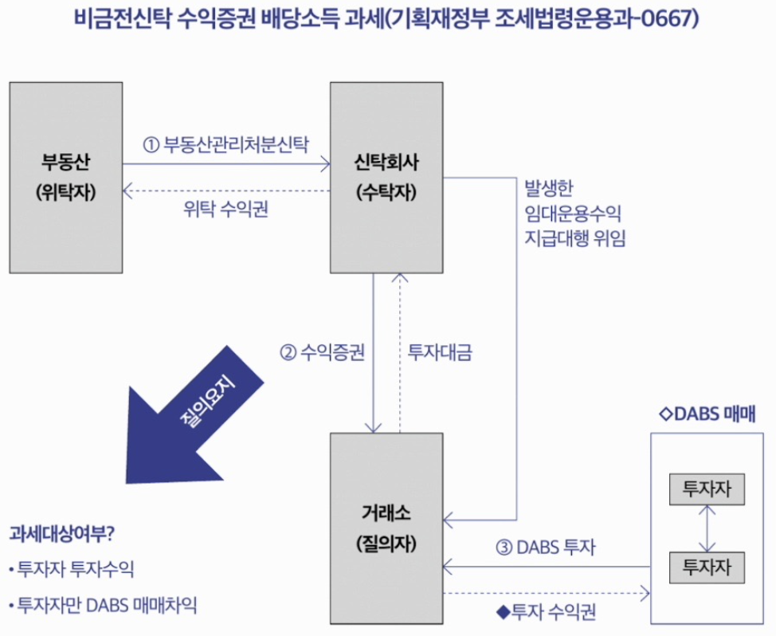

# 4장. STO 토큰증권과 세금

## 1. 가상자산은 과세 대상인가?

---

- 원래 2023년부터 가상자산 양도·대여 소득을 ‘기타소득’으로 과세할 예정이었음.
- 그런데 금융투자소득세 시행(2025년으로 유예)과 함께 가상자산 과세도 같이 유예된 상태.
- 그래서 2024년 현재 소득세법상 가상자산 양도/대여 소득을 과세대상으로 열거하지 않아 → 해당 소득은 과세되고 있지 않다.
- 다만 대가를 가상자산으로 받는 경우(급여/용역 대가 등)는 예외:
    - 급여로 받으면 근로소득
    - 재화·용역 제공 대가면 사업소득
    - 가상자산으로 받았다고 특별히 비과세하는 규정이 없으면 일반 소득 과세로 들어갈 수 있음.

    <aside>
    💡

    2024.12.10 가상자산 과세 2027.1.1로 유예 확정. 2026년 현재 비과세 상태(→7절 참조)

    </aside>

## 2. 토큰증권이 된 주식의 과세

---

- 현재는 주식이 토큰증권 형태로 발행·유통되는 사례가 없어 관련 과세 이슈가 실무로는 크지 않다고 봄.
- 향후 주식이 토큰증권으로 유통되면:
    - 소득세법에 “토큰증권 주식”을 따로 규정하지 않아도 기존 주식 과세 틀대로 과세될 가능성이 큼.
    - 즉 “발행 형태(실물/전자/토큰)”가 달라도 ‘주식’이면 양도소득 과세대상은 그대로라는 논지.
- 주식 양도 과세의 큰 구분도 함께 언급:
    - 비상장주식(장외거래 등)은 일반적으로 양도소득세 이슈가 생기고,
    - 상장주식은 원칙적으로 대주주 등 특정 요건에서 과세.
- 토큰증권에서 발생하는 배당 성격의 수익은 상장 여부와 무관하게 배당소득 과세로 볼 가능성이 크다고 정리.

## 3. 토큰증권이 된 채권의 과세

---

- 채권도 마찬가지로 현재 토큰증권 형태 유통 사례가 없어 과세 문제는 현실화되지 않았다.
- 향후 토큰증권 채권이 유통되더라도:
    - 현행 소득세법상 채권(채무증권) ‘양도’는 원칙적으로 양도소득 과세대상이 아니고
    - 채권이자가 이자소득으로 과세되는 구조이므로,
    - 토큰증권으로 발행되어도 양도차익 과세보다는 이자소득 과세 구조가 유지될 것이라고 예상.

## 4. 토큰증권이 된 ELS나 펀드의 과세

---

- ELS/펀드도 아직 토큰증권 발행 사례가 없어 과세 이슈가 당장 발생하진 않음.
- 향후 토큰증권으로 발행·유통되면:
    - 소득세법에 명시 규정이 없더라도 기존 과세체계에 따라 과세될 가능성이 크다.
    - 특히 ELS·펀드형 토큰증권에서 생기는 이익은 양도차익/분배금 구분과 관계없이 ‘배당소득’으로 과세될 것으로 보는 서술.

## 5. 토큰증권이 된 비금전신탁 수익증권의 과세

---

- 현재 분산원장을 활용한 비금전신탁 수익증권(조각투자 형태)에서 발생하는 이익은
    - 과세당국 행정해석에 따라 배당소득 과세로 정리되어 있다는 내용.
- 부동산 임대소득 등을 신탁으로 담고, 거래소에서 수익증권이 거래될 때:
    - 임대·처분에서 생긴 투자수익 + 거래소에서의 매매차익을 모두 ‘투자자의 배당소득’으로 해석하는 흐름.
- 자본시장법상 원칙은 금전신탁 수익증권만 허용이라서,
    - 비금전신탁 수익증권 형태 조각투자는 혁신금융서비스 지정 등 예외 구조를 통해 가능하다는 취지.

- 향후 법 개정으로 “분산원장 미러링”이 아니라 “직접 발행/유통”이 되더라도
    - 증권 속성이 달라지는 건 아니니 과세가 달라지진 않을 것이라는 결론.
- 따라서 새로운 해석이 나오기 전까지는 비금전신탁 수익증권형 토큰증권도 배당소득 과세로 보는 게 자연스럽다고 정리.

    <aside>
    💡

    2024년 세법개정안으로 비금전신탁 수익증권에서 발생하는 이익을 배당소득으로 분류하는 규정이 신설됨. 세율 15.4%(배당소득세 14%+지방소득세 1.4%). 2025.7.1부터 시행. 기존 행정해석이 법적 근거를 갖추게 된 것

    </aside>

## 6. 토큰증권이 된 투자계약증권의 과세

---

- 금융위가 투자계약증권으로 본 조각투자 사업자들 중 다수는
    - 투자자가 기초자산을 직접 소유한 것으로 보는 구조(민법상 공동소유/공유 법리 등)에 따라
    - 기타소득으로 원천징수하는 케이스가 있다는 설명.
- 일부는 사업소득으로 원천징수하는 사례도 있다고 언급.
- 다만 투자계약증권은 계약 실질/구조가 다양해서:
    - 민사·증권법적 성격을 일률적으로 특정하기 어렵고
    - 소득세법상 과세규정도 명확하게 정형화돼 있지 않다는 문제의식이 핵심.
- 결론적으로:
    - 투자계약증권 과세는 계약 실질에 따라 개별 판단이 필요하고,
    - 현재까지 과세당국의 명확한 통일 해석이 부족하니 향후 과세 이슈에 유의해야 한다.

    <aside>
    💡

    2024년 세법개정안으로 투자계약증권(미술품·한우 등)에서 발생하는 이익도 배당소득(15.4%)으로 과세하는 규정이 신설됨(2025.7.1 시행). 기존에 기타소득/사업소득으로 원천징수하던 불명확한 상태에서 배당소득으로 통일

    </aside>

## 7. 2025년부터 가상자산이 과세된다?

---

- 시행 경과/불확실성
    - 2020년 말 세법개정으로 (원래) 2022년 이후 가상자산 양도·대여 소득 과세 예정
    - 제도 미정비 등으로 2023년으로 유예
    - 이후 2022년 말 금투세가 2년 유예(→2025) 되면서 가상자산 과세도 다시 2년 유예되어 2025년 시행 예정이라는 흐름
    - 다만 2024년 중 정부·국회 논의 과정에서 폐지/추가 유예 가능성도 있어 실제 2025 시행 여부는 “지켜볼 필요”가 있다는 톤

- 2025 시행을 전제로 한 과세 구조(슬라이드 내용 기준)
    - 과세대상 소득: 가상자산을 양도하거나 대여해서 생긴 소득 → 기타소득
    - 소득금액 계산:
        - 총수입금액(양도/대여 대가) – 필요경비
        - 필요경비에 실제 취득가액 + 관련 부대비용 포함
    - 취득가액 평가방법:
        - 가상자산사업자: 이동평균법
        - 그 외: 선입선출법
    - 과세방식:
        - 원천징수 없이 분리과세
        - 세액: (가상자산 소득금액 – 250만원) × 20% (기본공제 250만원, 세율 20%로 서술)

    <aside>
    💡

    2024.12.10 금투세 폐지와 함께 가상자산 과세도 2027.1.1로 2년 추가 유예 확정(국회 본회의 의결). 2026년 현재 미시행. 2027년 시행 시 기타소득, 250만원 기본공제, 22%(지방세 포함) 세율 예정이나 4차 유예 가능성도 거론 중

    </aside>

## 8. 금융투자소득세(‘금투세’)란?

---

- 도입 취지/개념
    - 2020년 말 세법개정으로 도입: 주식·채권·파생상품 등 금융투자상품에서 발생하는 ‘자본손익’에 과세
    - 특징: 금융투자소득 간 손익통산 + 결손금(순손실) 이월공제 허용

- 금융투자소득의 범위: 자본시장법상 금융투자상품에서 실현된 소득
    1. 주식 등 양도로 발생하는 소득
    2. 채권 등 양도로 발생하는 소득
    3. 투자계약증권 양도로 발생하는 소득
    4. 집합투자증권에서 발생한 이익
    5. 파생결합증권 이익
    6. 파생상품 거래/행위로 발생한 소득
    - 참고로 배당·이자소득은 제외라고 명시

- 기본공제/손익통산/이월공제
    
    
    
    
    
    - 기본공제:
        - 국내상장주식 및 공모 국내주식형 펀드(1그룹): 연 5,000만원
        - 기타 금융투자소득(2그룹): 연 250만원
    - 손익통산:
        - 1단계: 금융투자소득·손실을 합산해 순손익 과세
        - 2단계: 결손금은 5년 이월공제
    - 세율/과세방식(슬라이드 서술):
        - 과세표준 3억 원 이하 20%, 3억 초과 25%
        - 원칙적으로 금융회사가 반기별 원천징수
        - 원천징수 후 추가 납부/환급은 다음 해 5월 확정신고 언급
    
    →
    
    - 현행은 상품별 과세·손익통산 제한적 / 금투세는 “전 금융투자상품 손익통산 + 5년 이월”이 핵심 차이

    <aside>
    💡

    2024.12.10 국회 본회의에서 금투세 폐지 확정(찬성 204, 반대 33, 기권 38). 2025.1.1부터 금투세는 시행되지 않으며 기존 양도소득세 체계가 유지됨. 금투세 도입을 전제로 인하했던 증권거래세는 2026.1.1부터 2023년 수준으로 환원(코스피 0.05%+농특세 0.15%=0.20%, 코스닥/K-OTC 0.20%)

    </aside>

## 9. 금투세 시행 후의 투자계약증권과 토큰증권 과세

---

- 투자계약증권형 토큰증권의 ‘양도차익’은
    
    → ‘투자계약증권 양도로 발생하는 소득’으로 보아 금투세 과세될 것으로 예상
    
- 다만 분배금(운용수익)은
    - 배당소득 과세 가능성이 높지만
    - 투자계약증권이 소득세법상 “배당소득 열거 금융상품”과 유사성이 낮다는 문제 등으로 세법 규정이 명확하지 않다.
    - 구조에 따라 출자공동사업 배당소득 또는 공동사업 소득(지분에 따른 사업소득) 가능성도 배제 못한다.
- 비금전신탁 수익증권은 현행 제도상 애매하나,
    - 자본시장법·전자증권법 개정 등을 통해 과세기준이 마련될 것이라고 전망하는 흐름

    <aside>
    💡

    금투세 폐지(2024.12)로 이 섹션에서 전제한 금투세 기반 과세 체계는 시행되지 않음. 대신 2024년 세법개정으로 투자계약증권·비금전신탁 수익증권 이익을 배당소득(15.4%)으로 과세하는 규정이 별도 신설됨(2025.7.1 시행). 투자계약증권 양도차익에 대한 별도 과세 근거는 현재 부재하며, 추가 입법이 필요한 상황

    </aside>

## 10. 금투세 시행 후의 정형적 증권인 토큰증권 과세

---

- 토큰증권은 자본시장법상 ‘증권’이라서 기존 증권 분류 틀(주식/채권/파생결합증권/금전신탁수익증권/투자계약증권 등)로 나뉜다는 전제
- 정형적 증권에서 생기는 소득은 각각 금투세의 분류 중 어디에 들어갈지가 정해짐:
    - 주식형 → “주식 등 양도소득”
    - 채권형 → “채권 등 양도소득”
    - 파생결합증권형 → “파생결합증권 이익”
    - 금전신탁수익증권형 → “금전신탁수익증권 이익”
    - 투자계약증권형 → “투자계약증권 양도소득”
    
    등으로 분류되어 금투세 과세될 것으로 “예상”
    
- 과세 방식:
    - 다른 금융투자상품 손익과 통산 후
    - 3억 이하 20%, 3억 초과 25% 세율 적용

    <aside>
    💡

    금투세 폐지(2024.12)로 이 섹션에서 전제한 과세 체계도 시행되지 않음(→9절 참조). 정형적 증권(주식형·채권형 등)은 기존 양도소득세 체계로 회귀하여 유형별로 개별 과세 규정 적용

    </aside>
