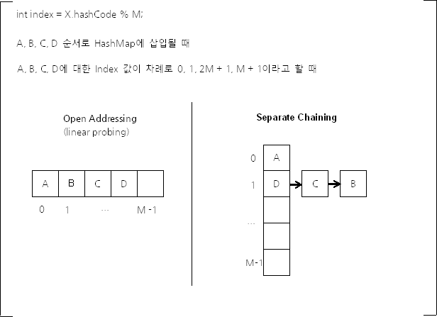

# Hash 란 무엇인가?

## 해싱과 해시함수

- 해싱: 해시함수를 이용해서 데이터를 해시테이블에 저장하고 검색하는 기법을 말한다.

### 해시함수

---

- 넘겨받은 데이터에 대해 고유한 숫자값을 만드는 알고리즘을 구현한 메서드
    - 간단히 말하자면 데이터를 키로 변환한다.
- 반환값을 해시값, 해시 코드, 또는 간단하게 해시라고 한다.
- `Boolean`같이 서로 구별되는 객체의 종류가 적거나, `Integer`, `Long`, `Double` 같은 `Number` 객체는 객체가 나타내려는 값 자체를 해시 값으로 사용할 수 있기 때문에 완전한 해시 함수 대상으로 삼을 수 있다. 하지만 `String`이나 POJO(plain old java object)에 대하여 완전한 해시 함수를 제작하는 것은 사실상 불가능하다.
    - `HashMap`은 기본적으로 각 객체의 `hashCode()` 메서드가 반환하는 값을 사용하는 데, 결과 자료형은 `int`다. 32비트 정수 자료형으로는 완전한 자료 해시 함수를 만들 수 없다.
    - 논리적으로 생성 가능한 객체의 수가 2^32보다 많을 수 있기 때문이며, 또한 모든 `HashMap` 객체에서 `O(1)` 을 보장하기 위해 랜덤 접근이 가능하게 하려면 원소가 2^32인 배열을 모든 `HashMap`이 가지고 있어야 하기 때문이다.
- 암호화: 해시를 분석했을 때 해시 함수를 알아낼 수 없도록 해야 한다.
- 충돌 위험성 최소화: 서로 다른 데이터에 대해 동일한 해시를 만들지 않도록 해야 한다.

### 해시(Hash)

---

- 특정 데이터가 저장되는 고유한 위치(Index) → 추가/삭제 시 데이터의 이동이 없다.
- 내부적으로 배열(Hash Table)을 이용하여 데이터를 저장 → 검색 속도가 빠르다.
    - 해시 테이블(Hash Map): 해시 함수가 해시를 생성할 때 참조하는 배열
- 데이터가 저장되어 있는 곳을 알려 준다.

### 충돌(Collision)

---

- 저장하려는 해시 == 기존 해시 인 경우
- 데이터를 저장할 때 해시 테이블에 이미 다른 데이터가 있을 경우 → 데이터 저장 불가능
- 해시 충돌이 발생하더라도 키-값 쌍 데이터를 잘 저장하고 조회할 수 있게 하는 방식, 대표 2가지

    

    - 개방 주소법(Open Addressing)
        - 배열만을 사용한다.
        - 해시 버킷(bucket, 저장 공간)이 겹치면 다른 버킷에 데이터를 저장한다.
        - 이 때 다른 버킷과도 겹치면 버킷이 겹치지 않을 때까지 옆으로 계속 이동해야 하기 때문에 충돌이 많이 일어날 경우 심각한 성능 저하가 발생할 수 있다.
            - 데이터를 저장/조회할 해시 버킷을 찾을 때에는 Linear Probing, Quadratic Probing 등의 방법을 사용한다.
            - 선형 탐색(Linear Probing): 비어있는 버킷을 찾을 때까지 순차적으로 탐색한다
            - 제곱 탐색(Quadratic Probing): 제곱만큼 건너뛴 버킷에 데이터를 저장한다.
            - 이중 해시(Double Hashing Probing): 해시 충돌 시 다른 해시 함수를 이용해 새로운 해시를 할당 받는다.
    - 분리 연결법(Seperate Chaining) → `HashMap`에서 사용하는 방식은 Separate Channing이다
        - 배열과 `LinkedList`를 조합하여 사용한다.
            - 각 배열의 인자는 인덱스가 같은 해시 버킷을 연결한 `LinkedList`의 첫 부분(head)이다.
        - 해시 테이블의 버킷마다 `LinkedList`를 하나씩 저장하여 충돌이 발생한 데이터는 `Node`로 추가한다.
        - 데이터 검색 시 해시 테이블의 index를 찾은 후, 셀에 연결된 `LinkedList`를 순차적으로 탐색하여 찾으려는 해시와 저장된 `Node`의 해시를 비교한다.
    - 둘 모두 Worst Case `O(M)` 이다.
        - 하지만 Open Addressing 은 연속된 공간에 데이터를 저장하기 때문에 Separate Chaining에 비하여 캐시 효율이 높다.
        - 따라서 데이터 개수가 충분히 적다면 Open Addressing 이 Separate Chaining 보다 더 성능이 좋다.
        - 하지만 배열의 크기가 커질수록(M 값이 커질수록) 캐시 효율이라는 Open Addressing 의 장점은 사라진다. 배열의 크기가 커지면, L1, L2 캐시 적중률(hit ratio)이 낮아지기 때문이다.

### 해싱 알고리즘(Hashing Algorithm)

---

- 중복된 해시코드를 반환하는 경우를 최소화시킨다.
- `HashMap`과 같이 해싱을 구현한 컬렉션 클래스에서는 Object 클래스에 정의된 `hashCode()`가 객체의 주소를 이용하는 알고리즘으로 해시코드를 만들어내기 때문에 모든 객체에 대해 `hashCode()`를 호출한 결과가 서로 겹치지 않는다.
- 단, `String` 클래스의 경우 `hashCode()`를 오버라이딩 했기 때문에 같은 내용의 문자열은 같은 해시코드를 얻는다.
    - `String` 객체에 대한 해시 함수 수행 시간은 문자열 길이에 비례한다.
        - JDK 1.1 `String` 해시 함수: 모든 문자에 대한 해시 함수를 계산하는 게 아니라, 문자열 길이가 16을 넘으면 최소 하나의 문자를 건너가며 해시 함수를 계산했다.

            ```java
            public int hashCode() {  
                int hash = 0;
                 int skip = Math.max(1, length() / 8);
                 for (int i = 0; i < length(): i+= skip) 
                       hash = s[i] + (37 * hash);
                return hash;
            }
            ```

            - 웹상의 URL은 길이가 수십 글자에 이르면서 앞 부분은 동일하게 구성되는 경우가 많다.
            - 이 경우 서로 다른 URL의 해시 값이 같아지는 빈도가 매우 높아질 수 있다는 문제가 있다.
            - 따라서 이런 방식은 곧 폐기되었고, Horner's method를 구현한 방식을 현재의 Java 8까지도 계속 사용하고 있다.
        - 이후 `String` 클래스 해시 함수: Horner's method를 구현한 것

            ```java
            public int hashCode() {  
                int h = hash;
                if (h == 0 && value.length > 0) {
                    char val[] = value;

                    for (int i = 0; i < value.length; i++) {
                        h = 31 * h + val[i];
                    }
                    hash = h;
                }
                return h;
            }
            ```

            - Horner's method는 다항식을 계산하기 쉽도록 단항식으로 이루어진 식으로 표현하는 것이다.

            

            - 이렇게 단항식을 재귀적으로 사용하여 다항식 연산을 표현할 수 있다.
        - `String` 객체 해시 함수에서 31을 사용하는 이유
            - 31이 소수이며, 어떤 수에 31을 곱하는 것은 빠르게 계산할 수 있기 때문이다.
            - 31N=32N-N인데 32는 2^5이니, 어떤 수에 대한 32를 곱한 값은 shift 연산으로 쉽게 구현할 수 있다.
            - 따라서 N에 31을 곱한 값은, (N << 5) – N과 같다.
            - 31을 곱하는 연산은 이렇게 최적화된 머신 코드로 생성할 수 있기 때문에, `String` 클래스에서 해시 값을 계산할 때에는 31을 승수로 사용한다.

    → `String` 클래스의 `hashCode()` 메서드에서 31을 승수로 사용하는 이유는 성능 향상 도모를 위한 것이다.

    - 완전 해싱(Perfect Hashing)
        - 서로 다른 키값이 해싱에 의해 주소값(해시)을 할당 받을 때, 해시가 절대로 겹치지 않는다.
        - 일대일 대응 이외에는 존재하지 않는 방식
    - 정형 해싱(Conventional Hashing)
        - 데이터를 저장할 배열의 크기를 미리 지정해두는 방식
        - 필요한 만큼의 메모리를 미리 측정하여 할당 받아 둔다.
        - 메모리의 범위를 넘어설 경우 다시 메모리 크기를 잡고 해싱해야 하는 단점이 있다.
    - 동적 해싱(Dynamic Hashing): 동적으로 메모리의 크기를 변화시킨다.

### 보조 해시 함수(supplement hash function)

---

- `index = X.hashCode() % M`을 계산할 때 사용하는 M 값은 소수일 때 index 값 분포가 가장 균등할 수 있다. 그러나 M 값이 소수가 아니기 때문에 별도의 보조 해시 함수를 이용하여 index 값 분포가 가급적 균등할 수 있도록 해야 한다.
- 보조 해시 함수의 목적은 '키'의 해시 값을 변형하여, 해시 충돌 가능성을 줄이는 것이다.
- JDK 1.4에 처음 등장했다. Java 5 ~ Java 7은 같은 방식의 보조 해시 함수를 사용하고, Java 8부터는 다시 새로운 방식의 보조 해시 함수를 사용하고 있다.
- Java 7 보조 해시 함수

    ```java
    final int hash(Object k) {  
        // Java 7부터는 JRE를 실행할 때, 데이터 개수가 일정 이상이면
        // String 객체에 대해서 JVM에서 제공하는 별도의 옵션으로
        // 해시 함수를 사용하도록 할 수 있다.
        // 만약 이 옵션을 사용하지 않으면 hashSeed의 값은 0이다.
        int h = hashSeed;
        if (0 != h && k instanceof String) {
            return sun.misc.Hashing.stringHash32((String) k);
        }
        h ^= k.hashCode();
        // 해시 버킷의 개수가 2a이기 때문에 해시 값의 a비트 값만을 
        // 해시 버킷의 인덱스로 사용한다. 따라서 상위 비트의 값이 
        // 해시 버킷의 인덱스 값을 결정할 때 반영될 수 있도록
        // shift 연산과 XOR 연산을 사용하여, 원래의 해시 값이 a비트 내에서 
        // 최대한 값이 겹치지 않고 구별되게 한다.
        h ^= (h >>> 20) ^ (h >>> 12);
        return h ^ (h >>> 7) ^ (h >>> 4);
    }
    ```

- Java 8 보조 해시 함수
    - Java 7보다 훨씬 더 단순한 형태의 보조 해시 함수를 사용한다.
    - 상위 16비트 값을 XOR 연산하는 매우 단순한 형태의 보조 해시 함수를 사용한다.
        - Java 8에서는 해시 충돌이 많이 발생하면 `LinkedList` 대신 트리를 사용하므로 해시 충돌 시 발생할 수 있는 성능 문제가 완화되었기 때문이다.
        - 최근의 해시 함수는 균등 분포가 잘 되게 만들어지는 경향이 많아, Java 7까지 사용했던 보조 해시 함수의 효과가 크지 않기 때문이다.

    ```java
    static final int hash(Object key) {
        int h;
        return (key == null) ? 0 : (h = key.hashCode()) ^ (h >>> 16);
    }
    ```


## 자바 `HashMap`의 Separate Chaining

- Java 2~7 의 `HashMap` 의 Separate Chaining
    - 과정

        

        - (1) 검색하고자 하는 값의 키로 해시 함수를 호출한다.
        - (2) 해시 함수의 계산 결과(해시코드)로 해당 값이 저장되어 있는 배열 요소를 찾는다.
        - (3) 링크드 리스트에서 검색한 키와 일치하는 데이터를 찾는다.
            - 링크드 리스트는 검색에 불리한 자료구조이다. 크기가 커질수록 검색속도가 떨어지게 된다.

            > 배열의 n번째 요소의 주소 = 배열의 시작주소 + type의 size * n

    - Separate Chaining 구현 코드는 조금씩 다르지만, 구현 알고리즘 자체는 같다.
    - 만약 객체의 해시 함수 값이 균등 분포(uniform distribution) 상태라고 할 때, `get()` 메서드 호출에 대한 기댓값은

        

    - 해시 버킷 관련 구현

        ```java
        // transient로 선언된 이유는 직렬화(serializ)할 때 전체, table 배열 자체를 직렬화하는 것보다
        // 키-값 쌍을 차례로 기록하는 것이 더 효율적이기 때문이다.
        transient Entry<K,V>[] table = (Entry<K,V>[]) EMPTY_TABLE;  

        static class Entry<K,V> implements Map.Entry<K,V> {  
            final K key;
            V value;
            Entry<K,V> next;
            int hash;

        		Entry(int h, K k, V v, Entry<K,V> n) {  
                value = v;
                next = n;
                key = k;
                hash = h;
            }

            public final K getKey() { … }
        		public final V getValue() { …}  
            public final V setValue(V newValue) { … }
            public final boolean equals(Object o) { … }
            public final int hashCode() {…}
            public final String toString() { …}

        		void recordAccess(HashMap<K,V> m) {… }

        		void recordRemoval(HashMap<K,V> m) {…}  
        }
        ```

    - `put()` 메소드

        ```java
        public V put(K key, V value) {
            if (table == EMPTY_TABLE) {
                inflateTable(threshold); // table 배열 생성
            }

            // HashMap에서는 null을 키로 사용할 수 있다.
            if (key == null) return putForNullKey(value);

            // value.hashCode() 메서드를 사용하는 것이 아니라, 보조 해시 함수를 이용하여
            // 변형된 해시 함수를 사용한다. "보조 해시 함수" 단락에서 설명한다.
            int hash = hash(key);

            // i 값이 해시 버킷의 인덱스이다.
            // indexFor() 메서드는 hash % table.length와 같은 의도의 메서드다.
            int i = indexFor(hash, table.length);

            // 해시 버킷에 있는 링크드 리스트를 순회한다.
            // 만약 같은 키가 이미 저장되어 있다면 교체한다.
            for (Entry<K,V> e = table[i]; e != null; e = e.next) {
                Object k;
                if (e.hash == hash && ((k = e.key) == key || key.equals(k))) {
                    V oldValue = e.value;
                    e.value = value;
                    e.recordAccess(this);
                    return oldValue;
                }
            }

            // 삽입, 삭제 등으로 이 HashMap 객체가 몇 번이나 변경(modification)되었는지
            // 관리하기 위한 코드다.
            // ConcurrentModificationException를 발생시켜야 하는지 판단할 때 사용한다.
            modCount++;

            // 아직 해당 키-값 쌍 데이터가 삽입된 적이 없다면 새로 Entry를 생성한다. 
            addEntry(hash, key, value, i);
            return null;
        }
        ```

- Java 8 의 `HashMap` 의 Separate Chaining
    - 만약 객체의 해시 함수 값이 균등 분포(uniform distribution) 상태라고 할 때, `get()` 메서드 호출에 대한 기댓값은 더 나아졌다.

        

    - 데이터의 개수가 많아지면, `LinkedList` 대신 트리를 사용하기 때문이다.
        - 데이터의 개수가 많아지면, 위의 차이는 무시할 수 없다.
        - 게다가 실제 해시 값은 균등 분포가 아닐뿐더러, 설사 균등 분포를 따른다고 하더라도 birthday problem이 설명하듯 일부 해시 버킷 몇 개에 데이터가 집중될 수 있다.
        - 그래서 데이터의 개수가 일정 이상일 때에는 트리를 사용하는 것이 성능상 이점이 있다.
    - `LinkedList`를 사용할 것인가 트리를 사용할 것인가에 대한 기준은 하나의 해시 버킷에 할당된 키-값 쌍의 개수이다.
        - 상수 형태로 기준을 정하고 있다. 하나의 해시 버킷에 8개의 키-값 쌍이 모이면 `LinkedList`를 트리로 변경한다.
        - 만약 해당 버킷에 있는 데이터를 삭제하여 개수가 6개에 이르면 다시 `LinkedList`로 변경한다.

        ```java
        static final int TREEIFY_THRESHOLD = 8;

        static final int UNTREEIFY_THRESHOLD = 6;
        ```

        - 트리는 `LinkedList`보다 메모리 사용량이 많고, 데이터의 개수가 적을 때 트리와 `LinkedList`의 Worst Case 수행시간 차이 비교는 의미가 없기 때문이다.
        - 8과 6으로 2 이상의 차이를 둔 것은, 만약 차이가 1이라면 어떤 한 키-값 쌍이 반복되어 삽입/삭제되는 경우 불필요하게 트리와 `LinkedList`를 변경하는 일이 반복되어 성능 저하가 발생할 수 있기 때문이다.
    - Java 8 `HashMap`에서는 `Entry` 클래스 대신 `Node` 클래스를 사용한다. `Node` 클래스 자체는 사실상 Java 7의 `Entry` 클래스와 내용이 같지만, `LinkedList` 대신 트리를 사용할 수 있도록 하위 클래스인 `TreeNode`가 있다는 것이 Java 7 `HashMap`과 다르다.
        - 이때 사용하는 트리는 `Red-Black Tree`인데, Java Collections Framework의 `TreeMap`과 구현이 거의 같다.
        - 트리 순회 시 사용하는 대소 판단 기준은 해시 함수 값이다.
        - 해시 값을 대소 판단 기준으로 사용하면 Total Ordering에 문제가 생기는데, Java 8 `HashMap`에서는 이를 `tieBreakOrder()` 메서드로 해결한다.
    - Node 클래스

        ```java
        transient Node<K,V>[] table;

        static class Node<K,V> implements Map.Entry<K,V> {  
          // 클래스 이름은 다르지만, Java 7의 Entry 클래스와 구현 내용은 같다. 
        }

        // LinkedHashMap.Entry는 HashMap.Node를 상속한 클래스다.
        // 따라서 TreeNode 객체를 table 배열에 저장할 수 있다.
        static final class TreeNode<K,V> extends LinkedHashMap.Entry<K,V> {
            TreeNode<K,V> parent;  
            TreeNode<K,V> left;
            TreeNode<K,V> right;
            TreeNode<K,V> prev;   

            // Red Black Tree에서 노드는 Red이거나 Black이다.
            boolean red;

            TreeNode(int hash, K key, V val, Node<K,V> next) {
                super(hash, key, val, next);
            }

            final TreeNode<K,V> root() {
            // Tree 노드의 root를 반환한다. 
            }

            static <K,V> void moveRootToFront(Node<K,V>[] tab, TreeNode<K,V> root) {
            // 해시 버킷에 트리를 저장할 때에는, root 노드에 가장 먼저 접근해야 한다.
            }

            // 순회하며 트리 노드 조회 
            final TreeNode<K,V> find(int h, Object k, Class<?> kc) {}
            final TreeNode<K,V> getTreeNode(int h, Object k) {}

            static int tieBreakOrder(Object a, Object b) {
             // TreeNode에서 어떤 두 키의comparator 값이 같다면 서로 동등하게 취급된다.
             // 그런데 어떤 두 개의 키의 hash 값이 서로 같아도 이 둘은 서로 동등하지 
             // 않을 수 있다. 따라서 어떤 두 개의 키에 대한 해시 함수 값이 같을 경우, 
             // 임의로 대소 관계를 지정할 필요가 있는 경우가 있다. 
            }

            final void treeify(Node<K,V>[] tab) {
              // 링크드 리스트를 트리로 변환한다.
            }

            final Node<K,V> untreeify(HashMap<K,V> map) {
              // 트리를 링크드 리스트로 변환한다.
            }

            // 다음 두 개 메서드의 역할은 메서드 이름만 읽어도 알 수 있다.
            final TreeNode<K,V> putTreeVal(HashMap<K,V> map, Node<K,V>[] tab, int h, K k, V v) {}
            final void removeTreeNode(HashMap<K,V> map, Node<K,V>[] tab, boolean movable) {}

            // Red Black 구성 규칙에 따라 균형을 유지하기 위한 것이다.
            final void split (…)
            static <K,V> TreeNode<K,V> rotateLeft(…)
            static <K,V> TreeNode<K,V> rotateRight(…)
            static <K,V> TreeNode<K,V> balanceInsertion(…)
            static <K,V> TreeNode<K,V> balanceDeletion(…)

            static <K,V> boolean checkInvariants(TreeNode<K,V> t) {
            // Tree가 규칙에 맞게 잘 생성된 것인지 판단하는 메서드다.
            }
        }
        ```

- 웹 애플리케이션 서버의 경우의 `HashMap`
    - `HTTP Request`가 생성될 때마다, 여러 개의 `HashMap`이 생성된다.
    - 수 많은 `HashMap` 객체가 1초도 안 되는 시간에 생성되고 또 GC(garbage collection) 대상이 된다.
    - 컴퓨터 메모리 크기가 보편적으로 증가하게 됨에 따라, 메모리 중심적인 애플리케이션 제작도 늘었다.
    - 따라서 갈수록 `HashMap`에 더 많은 데이터를 저장하고 있다고 할 수 있다.


## UUID

- UUID (Universally Unique Identifier): 유일 무이한 식별 번호
    - Open Software Foundation (OSF)에서 제정한 표준이다. 소프트웨어를 구현할 때에 사용하기 위한 목적이다.
    - 몇 가지 정해진 알고리즘(각 프로그래밍 언어별로 UUID를 만들어 내는 라이브러리가 이미 있다)에 의해서, UUID를 만들어 낸다.
        - 액션스크립트, 아파치 Solr, C, C++, Cache 오브젝트스크립트, CakePHP, 코코아/카본 (OS X)/ 코드기어 라드 스튜디오 (델파이/C++빌더), 코드퓨전, 커먼 LISP, CouchDB, D, 에펠, Erlang, 파이어버드 서버, 프리 파스칼&라자루스 IDE, 하스켈, Haxe, Java, JavaScript, KohanaPHP, Lasso, Lua, OS X, MySQL, .Net 프레임워크, OCaml, Oracle DB, Perl, PHP, PostgreSQL, 프로그레스 오픈에지 ABL, Python, 레볼루션/RunRev, 루비, SAP 비즈니스오브젝트 데이터 서비스, SQL 서버, Tcl, 유닉스, Openstack
    - 각 응용프로그램 내에서 만들어진 UUID는 유일무이하다고 가정하면 된다. (중복되는 UUID가 생성될 수도 있으나, 그 가능성은 대단히 희박하다)
- UUID는 16byte(128bit) 숫자이다. (32개의 16진수로 표시가능)
    - 따라서 최대로 생성이 가능한 UUID 갯수는 2^128 = 256^16 또는 약 3.4 × 10^38 이다.
    - 100억 년 동안, 매 1 nano second마다, 10^12 개의 UUID를 만들어 내면, 최대로 생성 가능한 UUID 갯수를 모두 만들어 낼 수 있다.
- UUID의 표준적인(canonical) 표시 방법
    - 32개의 hexadigit과 4개의 하이픈(-)로 표시를 하는 것이다.
    - 4바이트-2바이트-2바이트-2바이트-6바이트 (ex> 550e8400-e29b-41d4-a716-446655440000)
- UUID를 생성하는 실제 구현 알고리즘
    - version 1 (datetime + MAC address) : UUID를 생성시키는 컴퓨터의 MAC 어드레스와 시간 정보를 가지고 UUID를 만들어 낸다.
        - 단점은, 어느 컴퓨터가 언제 UUID를 생성시켰는지의 정보가 남기 때문에, 보안에 문제가 있다.
    - version 2 (datetime + mac + DCE 보안)
    - version 3 (namespace + MD5 hash): URL로 부터 MD5를 이용해서 만들어 내는 방법이다.
    - version 4 (Random): Random Number를 이용하는 방법이다.
    - version 5 (namespace + SHA-1 hash): [SHA](http://en.wikipedia.org/wiki/SHA)-1 hashing을 이용하는 방법이다.

- 참고
    - HashMap: [https://d2.naver.com/helloworld/831311](https://d2.naver.com/helloworld/831311)
    - UUID
        - [https://nhj12311.tistory.com/328](https://nhj12311.tistory.com/328)
        - [https://www.baeldung.com/java-uuid](https://www.baeldung.com/java-uuid)


- [Notion link](https://jennyuni.notion.site/Hash-95db59ea6d9049a585798f96b8d27889)
