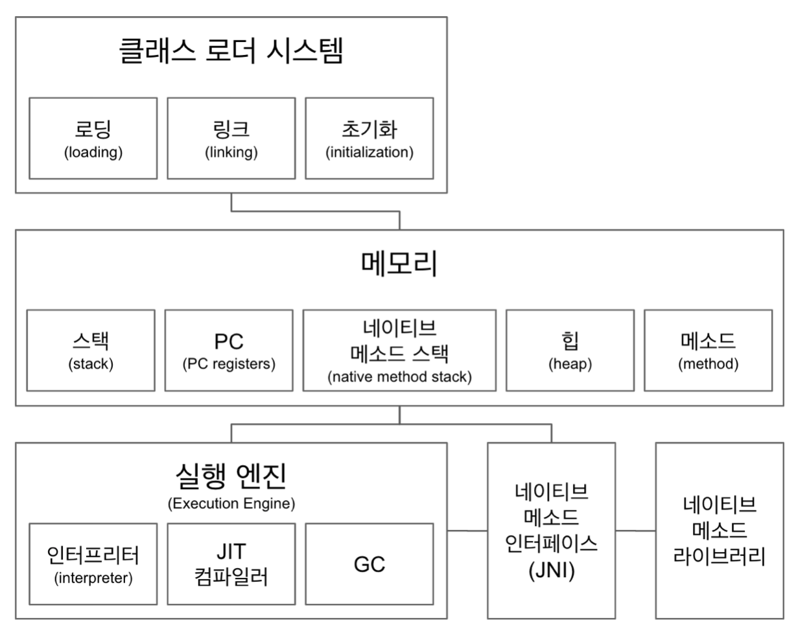

# JVM 메모리란 무엇인가? - 1. 클래스 로더 시스템 (공유용)

## 0. JVM 구성 요소



- 컴파일 시점이 아닌 **runtime 시점**에서 모든 과정은 시작된다.
    
    ```java
    public class Test {
        //클래스 필드
        public static int ONE = 1;
        public static String TWO = "TWO";
        public static String FOUR;
        
        // 상수
        public static final int FIVE = 10;
    
        // 정적 블럭
        static {
            FOUR = "안녕하세요";
        }
        
        //인스턴스 필드
        private int three;
        
        public Test( int three ) {
            this.three = three;
        }
        
        // 클래스 메서드
        public static int sum( int a , int b ) {
            return a + b;
        }
        
        //인스턴스 메서드
        public int multiply( int a, int b ) {
            return a*b;
        }
    
        public int getThree() {
            return three;
        }
    }
    
    // main thread
    public static void main(String args[]){
        int one = Test.ONE;
        String two = Test.TWO;
        int one_sum_two = Test.sum(1, 2);
        
        Test test = new Test(3);
        int three = test.getThree();
        int two_multiply_three = test.multiply(2, 3);
        
        System.out.println("one : " +one);
        System.out.println("two : " +two);
        System.out.println("one_sum_two : " +one_sum_two);
        System.out.println("three : " +three);
        System.out.println("two_multiply_three : " +two_multiply_three);
        System.out.println("FOUR : " +Test.FOUR);
        System.out.println("FIVE : " +Test.FIVE);
    }
    ```
    
    - 직접 만든 java 어플리케이션을 실행하는 도중(main 메서드 실행 중) 위 Test.class 파일을 사용하는 부분을 처음 만나는 순간, **Class Loader** 에 의해 Test.class 파일이 **Loading**, **Linking**, **Initialization** 과정을 겪는다.
        - ex> `int one = Test.ONE;`


## 1. Class Loader System


- 컴파일러(`javac`)에 의해 `.class`파일(바이트코드)로 컴파일되고, 이를 **Class Loader** 가 운영체제에 의해 메모리를 할당받은 **Runtime Data Area** 로 적재하는 역할을 한다.

### 1-1. Loading

---

- 클래스파일 로딩 시작되면, 로드한 클래스가 의존중인 의존성을 먼저 찾는다.
- **Method Area** 내에 특정 `Class`의 메타정보를 생성하는 것이 목적
    - 클래스로더가 `.class`파일을 읽고, 바이너리 코드로 변환 후 JVM 의 **Method Area** 메모리에 클래스 정보를 전달하는 과정을 말한다.
        - 이 때 **Method Area** 에 저장하는 데이터
            - FQCN(Fully Quallified Class Name)
            - 클래스 | 인터페이스 | 이넘(Enum)
            - 메소드와 변수
    - 한번 JVM 에 탑재된 클래스 파일은 종료될 때까지 JVM 에서 제거되지 않는다.
    - 👉  로딩이 완료된 후 해당 클래스 타입의 `Class`객체를 생성(인스턴스 생성)하여 **Heap** 영역에 저장하게 된다.
        1. Acquisition: 파일 형태의 `Class` 획득
        2. Parse: 파일 `Class`를 **Method Area** 데이터구조에 맞게 분석 (클래스로더에 의해 Load 된 `Class`의 최종 종착지는 **Method Area**)
        3. `java.lang.Class` 인스턴스 생성작업
    
    
    

- 코드로 확인해보자
    
    ```kotlin
    @Test
    fun classLoaderTest() {
        val classLoader = CodeTest::class.java.classLoader
    
        println("Application classLoader: $classLoader")
        println("Extension(Platform) classLoader: ${classLoader.parent}")
        println("Bootstrap classLoader: ${classLoader.parent.parent}")
    }
    
    // 결과
    Application classLoader: jdk.internal.loader.ClassLoaders$**AppClassLoader**@72167aea
    Extension(Platform) classLoader: jdk.internal.loader.ClassLoaders$**PlatformClassLoader**@fee7550
    Bootstrap classLoader: null // -> Native 코드로 구현되있어서 자바코드에선 확인할 수 없다.
    ```
    

- **1. Bootstrap Class Loader**
    - `jre/lib` 하위의 `rt.jar` 등 jar 파일을 로딩한다.
        - 자바 9부터 `rt.jar`, `tools.jar` 파일은 삭제되었다. ([https://docs.oracle.com/en/java/javase/14/migrate/index.html#JSMIG-GUID-A78CC891-701D-4549-AA4E-B8DD90228B4B](https://docs.oracle.com/en/java/javase/14/migrate/index.html#JSMIG-GUID-A78CC891-701D-4549-AA4E-B8DD90228B4B))
        - 자바 11 부터는 `jre` 가 없다.
            - `jdk/Contents/Home/lib` 하위에 구현 세부정보가 있다. 그리고 `src.zip`에 소스코드가 있다.
        
        ```kotlin
        FileSystem fs = FileSystems.getFileSystem(URI.create("jrt:/"));
        Path objClassFilePath = fs.getPath("modules", "java.base", "java/lang/Object.class");
        ```
        
    - `JAVA_HOME\lib`에 있는 코어 자바 API 를 제공한다.
        - JVM 을 구동시키기 위한 가장 필수적인 라이브러리의 클래스들을 JVM 에 탑재한다.
            - `java.lang.Object`같은 핵심 시스템 `Class` 로딩
        - `$JAVA_HOME/jre/lib` 위치의 JAR 파일들이 대상 → `jrt:/java.base` 같은 주요 모듈들
            
            ```kotlin
            jenny@gim-yunhuiui-MacBookPro sample % java -verbose:class CodeTest                       
            class load: java/lang/Object from: jrt:/java.base 
            class load: java/lang/J9VMInternals from: jrt:/java.base 
            class load: com/ibm/oti/vm/VM from: jrt:/java.base 
            class load: java/lang/J9VMInternals$ClassInitializationLock from: jrt:/java.base 
            class load: java/io/Serializable from: jrt:/java.base 
            class load: java/lang/reflect/AnnotatedElement from: jrt:/java.base 
            class load: java/lang/reflect/GenericDeclaration from: jrt:/java.base 
            class load: java/lang/reflect/Type from: jrt:/java.base 
            class load: java/lang/Class from: jrt:/java.base 
            class load: java/lang/Cloneable from: jrt:/java.base 
            class load: java/lang/Comparable from: jrt:/java.base 
            class load: java/lang/CharSequence from: jrt:/java.base 
            class load: java/lang/String from: jrt:/java.base 
            class load: java/util/Comparator from: jrt:/java.base 
            class load: java/lang/String$CaseInsensitiveComparator from: jrt:/java.base 
            class load: com/ibm/jit/JITHelpers from: jrt:/java.base 
            class load: jdk/internal/misc/Unsafe from: jrt:/java.base 
            class load: java/lang/invoke/MethodHandle from: jrt:/java.base 
            class load: java/util/Objects from: jrt:/java.base 
            class load: jdk/internal/reflect/Reflection from: jrt:/java.base 
            class load: java/util/Map from: jrt:/java.base 
            class load: java/util/AbstractMap from: jrt:/java.base 
            class load: java/util/HashMap from: jrt:/java.base 
            class load: java/util/Map$Entry from: jrt:/java.base 
            class load: java/util/HashMap$Node from: jrt:/java.base 
            class load: java/lang/System from: jrt:/java.base 
            class load: java/util/LinkedHashMap$Entry from: jrt:/java.base 
            class load: java/util/HashMap$TreeNode from: jrt:/java.base 
            class load: java/io/ObjectStreamField from: jrt:/java.base 
            class load: java/lang/annotation/Annotation from: jrt:/java.base 
            class load: java/lang/Runnable from: jrt:/java.base 
            class load: java/lang/Thread from: jrt:/java.base 
            class load: java/lang/Thread$TidLock from: jrt:/java.base 
            class load: java/lang/ClassLoader from: jrt:/java.base 
            class load: java/security/CodeSource from: jrt:/java.base 
            class load: java/security/cert/Certificate from: jrt:/java.base 
            class load: java/lang/NamedPackage from: jrt:/java.base 
            class load: java/lang/Package from: jrt:/java.base 
            class load: java/lang/StackTraceElement from: jrt:/java.base 
            class load: java/lang/Throwable from: jrt:/java.base 
            class load: java/lang/Error from: jrt:/java.base 
            class load: java/lang/VirtualMachineError from: jrt:/java.base 
            class load: java/lang/StackOverflowError from: jrt:/java.base 
            class load: java/lang/Exception from: jrt:/java.base 
            class load: java/lang/ReflectiveOperationException from: jrt:/java.base 
            class load: java/lang/ClassNotFoundException from: jrt:/java.base 
            class load: java/lang/LinkageError from: jrt:/java.base 
            class load: java/lang/NoClassDefFoundError from: jrt:/java.base 
            class load: java/lang/RuntimeException from: jrt:/java.base 
            class load: java/lang/NullPointerException from: jrt:/java.base 
            class load: java/lang/OutOfMemoryError from: jrt:/java.base 
            class load: java/lang/StackWalker$StackFrame from: jrt:/java.base 
            class load: java/lang/StackWalker$StackFrameImpl from: jrt:/java.base 
            class load: java/lang/ExceptionInInitializerError from: jrt:/java.base 
            class load: java/lang/Boolean from: jrt:/java.base 
            class load: java/lang/Number from: jrt:/java.base 
            class load: java/lang/Byte from: jrt:/java.base 
            class load: java/lang/Character from: jrt:/java.base 
            class load: java/lang/Short from: jrt:/java.base 
            class load: java/lang/Integer from: jrt:/java.base 
            class load: java/lang/Float from: jrt:/java.base 
            class load: java/lang/Long from: jrt:/java.base 
            class load: java/lang/Double from: jrt:/java.base 
            class load: java/lang/reflect/AccessibleObject from: jrt:/java.base 
            class load: java/lang/reflect/Member from: jrt:/java.base 
            class load: java/lang/reflect/Field from: jrt:/java.base 
            class load: java/lang/reflect/Executable from: jrt:/java.base 
            class load: java/lang/reflect/Method from: jrt:/java.base 
            class load: java/lang/reflect/Constructor from: jrt:/java.base 
            class load: java/lang/Thread$UncaughtExceptionHandler from: jrt:/java.base 
            class load: java/lang/ThreadGroup from: jrt:/java.base 
            class load: java/lang/ref/Reference from: jrt:/java.base 
            class load: java/lang/ref/SoftReference from: jrt:/java.base 
            class load: java/util/concurrent/locks/AbstractOwnableSynchronizer from: jrt:/java.base 
            class load: java/lang/invoke/PrimitiveHandle from: jrt:/java.base 
            class load: java/lang/invoke/DirectHandle from: jrt:/java.base 
            class load: java/lang/invoke/ReceiverBoundHandle from: jrt:/java.base 
            class load: java/lang/invoke/ConvertHandle from: jrt:/java.base 
            class load: java/lang/invoke/FoldHandle from: jrt:/java.base 
            class load: java/lang/invoke/FilterArgumentsHandle from: jrt:/java.base 
            class load: java/lang/invoke/GuardWithTestHandle from: jrt:/java.base 
            class load: java/lang/invoke/CollectHandle from: jrt:/java.base 
            class load: java/lang/invoke/SpreadHandle from: jrt:/java.base 
            class load: java/lang/invoke/MethodType from: jrt:/java.base 
            class load: java/lang/invoke/DynamicInvokerHandle from: jrt:/java.base 
            class load: java/lang/invoke/FilterReturnHandle from: jrt:/java.base 
            class load: java/lang/invoke/VarargsCollectorHandle from: jrt:/java.base 
            class load: java/lang/invoke/InvokeExactHandle from: jrt:/java.base 
            class load: java/lang/invoke/CallSite from: jrt:/java.base 
            class load: java/lang/invoke/VolatileCallSite from: jrt:/java.base 
            class load: java/lang/invoke/MutableCallSite from: jrt:/java.base 
            class load: java/lang/invoke/PassThroughHandle from: jrt:/java.base 
            class load: java/lang/invoke/ThunkTuple from: jrt:/java.base 
            class load: java/lang/invoke/InsertHandle from: jrt:/java.base 
            class load: java/lang/invoke/PermuteHandle from: jrt:/java.base 
            class load: java/lang/invoke/ConstantHandle from: jrt:/java.base 
            class load: java/lang/invoke/ConstantObjectHandle from: jrt:/java.base 
            class load: java/lang/invoke/ConstantIntHandle from: jrt:/java.base 
            class load: java/lang/invoke/ConstantFloatHandle from: jrt:/java.base 
            class load: java/lang/invoke/ConstantLongHandle from: jrt:/java.base 
            class load: java/lang/invoke/ConstantDoubleHandle from: jrt:/java.base 
            class load: java/lang/invoke/InvokeGenericHandle from: jrt:/java.base 
            class load: java/lang/invoke/VarHandleInternal from: jrt:/java.base 
            class load: java/lang/invoke/VarHandle from: jrt:/java.base 
            class load: java/lang/invoke/MethodHandleCache from: jrt:/java.base 
            class load: java/lang/invoke/VarHandleInvokeHandle from: jrt:/java.base 
            class load: java/lang/invoke/FieldVarHandle from: jrt:/java.base 
            class load: java/lang/Module from: jrt:/java.base 
            class load: java/lang/InternalRamClass from: jrt:/java.base 
            class load: java/lang/ref/WeakReference from: jrt:/java.base 
            class load: com/ibm/oti/util/WeakReferenceNode from: jrt:/java.base 
            class load: java/lang/invoke/MethodTypeHelper from: jrt:/java.base 
            class load: java/lang/Iterable from: jrt:/java.base 
            class load: java/util/Collection from: jrt:/java.base 
            class load: java/util/AbstractCollection from: jrt:/java.base 
            class load: java/util/Set from: jrt:/java.base 
            class load: java/util/AbstractSet from: jrt:/java.base 
            class load: java/util/HashSet from: jrt:/java.base 
            class load: java/util/Arrays from: jrt:/java.base 
            class load: java/util/List from: jrt:/java.base 
            class load: java/util/AbstractList from: jrt:/java.base 
            class load: java/util/RandomAccess from: jrt:/java.base 
            class load: java/util/Arrays$ArrayList from: jrt:/java.base 
            class load: java/lang/Math from: jrt:/java.base 
            class load: java/util/Iterator from: jrt:/java.base 
            class load: java/util/Arrays$ArrayItr from: jrt:/java.base 
            class load: java/util/Collections from: jrt:/java.base 
            class load: java/util/Collections$EmptySet from: jrt:/java.base 
            class load: java/util/Collections$EmptyList from: jrt:/java.base 
            class load: java/util/Collections$EmptyMap from: jrt:/java.base 
            class load: java/util/Collections$UnmodifiableCollection from: jrt:/java.base 
            class load: java/util/Collections$UnmodifiableSet from: jrt:/java.base 
            class load: java/lang/invoke/MethodHandleResolver from: jrt:/java.base 
            class load: java/lang/Runtime from: jrt:/java.base 
            class load: java/lang/invoke/MethodHandles$Lookup from: jrt:/java.base 
            class load: jdk/internal/reflect/MagicAccessorImpl from: jrt:/java.base 
            class load: jdk/internal/reflect/ConstructorAccessor from: jrt:/java.base 
            class load: jdk/internal/reflect/ConstructorAccessorImpl from: jrt:/java.base 
            class load: jdk/internal/reflect/MethodAccessor from: jrt:/java.base 
            class load: jdk/internal/reflect/MethodAccessorImpl from: jrt:/java.base 
            class load: java/lang/ThreadGroup$ChildrenGroupsLock from: jrt:/java.base 
            class load: java/lang/ThreadGroup$ChildrenThreadsLock from: jrt:/java.base 
            class load: java/lang/Thread$ThreadLock from: jrt:/java.base 
            class load: com/ibm/oti/vm/VMLangAccess from: jrt:/java.base 
            class load: java/lang/VMAccess from: jrt:/java.base 
            class load: java/util/Dictionary from: jrt:/java.base 
            class load: java/util/Hashtable from: jrt:/java.base 
            class load: java/util/Properties from: jrt:/java.base 
            class load: java/util/concurrent/ConcurrentMap from: jrt:/java.base 
            class load: java/util/concurrent/ConcurrentHashMap from: jrt:/java.base 
            class load: java/util/concurrent/locks/Lock from: jrt:/java.base 
            class load: java/util/concurrent/locks/ReentrantLock from: jrt:/java.base 
            class load: java/util/concurrent/ConcurrentHashMap$Segment from: jrt:/java.base 
            class load: java/security/PrivilegedAction from: jrt:/java.base 
            class load: jdk/internal/reflect/ReflectionFactory$GetReflectionFactoryAction from: jrt:/java.base 
            class load: java/security/AccessController from: jrt:/java.base 
            class load: jdk/internal/reflect/ReflectionFactory from: jrt:/java.base 
            class load: java/util/concurrent/ConcurrentHashMap$CounterCell from: jrt:/java.base 
            class load: java/util/concurrent/ConcurrentHashMap$Node from: jrt:/java.base 
            class load: java/util/concurrent/locks/LockSupport from: jrt:/java.base 
            class load: java/util/concurrent/ConcurrentHashMap$ReservationNode from: jrt:/java.base 
            class load: java/util/concurrent/ConcurrentHashMap$ForwardingNode from: jrt:/java.base 
            class load: java/lang/VersionProps from: jrt:/java.base 
            class load: java/lang/String$UnsafeHelpers from: jrt:/java.base 
            class load: java/lang/Appendable from: jrt:/java.base 
            class load: java/lang/AbstractStringBuilder from: jrt:/java.base 
            class load: java/lang/StringBuilder from: jrt:/java.base 
            class load: java/lang/StringUTF16 from: jrt:/java.base 
            class load: jdk/internal/misc/VM from: jrt:/java.base 
            class load: java/util/Properties$EntrySet from: jrt:/java.base 
            class load: java/util/concurrent/ConcurrentHashMap$CollectionView from: jrt:/java.base 
            class load: java/util/concurrent/ConcurrentHashMap$EntrySetView from: jrt:/java.base 
            class load: java/util/Collections$SynchronizedCollection from: jrt:/java.base 
            class load: java/util/Collections$SynchronizedSet from: jrt:/java.base 
            class load: java/lang/reflect/Array from: jrt:/java.base 
            class load: java/lang/Void from: jrt:/java.base 
            class load: java/util/concurrent/ConcurrentHashMap$Traverser from: jrt:/java.base 
            class load: java/util/concurrent/ConcurrentHashMap$BaseIterator from: jrt:/java.base 
            class load: java/util/concurrent/ConcurrentHashMap$EntryIterator from: jrt:/java.base 
            class load: java/util/concurrent/ConcurrentHashMap$MapEntry from: jrt:/java.base 
            class load: java/util/ImmutableCollections$AbstractImmutableMap from: jrt:/java.base 
            class load: java/util/ImmutableCollections$MapN from: jrt:/java.base 
            class load: java/lang/CharacterData from: jrt:/java.base 
            class load: java/lang/CharacterDataLatin1 from: jrt:/java.base 
            class load: jdk/internal/util/StaticProperty from: jrt:/java.base 
            class load: jdk/internal/misc/JavaLangAccess from: jrt:/java.base 
            class load: java/lang/Access from: jrt:/java.base 
            class load: jdk/internal/misc/SharedSecrets from: jrt:/java.base 
            class load: java/lang/StringCoding from: jrt:/java.base 
            class load: java/lang/ThreadLocal from: jrt:/java.base 
            class load: java/util/concurrent/atomic/AtomicInteger from: jrt:/java.base 
            class load: java/nio/charset/Charset from: jrt:/java.base 
            class load: sun/nio/cs/HistoricallyNamedCharset from: jrt:/java.base 
            class load: sun/nio/cs/ISO_8859_1 from: jrt:/java.base 
            class load: java/nio/charset/spi/CharsetProvider from: jrt:/java.base 
            class load: sun/nio/cs/StandardCharsets from: jrt:/java.base 
            class load: sun/nio/cs/US_ASCII from: jrt:/java.base 
            class load: sun/nio/cs/Unicode from: jrt:/java.base 
            class load: sun/nio/cs/UTF_8 from: jrt:/java.base 
            class load: java/lang/StringCoding$1 from: jrt:/java.base 
            class load: sun/security/action/GetPropertyAction from: jrt:/java.base 
            class load: java/lang/AutoCloseable from: jrt:/java.base 
            class load: java/io/Closeable from: jrt:/java.base 
            class load: java/io/Flushable from: jrt:/java.base 
            class load: java/io/OutputStream from: jrt:/java.base 
            class load: java/io/FilterOutputStream from: jrt:/java.base 
            class load: java/io/PrintStream from: jrt:/java.base 
            class load: java/io/BufferedOutputStream from: jrt:/java.base 
            class load: java/io/FileOutputStream from: jrt:/java.base 
            class load: java/io/FileDescriptor from: jrt:/java.base 
            class load: jdk/internal/misc/JavaIOFileDescriptorAccess from: jrt:/java.base 
            class load: java/io/FileDescriptor$1 from: jrt:/java.base 
            class load: java/io/Writer from: jrt:/java.base 
            class load: java/io/OutputStreamWriter from: jrt:/java.base 
            class load: sun/nio/cs/StreamEncoder from: jrt:/java.base 
            class load: java/nio/charset/CharsetEncoder from: jrt:/java.base 
            class load: sun/nio/cs/UTF_8$Encoder from: jrt:/java.base 
            class load: java/nio/charset/CodingErrorAction from: jrt:/java.base 
            class load: java/nio/Buffer from: jrt:/java.base 
            class load: java/nio/ByteBuffer from: jrt:/java.base 
            class load: jdk/internal/misc/JavaNioAccess from: jrt:/java.base 
            class load: java/nio/Buffer$1 from: jrt:/java.base 
            class load: java/nio/HeapByteBuffer from: jrt:/java.base 
            class load: java/nio/ByteOrder from: jrt:/java.base 
            class load: java/io/BufferedWriter from: jrt:/java.base 
            class load: java/util/WeakHashMap from: jrt:/java.base 
            class load: java/lang/ref/ReferenceQueue from: jrt:/java.base 
            class load: java/lang/ref/PhantomReference from: jrt:/java.base 
            class load: jdk/internal/ref/Cleaner from: jrt:/java.base 
            class load: java/lang/Class$ReflectRef from: jrt:/java.base 
            class load: jdk/internal/misc/JavaLangRefAccess from: jrt:/java.base 
            class load: java/lang/ref/Reference$1 from: jrt:/java.base 
            class load: java/lang/ClassLoader$ClassNameLockRef from: jrt:/java.base 
            class load: java/util/WeakHashMap$Entry from: jrt:/java.base 
            class load: java/util/Collections$SynchronizedMap from: jrt:/java.base 
            class load: java/security/ProtectionDomain from: jrt:/java.base 
            class load: jdk/internal/misc/JavaSecurityAccess from: jrt:/java.base 
            class load: java/security/ProtectionDomain$JavaSecurityAccessImpl from: jrt:/java.base 
            class load: jdk/internal/loader/ClassLoaders from: jrt:/java.base 
            class load: java/security/SecureClassLoader from: jrt:/java.base 
            class load: jdk/internal/loader/BuiltinClassLoader from: jrt:/java.base 
            class load: jdk/internal/loader/ClassLoaders$BootClassLoader from: jrt:/java.base 
            class load: java/lang/ClassLoader$AssertionLock from: jrt:/java.base 
            class load: java/util/Hashtable$Entry from: jrt:/java.base 
            class load: java/lang/ClassLoader$LazyInitLock from: jrt:/java.base 
            class load: jdk/internal/loader/ClassLoaders$PlatformClassLoader from: jrt:/java.base 
            class load: java/util/ImmutableCollections$AbstractImmutableCollection from: jrt:/java.base 
            class load: java/util/ImmutableCollections$AbstractImmutableSet from: jrt:/java.base 
            class load: java/util/ImmutableCollections$Set12 from: jrt:/java.base 
            class load: jdk/internal/loader/URLClassPath from: jrt:/java.base 
            class load: java/net/URL from: jrt:/java.base 
            class load: java/net/URLStreamHandlerFactory from: jrt:/java.base 
            class load: java/net/URL$DefaultFactory from: jrt:/java.base 
            class load: jdk/internal/misc/JavaNetURLAccess from: jrt:/java.base 
            class load: java/net/URL$3 from: jrt:/java.base 
            class load: java/util/ArrayList from: jrt:/java.base 
            class load: java/io/File from: jrt:/java.base 
            class load: java/io/DefaultFileSystem from: jrt:/java.base 
            class load: java/io/FileSystem from: jrt:/java.base 
            class load: java/io/UnixFileSystem from: jrt:/java.base 
            class load: java/io/ExpiringCache from: jrt:/java.base 
            class load: java/util/LinkedHashMap from: jrt:/java.base 
            class load: java/io/ExpiringCache$1 from: jrt:/java.base 
            class load: java/lang/Enum from: jrt:/java.base 
            class load: java/io/File$PathStatus from: jrt:/java.base 
            class load: java/lang/ThreadLocal$ThreadLocalMap from: jrt:/java.base 
            class load: java/lang/ThreadLocal$ThreadLocalMap$Entry from: jrt:/java.base 
            class load: jdk/internal/misc/TerminatingThreadLocal from: jrt:/java.base 
            class load: java/io/ExpiringCache$Entry from: jrt:/java.base 
            class load: sun/net/www/ParseUtil from: jrt:/java.base 
            class load: java/net/URLStreamHandler from: jrt:/java.base 
            class load: sun/net/www/protocol/file/Handler from: jrt:/java.base 
            class load: sun/net/util/IPAddressUtil from: jrt:/java.base 
            class load: java/util/Queue from: jrt:/java.base 
            class load: java/util/Deque from: jrt:/java.base 
            class load: java/util/ArrayDeque from: jrt:/java.base 
            class load: jdk/internal/util/Preconditions from: jrt:/java.base 
            class load: jdk/internal/loader/ClassLoaders$AppClassLoader from: jrt:/java.base 
            class load: jdk/internal/loader/BootLoader from: jrt:/java.base 
            class load: jdk/internal/module/ServicesCatalog from: jrt:/java.base 
            class load: jdk/internal/loader/AbstractClassLoaderValue from: jrt:/java.base 
            class load: jdk/internal/loader/ClassLoaderValue from: jrt:/java.base 
            class load: java/lang/InternalAnonymousClassLoader from: jrt:/java.base 
            class load: java/lang/reflect/Modifier from: jrt:/java.base 
            class load: jdk/internal/reflect/LangReflectAccess from: jrt:/java.base 
            class load: java/lang/reflect/ReflectAccess from: jrt:/java.base 
            class load: jdk/internal/module/ModuleBootstrap from: jrt:/java.base 
            class load: java/lang/module/ModuleDescriptor from: jrt:/java.base 
            class load: jdk/internal/misc/JavaLangModuleAccess from: jrt:/java.base 
            class load: java/lang/module/ModuleDescriptor$1 from: jrt:/java.base 
            class load: java/util/ImmutableCollections from: jrt:/java.base 
            class load: jdk/internal/module/ModulePatcher from: jrt:/java.base 
            class load: java/util/ImmutableCollections$SetN from: jrt:/java.base 
            class load: jdk/internal/module/ArchivedModuleGraph from: jrt:/java.base 
            class load: jdk/internal/module/SystemModuleFinders from: jrt:/java.base 
            class load: java/net/URI from: jrt:/java.base 
            class load: jdk/internal/misc/JavaNetUriAccess from: jrt:/java.base 
            class load: java/net/URI$1 from: jrt:/java.base 
            class load: jdk/internal/module/SystemModulesMap from: jrt:/java.base 
            class load: jdk/internal/module/SystemModules from: jrt:/java.base 
            class load: jdk/internal/module/SystemModules$default from: jrt:/java.base 
            class load: jdk/internal/module/Builder from: jrt:/java.base 
            class load: java/lang/module/ModuleDescriptor$Requires from: jrt:/java.base 
            class load: java/lang/module/ModuleDescriptor$Exports from: jrt:/java.base 
            class load: java/lang/module/ModuleDescriptor$Opens from: jrt:/java.base 
            class load: java/lang/module/ModuleDescriptor$Provides from: jrt:/java.base 
            class load: java/util/ImmutableCollections$AbstractImmutableList from: jrt:/java.base 
            class load: java/util/ImmutableCollections$List12 from: jrt:/java.base 
            class load: java/lang/module/ModuleDescriptor$Version from: jrt:/java.base 
            class load: java/lang/Integer$IntegerCache from: jrt:/java.base 
            class load: java/lang/module/ModuleDescriptor$Modifier from: jrt:/java.base 
            class load: java/lang/module/ModuleDescriptor$Requires$Modifier from: jrt:/java.base 
            class load: java/util/ImmutableCollections$ListN from: jrt:/java.base 
            class load: jdk/internal/module/ModuleTarget from: jrt:/java.base 
            class load: jdk/internal/module/ModuleHashes from: jrt:/java.base 
            class load: jdk/internal/module/ModuleHashes$Builder from: jrt:/java.base 
            class load: java/util/Collections$UnmodifiableMap from: jrt:/java.base 
            class load: jdk/internal/module/ModuleResolution from: jrt:/java.base 
            class load: java/lang/module/ModuleReference from: jrt:/java.base 
            class load: java/util/function/Supplier from: jrt:/java.base 
            class load: jdk/internal/module/SystemModuleFinders$2 from: jrt:/java.base 
            class load: jdk/internal/module/ModuleReferenceImpl from: jrt:/java.base 
            class load: java/util/KeyValueHolder from: jrt:/java.base 
            class load: jdk/internal/module/ModuleHashes$HashSupplier from: jrt:/java.base 
            class load: jdk/internal/module/SystemModuleFinders$3 from: jrt:/java.base 
            class load: java/lang/module/ModuleFinder from: jrt:/java.base 
            class load: jdk/internal/module/SystemModuleFinders$SystemModuleFinder from: jrt:/java.base 
            class load: jdk/internal/module/ModuleBootstrap$Counters from: jrt:/java.base 
            class load: java/util/Optional from: jrt:/java.base 
            class load: jdk/internal/loader/BuiltinClassLoader$LoadedModule from: jrt:/java.base 
            class load: sun/net/www/protocol/jrt/Handler from: jrt:/java.base 
            class load: jdk/internal/loader/BuiltinClassLoader$2 from: jrt:/java.base 
            class load: java/nio/file/Paths from: jrt:/java.base 
            class load: java/nio/file/Watchable from: jrt:/java.base 
            class load: java/nio/file/Path from: jrt:/java.base 
            class load: java/nio/file/FileSystems from: jrt:/java.base 
            class load: sun/nio/fs/DefaultFileSystemProvider from: jrt:/java.base 
            class load: java/nio/file/spi/FileSystemProvider from: jrt:/java.base 
            class load: sun/nio/fs/AbstractFileSystemProvider from: jrt:/java.base 
            class load: sun/nio/fs/UnixFileSystemProvider from: jrt:/java.base 
            class load: sun/nio/fs/BsdFileSystemProvider from: jrt:/java.base 
            class load: sun/nio/fs/MacOSXFileSystemProvider from: jrt:/java.base 
            class load: java/nio/file/OpenOption from: jrt:/java.base 
            class load: java/nio/file/StandardOpenOption from: jrt:/java.base 
            class load: java/nio/file/FileSystem from: jrt:/java.base 
            class load: sun/nio/fs/UnixFileSystem from: jrt:/java.base 
            class load: sun/nio/fs/BsdFileSystem from: jrt:/java.base 
            class load: sun/nio/fs/MacOSXFileSystem from: jrt:/java.base 
            class load: sun/nio/fs/UnixPath from: jrt:/java.base 
            class load: sun/nio/fs/Util from: jrt:/java.base 
            class load: sun/nio/fs/UnixNativeDispatcher from: jrt:/java.base 
            class load: sun/nio/fs/UnixNativeDispatcher$1 from: jrt:/java.base 
            class load: com/ibm/oti/util/Util from: jrt:/java.base 
            class load: java/nio/file/attribute/BasicFileAttributes from: jrt:/java.base 
            class load: java/nio/file/attribute/PosixFileAttributes from: jrt:/java.base 
            class load: sun/nio/fs/UnixFileAttributes from: jrt:/java.base 
            class load: sun/nio/fs/UnixFileStoreAttributes from: jrt:/java.base 
            class load: sun/nio/fs/UnixMountEntry from: jrt:/java.base 
            class load: java/lang/Readable from: jrt:/java.base 
            class load: java/nio/CharBuffer from: jrt:/java.base 
            class load: java/nio/HeapCharBuffer from: jrt:/java.base 
            class load: java/nio/charset/CoderResult from: jrt:/java.base 
            class load: java/nio/file/CopyOption from: jrt:/java.base 
            class load: java/nio/file/LinkOption from: jrt:/java.base 
            class load: java/nio/file/Files from: jrt:/java.base 
            class load: sun/nio/fs/NativeBuffers from: jrt:/java.base 
            class load: sun/nio/fs/NativeBuffers$1 from: jrt:/java.base 
            class load: jdk/internal/misc/TerminatingThreadLocal$1 from: jrt:/java.base 
            class load: java/util/IdentityHashMap from: jrt:/java.base 
            class load: java/util/Collections$SetFromMap from: jrt:/java.base 
            class load: java/util/IdentityHashMap$KeySet from: jrt:/java.base 
            class load: sun/nio/fs/NativeBuffer from: jrt:/java.base 
            class load: jdk/internal/ref/CleanerFactory from: jrt:/java.base 
            class load: java/util/concurrent/ThreadFactory from: jrt:/java.base 
            class load: jdk/internal/ref/CleanerFactory$1 from: jrt:/java.base 
            class load: java/lang/ref/Cleaner from: jrt:/java.base 
            class load: java/util/function/Function from: jrt:/java.base 
            class load: java/lang/ref/Cleaner$1 from: jrt:/java.base 
            class load: jdk/internal/ref/CleanerImpl from: jrt:/java.base 
            class load: java/lang/ref/Cleaner$Cleanable from: jrt:/java.base 
            class load: jdk/internal/ref/PhantomCleanable from: jrt:/java.base 
            class load: jdk/internal/ref/CleanerImpl$PhantomCleanableRef from: jrt:/java.base 
            class load: jdk/internal/ref/WeakCleanable from: jrt:/java.base 
            class load: jdk/internal/ref/CleanerImpl$WeakCleanableRef from: jrt:/java.base 
            class load: jdk/internal/ref/SoftCleanable from: jrt:/java.base 
            class load: jdk/internal/ref/CleanerImpl$SoftCleanableRef from: jrt:/java.base 
            class load: jdk/internal/ref/CleanerImpl$CleanerCleanable from: jrt:/java.base 
            class load: jdk/internal/ref/CleanerFactory$1$1 from: jrt:/java.base 
            class load: jdk/internal/misc/InnocuousThread from: jrt:/java.base 
            class load: java/security/AccessControlContext from: jrt:/java.base 
            class load: java/security/ProtectionDomain$Key from: jrt:/java.base 
            class load: java/security/Principal from: jrt:/java.base 
            class load: jdk/internal/misc/InnocuousThread$3 from: jrt:/java.base 
            class load: jdk/internal/misc/InnocuousThread$2 from: jrt:/java.base 
            class load: sun/nio/fs/NativeBuffer$Deallocator from: jrt:/java.base 
            class load: sun/nio/fs/UnixUriUtils from: jrt:/java.base 
            class load: java/net/URI$Parser from: jrt:/java.base 
            class load: java/util/ImmutableCollections$SetN$SetNIterator from: jrt:/java.base 
            class load: jdk/internal/module/Modules from: jrt:/java.base 
            class load: java/lang/module/Configuration from: jrt:/java.base 
            class load: java/lang/module/ResolvedModule from: jrt:/java.base 
            class load: java/util/AbstractMap$1 from: jrt:/java.base 
            class load: java/util/AbstractMap$1$1 from: jrt:/java.base 
            class load: java/util/ImmutableCollections$MapN$1 from: jrt:/java.base 
            class load: java/util/ImmutableCollections$MapN$MapNIterator from: jrt:/java.base 
            class load: java/util/ImmutableCollections$Set12$1 from: jrt:/java.base 
            class load: jdk/internal/module/ModuleLoaderMap from: jrt:/java.base 
            class load: jdk/internal/module/ModuleLoaderMap$Mapper from: jrt:/java.base 
            class load: java/lang/ModuleLayer from: jrt:/java.base 
            class load: java/util/ListIterator from: jrt:/java.base 
            class load: java/util/ImmutableCollections$ListItr from: jrt:/java.base 
            class load: java/util/ArrayList$Itr from: jrt:/java.base 
            class load: java/util/Collections$UnmodifiableCollection$1 from: jrt:/java.base 
            class load: java/util/concurrent/CopyOnWriteArrayList from: jrt:/java.base 
            class load: jdk/internal/module/ServicesCatalog$ServiceProvider from: jrt:/java.base 
            class load: java/util/HashMap$KeySet from: jrt:/java.base 
            class load: java/util/HashMap$HashIterator from: jrt:/java.base 
            class load: java/util/HashMap$KeyIterator from: jrt:/java.base 
            class load: java/lang/ModuleLayer$Controller from: jrt:/java.base 
            class load: jdk/internal/module/IllegalAccessLogger$Mode from: jrt:/java.base 
            class load: jdk/internal/module/IllegalAccessLogger$Builder from: jrt:/java.base 
            class load: java/util/HashMap$Values from: jrt:/java.base 
            class load: java/util/HashMap$ValueIterator from: jrt:/java.base 
            class load: jdk/internal/module/ModuleBootstrap$2 from: jrt:/java.base 
            class load: java/util/HashMap$EntrySet from: jrt:/java.base 
            class load: java/util/HashMap$EntryIterator from: jrt:/java.base 
            class load: jdk/internal/module/IllegalAccessLogger from: jrt:/java.base 
            class load: jdk/internal/loader/BuiltinClassLoader$1 from: jrt:/java.base 
            class load: java/lang/Class$6 from: jrt:/java.base 
            class load: java/io/InputStream from: jrt:/java.base 
            class load: java/io/FilterInputStream from: jrt:/java.base 
            class load: java/io/BufferedInputStream from: jrt:/java.base 
            class load: java/io/FileInputStream from: jrt:/java.base 
            class load: java/lang/Terminator from: jrt:/java.base 
            class load: jdk/internal/misc/Signal$Handler from: jrt:/java.base 
            class load: java/lang/Terminator$1 from: jrt:/java.base 
            class load: jdk/internal/misc/Signal from: jrt:/java.base 
            class load: jdk/internal/misc/Signal$NativeHandler from: jrt:/java.base 
            class load: java/lang/ThreadDeath from: jrt:/java.base 
            class load: java/lang/ClassLoader$ClassNameBasedLock from: jrt:/java.base 
            class load: jdk/internal/reflect/ConstantPool from: jrt:/java.base 
            class load: com/ibm/oti/lang/ArgumentHelper from: jrt:/java.base 
            class load: java/lang/invoke/ComputedCalls from: jrt:/java.base 
            class load: java/lang/invoke/ThunkKey from: jrt:/java.base 
            class load: java/lang/invoke/ILGenMacros from: jrt:/java.base 
            class load: java/lang/reflect/InvocationTargetException from: jrt:/java.base 
            class load: com/ibm/jvm/Trace from: jrt:/openj9.jvm 
            class load: java/security/Guard from: jrt:/java.base 
            class load: java/security/Permission from: jrt:/java.base 
            class load: java/security/BasicPermission from: jrt:/java.base 
            class load: com/ibm/jvm/TracePermission from: jrt:/openj9.jvm 
            class load: java/lang/Shutdown from: jrt:/java.base 
            class load: java/lang/Shutdown$Lock from: jrt:/java.base 
            class load: openj9/internal/tools/attach/target/AttachHandler from: jrt:/java.base 
            class load: java/util/Vector from: jrt:/java.base 
            class load: openj9/internal/tools/attach/target/AttachHandler$syncObject from: jrt:/java.base 
            class load: openj9/internal/tools/attach/target/AttachHandler$AttachStateValues from: jrt:/java.base 
            class load: openj9/internal/tools/attach/target/AttachHandler$AttachStateSync from: jrt:/java.base 
            class load: openj9/internal/tools/attach/target/IPC from: jrt:/java.base 
            class load: java/nio/file/attribute/PosixFilePermission from: jrt:/java.base 
            class load: java/util/EnumSet from: jrt:/java.base 
            class load: java/lang/Class$EnumVars from: jrt:/java.base 
            class load: java/lang/Class$CacheKey from: jrt:/java.base 
            class load: java/lang/Class$ReflectCache from: jrt:/java.base 
            class load: jdk/internal/reflect/CallerSensitive from: jrt:/java.base 
            class load: sun/reflect/annotation/AnnotationParser from: jrt:/java.base 
            class load: jdk/internal/reflect/NativeMethodAccessorImpl from: jrt:/java.base 
            class load: jdk/internal/reflect/DelegatingMethodAccessorImpl from: jrt:/java.base 
            class load: java/security/PrivilegedExceptionAction from: jrt:/java.base 
            class load: java/lang/Class$5 from: jrt:/java.base 
            class load: jdk/internal/reflect/UnsafeFieldAccessorFactory from: jrt:/java.base 
            class load: jdk/internal/reflect/FieldAccessor from: jrt:/java.base 
            class load: jdk/internal/reflect/FieldAccessorImpl from: jrt:/java.base 
            class load: jdk/internal/reflect/UnsafeFieldAccessorImpl from: jrt:/java.base 
            class load: jdk/internal/reflect/UnsafeObjectFieldAccessorImpl from: jrt:/java.base 
            class load: java/util/RegularEnumSet from: jrt:/java.base 
            class load: openj9/internal/tools/attach/target/IPC$syncObject from: jrt:/java.base 
            class load: openj9/internal/tools/attach/target/AttachHandler$teardownHook from: jrt:/java.base 
            class load: java/lang/ApplicationShutdownHooks from: jrt:/java.base 
            class load: java/lang/ApplicationShutdownHooks$1 from: jrt:/java.base 
            class load: openj9/internal/tools/attach/target/CommonDirectory from: jrt:/java.base 
            class load: openj9/internal/tools/attach/target/CommonDirectory$syncObject from: jrt:/java.base 
            class load: sun/launcher/LauncherHelper from: jrt:/java.base 
            class load: java/lang/StringCoding$Result from: jrt:/java.base 
            class load: sun/net/util/URLUtil from: jrt:/java.base 
            class load: java/util/Locale from: jrt:/java.base 
            class load: sun/util/locale/LocaleObjectCache from: jrt:/java.base 
            class load: java/util/Locale$Cache from: jrt:/java.base 
            class load: openj9/internal/tools/attach/target/FileLock from: jrt:/java.base 
            class load: openj9/internal/tools/attach/target/FileLock$syncObject from: jrt:/java.base 
            class load: sun/util/locale/BaseLocale from: jrt:/java.base 
            class load: sun/util/locale/BaseLocale$Cache from: jrt:/java.base 
            class load: sun/util/locale/BaseLocale$Key from: jrt:/java.base 
            class load: sun/util/locale/LocaleObjectCache$CacheEntry from: jrt:/java.base 
            class load: java/io/FileFilter from: jrt:/java.base 
            class load: openj9/internal/tools/attach/target/CommonDirectory$DirectorySampler from: jrt:/java.base 
            class load: sun/util/locale/LocaleUtils from: jrt:/java.base 
            class load: sun/util/locale/InternalLocaleBuilder from: jrt:/java.base 
            class load: sun/util/locale/InternalLocaleBuilder$CaseInsensitiveChar from: jrt:/java.base 
            class load: jdk/internal/loader/URLClassPath$3 from: jrt:/java.base 
            class load: jdk/internal/loader/URLClassPath$Loader from: jrt:/java.base 
            class load: jdk/internal/loader/URLClassPath$FileLoader from: jrt:/java.base 
            class load: openj9/internal/tools/attach/target/TargetDirectory from: jrt:/java.base 
            class load: openj9/internal/tools/attach/target/Advertisement from: jrt:/java.base 
            class load: java/text/Normalizer$Form from: jrt:/java.base 
            class load: java/text/Normalizer from: jrt:/java.base 
            class load: sun/text/normalizer/NormalizerBase from: jrt:/java.base 
            class load: sun/text/normalizer/NormalizerBase$Mode from: jrt:/java.base 
            class load: sun/text/normalizer/NormalizerBase$NONEMode from: jrt:/java.base 
            class load: sun/text/normalizer/NormalizerBase$NFDMode from: jrt:/java.base 
            class load: sun/text/normalizer/NormalizerBase$NFKDMode from: jrt:/java.base 
            class load: java/nio/file/FileSystems$DefaultFileSystemHolder from: jrt:/java.base 
            class load: sun/text/normalizer/NormalizerBase$NFCMode from: jrt:/java.base 
            class load: java/nio/file/FileSystems$DefaultFileSystemHolder$1 from: jrt:/java.base 
            class load: sun/text/normalizer/NormalizerBase$NFKCMode from: jrt:/java.base 
            class load: sun/text/normalizer/NormalizerBase$1 from: jrt:/java.base 
            class load: sun/text/normalizer/NormalizerBase$NFDModeImpl from: jrt:/java.base 
            class load: sun/text/normalizer/NormalizerBase$ModeImpl from: jrt:/java.base 
            class load: sun/text/normalizer/Normalizer2 from: jrt:/java.base 
            class load: sun/text/normalizer/Norm2AllModes from: jrt:/java.base 
            class load: sun/text/normalizer/Norm2AllModes$NoopNormalizer2 from: jrt:/java.base 
            class load: sun/text/normalizer/Norm2AllModes$NFCSingleton from: jrt:/java.base 
            class load: java/nio/file/attribute/AttributeView from: jrt:/java.base 
            class load: java/nio/file/attribute/FileAttributeView from: jrt:/java.base 
            class load: java/nio/file/attribute/BasicFileAttributeView from: jrt:/java.base 
            class load: sun/text/normalizer/Norm2AllModes$Norm2AllModesSingleton from: jrt:/java.base 
            class load: java/nio/file/attribute/FileOwnerAttributeView from: jrt:/java.base 
            class load: java/nio/file/attribute/PosixFileAttributeView from: jrt:/java.base 
            class load: sun/text/normalizer/NormalizerImpl from: jrt:/java.base 
            class load: sun/nio/fs/UnixFileAttributeViews from: jrt:/java.base 
            class load: sun/text/normalizer/ICUBinary$Authenticate from: jrt:/java.base 
            class load: sun/nio/fs/DynamicFileAttributeView from: jrt:/java.base 
            class load: sun/text/normalizer/NormalizerImpl$IsAcceptable from: jrt:/java.base 
            class load: sun/nio/fs/AbstractBasicFileAttributeView from: jrt:/java.base 
            class load: sun/nio/fs/UnixFileAttributeViews$Basic from: jrt:/java.base 
            class load: sun/text/normalizer/ICUBinary from: jrt:/java.base 
            class load: sun/nio/fs/UnixFileAttributeViews$Posix from: jrt:/java.base 
            class load: sun/text/normalizer/ICUBinary$1 from: jrt:/java.base 
            class load: jdk/internal/module/Resources from: jrt:/java.base 
            class load: jdk/internal/module/Checks from: jrt:/java.base 
            class load: jdk/internal/loader/BuiltinClassLoader$7 from: jrt:/java.base 
            class load: java/lang/module/ModuleReader from: jrt:/java.base 
            class load: jdk/internal/module/SystemModuleFinders$SystemModuleReader from: jrt:/java.base 
            class load: jdk/internal/module/SystemModuleFinders$SystemImage from: jrt:/java.base 
            class load: jdk/internal/jimage/ImageReaderFactory from: jrt:/java.base 
            class load: jdk/internal/jimage/ImageReaderFactory$1 from: jrt:/java.base 
            class load: jdk/internal/jimage/ImageReader from: jrt:/java.base 
            class load: jdk/internal/jimage/BasicImageReader from: jrt:/java.base 
            class load: jdk/internal/jimage/ImageReader$SharedImageReader from: jrt:/java.base 
            class load: jdk/internal/jimage/BasicImageReader$1 from: jrt:/java.base 
            class load: jdk/internal/jimage/NativeImageBuffer from: jrt:/java.base 
            class load: jdk/internal/jimage/NativeImageBuffer$1 from: jrt:/java.base 
            class load: java/nio/MappedByteBuffer from: jrt:/java.base 
            class load: sun/nio/ch/DirectBuffer from: jrt:/java.base 
            class load: java/nio/DirectByteBuffer from: jrt:/java.base 
            class load: java/io/FileCleanable from: jrt:/java.base 
            class load: java/nio/Bits from: jrt:/java.base 
            class load: java/util/concurrent/atomic/AtomicLong from: jrt:/java.base 
            class load: jdk/internal/misc/JavaNioAccess$BufferPool from: jrt:/java.base 
            class load: java/nio/Bits$1 from: jrt:/java.base 
            class load: sun/util/PreHashedMap from: jrt:/java.base 
            class load: sun/nio/cs/StandardCharsets$Aliases from: jrt:/java.base 
            class load: jdk/internal/jimage/ImageHeader from: jrt:/java.base 
            class load: java/nio/IntBuffer from: jrt:/java.base 
            class load: java/nio/DirectIntBufferU from: jrt:/java.base 
            class load: java/nio/DirectByteBufferR from: jrt:/java.base 
            class load: sun/nio/cs/StandardCharsets$Cache from: jrt:/java.base 
            class load: java/nio/DirectIntBufferRU from: jrt:/java.base 
            class load: java/nio/charset/StandardCharsets from: jrt:/java.base 
            class load: sun/nio/cs/UTF_16BE from: jrt:/java.base 
            class load: jdk/internal/jimage/ImageStrings from: jrt:/java.base 
            class load: jdk/internal/jimage/ImageStringsReader from: jrt:/java.base 
            class load: sun/nio/cs/UTF_16LE from: jrt:/java.base 
            class load: jdk/internal/jimage/decompressor/Decompressor from: jrt:/java.base 
            class load: sun/nio/cs/UTF_16 from: jrt:/java.base 
            class load: jdk/internal/jimage/ImageLocation from: jrt:/java.base 
            class load: java/io/FileOutputStream$1 from: jrt:/java.base 
            class load: java/lang/invoke/MethodType$InternTableAddLock from: jrt:/java.base 
            class load: openj9/internal/tools/attach/target/WaitLoop from: jrt:/java.base 
            class load: java/util/IdentityHashMap$IdentityHashMapIterator from: jrt:/java.base 
            class load: java/util/IdentityHashMap$KeyIterator from: jrt:/java.base 
            class load: java/lang/Module$ReflectionData from: jrt:/java.base 
            class load: java/lang/WeakPairMap from: jrt:/java.base 
            class load: java/lang/WeakPairMap$Pair from: jrt:/java.base 
            class load: java/lang/WeakPairMap$Pair$Lookup from: jrt:/java.base 
            class load: java/lang/invoke/LambdaMetafactory from: jrt:/java.base 
            class load: java/lang/invoke/HandleCache from: jrt:/java.base 
            class load: java/lang/ClassValue from: jrt:/java.base 
            class load: java/lang/invoke/Cache from: jrt:/java.base 
            class load: java/lang/ClassValue$Entry from: jrt:/java.base 
            class load: java/lang/ClassValue$Identity from: jrt:/java.base 
            class load: java/lang/ClassValue$Version from: jrt:/java.base 
            class load: java/lang/ClassValue$ClassValueMap from: jrt:/java.base 
            class load: java/lang/invoke/CacheKey from: jrt:/java.base 
            class load: java/lang/invoke/MethodCacheKey from: jrt:/java.base 
            class load: java/lang/invoke/ThunkTable from: jrt:/java.base 
            class load: java/lang/invoke/ThunkTable$Properties from: jrt:/java.base 
            class load: java/lang/invoke/ThunkTable$Properties$1 from: jrt:/java.base 
            class load: java/lang/invoke/MethodHandles$Lookup$VMLangAccessGetter from: jrt:/java.base 
            class load: java/lang/invoke/SecurityFrameInjector from: jrt:/java.base 
            class load: java/lang/invoke/SecurityFrameInjector$SecurityFrameInjectorLoaderLock from: jrt:/java.base 
            class load: java/lang/invoke/ArgumentConversionHandle from: jrt:/java.base 
            class load: java/lang/invoke/AsTypeHandle from: jrt:/java.base 
            class load: java/lang/invoke/ConvertHandle$FilterHelpers from: jrt:/java.base 
            class load: java/lang/invoke/ThunkKeyWithObject from: jrt:/java.base 
            class load: java/lang/invoke/AbstractValidatingLambdaMetafactory from: jrt:/java.base 
            class load: java/lang/invoke/InnerClassLambdaMetafactory from: jrt:/java.base 
            class load: jdk/internal/org/objectweb/asm/Type from: jrt:/java.base 
            class load: sun/security/action/GetBooleanAction from: jrt:/java.base 
            class load: java/lang/invoke/MethodHandleInfo from: jrt:/java.base 
            class load: java/lang/invoke/MethodHandleInfoImpl from: jrt:/java.base 
            class load: jdk/internal/org/objectweb/asm/ClassVisitor from: jrt:/java.base 
            class load: jdk/internal/org/objectweb/asm/ClassWriter from: jrt:/java.base 
            class load: jdk/internal/org/objectweb/asm/ByteVector from: jrt:/java.base 
            class load: jdk/internal/org/objectweb/asm/Item from: jrt:/java.base 
            class load: sun/invoke/util/BytecodeDescriptor from: jrt:/java.base 
            class load: sun/invoke/util/Wrapper from: jrt:/java.base 
            class load: sun/invoke/util/Wrapper$Format from: jrt:/java.base 
            class load: jdk/internal/org/objectweb/asm/FieldVisitor from: jrt:/java.base 
            class load: jdk/internal/org/objectweb/asm/FieldWriter from: jrt:/java.base 
            class load: jdk/internal/org/objectweb/asm/MethodVisitor from: jrt:/java.base 
            class load: jdk/internal/org/objectweb/asm/MethodWriter from: jrt:/java.base 
            class load: jdk/internal/org/objectweb/asm/Label from: jrt:/java.base 
            class load: jdk/internal/org/objectweb/asm/Frame from: jrt:/java.base 
            class load: jdk/internal/org/objectweb/asm/AnnotationVisitor from: jrt:/java.base 
            class load: jdk/internal/org/objectweb/asm/AnnotationWriter from: jrt:/java.base 
            class load: java/lang/invoke/TypeConvertingMethodAdapter from: jrt:/java.base 
            class load: java/lang/invoke/InnerClassLambdaMetafactory$ForwardingMethodGenerator from: jrt:/java.base 
            class load: jdk/internal/module/SystemModuleFinders$SystemModuleReader$$Lambda$75/0x0000000000000000 
            class load: java/lang/invoke/ConstantCallSite from: jrt:/java.base 
            class load: java/io/ByteArrayInputStream from: jrt:/java.base 
            class load: java/io/DataInput from: jrt:/java.base 
            class load: java/io/DataInputStream from: jrt:/java.base 
            class load: sun/text/normalizer/VersionInfo from: jrt:/java.base 
            class load: sun/text/normalizer/Trie2 from: jrt:/java.base 
            class load: sun/text/normalizer/Trie2_16 from: jrt:/java.base 
            class load: sun/text/normalizer/Trie2$ValueMapper from: jrt:/java.base 
            class load: sun/text/normalizer/Trie2$1 from: jrt:/java.base 
            class load: sun/text/normalizer/Trie2$UTrie2Header from: jrt:/java.base 
            class load: sun/text/normalizer/Norm2AllModes$Normalizer2WithImpl from: jrt:/java.base 
            class load: sun/text/normalizer/Norm2AllModes$ComposeNormalizer2 from: jrt:/java.base 
            class load: sun/text/normalizer/Norm2AllModes$DecomposeNormalizer2 from: jrt:/java.base 
            class load: sun/text/normalizer/NormalizerBase$NFCModeImpl from: jrt:/java.base 
            class load: java/lang/Class$MetadataCache from: jrt:/java.base 
            class load: java/lang/Class$ClassReflectNullPlaceHolder from: jrt:/java.base 
            class load: sun/launcher/LauncherHelper$ResourceBundleHolder from: jrt:/java.base 
            class load: java/util/ResourceBundle from: jrt:/java.base 
            class load: jdk/internal/misc/JavaUtilResourceBundleAccess from: jrt:/java.base 
            class load: java/util/ResourceBundle$1 from: jrt:/java.base 
            class load: java/util/ResourceBundle$2 from: jrt:/java.base 
            class load: java/util/ResourceBundle$Control from: jrt:/java.base 
            class load: java/util/ResourceBundle$Control$CandidateListCache from: jrt:/java.base 
            class load: java/util/ResourceBundle$$Lambda$636/0x0000000000000000 
            class load: java/util/ResourceBundle$CacheKey from: jrt:/java.base 
            class load: java/util/ResourceBundle$CacheKeyReference from: jrt:/java.base 
            class load: java/util/ResourceBundle$KeyElementReference from: jrt:/java.base 
            class load: java/util/AbstractSequentialList from: jrt:/java.base 
            class load: java/util/LinkedList from: jrt:/java.base 
            class load: java/util/LinkedList$Node from: jrt:/java.base 
            class load: java/util/ResourceBundle$3 from: jrt:/java.base 
            class load: java/util/ResourceBundle$ResourceBundleProviderHelper from: jrt:/java.base 
            class load: java/util/ResourceBundle$ResourceBundleProviderHelper$$Lambda$1014/0x0000000000000000 
            class load: sun/security/util/SecurityConstants from: jrt:/java.base 
            class load: java/security/AllPermission from: jrt:/java.base 
            class load: java/net/NetPermission from: jrt:/java.base 
            class load: java/lang/RuntimePermission from: jrt:/java.base 
            class load: java/security/SecurityPermission from: jrt:/java.base 
            class load: java/net/SocketPermission from: jrt:/java.base 
            class load: java/lang/reflect/ReflectPermission from: jrt:/java.base 
            class load: java/util/ListResourceBundle from: jrt:/java.base 
            class load: sun/launcher/resources/launcher from: jrt:/java.base 
            class load: java/util/ResourceBundle$ResourceBundleProviderHelper$$Lambda$21/0x0000000000000000 
            class load: jdk/internal/reflect/NativeConstructorAccessorImpl from: jrt:/java.base 
            class load: jdk/internal/reflect/DelegatingConstructorAccessorImpl from: jrt:/java.base 
            class load: java/util/ResourceBundle$BundleReference from: jrt:/java.base 
            class load: sun/launcher/resources/launcher_ko from: jrt:/java.base 
            class load: java/util/ResourceBundle$ResourceBundleProviderHelper$$Lambda$1015/0x0000000000000000 
            class load: java/text/Format from: jrt:/java.base 
            class load: java/text/MessageFormat from: jrt:/java.base 
            class load: java/util/Locale$Category from: jrt:/java.base 
            class load: java/util/Locale$1 from: jrt:/java.base 
            class load: java/lang/StringBuffer from: jrt:/java.base 
            class load: java/text/FieldPosition from: jrt:/java.base 
            class load: java/util/Date from: jrt:/java.base 
            class load: java/text/AttributedCharacterIterator$Attribute from: jrt:/java.base 
            class load: java/text/Format$Field from: jrt:/java.base 
            class load: java/text/MessageFormat$Field from: jrt:/java.base 
            class load: openj9/internal/tools/attach/target/AttachHandler$1 from: jrt:/java.base 
            class load: java/util/Vector$Itr from: jrt:/java.base 
            class load: java/lang/Thread$State from: jrt:/java.base
            ```
            
        - JVM 에 내장되어 있으며 `ClassLoader` API 에서는 `null`로 표시된다.
- **2. Extension Class Loader**
    - `$JAVAHOME/jre/lib/ext`에 위치한 JAR 파일을 로딩한다.
        - 사용자의 classpath 를 수정하지 않고 다양한 새 확장 프로그램(보안 등)을 로드할 수 있다.
    - 자바 9부터 `PlatformClassLoader`로 이름이 변경되었다.
        - Java SE 플랫폼의 모든 클래스는 플랫폼 클래스 로더를 통해 볼 수 있다.
- **3. Application Class Loader**
    - `$CLASSPATH`에 위치한 시스템 환경변수 및 모든 JAR 파일들 로딩한다.
        - 애플리케이션 실행할 때 주는 `-classpath`옵션 또는 `java.class.path` 환경 변수에 값에 해당하는 위치
        - 직접 만든 어플리케이션의 JAR 파일의 classpath 라고 보면된다.

→ `ClassLoader`들 모두 거쳤는데도, 클래스 파일을 찾지 못하면 `ClassNotFoundException` 예외를 던진다.

### 1-2. Linking

---

- 로드된 클래스 파일들을 검증하고, 사용할 수 있게 준비하는 과정
    - `Class` 의 `static` 변수 및 메소드를 메모리에 할당한다.

- **1. Verify**
    - 바이트코드 검증기로 로드된 바이트코드(`.class`) 검사 → `VerifyError` 발생
- **2. Prepare**
    - 클래스 및 인터페이스에 필요한, 모든 클래스 변수(`static` 변수)에 메모리가 할당되고, 기본값으로 초기화한다.
        - ex> `public static int ONE = 0;`으로 세팅
        - JVM 에 탑재된 클래스 파일의 코드를 작동시키지는 않는다.
- **3. Resolve**
    - 클래스의 상수 풀(**Run-Time Constant Pool**) 내 모든 `Symbolic Memory Reference`를 **Method Area** 의 실제 참조로 변경한다. (Optional)
        - ex> `Test.TWO`같이 객체 이름으로 참조하는 것들을 **Method Area** 의 런타임 상수 풀을 통하여 실제 주소값(`Direct Reference`)으로 바꿔준다.
        - `Symbolic Memory Reference`
            
            ```kotlin
            class CodeTest {
                val testBasicProductCreateModel = TestBasicProductCreateModel() // Symbolic Reference
                
                @Test
                fun classLoaderTest() {
                    val classLoader = CodeTest::class.java.classLoader
            
                    println("Application classLoader: $classLoader")
                    println("Extension(Platform) classLoader: ${classLoader.parent}")
                    println("Bootstrap classLoader: ${classLoader.parent.parent}")
                }
            
                @Test
                fun rtJarTest() {
                    val fs = FileSystems.getFileSystem(URI.create("jrt:/"))
                    val objClassFilePath = fs.getPath("modules", "java.base", "java/lang/Object.class")
            
                    println(objClassFilePath)
                }
            }
            ```
            
            - 클래스내에서 다른 클래스를 참조할 때, 링크 과정에서 해당 코드를 스캔하더라도 실제 인스턴스를 참조하고 있지 않는다.(논리적으로만 참조)
            - Resolve 과정에서 실제로 인스턴스화되어 해당 클래스가 사용될 때 **Heap** 영역에 있는 인스턴스에 접근하여 교체된다.
        - 해당 단계의 영향을 받는 JVM Instruction 요소는 `new` 및 `instanceof` 등이 있다.
            - 런타임 상수 풀의 `Symbolic` 참조에 의존하는 명령들
        - 링크 과정(Resolve)에서 교체가 이루어질 수도 있고, 실제 런타임 과정에서 사용될 때 교체될수도 있다.

→ `OutOfMemoryError`가 발생할 수 있다.

### 1-3. Initialization

---

- 앞서 Linking 과정에서 준비해놓은 메모리영역(Link - Prepare)에서 실제 값을 할당하는 과정을 말한다.
    - 따라서 모든 `static` 변수가 초기화되고, `static` block 이 실행된다.
    - 클래스 파일의 코드를 읽게 된다.
    - 이 때, JVM 은 멀티 쓰레딩으로 작동을 하며, 같은 시간에 한 번에 초기화를 하는 경우가 있기 때문에 초기화 단계에서도 동시성을 고려해줘야 한다.
- **Class Loader** 를 통한 클래스 탑재 과정이 끝나면 본격적으로 JVM 에서 클래스 파일을 구동시킬 준비가 끝나게 된다.
    - Application 에서 `Class`를 사용할 수 있는 상태가 된다.
- ex> 이 때, **Method Area** 로 Test.class 에 있는 모든 정보들이 **Method Area** 안 독립적인 Test.class 영역으로 배치된다.
    - Test 클래스 (Kotlin)
        
        ```kotlin
        class Test(  //인스턴스 필드
            val three: Int
        ) {
            companion object {
                //클래스 필드
                var ONE = 1
                var TWO = "TWO"
                var FOUR: String? = null
        
                // 상수
                const val FIVE = 10
        
                // 클래스 메서드
                fun sum(a: Int, b: Int): Int {
                    return a + b
                }
        
                // 정적 블럭
                init {
                    FOUR = "안녕하세요"
                }
            }
        
            //인스턴스 메서드
            fun multiply(a: Int, b: Int): Int {
                return a * b
            }
        }
        ```
        
    
    
    
    - 👉  Main 메서드 안에서 `Test test = new Test(3);`을 만나면,
        - **Method Area** 에서 객체정보를 읽어 **Heap** 메모리 안에 독립적으로 생성한다.
        
        
        

- 참조
    - [https://blog.naver.com/kyh31126/221479328306](https://blog.naver.com/kyh31126/221479328306)
    - [https://better-dev.netlify.app/java/2020/07/21/thejava_3/](https://better-dev.netlify.app/java/2020/07/21/thejava_3/)
    - [https://honbabzone.com/java/java-jvm/](https://honbabzone.com/java/java-jvm/)
    - [https://tecoble.techcourse.co.kr/post/2021-07-15-jvm-classloader/](https://tecoble.techcourse.co.kr/post/2021-07-15-jvm-classloader/)
    - [https://catsbi.oopy.io/df0df290-9188-45c1-b056-b8fe032d88ca](https://catsbi.oopy.io/df0df290-9188-45c1-b056-b8fe032d88ca)
    - 레퍼런스
        - Chapter 2. The Structure of the Java Virtual Machine: [https://docs.oracle.com/javase/specs/jvms/se11/html/jvms-2.html#jvms-2.5](https://docs.oracle.com/javase/specs/jvms/se11/html/jvms-2.html#jvms-2.5)
        - Chapter 5. Loading, Linking, and Initializing: [https://docs.oracle.com/javase/specs/jvms/se11/html/jvms-5.html](https://docs.oracle.com/javase/specs/jvms/se11/html/jvms-5.html)
