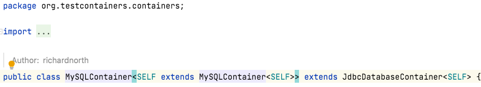

# Kotlin 1.6 출시

- 쓰는 기술인 Kotlin/JVM 위주로만 정리함
- 레퍼런스: [https://blog.jetbrains.com/kotlin/2021/11/kotlin-1-6-0-is-released/#language-features](https://blog.jetbrains.com/kotlin/2021/11/kotlin-1-6-0-is-released/#language-features)
- 예제: [https://kotlinlang.org/docs/whatsnew16.html#stable-suspending-functions-as-supertypes](https://kotlinlang.org/docs/whatsnew16.html#stable-suspending-functions-as-supertypes)

## 1. Language 기능들

### 1-1. Sealed (exhaustive) `when` statements

---

- Kotlin 은 항상 철저하게 `sealed class`, `enum`, `Boolean` 타입에 대한 표현식을 검사해왔다.
    - 이러한 데이터 타입으로 도메인을 모델링할 때 유용하다.
- Sealed `when`은 when 문이 완전하지 않은 경우 Kotlin 컴파일러가 경고하도록 하는, 오랫동안 기다려온 기능이다. 이렇게 하면 당신의 function 을 도입하지 않고도 코드를 더 안전하게 만들 수 있다.
    - ex> 연락수단
        - `sealed class` 계층으로 다른 연락수단 설정을 나타낼 수 있다.
            
            ```kotlin
            sealed class Contact {
               data class PhoneCall(val number: String) : Contact()
               data class TextMessage(val number: String) : Contact()
               data class InstantMessage(val type: IMType, val user: String) : Contact()
            }
            ```
            
        - 만약 다른 연락수단 설정에 따라 다른 결과를 반환하는 표현식(expression)을 작성하면, 앱에 있는 모든 타입을 처리하는 것을 잊어버린 경우 컴파일러에서 오류 플래그를 표시해준다.
            
            ```kotlin
            fun Contact.messageCost(): Int =
                when(this) { // Error: 'when' expression must be exhaustive
                    is Contact.PhoneCall -> 42
                }
            
            fun sendMessage(contact: Contact, message: String) {
                // Starting with 1.6.0
            
                // Warning: Non exhaustive 'when' statements on Boolean will be
                // prohibited in 1.7, add 'false' branch or 'else' branch instead
                when(message.isEmpty()) {
                    true -> return
                }
                // Warning: Non exhaustive 'when' statements on sealed class/interface will be
                // prohibited in 1.7, add 'is TextMessage' branch or 'else' branch instead
                when(contact) {
                    is Contact.PhoneCall -> TODO()
                }
            }
            ```
            
        - 이것은 코드 작성과 향후 유지 관리에 큰 도움이 된다. 나중에 다른 연락수단 설정 타입을 추가하면 컴파일러가 코드 전체에서 다양한 연락수단 설정 타입을 처리하는 것을 잊지 않았는지 확인한다.

- Kotlin 1.6 이전에는 완전하지 않은 `when` 문도 성공적으로 컴파일되었다.
    
    ```kotlin
    fun sendAnnouncement(contact: Contact, announcement: Announcement) {
       when (contact) {
           is Contact.PhoneCall -> schedulePhoneCall(contact.number, announcement)
           is Contact.TextMessage -> sendTextMessage(contact.number, announcement)
       }
    }
    ```
    
- 컴파일러의 메시지 없이 약한 IDE 검사만 보고되었다. Kotlin 1.6부터 다음 컴파일러 경고를 생성한다.
    
    ```kotlin
    Non-exhaustive 'when' statements on sealed class/interface will be prohibited in 1.7. Add an 'is InstantMessage' branch or 'else' branch instead.
    ```
    
- Kotlin 1.7부터는 오류로 되어 실수로 잊어버릴 가능성이 없다.

### 1-2. Suspending functions as supertypes

---

- Kotlin 1.6은 `suspend`함수형 타입을 `super` 인터페이스로 구현(`implement`)하기 위한 지원을 안정화했다.
    - Kotlin 코루틴 설계에서 누락된 부분 중 하나였다.
- Kotlin API 를 설계할 때, 다양한 라이브러리 함수의 동작을 사용자정의 할 때 함수형 타입을 허용하는 것이 관용적이다.
    - ex> `kotlinx.coroutines` API 의 Job 인터페이스에는 다음과 유사한 멤버 함수가 있다.
        
        ```kotlin
        fun invokeOnCompletion(handler: () -> Unit)
        ```
        
        → 이는 *`invokeOnCompletion*{ *doSomething*() }`  같이 편하게 쓸 수 있다.
        
    - 예제에서 Completion 처리하려는 클래스가 있는 경우, 추가 람다를 생성하지 않고 클래스에서 함수형 타입 `() -> Unit`을 직접 구현(`implement`)하여 코드를 간소화하고 최적화할 수 있다.
        
        ```kotlin
        class MyCompletionHandler : () -> Unit {
            override fun invoke() {
                doSomething()
            }
        
            private fun doSomething() {
                println("SFN 개발자들의 스코네시간")
            }
        }
        
        // 사용
        val mch = MyCompletionHandler()
        mch.invoke()
        ```
        

- Kotlin 1.6부터 이 최적화는 `suspend` 함수에서도 가능하다.
    - API 가 `suspend` 함수 타입을 이 같이 허용하면,
        
        ```kotlin
        public fun launchOnClick(action: suspend () -> Unit) {}
        ```
        
    - 그러면 더 이상 이 코드에 람다와 `suspend` 함수 참조를 전달하는 것으로 제한되지 않는다. 클래스에서 해당 `suspend` 함수 타입을 `implement`할 수도 있다.
        
        ```kotlin
        class MyClickAction : suspend () -> Unit {
           override suspend fun invoke() { doSomething() }
        }
        ```
        

### 1-3. Suspend conversions

---

- Kotlin 1.6은 일반 함수 유형에서 `suspend` 함수 타입으로의 변환을 안정화했다. 이제 적절한 일반 함수 타입의 표현식을 전달할 수 있다.(`suspend` 함수가 매개변수로 예상되는 곳에) 컴파일러는 자동으로 변환을 수행한다.
- 이는 Kotlin 에서 일반 함수와 `suspend` 함수 간의 상호 작용에서 작지만 성가신 불일치를 수정한다.
    - Kotlin Flow 의 `[collect](https://kotlin.github.io/kotlinx.coroutines/kotlinx-coroutines-core/kotlinx.coroutines.flow/collect.html)` 호출과 같이 `suspend` 함수를 허용하는 고차 함수가 있다. 이를 람다로 호출하는 대신 다음과 같이 할 수 있다.
        
        ```kotlin
        flow.collect { processItem(it) }
        
        fun processItem(item: Item) { /* ... */ }
        ```
        
    - 같은 효과를 얻기 위해 수집 호출에 processItem 함수에 대한 참조를 전달하는 것이 편리하다는 것을 알 수 있다.
        
        ```kotlin
        flow.collect(::processItem)
        ```
        
    - 그런 다음 코드의 동작을 사용자지정 하기 위해 처리 함수에 대한 참조를 변수로 추출한다. 그러나 1.6 이전의 Kotlin 버전에서는 작동하지 않았다. `suspend` 타입의 매개 변수로 전달되는 일반 함수가 있기 때문이다.
        
        ```kotlin
        val processingFunction = ::processItem
        flow.collect(processingFunction) // ERROR: Type mismatch
        ```
        
    - Kotlin 1.6에서는 위의 코드도 컴파일되고 작동한다.

### 1-4. Improved type inference for recursive generic types

---

- 1.6부터 Kotlin 컴파일러는 재귀 제네릭인 경우, 해당 타입 매개변수의 upper bound 기반만으로 타입 인수를 유추할 수 있다.(default) 컴파일러 옵션을 사용하여 개선할 수 있었다. 버전 1.6 이상에서는 기본적으로 활성화되어 있다.
- 이를 통해 Java 에서 빌더 API 를 만드는 데 자주 사용되는 재귀 제네릭 타입으로 다양한 패턴을 생성할 수 있다. ex> 테스트컨테이너 설정 내 도커 컨테이너 부분
    
    
    
    
    
    
    
    - `fn-product` 프로젝트 기준, 테스트컨테이너 설정 내 도커 컨테이너 부분을 보면
        
        ```kotlin
        // 1.5.10
        private val mySqlContainer = MySQLContainer<Nothing>("mysql:latest").apply {
                    withDatabaseName("mysqld")
                    withCommand(
                        "--character-set-server=utf8mb4",
                        "--collation-server=utf8mb4_0900_ai_ci"
                    )
                    start()
                }
        
        // 개선된 버전
        private val mySqlContainer = MySQLContainer("mysql:latest")
                    .withDatabaseName("mysqld")
                    .withCommand(
                        "--character-set-server=utf8mb4",
                        "--collation-server=utf8mb4_0900_ai_ci"
                    ).apply { start() }
        ```
        
        
        

### 1-5. Builder inference improvements

---

- 빌더 추론은 일반 빌더 함수를 호출할 때 유용한 타입 추론 특징이다. 람다 인수 내부의 호출에서 타입 정보를 사용하여 호출의 타입 인수를 유추할 수 있다. 완전히 안정적인 빌더 추론에 더 가까워지도록 여러 가지를 변경하고 있다.
- Kotlin 1.5.30에는 `-Xunrestricted-builder-inference` 컴파일러 옵션이 도입되어 빌더 호출에 대한 타입 정보를 빌더 람다 내부로 가져올 수 있다. 즉, `buildList()` 람다 내부의 `get()`과 같이 아직 유추되지 않은 유형의 인스턴스를 반환하는 호출 기능을 도입했다.
- 1.6부터는 이전에 금지된 호출을 수행하기 위한 `-Xunrestricted-builder-inference`를 지정할 필요가 없다. `Xenable-builder-inference`컴파일러 옵션과 함께, `@BuilderInference`를 적용하지 않고 고유한 일반 빌더를 작성하고 일반 타입 추론이 타입 정보를 확인할 수 없는 경우 자동으로 빌더 추론을 활성화할 수 있다.
- 사용자정의 일반 빌더를 작성하는 방법
    - 가이드: [https://kotlinlang.org/docs/using-builders-with-builder-inference.html](https://kotlinlang.org/docs/using-builders-with-builder-inference.html)

### 1-6. Supporting previous API versions for a longer period

---

- Kotlin 1.6부터 이제 2개 대신 3개의 이전 API 버전을 사용하여 개발할 수 있다(현재 stable 버전과 함께).
    - API 버전 1.3, 1.4, 1.5, 1.6

### 1-7. Stable instantiation of annotation classes

---

- Kotlin 1.5.30은 JVM 플랫폼에서 어노테이션 클래스의 인스턴스화에 대한 실험적 지원을 도입했다. 1.6에서 이 기능은 기본적으로 Kotlin/JVM 및 Kotlin/JS 모두에서 사용할 수 있다.
- 어노테이션 클래스의 인스턴스화
    - 가이드: [https://github.com/Kotlin/KEEP/blob/master/proposals/annotation-instantiation.md](https://github.com/Kotlin/KEEP/blob/master/proposals/annotation-instantiation.md)
    
    ```kotlin
    annotation class InfoMarker(val info: String)
    
    fun processInfo(marker: InfoMarker) = ...
    
    fun main(args: Array<String>) {
        if (args.size != 0)
            processInfo(getAnnotationReflective(args))
        else
            processInfo(InfoMarker("default"))
    }
    ```
    

### 1-8. Support for annotations on class type parameters

---

- 클래스 타입 파라미터에 대한 어노테이션 지원
    
    ```kotlin
    @Target(AnnotationTarget.TYPE_PARAMETER)
    annotation class BoxContent
    
    class Box<@BoxContent T> {}
    ```
    
- 모든 타입 매개변수에 대한 어노테이션은 JVM 바이트코드로 내보내져서 어노테이션 프로세서가 이를 사용할 수 있다.
    - 예시: [https://youtrack.jetbrains.com/issue/KT-43714?_gl=1*amgcq9*_ga*MTU2NzQ1MTc3Ni4xNjM0ODgyMzc1*_ga_J6T75801PF*MTYzNzIyNTk2NC42LjEuMTYzNzIyOTUyOC42MA](https://youtrack.jetbrains.com/issue/KT-43714?_gl=1*amgcq9*_ga*MTU2NzQ1MTc3Ni4xNjM0ODgyMzc1*_ga_J6T75801PF*MTYzNzIyNTk2NC42LjEuMTYzNzIyOTUyOC42MA)..&_ga=2.91484312.343703627.1637136332-1567451776.1634882375


## 2. Kotlin/JVM

- 우리가 IntelliJ 에서 디폴트로 쓰는 Kotlin component (JVM 11)
    - 셋팅은 👉  Language version 1.6으로 변경
        
        
        
    - `build.gradle.kts` kotlin 버전 1.6.0 으로 변경
- 참고> 우리 MSA 프로젝트들은 `build.gradle.kts` 하위에 JVM 11 을 사용하도록 셋팅됨
    
    ```kotlin
    import org.jetbrains.kotlin.gradle.tasks.KotlinCompile
    
    plugins {
        id("org.springframework.boot") version "2.5.0"
        id("io.spring.dependency-management") version "1.0.11.RELEASE"
        kotlin("jvm") version **"1.6.0"**
        kotlin("plugin.spring") version **"1.6.0"**
        kotlin("plugin.jpa") version **"1.6.0"**
        kotlin("kapt") version **"1.6.0"**
    }
    
    group = "com.smartfoodnet"
    version = "0.0.1-SNAPSHOT"
    java.sourceCompatibility = **JavaVersion.VERSION_11**
    ```
    
     👉   개인 IntelliJ 에서도 JVM 11 을 사용하도록 하자! (Target JVM version)
    
    
    

### 2-1. JVM 1.8 대상에 대해 `@Repeatable` retention 을 runtime 으로 설정 가능

---

- Java 8에는 단일 코드에 여러 번 적용할 수 있는 `@Repeatable`이 도입되었다.
    - 레퍼런스: [https://docs.oracle.com/javase/tutorial/java/annotations/repeating.html](https://docs.oracle.com/javase/tutorial/java/annotations/repeating.html)
    - 이 기능을 사용하려면 Java 코드에 두 가지 선언이 있어야 한다.
        - `@java.lang.annotation.Repeatable`표시된 중복 사용할 어노테이션
            - ex> `[@Chicken](https://github.com/kyh1126/java8-to-11/blob/e73e8be69c6ce1e864538e3fc27970ce8a952732/src/main/java/me/jenny/java8to11/_7_etc/Chicken.java)`
        - 해당 값을 보유할, 위 어노테이션을 포함하는 중복 어노테이션 컨테이너
            - 중복 어노테이션보다 `@Retention` 및 `@Target` 이 같거나 더 넓어야 한다.
            - ex> `[@ChickenContainer](https://github.com/kyh1126/java8-to-11/blob/e73e8be69c6ce1e864538e3fc27970ce8a952732/src/main/java/me/jenny/java8to11/_7_etc/ChickenContainer.java)`
    - 사용
        
        ```java
        @Chicken
        @Chicken("양념")
        @Chicken("마늘간장")
        public class AnnotationChange
        ```
        
- 1.6 이전에는 `SOURCE` retention 만 가능했고, Java 의 `@Repeatable`과 호환되지 않았다.
- Kotlin 1.6에서는 Java 와 호환되며 `@kotlin.annotation.Repeatable`은 이제 모든 retention을 허용하고 어노테이션을 Kotlin과 Java 모두에서 반복 가능하게 만든다. Java 의 `@Repeatable`은 이제 Kotlin 측에서도 지원된다.
    - `@Tag`가 `@kotlin.annotation.Repeatable`로 표시되면 Kotlin 컴파일러는 `@Tag.Container` 이름으로 포함하는 주석 클래스를 자동으로 생성한다.
        
        ```kotlin
        @Repeatable
        annotation class Tag(val name: String)
        
        // The compiler generates @Tag.Container containing annotation
        ```
        
    - 컨테이너 어노테이션에 대한 사용자정의 이름을 설정하려면 `@kotlin.jvm.JvmRepeatable` 메타 어노테이션을 적용하고 명시적으로 선언된 컨테이너 어노테이션 클래스를 인수로 전달한다.
        
        ```kotlin
        @JvmRepeatable(Tags::class)
        annotation class Tag(val name: String)
        
        annotation class Tags(val value: Array<Tag>)
        ```
        
    - Kotlin 리플렉션은 이제 새로운 기능인 `KAnnotatedElement.findAnnotations()`를 통해 Kotlin과 Java의 `@Repeatable`을 모두 지원한다.
        
        
        

### 2-2. 주어진 KProperty 인스턴스에서 `get`/`set`을 호출하는 위임된 속성(delegated properties) 최적화

---

- Delegated properties
    - 레퍼런스: [https://kotlinlang.org/docs/delegated-properties.html](https://kotlinlang.org/docs/delegated-properties.html)
- `$delegate` 필드를 생략하고 참조된 속성(referenced property)에 대한 즉각적인 액세스를 생성하여 생성된 JVM 바이트 코드를 최적화했다.
    
    ```kotlin
    class Box<T> {
        private var impl: T = ...
    
        var content: T by ::impl
    }
    ```
    
    - Kotlin은 더 이상 `content$delegate` 필드를 생성하지 않는다.
    - 변수 content 의 속성 접근자(Property accessors)는 impl 변수를 직접 호출하여 위임된 속성의 `getValue`/`setValue` 연산자를 건너뛰므로 KProperty 타입의 속성 참조 개체(object)가 필요하지 않다.


## 3. Kover 발표

- JaCoCo 와 같은 일부 훌륭한 도구는 Kotlin 코드와 함께 작동하지만 Gradle 도구 체인 및 멀티플랫폼 프로젝트와 완전히 통합되지 않았다. 이번 Kotlin 릴리스에서는 이 문제를 해결하기 시작했다. 이제 초기 개발 단계에 있으며 실험적입니다. [GitHub](https://github.com/Kotlin/kotlinx-kover/issues)에서 이에 대한 피드백을 보내주시면 감사하겠습니다.
- Kover: Kotlin/JVM 컴파일러로 빌드된 Kotlin 코드의 코드 커버리지를 측정하는 새로운 Gradle 플러그인
- 간략 소개 영상: [https://www.youtube.com/watch?v=jNu5LY9HIbw](https://www.youtube.com/watch?v=jNu5LY9HIbw)
    - 영상에서 코드 위주로만 보시면 될 것 같습니다.


## 4. Standard library

- 표준 입력, Stable typeOf(), Stable Duration API 및 기타 안정화된 stdlib 기능을 위한 새로운 기능이 있는 표준 라이브러리.
- 표준 라이브러리의 새로운 1.6 버전은 실험 기능을 안정화하고 새로운 기능을 도입하며 플랫폼 전체에서 동작을 통합한다.

### 4-1. **New readline functions**

---

- Kotlin 1.6은 표준 입력을 처리하기 위한 새로운 기능인 `readln()` 및 `readlnOrNull()`을 제공한다.
    
    <aside>
    💡 현재로서는 JVM 및 Native 대상 플랫폼에서만 새로운 함수를 사용할 수 있다.
    
    </aside>
    

- `readLine()!!` → `readln()`: stdin 에서 한 줄을 읽고 반환하거나 EOF 에 도달하면 `RuntimeException`을 던진다.
- `readLine()` → `readlnOrNull()`: stdin 에서 한 줄을 읽고 반환하거나 EOF 에 도달하면 `null`을 반환한다.

- 우리는 `!!`를 사용할 필요가 없다. read-line 연산 이름을 그것의 `println()` 대응물과 일관성 있게 만들기 위해 새로운 함수의 이름을 '`ln`'으로 줄이기로 결정했다.
    
    ```kotlin
    // ex1
    println("What is your nickname?")
    val nickname = readln()
    println("Hello, $nickname!")
    
    // ex2
    var sum = 0
    while (true) {
        val nextLine = readlnOrNull().takeUnless { 
            it.isNullOrEmpty() 
        } ?: break
        sum += nextLine.toInt()
    }
    println(sum)
    ```
    
- 기존 `readLine()` 함수는 IDE 코드 완성에서 `readln()` 및 `readlnOrNull()`보다 우선 순위가 낮다. IDE 검사에서는 레거시 `readLine()` 대신 새 함수를 사용할 것을 권장한다.
- 향후 릴리스에서 `readLine()` 함수를 점진적으로 deprecate 할 계획이다.

### 4-2. **Stable typeOf()**

---

- 버전 1.6은 Stable `typeOf()` 함수를 제공한다.
    
    
    
- 1.3.40부터 `typeOf()`는 JVM 플랫폼에서 실험적 API 로 사용할 수 있었다. 이제 모든 Kotlin 플랫폼에서 사용할 수 있고 컴파일러가 추론할 수 있는 모든 Kotlin 유형의 KType 표현을 얻을 수 있다.
    
    ```kotlin
    inline fun <reified T> renderType(): String {
        val type = typeOf<T>()
        return type.toString()
    }
    
    fun main() {
        val fromExplicitType = typeOf<Int>()
        val fromReifiedType = renderType<List<Int>>()
    }
    ```
    

### 4-3. **Stable collection builders**

---

- Kotlin 1.6에서는 컬렉션 빌더 기능이 Stable 로 승격되었다. 컬렉션 빌더가 반환한 컬렉션은 이제 읽기 전용 상태에서 serializable 이다.
- 이제 opt-in 어노테이션 없이 `[buildMap()](https://kotlinlang.org/api/latest/jvm/stdlib/kotlin.collections/build-map.html)`, `[buildList()](https://kotlinlang.org/api/latest/jvm/stdlib/kotlin.collections/build-list.html)`, `[buildSet()](https://kotlinlang.org/api/latest/jvm/stdlib/kotlin.collections/build-set.html)` 을 사용할 수 있다.
    
    ```kotlin
    val x = listOf('b', 'c')
    val y = buildList {
        add('a')
        addAll(x)
        add('d')
    }
    println(y)  // [a, b, c, d]
    ```
    

### 4-4. **Stable Duration API**

---

- 다른 시간 단위에서 기간을 나타내는 `Duration` 클래스가 Stable 로 승격되었다. 1.6에서 Duration API 는 다음 변경 사항을 받았다.
    - 기간을 일, 시간, 분, 초 및 나노초로 분해하는 `toComponents()` 함수의 첫 번째 구성 요소는 이제 `Int` 대신 `Long` 타입을 갖는다.
        - 이전에는 값이 `Int` 범위에 맞지 않으면 해당 범위로 강제 변환되었다. `Long` 타입을 사용하면 `Int`에 맞지 않는 값을 잘라내지 않고 지속 시간 범위의 모든 값을 분해할 수 있다.
    - `DurationUnit` enum 은 이제 독립형(standalone)이며 JVM 에서 `java.util.concurrent.TimeUnit`의 타입 별칭(alias)이 아니다.
        - `typealias DurationUnit = TimeUnit`이 유용한 설득력 있는 사례를 찾지 못했다. 또한 타입 별칭을 통해 TimeUnit API 를 노출하면 `DurationUnit` 사용자에게 혼란을 줄 수 있다.
    - `Int.seconds`와 같은 확장 속성을 다시 가져온다. 그러나 적용 가능성을 제한하고 싶으므로 `Duration` 클래스의 companion 으로 넣는다.
        - IDE 는 여전히 완료 시 확장을 제안하고 companion 에서 가져오기를 자동으로 삽입할 수 있지만, 앞으로는 `Duration` 타입이 예상되는 경우에만 이 동작을 제한할 계획이다.
        
        ```kotlin
        val duration = 10000
        println("There are ${duration.seconds.inWholeMinutes} minutes in $duration seconds")
        // There are 166 minutes in 10000 seconds
        ```
        
        - `Duration.seconds(Int)`와 같은 이전에 도입된 companion 함수와 `Int.seconds`와 같은 더 이상 사용되지 않는 최상위 확장을 `Duration.Companion`의 새 확장으로 교체하는 것이 좋다.
        
        <aside>
        💡 이러한 교체는 이전 최상위 확장과 새로운 동반 확장 간에 모호성을 유발할 수 있습니다. 자동 마이그레이션을 수행하기 전에 `kotlin.time` 패키지의 와일드카드 가져오기(`import kotlin.time.*`)를 사용해야 한다.
        
        </aside>
        

### 4-5. **Splitting Regex into a sequence**

---

- `Regex.splitToSequence(CharSequence)` 및 `CharSequence.splitToSequence(Regex)` 함수는 Stable로 승격된다. 그들은 주어진 정규식의 일치를 중심으로 문자열을 분할하지만, 이 결과에 대한 모든 작업이 lazy 실행되도록 결과를 시퀀스로 반환한다.
    
    ```kotlin
    val colorsText = "green, red, brown&blue, orange, pink&green"
    val regex = "[,\\s]+".toRegex()
    val mixedColor = regex.splitToSequence(colorsText)
    // or
    // val mixedColor = colorsText.splitToSequence(regex)
        .onEach { println(it) }
        .firstOrNull { it.contains('&') }
    println(mixedColor) // "brown&blue"
    ```
    

### 4-6. **Bit rotation operations on integers**

---

- Kotlin 1.6에서는 비트 조작을 위한 `rotateLeft()` 및 `rotateRight()` 함수가 Stable 이 되었다. 함수는 지정된 비트 수만큼 숫자의 이진 표현을 왼쪽 또는 오른쪽으로 회전한다.
    
    ```kotlin
    val number: Short = 0b10001
    println(number
            .rotateRight(2)
            .toString(radix = 2)) // 100000000000100
    println(number
            .rotateLeft(2)
            .toString(radix = 2))  // 1000100
    ```
    

### 4-7. **Deprecations**

---

- Kotlin 1.6에서는 일부 JS 전용 stdlib API 에 대한 경고와 함께 deprecation cycle 을 시작한다.
