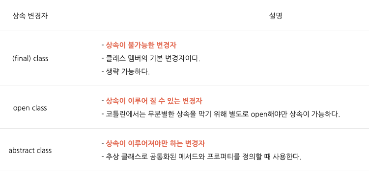

# abstract vs open classes

- java: 추상 클래스 구현을 만들어야 한다.
    - 상속을 불가능하게 만들기 위해서는 `final` 변경자를 붙여야 했다.
- kotlin: `open class`를 사용하면 상속 가능한 클래스를 만들면서도 자체적으로 사용할 수 있다. 인터페이스와 일반 클래스의 멋진 혼합
    - class 의 기본 상속 변경자: `final`

→ Kotlin의 상속 변경자 : `final`, `abstract`, `open`



## abstract

---

```kotlin
abstract class Person() {  // 1)
    abstract fun hello()   // 2)

    open fun hi() {     -> // 3)
        println("hi")   -> // 4)
    }

    fun ya() {          -> // 5)
        println("ya")
    }
}

class Bar : Person() {
    override fun hello {}  // 6)
}
```

- 1) `open`처럼 상속이 가능한 클래스가 된다
- 2) `abstract`는 구현체를 가질 수 없다(open과의 차이점) `{...}` body 없음
- 3) `open` 키워드가 상속받는 쪽에서의 오버라이드를 허용한다.
- 4) `open`은 구현체를 갖는다.
- 5) `open` 키워드가 없으면 property 나 function 은 `final` 취급되어 오버라이드 불가
- 6) `abstract`는 상속받은 쪽에게 구현을 강제한다.

- 추상클래스의 인스턴스 생성

    ```kotlin
    val foo = object: Person() {
        override fun hello() {
            ...
        }
    }
    ```

    - `object` 키워드: 익명 객체를 지정

## open

---

- Kotlin 에서 상속은 "클래스네임 : 부모클래스네임()" 형태로 작성한다.

```kotlin
open class Foo {
    open val x: Int get { ... }
}

class Bar1 : Foo() {
    override val x: Int = ...  //Property도 override가 가능하다.
}
```

```kotlin
open class Base {
    open fun v() {}
    fun nv() {}
}

class Derived : Base() {
    override fun v() {}  // 1)
}
```

- 1) `open` 키워드가 없으면 property 나 function 은 `final` 취급되어 오버라이드 불가

```kotlin
interface Foo {
    val count: Int
}

class Bar1(override val count: Int) : Foo

class Bar2 : Foo {          // 2)
    override var count = 0  // 3)
}
```

- 2) interface 는 생성자를 필요로 하지 않기 때문에 `()`를 붙이지 않는다.
- 3) `val`을 `var`로도 `override` 할 수 있다. 그 반대는 불가


- 참고
    - [https://gold.gitbook.io/kotlin/class/abstract](https://gold.gitbook.io/kotlin/class/abstract)
    - [https://gist.github.com/paulfranco/4453383cc6df064d03087ce7aa5a0c8c](https://www.notion.so/4453383cc6df064d03087ce7aa5a0c8c)
    - [https://kotlinworld.com/68](https://kotlinworld.com/68)


- [Notion link](https://jennyuni.notion.site/abstract-vs-open-classes-a5f9f905a6cb4c5aaf1670d8baea46e5)
