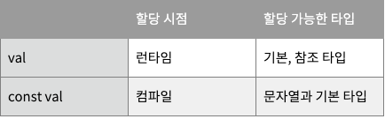

# val vs const val

## val

---

```kotlin
class MainActivity : AppCompatActivity() {
    val str = "JhDroid"

    override fun onCreate(savedInstanceState: Bundle?) {
        super.onCreate(savedInstanceState)
        setContentView(R.layout.activity_main)
    }
}
```

- 런타임 시 할당
- `val`로 선언한 변수는 코틀린에서 프로퍼티로 `get()` 함수를 가지는 변수
    - 해당 변수를 직접 변경할 수 없지만 `get()` 처리 방식에 따라 의도한 값과 다른 값이 나올 수 있음
    - 즉, 항상 초깃값만 반환하지 않음
- 위 코드를 자바 코드로 디컴파일하면 `get()` 함수가 생성된 것을 확인할 수 있다.
    - 파일의 class 외부에 위치한 `val`의 경우, `private static final` 로 보여진다.

    ```java
    public final class MainActivity extends AppCompatActivity {
       @NotNull
       private final String str = "JhDroid";

       @NotNull
       public final String getStr() {
          return this.str;
       }

       protected void onCreate(@Nullable Bundle savedInstanceState) {
          super.onCreate(savedInstanceState);
          this.setContentView(1300010);
       }
       ...
    }
    ```

- `get()` 함수의 처리 방식에 따라 의도한 값과 다른 결과가 나올 수 있다.

    ```kotlin
    val str : String
        get() {
            return if (str.isEmpty()) {
                "Jhdroid"
            } else {
                "Jhdroid_Blog"
            }
        }
    ```

## const val

---

```kotlin
object Constant {
    const val num = 1234
    const val str = "JhDroid"
    
    //에러
    //Const 'val' has type 'MainActivity'. Only primitives and String are allowed
    const val main = MainActivity()
}
```

- 컴파일 시 할당
    - 함수나 어떤 클래스의 생성자로 할당될 수 없다.
    - 일반적으로 `companion object` 안에 상수로 선언하게 된다.
- 오직 문자열이나 기본 타입으로 할당돼야 함
- 클래스나 함수 내부에서 선언 불가능 (클래스의 프로퍼티나 지역 변수로 사용 불가능)
    - 변수를 최상위 레벨로 선언하거나, `object`로 선언한 클래스에서만 사용 가능

- `companion object`에서 선언한 `const val` 변수는 에러가 발생하지 않지만 클래스 내부에서 선언한 `const val` 변수는 에러가 발생한다.

    ```kotlin
    class MainActivity : AppCompatActivity() {
        companion object {
            const val str = "JhDroid"
        }

        //에러
        //Const 'val' are only allowed on top level or in objects
        const val num = 1234
        
        override fun onCreate(savedInstanceState: Bundle?) {
            super.onCreate(savedInstanceState)
            setContentView(R.layout.activity_main)
        }
    }
    ```

- 자바에서의 `static final` 형태로 선언되게 된다.



- 참고
    - [https://jhdroid.tistory.com/14](https://jhdroid.tistory.com/14)
    - [https://kimch3617.tistory.com/entry/Kotlin에서-val-와-const-val-의-차이](https://kimch3617.tistory.com/entry/Kotlin%EC%97%90%EC%84%9C-val-%EC%99%80-const-val-%EC%9D%98-%EC%B0%A8%EC%9D%B4)


- [Notion link](https://jennyuni.notion.site/val-vs-const-val-dc3bf0efe679447e9dc81561bae73f4b)
