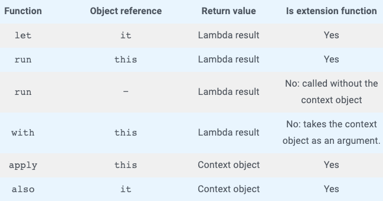

# 함수 선택

- 공식 레퍼런스: [https://kotlinlang.org/docs/scope-functions.html#function-selection](https://kotlinlang.org/docs/scope-functions.html#function-selection)



## 1. let

```kotlin
- Executing a lambda on non-null objects
- Introducing an expression as a variable in local scope
```

- `null`이 아닌 객체들에 대하여 람다를 실행할 때 or 지역 변수 범위를 제한하고 싶을 때

    ```kotlin
    var nullableValue: Int? = 5
    nullableValue?.let {
        // ...
    }
    ```

    - 위와 같이 작성하면 객체가 `null`이 아닌 경우 `let` 내부의 람다를 수행한다.
    - 하지만 불변 변수(immutable variable)에 사용하면 오히려 좋지 않다. 디컴파일을 해 보면 내부에 쓸데없는 변수가 생성된다. 이 경우는 `if (a != null) {}`과 같이 작성하는 것이 더 낫다.
- 위 상황 외에도 람다 내의 결과물을 반환하고 싶을때도 사용할 수 있다.


## 2. also

```kotlin
- Additional effects
```

- `also`는 람다의 결과가 수신 객체이다. 그렇기 때문에 내부에서 객체의 속성을 변경하지 않고 객체의 값을 검증한다거나 어떤 동작을 하는 경우 사용하도록 한다.
- 전달된 수신 객체를 전혀 사용하지 않거나 수신 객체의 속성을 변경하지 않고 사용하는 경우
- 객체의 사이드 이펙트를 확인하거나 수신 객체의 프로퍼티에 데이터를 할당하기 전에 해당 데이터의 유효성을 검사할 때 유용하다.

    ```kotlin
    class Book(author: Person) {
        val author = author.also {
          requireNotNull(it.age)
          print(it.name)
        }
    }
    ```


## 3. apply

```kotlin
- Object configuration
```

- `apply`는 수신 객체를 그대로 반환한다. 주로 객체를 생성하면서 프로퍼티에 접근하여 초기화(객체의 초기화)할 때 사용할 수 있다.
- 수신 객체의 함수를 사용하지 않고 수신 객체 자신을 다시 반환하려는 경우


## 4. run

```kotlin
- Object configuration and computing the result: run
- Running statements where an expression is required: non-extension run
```

- `run`은 이미 생성된 객체의 프로퍼티에 접근하여 변경하거나 어떤 연산을 할 때 사용할 수 있다.
- 또는 여러 지역 변수의 범위를 제한하고 변수들을 통해 수행한 람다의 결과를 얻을 때 사용할 수 있다.

    ```kotlin
    val inserted: Boolean = run {
        // person 과 personDao 의 범위를 제한
        val person: Person = getPerson()
        val personDao: PersonDao = getPersonDao()
        // 수행 결과를 반환
        personDao.insert(person)
    }
    fun printAge(person: Person) = person.run {
        // person 을 수신객체로 변환하여 age 값을 사용
        print(age)
    }
    ```


## 5. with

```kotlin
- Grouping function calls on an object
```

- `with`는 객체의 여러 함수 호출을 묶는 데 사용할 수 있다.
- Non-nullable (`null`이 될수 없는) 수신 객체이고, 결과가 필요하지 않은 경우

    ```kotlin
    val person: Person = getPerson()
    with(person) {
        print(name)
        print(age)
    }
    ```

- 참고
    - [https://doitddo.tistory.com/91](https://doitddo.tistory.com/91)
    - [https://kotlinexpertise.com/coping-with-kotlins-scope-functions/](https://kotlinexpertise.com/coping-with-kotlins-scope-functions/)
    - [https://medium.com/@limgyumin/코틀린-의-apply-with-let-also-run-은-언제-사용하는가-4a517292df29](https://medium.com/@limgyumin/%EC%BD%94%ED%8B%80%EB%A6%B0-%EC%9D%98-apply-with-let-also-run-%EC%9D%80-%EC%96%B8%EC%A0%9C-%EC%82%AC%EC%9A%A9%ED%95%98%EB%8A%94%EA%B0%80-4a517292df29)


- [Notion link](https://jennyuni.notion.site/431229c457dc4806b3191ebef2d09bc9)
