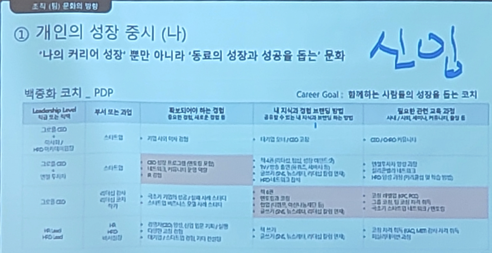

# 팀장도 사수가 필요해

- 2024-11-02: [https://slashpage.com/slit/ndvwx728n6n7523z6jpg](https://slashpage.com/slit/ndvwx728n6n7523z6jpg)

## 1. 리더는 항상 옳다 - 우미영님

---

### 리더로 일하며 매일 나에게 던진 질문: 어떻게 잘 할 수 있을까?

---

- 실무에서 손을 떼도 될까?
    - 창업할 거 아니면 실무를 놓으면 안 된다고 들었다.
- 어떻게 팀원들의 실력을 높일 수 있을까?
    - A, B 팀원이 결과는 같지만, 과정이 다르다면 문제가 될 것 같은 부분을 같이 참여해서 파악해본다.
- 내가 좀 더 큰 일을 할 수 있을까?
    - 80% 정도 준비되고 채워야 할 20%가 뭔지 알 수 있다면 그냥 해보자

### 나를 향한 질문 못지 않게 강력한 질문

---

- 직원들이 입사하기 전 2주전에 다음의 질문을 보냈다. 개별적으로 회신달라고 했다.
    - 본인을 소개해 주세요
    - 비즈니스에 어떤 문제들이 있고 그 문제를 어떻게 풀어 가는 게 좋을까요?
    - 출근하고 싶은 직장이 되기 위해 필요한것은?
    - 새 대표에게 바라는 바는?

- 모르는 것에 대해 모른다고 얘기하고 의견을 구하는 것이 훨씬 옳은 답을 내는 방법이다.
    - 본인들이 낸 답이기 때문에 참여도가 훨씬 좋다.

### 문화

---

- 설마 문화가 전략에 우선할까?
    - 마이크로소프트에 새로온 CEO(나델라)가 문화의 큐레이터다 하면서 문화를 바꾸기 시작했다. (이 시점에 마소는 많이 성장했다)
    - 2016년에 16시간 만에 트위터 챗봇 서비스를 중단했는데, '리더는 직원을 다그치면 안되고 문제를 푸는 데 방패막이가 되어주어야 한다'고 했다.

- 어떻게 좋은 문화를 만들고 지킬 수 있을까?
    - 고객 중심 문화를 위한 메커니즘, 아마존의 PRFAQ
        - 아마존에서 메커니즘이 중요함을 깨달았다. 회의실에 보조의자를 놓고, 고객이 거기서 듣고 있다면 어떤 생각을 할까 취지에서 보조의자를 뒀다.
        - PRFAQ: 보도자료와 FAQ 쓰기
            - 제목
            - 부제
            - 문제점
            - 솔루션
            - 내부 관계자의 말
            - 이용 방법
            - 고객의 말
            - 마무리
            - 내부용 FAQ
            - 외부용 FAQ

### 리더는 항상 옳다

---

- 항상 옳게 행동하라 - by. 아마존의 14개의 리더십 원칙 (제프 베조스)
    - 훌륭한 리더들은 대부분 옳게 행동한다. 우리가 항상 옳을 수는 없겠지만, 그것도 계속 연습하다 보면 더 자주 옳을 수 있다고 생각한다.

### Q&A

---

1. IT에 대한 이해도가 낮은 분들을 설득하기에 좋은 방법들이 무엇이 있을까요?
    - 그 사람의 단어로 얘기해줘야 한다.
2. 리더에 가장 적합한 성향은 무엇인가요?
    - 리더의 가장 중요한 자질: 팀을 우선시 할 수 있는 것
3. 직급상 더 올라갈 수 있는 부분이 없다면 나를 발전시킬 원동력을 찾는 방법?
    - 직급이 중요하다고 생각하지 않는다. 내가 좀 더 유능한 사람이 될 수 있는 것이 목표가 되어야 한다.
4. 팀의 규모별로 특히 주의해야 할 점들이 무엇인지 궁금합니다!
    - 커뮤니케이션
5. 원팀으로 일하기 위해서 어떻게 하면 한 방향을 바라보고 열중해서 즐겁게 일하게 할 수 있을까요?
    - 한 방향을 바라볼 수 있도록 하는 역할을 리더가 해야 한다.
    - 회사에서 우리팀이 차지하는 포지션, 어떤 결과를 내야하는지 명확하게 설명해주고 이해도를 얼라인 시켜줘야 한다.
    - 리더는 긍정적인 마인드와 에너지가 있어야 한다.
6. 여러 직군들이 함께 일할 때, 좋은 협업을 만들어 내기 위해 어떤 노력이 필요한가요?
    - 다른 팀이 하는 일을 잘 알아두면 좋다.
7. 가장 어려웠던 시기와 극복스토리?
    - 애 동영상 보고 목소리를 듣게되어서 울었다. 주변의 도움을 받으려고 노력했다.
8. 어떤 팀원까지(?) 겪어보셨는지 궁금해요
    - 저사람 입장에선 저렇게 생각하겠구나 라고 입장을 이해할 수 있기 때문에, 일 못하는 사람은 만난 적 있지만, 나쁜 사람은 없었다
9. 조직에서 필요한 정치란 무엇이라고 생각하시나요?
    - 개인적 이득이 아니라, 팀을 위한 외교로 관점을 바꾸게 되면 굉장히 필요하고 긍정적인, 리더가 해야하는 역할이다.
10. 해당 조직에서 리더보다 오래 일했던 팀원이 있을 때, 리더가 직접 채용하지 않은 사람과 함께 일하게 되었을 때, 리더가 그 사람보다 해당 업무의 실무 경험이 많지 않을 때, 어떻게 가장 빠르게 팀원들의 신뢰를 얻을까요?
    - 직접 채용하지 않은 많은 팀원들과 함께 일하게 되어도 신뢰를 얻을 수 있다.
11. 리더 초보인 사람과 초보가 아닌 사람을 구분할 수 있으신가요?
    - 그렇다. 초보 팀장은 복잡한 상황을 해결해나가는데 차이점이 있다. 그렇지만, 베테랑 팀장도 다 초보 시절을 겪어낸 사람들이다. 같이 해줬으면 좋겠다 라고 말할 수 있는 용기만 있으면 된다.
12. (현장질문) 어떻게 원팀처럼 갈 수 있는지?
    - 내가 회사를 움직이는 리더 중 한명이라고 생각해야 한다. 조직의 문제 중에서 팀원들의 문제는 아무것도 없다라고 생각한다.
        
        → 팀원이 옳다가 아닌, 리더의 문제라고 생각한다. 리더가 심각하게 생각하고 행동해야 한다.
        
    - MS에서는 평가 방식을 바꿨다 → 경쟁보다는 협력이 중요하다는 문화를 확립하고자 했다.
        - 다른 팀과의 협업 성과
        - 공유 자원의 활용 및 지원
        - 팀 간 연결과 정보 전달
        - 조직 전체의 가치 증대에 기여

## 2. 팀장이 마음놓고 부재할 수 있는 팀 만드는 법 - 넥슨네트웍스 QA팀 지선혜님

---

- 부제: 주체적인 팀 만들기
- 팀장이 가장 많이 하는 고민: 마음 편히 연차 사용하고 싶다
    - 팀원이 주체적으로 움직이고 팀장은 그것을 신뢰한다.

- 팀원이 주체적으로 움직이게 하는 방법
    1. 명확한 업무 목표와 방향성 제시
        - 충분한 고민을 통해 나부터 이해해야 한다.
            - 그냥 시키는건지 팀원이 다 알아챈다
        - 최대한의 정보를 오픈하며, 동일한 끝 그림 구상해야 한다.
        - 팀장이 생각하는 우선순위에 동기화해야 한다.
            - 빨리 끝내야 하거나 중요도가 높은 것들을 일치시켜야 한다.
        - 부정적인 의견을 외면하지 않기
            - ex> 너무 바빠요 → 왜 그런 고민을 하는지 들어봐야 한다.
    2. 자율성 부여 및 신뢰 관계 형성
        - 필수 가이드라인 제시 후 스스로 고민할 수 있도록 함
            - 가이드, 마감일 정도까지만 제시하고, 자율적으로 두어 본인의 업무가 되게 한다.
        - 팀장과 동기화 시점까지 지속적인 피드백 진행
        - 적절한 권한 부여
    3. 정보를 공유할 수 있는 채널 생성
        - 팀원 별 진행 일감을 확인할 수 있는 환경 마련
        - 주기적으로 개인 별 진행상황 공유 자리 마련
        - 자유로운 의견 공유 분위기 셋업

→

😃 팀원이 주체적으로 움직이고 팀장은 그것을 신뢰한다 == 팀원은 해야 할 일을 알고 있고 팀장은 팀원이 하는 일을 알고 있다.

### Q&A

---

- 팀장은 팀과 구성원의 성장이 목표이다.
- 실무를 다 파악할 수 있다면 좋지만, 어렵다면 내가 원하는 답을 누가 줄 수 있는지를 알면 된다.
- 정말로 모든 것을 다 전달해줬나요?
    - 당당하게 네! 라고 할 수 있을 때까지 교육해보세요
- 내향형이라 힘들어요.
    - 팔로워형의 리더쉽도 있다는 것을 기억해라.
    - 당신이 리더의 자리에 있다면, 조직에서 그렇게 판단한 것이다.

## 3. 그땐 미처 알지 못했지 - 컬리 주문이행프로덕트 박수석님

---

- 모두가 정답이 될 이유가 있다.

- 팀장이 하는 일은? 👉 결정
    - 회사의 전체 방향성(vision, mission)
- 최악의 팀장 👉 결정하지 않는 팀장
    - 책임지지 않으려는 팀장

- 왜 결정하지 않을까?
    - 팀원들이 싫어할까봐
        - 자신의 역량과 직감을 믿고 결정하기
        - 팀원들의 팔로어십을 믿자
    - 잘못된 선택일까봐
        - 팀장의 선택도 틀릴 수 있다.
            - 잘해야지 ⭕, 잘해야만해 ❌
        - 그래야 팀원도 실패할 수 있다.
        - 빠르게 실패, 검증, 보완
        - 자신의 역량을 믿고 최선을 다해 끌고가기
        - 실패를 극복하며 팀원들과의 연결고리가 만들어진다.

- 팀원들의 말을 모두 들어줄 필요는 없다.
    - 팀원들이 모두 원한다고 정답은 아니다.
        - 내 결정이 맞다는 확신이 있다면 밀고 나가야 한다.
    - 팔로어십이 좋은 사람과 일하자
    - 정렬이 중요하다.

- 신뢰가 가장 중요하다.
    - 가장 무서운말: 팀장님 시간 되세요? → 팀원의 퇴사를 두려워 말자
        - 회사와 팀원은 계약관계
        - 나와 팀원은? 관계의 스키마(인식의 창) 👉 새로운 관계!
    - 알아서 잘하겠지 ❌
        - 룰을 만들어줘야 한다 == 조직 문화
    - 회사에 기대하는 것: 팀장과 팀원이 하기 나름이다.
        - 급여
        - 성장
            - 일하는 속도가 빨라짐
            - 할 수 있는게 많아짐, 영향도가 많아짐
    
    → 급여 x 성장 = 성과
    
    - 1 on 1, 피드백, 목표설정, 측정을 해준다
        
        → 신뢰가 생긴다.
        

- 주의할 점
    - 상자(자기기만) 안에서 나올 것 - (상자밖에 있는 사람 책 추천)
        - ex> Slack 소환했는데 팀원이 1시간 동안 답변 없을 때
            1. 그냥 내가 한다
            2. 끝까지 기다린다
            
            🥲 자기 합리화를 위해 대화가 아닌, 의도를 추측하여 대상을 왜곡하여 이해
            
    - 때로는 외로움도!
        - 팀원들과 나누면 동료 의식도 생긴다.

❗중요한 것: 결정, 정렬

## 4. 퇴사율 0% 팀 문화 구축기: 나다움 활용하기 - 코멘토 프론트엔드 유성실님

---

- 나다움의 중요성
    - 타고난 기질과 경험을 연결해 성장하는 사람
- 외부 활동으로 인사이트를 얻는다.
- 리더십에 정답은 없다

- 팀 문화도 조직 문화다
    1. 기질과 경험을 활용하기: ISFJ - (테크니컬 리더 책 언급)
    2. 평소 팀원들을 관찰하며 도울만한 부분 찾기
    3. 경험 또는 사례에서 영감얻기
    4. 우리팀에 맞게 조정하고 실험하며 정착시키기

## 5. 요즘 팀장 생존법 - 메가존클라우드 현지환님

---

- 꽤 무거운 현실의 이면입니다.
- 여러분에게 질문
    - 팀장이 처음인가요?
    - 팀장 교육 받으셨어요?
    - 어떤 팀장이 되고 싶은가요?
    - 이걸요? 제가요? 왜요?
    - 여러분의 팀은 평화로운가요?

- 노무부 고소건
    - 팀 스터디하자: 업무 외 시간 노동 강요
        
        → 노동부 진정 건, 혐의 없음
        
    - A,B 는 업무중이니 C에게 줄게: 의미있는 일을 특정 직원에게만 몰아준다
        
        → 사내 진정 건, 혐의 없음
        
    - 팀 성과가 안좋으니 개인 성과 안좋은 걸 이해해라. 피드백은 딱히 없다
    → 피드백 미비는 팀장의 의무소홀로 판단, 견책

- 팀장이 되고 싶으셨나요?
    - 회사는 어떤 목표를 가지고 있는지, 팀의 목표와 일치하나요?
    - 여러분의 팀은 진짜 평화로운가요?

- 직장 내 괴롭힘: 사용자와 근로자 사이
    - 직장에서의 지위나 관계 등의 우위를 이용하는 행위
    - 업무상 적정 범위를 넘는 행위
    - 신체적, 정신적 고통을 주거나 근무 환경을 악화시키는 행위
    
    → 따라서, 분쟁이 생기지 않도록 하는 것이 최선이다. 그래서 우리가 HR을 배워야 한다.
    

- 작은 조언
    1. HR 학습하기
        - 회사에서 교육을 하지 않았더라도 직위에 의한 조건이 성립하기 때문에 '당연한' 의무가 발생한다고 함. 따라서, 배우고 배우고 또 배워야 할 것 (HOW는 찾아보기!)
    2. 리더십 원칙 세우기
        - 팀을 이끄는 방법, 공정한 업무 분배, 3 Why에 응답 가능한 기준 등 리더가 해야 할 중심을 잡고 모든 업무에 대한 로깅을 할 것
    3. 존중하기
        - 팀원들을 존중하는 마음을 갖고, 행동 언어와 음성 언어 등에 모두 유의해야 한다.

- 팀원을 어떻게 바라볼 것인가
    - 확실한 동료. 적이 아니다.
    - 하지만 무지는 위험하다.

## 6. 패널 토크

---

- 알아서 잘하는 사람이 있는 반면, 아닌 사람이 있다.
    - 위임의 단계가 있다.
- 팀원들의 말을 다 수용하려고 한다?
    - 토론 후 수용해야 하는 것과, 팀장이 의사결정하고 요청해야 하는 건 결이 다른데,
        
        👉 회사가 가고자 하는 방향성이 기준이다.
        
    - 설득, 설명하면서 그 방향으로 가고자 한다.
- 팀원들 간의 관계가 좋을 것이라고 생각했다. 팔로워들 간의 관계도 중요할텐데 관심과 관리를 어떻게 하시는지?
    - 매 달마다 개발 세미나 하는중인데, 이분 이거 잘하시니 발표해보세요 하면 다들 그 사람의 장점을 인지하게 된다.
    - 팀 내 공통된 룰을 따르지 않은 사람은 잘못한 것이다. 유연하지 않은 분은 결국 적응 못하고 퇴사하시게 된다. 너무 에너지 쏟기 보다는, 관계 좋은분을 붙들자.
    - 활발한 분위기가 되면 도움이 되니, 팀장이 원칙을 갖고 꾸준히 끌고가야 한다.
    - 갈등이 생겼을 때 초기에 알아채기 힘든데, 초기에 바로잡지 않으면 힘들다. 그럴 경우 HR과 같이 얘기해봐라.
    - 업무 역량 차이가 날 때 이런 경우가 생기는데, 팀장이 그 상황을 알고 있다라는 걸 공유하고 성과에 반영할 거라고 미리 얘기해놓아야 한다.
- 1 on 1을 어떻게 잘 활용할 수 있을까?
    - 1 on 1 해도 목표가 없으면 사람과 사람 사이, 관계 논의만 하게 된다.
    - 목표를 되짚어주고 액션플랜 어떻게 진행되는지 체크
    - 목표관리, 감정적인 부분도 들어주면서 관리한다.
    - 5점까지 점수를 기재해오라고 한다.
    - 피드백 하고싶은 말을 적어두고, 팀원도 생각을 하고 와달라고 한다. 먼저 들어보고 피드백을 드린다.

## 7. 요즘 시대 리더쉽, 조직문화 - 그로플 CEO 백종화님

---

- pdf 공유 예정

