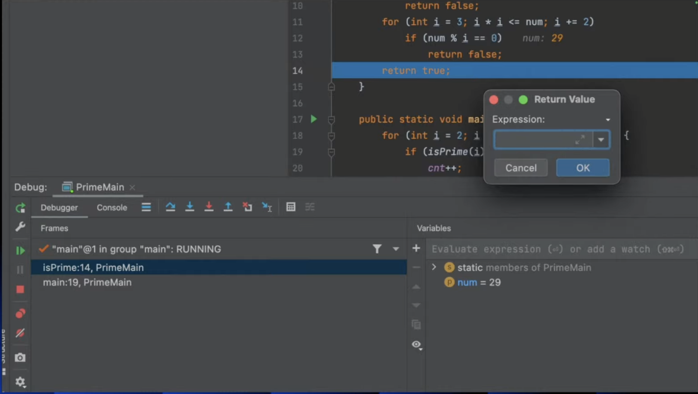

# Practical Debugging at Scale: Do you really know how to debug effectively? by Shai Almog

- link: [https://www.youtube.com/live/l6Rn0dsfK34](https://www.youtube.com/live/l6Rn0dsfK34)

## Return Immediaetly

---

## Jump To Line

---

- Plugin: [https://plugins.jetbrains.com/plugin/14877-jump-to-line](https://plugins.jetbrains.com/plugin/14877-jump-to-line)
- drag the execution point
    
    
    

## Field Watchpoint

---

## Tracepoints/Logging

---

## Method Breakpoints that Rock!

---

## Exception Breakpoints that don’t Suck

---

## Asynchronous Stack Traces

---

## Async Annotations

---

## Watch the Return Value

---

## Object Marking

---

## See all objects in the VM!

---

## Filter Collections

---

## Stream Debugger

---

## Rendering

---

- Runtime시엔 전혀 영향안주고 Debugging(컴파일)중에만 유용한 어노테이션

## Memory Debugging

---

- 메모리 디버깅은 매우 비싼 도구여서 디폴트로 꺼져있다. 필요없을 땐 사용 X. 이걸 키면 강력한 컴퓨터에서도 매우 비싸다는걸 느낄 수 있다.
    
    
    

## Thread Debugging

---

### Debugging Deadlocks

---

