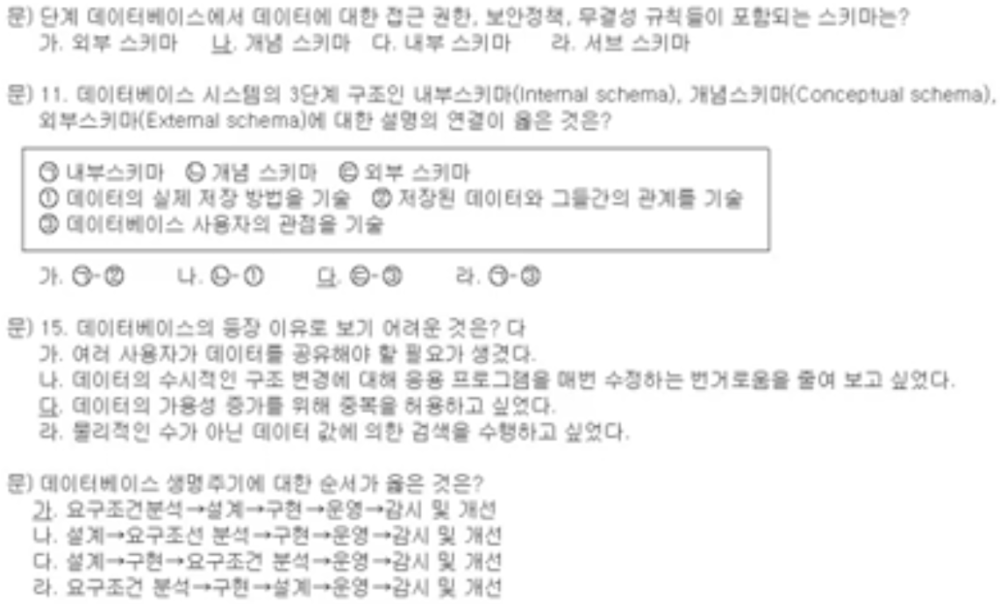

# SQLD 보수교육

# 1. 데이터베이스 개요

---

## 가. 데이터베이스의 정의

---

- 업무에서 사용되는 데이터를 인식하되 서로 관련되는 데이터들을 일정한 체계와 순서로 모아놓은 데이터의 집합
    - 중복이 배제된 통합된 데이터의 집합
    - 컴퓨터화하여 저장된 데이터
    - 조직의 기능을 수행하는데 반드시 유지해야 할 운영데이터
    - 한 조직에 있는 여러 응용 시스템들이 공동으로 소유하고 유지하며 이용하는 공용 데이터

- 또 다른 데이터베이스의 관점
    1. 지속적인(지속성 있는) 데이터: 특정 조직에서 응용시스템에 사용하는 지속적인 데이터의 집합
    2. 개체와 연관성: 개체는 Entity(개체; File; Table과 동의어)로 부르며, Entity들은 상호간의 관계성(Relationship; 업무 관련성; Fields)을 가지고 있음.
    3. 성질(Property)은 속성(Attribute; Column; Fields)이라고 부르며 데이터베이스를 구성하는 가장 작은 데이터 단위를 말함.

## 나. 데이터베이스의 목적

---

- 서로 다른 형태의 데이터(사용자 관점)의 통합화
- 중복된 데이터의 일관성 유지
- 저장된 데이터의 정확성을 보장하는 무결성 유지
- 데이터 중복의 최소화
- 업무상 데이터의 공유
- 데이터의 보안성 달성
- 데이터의 논리적, 물리적 독립성
- 데이터의 표준화 달성

- 무결성(Integrity)의 정의
    - 데이터베이스 내의 특정 데이터는 특정의 시점에 특정의 동일한 값과 동일한 형태를 유지해야 하며, 데이터베이스 구축 시 가장 중점을 두는 사항이다.
- 데이터베이스의 장점
    - 데이터의 압축성(통합성), 많은 종이파일 불필요, 처리속도, 단조롭고 고된 작업의 감소, 현재성(최신정보의 항상 이용)

## 다. 데이터베이스의 구조

---

- 외부 스키마
    - 사용자 개개인이 보는 자료에 대한 관점에서의 데이터 모델 Sub Schema 또는 사용자 뷰, Individual Schema
- 개념 스키마
    - 다양한 사용자의 정보 요구사항의 기술과 통합을 통해 데이터 모델을 작성.
    - 즉, 개별 사용자 뷰를 대상으로 분석 및 설계를 하여 엔티티(Entity; Table), 애트리뷰트(Attribute; 속성) 및 관계(Relationship) 등으로 표현하고, 점진적으로 여러 사용자 뷰를 대상으로 종목과 상호 불 일치되는 점을 제거하여 최종적으로 하나의 개념적 데이터모델을 만든다.
    - ex> 개체 관계도 (Entity - Relationship Diagram), 무결성 규칙(Integrity Rule)
- 내부 스키마
    - 주어진 DBMS 및 하드웨어의 계약조건 하에서 여러 가지 처리 요구사항 등을 최대한 만족시킬 접근방법을 선택하고 레코드 저장방법을 설계하여, 저장공간을 계산하는 등 데이터가 실제로 저장되는 방법과 관련 있는 모델.

- 사원이라는 개념스키마는 사원을 보는 사용자 개개인에 따라서 관리직 사원, 생산직 사원, 노조에 가입한 사원, 노조에 비 가입한 사원 등으로 다를 수가 있는데(외부 스키마), 데이터를 정련(Refine)해 나가는 과정에서 동음이의어, 이음동의어 및 중복된 자료가 통합되어진다.

# 2. 데이터베이스 관계원리

---

## 가. 관계

---

### 1) 관계관련 용어해설

---

- 데이터(Data)
    - 현실세계에 대해 전체가 아닌 특별히 관심을 끄는 부분을 표현한 것
    - ex> 만년필, 종이, 사람 이름 등
- 모집단(Population)
    - 비슷한 유형의 자료(개체)들을 포함하는 현실세계의 일부분으로써 주제영역(Subject Area), 개체(Entity)그룹을 들 수 있다.
    - ex> 영업 데이터, 물품 명세(창고 안의 물품+물품 공급자+물품 주문 등)
- 개체(Entity; 개체; File)
    - 모집단을 구성하는 개체, 개체
- 속성(Attribute; Column; Field 등)
    - 개체를 구성하는 더 이상 분리할 수 없는 정보단위
- 건(Row; Record; Instance; Object)
    - 개체의 1건(개)을 말함

- 데이터는 기업의 업무활동 중 보고서, 양식, 전표 등에 들어있다. 데이터는 물품 명, 자동차바퀴 모델 번호 등의 가장 최소의 단위에서부터 자동차, 도시, 물품처럼 여러 개의 데이터로 이루어진 그룹 성격의 데이터가 있으며 물품, 제품, 상품, 물건 등 동일한 데이터로써 이름만 다른 이음동의어가 있는 등의 데이터 특성이 존재한다.

### 2) 관계의 정의

---

- 관계(Relation)
    - 모집단 개개의 개체들이 관련 지어지는 방법을 기술한 것으로써, 대개 업무에 관련된 개체들끼리의 관계를 정의한다.
- 관계성(Relationship)
    - 두 개의 개체들 간에 존재하는 기수성(Cardinality)과 선택성(Optionality)을 관계성이라고 하며, 기준이 되는 기준개체(주체; Subject)와 행위를 받는 상대개체(객체; Object) 사이의 관계성을 구하는데, 개체간의 데이터 추출 시 데이터 접근방법(Access Method; Pointer or Column Join을 위한 외부 키)을 제공한다.
    - ex> 각 고객은 하나 이상의 주문을 한다.(기수성)
    - ex> 각 주문은 하나의 고객으로부터 만 나온다.(선택성)

- 데이터베이스는 서로 관련되는 데이터를 모아놓은 것으로써(ex> 고객, 주문…), 만약 특정 고객(’홍길동’)이 1996년 1월 1일 ~ 1997년 1월 30일까지의 주문현황을 구하는 요구가 있을 때 특정 고객인 ‘홍길동’을 고객 데이터에서 찾은 후, ‘홍길동’이란 고객이 주문한 주문사항을 주문데이터에서 찾아야 한다. 이것을 우리는 고객 데이터와 주문 데이터는 관계가 있다고 하며, 관계성을 구하여 부모 개체와 자식 개체를 식별하게 되는데 부모 개체가 기준이 되어 자식 개체의 해당 자료를 찾게 된다. 계층구조 DB, 네트워크 DB는 Pointer를, 관계형 DB는 부모 개체의 기본 키를 자식 개체의 외부 키로 넣어준다.

### 3) 관계의 종류

---

- 이진관계(Binary Relationship)
    
    
    
- N-ary관계
    - 관계까 다대다(Many to Many)일 때 교차개체를 사용하여 일대다로 만들어줌.
    
    
    
- 링 관계
    
    
    

- 관계추출 사례
    - 창고는 부품들을 관리한다.
    - 공급자는 수요자에게 부품을 판매한다.
    - 구매요청서는 서로 다른 다수의 부품들의 판매 및 선적을 요청한다.
    - 송장은 화물의 반송 및 도착을 알린다.
    - 청구서는 하나 또는 그 이상의 화물에 대한 대금지불을 요청한다.

## 나. 관계와 그래프

---

### 1) 그래프의 정의

---

- 그래프: 정점과 호로 구성
- 정점: 원소, 한 관계성을 이루는 주체 또는 객체
- 호: 두 원소 사이의 관계
- 모집단: 원소들의 집합이며, 정점들의 집합에 의해 그래프에 표현
- 선형 그래프: 세 개의 관계성을 묘사
    
    
    
- 비 선형 그래프: 세 개 이상의 관계성을 묘사
    
    
    

### 2) 그래프 관계의 분류

---

- 반사 관계: aRa
    - 관계성에서 주체와 객체가 동일
    
    
    
- 대칭관계: aRb = bRa
    - 어떤 관계성에서 주체와 객체를 서로 바꾸었을 때 또 다른 참인 관계성이 생길 경우
    
    
    
- 전이관계: aRb, bRc, cRa
    - b는 aRb의 객체이고 bRc의 주체
    
    
    

- 반사관계: 사원(관리자)이 사원을 관리한다.
- 대칭관계: ‘홍길동’은 ‘홍악동’의 형제이다. ‘홍악동’은 ‘홍길동’의 형제이다.
- 전이관계: 고객(a)은 주문(b)을 하고, 주문(b)은 주문품목(c)으로 구성한다. 고객(a)은 주문품목(c)을 주문했다.
- 관계의 다중성
    - 일대일: ‘각 고객은 단 하나의 주문만을 한다.’
    - 일대다: ‘각 고객은 하나 이상의 주문을 한다.’
    - 다대일: ‘여러 고객은 하나의 도시에 거주한다.’
    - 다대다: ‘여러 고객은 여러 도시에 거주한다.’

### 3) 관계의 순서

---

- 순서 관계 키
    - 관계의 가장 중요한 형태로 서로에 대한 각 원소들의 위치를 나타냄
    - 선행순서(P): aPb. 원소 a는 원소 b보다 위치상으로 앞에 있다는 의미
    - 후행순서(P*): bP*a. 원소 b는 원소 a의 뒤에 위치
- 순서 파일 (Ordered File)
    - 파일에서 레코드나 세그먼트의 위치가 그것들의 키에 의해 결정
    
    
    

- 키(Key)
    - 한 레코드나 세그먼트는 유일한 값을 갖는 필드 또는 필드의 집합을 갖는다.
- Key b > Key a, aPb: a Precede b
    - 오름차순 정렬(Default): 작은 주소의 레코드는 작은 키 값을 갖는다.
- 순서 파일의 특징
    - 장점: 각 레코드들의 상대적인 위치를 알 수 있다.
    - 단점: 한 레코드를 첨가 또는 삭제시키려고 할 때, 다른 많은 레코드들의 실제적인 위치를 변경시켜야 한다.

### 4) 연결 리스트 (Linked List)

---

- 레코드 안에 다음 레코드의 위치를 가리키는 포인터가 있고, 마지막 레코드에 터미널 플래그 표시(*)가 됨.
- 레코드의 첨가 또는 삭제가 쉬움
    
    
    
- aPb: Point a = loc b
    - 레코드a는 레코드b보다 먼저 위치하기 때문에 레코드a의 포인터 필드에서 레코드b의 위치를 찾을 수 있다.
    
    
    

- 연결리스트와 관련된 데이터베이스 접근방법: DAM (Direct Access Method)

### 5) 그래프와 구조

---

- 트리 구조를 갖는 계층 데이터베이스
- 중복된 루프의 성질을 갖는 네트워크 데이터베이스
- 테이블과 행렬을 이용한 관계형 데이터베이스
- 큐: FIFO 선입선출
- 스택: LIFO 후입선출

## 다. 테이블과 행렬

---

### 1) 데이터 행렬

---

- 모집단에 대한 모든 데이터는 한 개의 테이블로 표현되는데, 이 테이블을 행렬이라 함.
- 테이블은 2차원에서 행과 열로 구성됨.
- 행: 같은 수평선상의 모든 데이터
- 열: 같은 수직선상에 배열된 모든 데이터

- 유사용어
    - 행: Row, Record, 인스턴스, Occurrence, Object
    - 열: Column, Attribute, Field, Data Item
    - 테이블: File, 개체(Entity), 개체, 클래스

### 2) 데이터 셀

---

- Cell: 하나의 데이터. 행과 열의 교차로 표현
- 한 행은 여러 개의 수평 셀로 구성
- 열은 여러 개의 수직 셀의 집합
- 각 행은 필드들의 모임으로 구성된 RECORD
- 각 행을 튜플이라 함
- 행 내의 Cell의 위치는 중요
- 행렬내의 행의 위치는 중요하지 않음

- 파일은 여러 개의 레코드로 되어있으며, 각 레코드는 키 필드와 데이터필드로 나누어져 있다. 데이터필드는 값을 가지고 있는데 이러한 데이터필드를 데이터 셀 이라고 한다.
    - ex> 고객 F = 고객번호(키이)(NUMBER(4)) + 고객명(CHAR(10)) + 고객주소(CHAR(20)) + 고객전화번호(NUMBER(11)) + …

# 3. 데이터 모델 및 모델링

---

## 가. 데이터 모델

---

### 1) 데이터 모델의 정의

---

- 데이터베이스 내의 Data unit을 정의하고 각 unit들이 어떻게 관련되어 있는지를 나타내는 논리적 표현
- 현실세계를 데이터베이스에 표현하는 중간과정
- 데이터베이스 설계과정에서 데이터의 구조를 논리적으로 표현하기 위해 사용하는 지능적 도구
- 소프트웨어, 하드웨어와 독립적으로 데이터의 특성을 나타내는 논리적인 DATA MAP
- 현실세계를 보는 다양한 관점을 통함

### 2) 데이터 모델링의 정의

---

- 현실세계에 대한 인식을 추상적 개념으로 표현하는 과정
- 업무영역으로부터 업무와 데이터를 분석, 설계하는 과정

- Data Unit
    - 테이블(베이스, 인덱스, 백업, 시스템 카탈로그 등)
- 데이터베이스 구축과정
    - 현실세계의 데이터(전표, 장부, 영수증, 보고서) → 모델세계의 데이터(entity, table) → 컴퓨터세계의 데이터(bit, byte)
- 뷰(View)
    - 테이블이 데이터베이스 내에서 물리적인 데이터를 가지고 있는데 비해, 뷰는 뷰를 사용하는 프로그램이 실행될 때만 데이터를 가지고 있는 임시 테이블을 말함.

### 3) 관계형 데이터 모델 (Relational Model)

---

- 데이터의 관계가 테이블로 표현됨
- E.F Codd에 의해 개념도입

### 4) 네트워크형 데이터 모델 (Network Model)

---

- Hierarchical Data Model 의 단점을 보완하여 데이터의 구조를 레코드와 링크에 의해 망(network) 형태로 표현
- 사용하기 복잡하고 어려움

### 5) 계층형 데이터 모델 (Hierarchical Model)

---

- 데이터의 구조를 레코드와 링크에 의해 tree 형태로 표현
- Parent와 child File을 pointer로 연결
- 모델링 규칙에서 Parent - Child 의 관계까 1:M일 경우 효율적이나 M:1 의 표현은 지원하지 않음
- Non Hierarchical Data의 표현이 어려움

### 6) 객체관계형 데이터 모델 (Object-Relational Model)

---

- 관계형 DB기술의 모든 장점을 포함하되 한계성의 확장
    - 관계형 DB기술의 중요한 문제점인 반복 그룹, 포인터 추적, 자료형(Data Type) 의 한계를 제거
- Row(행)나 Column(열;field)에 한 개 이상의 Data Item을 갖도록 허용
    - 반복(Repeating Group)의 허용
- 복잡한 DB Schema Modeling에 대하여 Encapsulation과 Inheritance의 이점 추가
    - Table에 Column과 Procedure를 동시에 가질 수 있음

### 7) 객체지향형 데이터 모델 (Object-Oriented Model)

---

- Encapsulation (캡슐화)
    - Data + Method = Object
- Inheritance (계승)
    - Class Hierarchy: Sub-Class에서 Super-Class의 Definition의 재사용이 가능
- Poly-Morphism (다형성)
    - 타 프로그램에서 넘어오는 변수의 Type을 해당 프로그램에서 취사선택하여 사용할 수 있음

## 나. 데이터 모델링

---

### 1) 계층구조형 데이터 모델링

---

1. 레코드유형 및 필드의 정의
2. 부모-자식관계 도출 → M:N관계를 교차 레코드 유형을 제작하여 2개의 부모자식 관계 출현
3. 루트노드 결정 → ERD개념적 모델에서 Level 1 에 있는 개체(Entity) 즉, 외부 키를 갖지 않는 레코드 유형이 루트 노드 후보가 된다.
4. 다중부모 해결 → 다중부모 제거
    - 중복의 도입(부모, 자식 유형의 통합)
    - 둘 이상의 부모 밑에 자식노드 반복 표현
    - 도치 기법(판매 & 고객, 판매원, 차)
5. 사용할 DBMS에 맞도록 개조
6. 키를 단순화 함

### 2) 네트워크형 데이터 모델링

---

1. Record 및 Set유형 정의
2. 자료 항목 정의
3. 사용할 DBMS에 맞도록 개조
4. 키 이름의 단순화
5. 대체 키의 선정
6. Set 순서의 결정: ex> Insertion is First
7. Set의 삽입, 삭제규칙 정의
8. Set 선택 기준 정의: Set Selection 주문은 member record의 저장 또는 검색 시 정확한 owner record 또는 set occurrence를 선택하는데 사용하는 기준임.
9. Set 실행모드의 설정: Chain 방식, Poiner Array 방식
10. Record 위치모드의 설정

- Online Data검색 및 조작방법
    - CALC 방법
        - Hashing에 의해 새로운 레코드를 결정된 위치에 저장.
    - Indexed
    - Direct
    - Via Set 방법
        - 어떤 Record유형이 하나 혹은 다중멤버 레코드 Set에 다른 멤버 Occurrence와 함께 그룹으로 처리되는 경우 이용
        - 새로운 레코드를 지정된 집합의 오너에 가까운 곳을 저장하라는 의미
        - 파생 data는 주로 Owner Record에, 파생 data의 기초data는 member record에 존재

### 3) 관계형 데이터 모델링

---

### 4) 객체관계형 데이터 모델링

---

- 관계형 데이터 모델을 제작한 후에, 객체관계형 모델로 변환함.
    
    
    

### 5) 객체지향 모델링

---

- 객체지향 모델은 (임시)데이터 부분과 처리기능 부분을 같이 가지고 있는 클래스라고 부르는 캡슐화 구조로 정보를 포함함.
- UML(Unified Modeling Language)을 사용하여 업무를 분석, 설계하여 시스템으로 변환함.
- UML에서 전통적인 데이터 모델 부분을 포함하고 있는 다이어그램이 클래스 다이어그램임.

## 다. 데이터 모델링 주요 이슈

---

### 1) 함수적 종속성(Functional Dependency)

---

- 정의
    - 어떤 릴레이션 R에서, 애트리뷰트 X의 각각의 값에 대해 애트리뷰트 Y의 값이 하나만 연관 ↔ 애트리뷰트 Y는 애트리뷰트 X에 함수 종속.
- R.X → R.Y
    - 애트리뷰트 X는 Y를 (함수적으로) 결정 즉, X는 Y의 결정자
    - X, Y는 복합 애트리뷰트일 수 있음
- 도해
    
    
    

### 2) 정규화(Normalization)

---

- 정규형(Normal Form)
    - 비 정규형
        - 정규화를 하지 않은 일반적인 자료(전표, 보고서, 영수증, 서식 등)
    - 1차 정규형
        - 비 정규형에서 반복되는 데이터(그룹)을 분리하여 남은 결과물로써 중복된 데이터(그룹)가 없는 상태.
    - 2차 정규형
        - 1차 정규형에서 기본 키에 함수적으로 종속되지 않는 속성을 분리된 상태.
        - 1차 정규형에서 복합 속성으로 이루어진 기본 키의 일부에 함수적으로 종속하는 속성(들)이 분리된 상태.
    - 3차 정규형
        - 2차 정규형에서 기본 키가 아닌 속성 들에서, 한 속성에 함수적으로 종속하는 속성(들)이 분리된 상태.
    - 4차 정규형
        - 기본 키가 아닌 속성들에서, 한 속성의 값에 따라 다른 속성의 값이 함수적으로 종속인 상태.
    - 5차 정규형
        - 기본 키(복합 속성을 포함)에 함수적으로 종속하는 속성이 일대일인 상태.
    - 보이스-코드 정규형(BCNF)
        - 모든 속성(들)은 기본 키에 대하여 완전 종속해야 하고, 자신들이 복합 기본키에 속하지 않는 한 모든 기본 키에 대하여 완전 종속하여야 하며, 기본 키가 속성에 대하여는 완전 종속하지 않음.

- 정규화(Normalization)
    
    
    

# 4. 파일과 데이터베이스 시스템

---

## 가. 파일 시스템

---

### 1) 파일 시스템의 특성

---

- 모든 사용자 그룹이 데이터처리를 위해 자신들의 파일을 유지
- 각 사용자 그룹별 데이터의 중복저장이 발생
- 데이터 처리에 많은 문제점들이 야기됨
- 응용프래그래머는 물리적 파일구조에 대하여 알고 있어야 프로그램 속에 파일처리에 대한 구현이 가능

### 2) 파일 시스템의 문제점

---

- 데이터 종속성
    - 응용프로그램과 데이터간의 상호 의존관계
    - 데이터의 변경이 관련된 모든 응용프로그램에 대한 변경을 야기시킴
- 데이터 중복성
    - 같은 내용의 데이터가 사용자 그룹별 중복 저장됨
    - 동일 데이터에 대한 동일한 수준의 보안성 유지가 어려움
    - 메모리 낭비 등 데이터 저장비용에 대한 경제성 문제 발생
    - 현실세계의 사실과 일치하는 데이터간의 관계성 등 정확성, 무결성(Integrity) 유지가 곤란
- 데이터의 불일치성(Inconsistency)
    - 데이터 변경 시 중복 저장된 모든 데이터의 변경처리 반복
    - 중복 저장된 데이터의 일관성 유지에 어려움

### 3) 파일 시스템의 종류

---

A. 순차 파일(Sequential File)

- 특성
    - 데이터 레코드들은 특정한 순서로 정렬되어 있음
    - 모든 데이터 속성들은 분류되어 있어서 각 레코드 내에서는 똑같은 순서로 데이터 속성값을 가지고 있음
- 구조
    - 순차 파일 내의 레코드들은 키 값에 따라 배열되어 있음

B. 인덱스된 파일(Indexed File)

- 효율적인 연속 액세스를 제공하는 순차성에 대한 요구가 없다면, 인덱스된 화일을 사용할 수 있음.
- 인덱스된 화일에서는 레코드들이 반드시 한 개 이상의 인덱스를 통하여 액세스됨.

C. 직접 파일(DAM: Direct Accesss Method File)

- 레코드를 채취하는데 사용되는 탐색 매개 변수와 직접 액세스 매커니즘의 물리적 기능이 밀접하게 관련되어 있음.
- 인덱스된 파일 구성에서는 레코드의 현 위치정보를 제공해 주기 위해 인덱스 테이블이 사용되지만, 직접 화일에서는 이와는 달리 레코드 주소를 제공해 주기 위해 주소연산 루틴(ex> 해슁)이 사용됨.

## 나. 데이터베이스 시스템의 구조

---

- DBMS는 테이블(또는 파일)내의 로우(행; 레코드)에 대하여 Data를 삽입하고, 검색, 갱신 또는 삭제시키는 작업을 하며, Database내의 테이블 또는 파일을 추가 등록하거나 삭제한다.
- 파일 시스템에서는 반드시 응용 프로그램을 통하여야만 데이터를 액세스하지만, DBMS는 응용 프로그램이 없이도 데이터를 액세스 할 수 있다.

## 다. 데이터베이스 관리시스템(DBMS)

---

### 1) 데이터 언어

---

- 데이터베이스 정의언어(Data Definition Language)
    - 데이터베이스의 논리적/물리적 구조를 정의할 때 사용
    - 논리적 구조와 물리적 구조 사이의 사상(Mapping)을 명세화
    - 데이터베이스관리자/설계자가 주로 이용
    - DDL컴파일러에 의하여 시스템카탈로그에 저장 후 이용됨
    - create table, drop table, …
- 데이터베이스 조작언어(Data Manipulation Language)
    - 데이터베이스에 저장된 데이터를 검색/갱신/삽입/삭제 처리
    - 다양한 데이터베이스 연산처리를 지원
    - 데이터베이스 프로그래머/사용자가 주로 이용
    - select, insert, delete, update
- 데이터베이스 제어언어(Data Control Language)
    - 데이터의 조작이 바르게 수행되도록 데이터 무결성 유지 (Data Integrity)
    - 정당한 사용자가 인가된 DB만 사용할 수 있는 보안/권한 (Security/Authority)
    - 여러 사용자의 동시 접근을 가능하게 하는 병행제어(Concurrency Control)
    - grant, revoke

### 2) 데이터베이스 관리자 (DBA)

---

- 정의
    - 각종 정보서비스를 위해 데이터베이스를 관리하는 사람
    - 데이터베이스 사용을 관리하고 감독
    - 데이터베이스 자원에 대한 모니터링
    - H/W, S/W 구입, 보안 및 성능 책임자
- 역할
    - 데이터베이스 설계 및 운영총괄
        - 데이터베이스 구성요소 결정
        - 데이터베이스 스키마 정의 및 물리적 구성변경
    - 데이터베이스 표준 및 사용자 요구해결
        - 데이터베이스 설계 및 관리 표준 선정
        - 저장구조와 접근방법 결정
    - 시스템 감시 및 성능분석
        - 보안/권한부여 및 데이터유효성 검사
        - 백업/복구 절차수립 및 성능향상 방안

## 라. 데이터베이스 기술 및 특성

---

### 1) 데이터베이스 보안

---

- 불법적이고 비정상적인 데이터의 변경이나 파괴로부터 데이터베이스를 보호하는 것을 말함
- 데이터베이스를 접근하는 사용자의 유형에 따라 합리적인 사용자만이 허가 된 데이터베이스만 접근이 가능하도록 보안규정의 마련

### 2) 보안 프로토콜

---

A. SSL(Secure Sockets Layer)

- Netscape사에서 개발한 기술
- 인터넷을 통해 전달되는 정보 보안의 안전한 거래를 허용하기 위해 개발한 인터넷 통신 규약 프로토콜
- 미국은 SET의 핵심기술인 암호화 기술을 전략무기로 분류해 수출을 엄격히 통제해오다 EC에서 주도권을 행사하기 위해 96년 5월부터 완화해가고 있음.

B. S-HTTP(Secure Hypertext Transfer Protocol)

- 웹 페이지나 다른 문서를 안전하게 전송

C. SET(Secure Electronic Transaction)

- RSA Data Security, Terisa Systems, Verisign사가 공동으로 대금지불 보안을 위해 개발한 기술
- 인터넷과 같은 오픈 네트워크에서 안전하게 상거래를 할 수 있도록 보장해 주는 보안 프로토콜
- 일상생활에서 이용하는 신용카드 거래체계를 인터넷을 통한 전자상거래에서도 안전하게 이용할 수 있도록 함.

D. S-MIME(Secure MIME)

- 메시징 보안을 위한 기술

E. Firewalls

- 외부로부터 내부 중요 정보를 보호하기 위한 방화벽을 구성하는 기술

### 3) 암호화

---

A. 암호화 목적

- 자료의 기밀성 보장으로 자료의 전달과정에서 그것이 누출되더라도 다른 사람이 그 내용을 알 수 없도록 하고, 그것을 수정하거나 위조할 수 없도록 하기 위함.

B. 암호시스템(Crypto System)

- Code 시스템: 평문의 단어나 전등과 관련있는 코드 북(Codebook)사용
    - 코드 북의 크기
    - 자동화가 어려움.
- Cypher 시스템: 암호화 알고리즘과 키들로 구성
    - 알고리즘의 공개성
    - Key중 일부는 보안되어야 함.
    - 자동화가 쉬움.

C. 암호관련 용어

- 평문(Plaintext): 송신자가 수신자에게 보내려는 보통의 메시지
- 암호문(Cyphertext): 평문을 그냥 보아서는 알 수 없는 문장
- 암호화(Encryption): 평문을 암호문으로 바꿈
- 복호화(Decryption): 암호문을 본래의 평문으로 바꿈
- 암호분석: 부당한 제3자가 다른 수단으로 복호화를 추정하는 것.
- 암호알고리즘: 암호화와 복호화를 위한 방법
- 키: 암호 알고리즘에 의한 변환을 제어하는 변수

D. 암호화 요소기술

- 암호화 방식으로는 대칭형 암호화 방식, 비 대칭형 암호화 방식, E-Mail을 위한 PGP/PEM, 인증 위한 Kerberos, 네트워크 관리를 위한 SNMP, WWW을 위한 S-HTTP, 전송계층 보안을 위한 SSL가 있음.
- 암호화를 통해서는 정보의 기밀성을 지킬 수 있지만, 이 메시지가 정말 내가 기대 했던 그 사람이 보낸 것인지, 또 내용의 수정이 없는 것인지에 대한 보증을 할 수 없으므로 인증(Authentification)과 전자서명(Digital Signature)기법으로 이를 보완하여야 함.

E. 대칭형 암호화 방식

- 특징
    - 대칭형 암호화 알고리즘, 대칭 키 시스템, 비밀키 알고리즘, 공통 키 암호시스템
    - 송신자와 수신자가 같은 키를 사용하여 암호화와 복호화 수행
    - 송신자와 수신자가 키를 공유하여 비밀통신을 수행하는데 암호화와 복호화는 역함수 관계를 가짐
    - 암호화 과정에서 사용되는 키를 각 사용자가 안전하게 나눠자겨야 하는데, 키가 네트워크로 전송될 경우 가로채기를 당할 우려가 있으므로, 키의 공유/분배에 어려움이 존재.
    - 키의 비밀보장과 정확성을 위해 안전한 통신수단을 통해, 수신자에게 전달되어야 함.
- 예
    - DES(Data Encryption Standard): 미국
    - IDEA(International Data Encryption Algorithms): 스위스

F. 비 대칭형 암호화 방식

- 특징
    - 비 대칭형 암호화 알고리즘, 비대칭 키 시스템, 공개키 알고리즘, 공공 키 알고리즘
    - 2개의 암호화 키를 사용하고 공공 키(Public Key)와 개별 키(Private Key)를 사용하며, 공공 키는 타인에 공개되고 개별 키는 소유자만 알며, 개인별로 유일함.
    - 비밀키 방안과는 달리 키를 공유할 필요가 없음.
    - 개인 키를 암호화하면 공개 키를 복호화하고, 공개키로 암호화하면 개인키로 복호화 함.
    - 암호 키를 공개하며 복호 키는 수신자에 의해 비밀보장이 필요
    - 비 보안 통신선로를 통해 전달이 가능하므로 키 분배 문제에 대한 해결책 제시 가능
    - 키 관리센터(KDC)에서 공개키 관리
    - 전자서명에 적용
    - 키 분배는 용이하나 암호화 속도가 대칭형에 비해 1000배 이상 느림.
    - 네트워크 상의 자료 암호화는 주로 공개키 암호화 기법을 사용한다.
    - 미국의 RSA가 특허를 보유하고 있고, 미국은 이 기술을 무기로 간주해 일정 수준 이상의 암호화 장비 및 소프트웨어는 수출이 금지되어 있음.
- 예
    - RSA(Rivest-Shamir-Adlemon)
    - Diffie-Hellmann
    - DSS(the Digital Signature Standard from NIST)

### 4) 정보처리 기술

---

A. 일괄 처리

- 데이터 처리를 위한 발생자료를 모았다가 특정시점에 처리
- 연속적인 순서에 의하여 순서처리

B. 온라인 처리

- 데이터 발생 시점에 즉시 처리
- 신속하고 정확한 처리를 통하여 늘 최신의 자료로 유지

C. 분산 처리

- 분리된 지역이나 시스템을 통하여 분산/병행 처리
- 분산된 자원의 공유 및 효율성
- 신뢰성: 일부 지역의 장애가 전 지역으로 확산되지 않음

### 5) 트랜잭션

---

A. 정의

- 논리적인 데이터처리 기능을 수행하기 위한 작업의 단위
- 데이터베이스나 파일의 상태를 변화시킴

B. 특성

- 원자성(Atomicity): 일련의 처리로서 분리되어서는 안됨
- 일관성(Consistency): 데이터 처리결과가 일관성있게 처리되어야 함
- 격리성(Isolation): 다른 트랜잭션과는 엄격하게 분리됨
- 영속성(Durability): 종료될 때까지 지속되어야 함

## 마. 객체지향 데이터베이스

---

### 1) 개념

---

- 객체지향 데이터베이스는 CAD, CAM, CASE, 지식베이스, 인공 지능 및 멀티미디어 분야에 응용 가능한 데이터베이스로서 복합 객체, 상속, 추상적 데이터 타입 정의 등 객체지향 개념을 지원함

### 2) 장점

---

- 객체프로그래밍 언어의 객체지향 모델을 지원
- 다양한 데이터 모델링 기능 제공
    - 객체, 객체 식별자, 클래스, 메소드, 복합개체, 상속, set 애트리뷰트
- 재 사용성, 확장 용이
- 개념적 일치성 제공
- 지원 기능(대용량 레코드 저장, 버전관리, 스키마 변화, 긴 트랜잭션 처리)

### 3) 단점

---

- 이론의 부재: 데이터 모델 및 질의 모델의 정형화 미개발(수학적 기반 결여)
- 복잡성: 구현 및 관리 복잡
- 질의 최적화의 복잡성: 질의어가 일반 Program Language의 내장형태로 지원 → 질의 최적화 곤란

## 바. 분산 데이터베이스

---

### 1) 개념

---

- 데이터가 자체 수행 능력을 갖는 다양한 사이트에 물리적으로는 분산되어 있으나 통신망을 통해서 논리적으로 연결되어 서로 데이터를 공유할 수 있는 데이터베이스.

### 2) 분산방법

---

- 모든 자료를 중앙컴퓨터시스템에 두고 각기 분산되어 있는 컴퓨터는 자료가 필요할 때마다 중앙의 컴퓨터에서 가져와 처리
- 공유기법으로 중아의 대형 컴퓨터시스템에 전체 데이터베이스를 두고, 각기 분산된 컴퓨터에는 전체 데이터베이스의 어느 한 부분만을 복사하되 이들 복사된 자료는 해당 컴퓨터시스템이 처리하는 특정 응용에만 사용
- 각기 분산된 시스템에 그 시스템의 작업에 사용되는 자로를 각각 따로 둠

### 3) 장점

---

- 자원의 공유 및 처리효율의 향상
- 신뢰성 및 가용성 향상
- 효용성 및 융통성 증대

### 4) 단점

---

- 데이터 무결성(일치성) 관리의 어려움
- 통신망 부하의 증가
- 설치비용, 유지보수 비용의 증가

# 5. 구조적 질의어(SQL)

---

## 가. SQL의 특징

---

- 표준화(All ata Base)
    - 모든 관계형 DBMS에서 동일하게 사용될 수 있다.
    - ISO/ANSI 표준
- 관계형 모델에 근거
    - 자료 추출에 대한 물리적 구조로부터 독립
    - 수학의 집합론을 바탕으로 개발
- 비 절차형 언어(Non-Procedural)
- 고급 언어이고 영어와 비슷한 구조
- 모든 처리를 SQL로 수행(All Users)
    - DBA, 일반 사용자, 프로그래머
    - System 관리, 보안관리, DB Access, DB update

## 나. SQL 문법

---

### 1) 함수(Function)

---

### 2) 연산자(Operator)

---

### 3) 명령어

---

- Data Definition Language
    - CREATE, ALTER, DROP, RENAME
- Data Manipulation Language
    - (SELECT), INSERT, UPDATE, DELETE
    - COMMIT: 논리적으로 서로 연관된 일련의 데이터 처리문을 영구히 기록.
    - ROLLBACK: 전체 트랜잭션 또는 savepoint 이후의 트랜잭션을 취소하여 원래의 상태대로 복귀시킨다.
- Data Control Language
    - GRANT, REVOKE, AUDIT, LOCK, ROLE, SESSION 등
- PL/SQL: Oracle
    - Data Definition Language

## 다. SQL 실습

---

### 1) 명령어 실습-1: SQL 문에 대한 답을 찾기

---

### 2) 명령어 실습-2: SQL 문을 완성하고 실행시켜 보기

---

