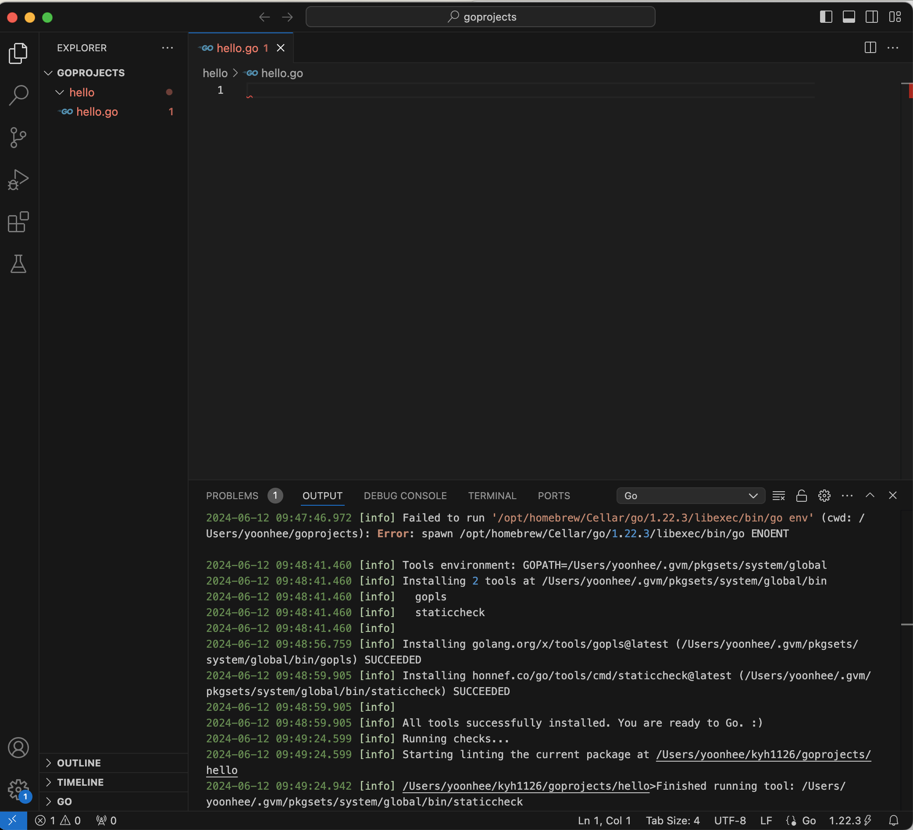

# Go 개발 환경 설정

- 버전 1.16 기반

## 설치

---

### Go

---

- [golang.org](http://golang.org) 에서 다운로드
    - gvm 통해서 설치함
    
    ```powershell
    yoonhee@Yoonhee ~ % go version
    go version go1.22.3 darwin/arm64
    yoonhee@Yoonhee ~ % cd /usr/local/go
    yoonhee@Yoonhee go % ll
    total 360
    drwxr-xr-x   20 root  wheel    640  2  5  2021 .
    drwxr-xr-x    5 root  wheel    160  5 20 22:55 ..
    -rw-r--r--    1 root  wheel  55383  2  5  2021 AUTHORS
    -rw-r--r--    1 root  wheel   1339  2  5  2021 CONTRIBUTING.md
    -rw-r--r--    1 root  wheel  90098  2  5  2021 CONTRIBUTORS
    -rw-r--r--    1 root  wheel   1479  2  5  2021 LICENSE
    -rw-r--r--    1 root  wheel   1303  2  5  2021 PATENTS
    -rw-r--r--    1 root  wheel   1607  2  5  2021 README.md
    -rw-r--r--    1 root  wheel    397  2  5  2021 SECURITY.md
    -rw-r--r--    1 root  wheel      9  2  5  2021 VERSION
    drwxr-xr-x   20 root  wheel    640  2  5  2021 api
    drwxr-xr-x    4 root  wheel    128  2  5  2021 bin
    drwxr-xr-x   45 root  wheel   1440  2  5  2021 doc
    -rw-r--r--    1 root  wheel   5686  2  5  2021 favicon.ico
    drwxr-xr-x    3 root  wheel     96  2  5  2021 lib
    drwxr-xr-x   14 root  wheel    448  2  5  2021 misc
    drwxr-xr-x    6 root  wheel    192  2  5  2021 pkg
    -rw-r--r--    1 root  wheel     26  2  5  2021 robots.txt
    drwxr-xr-x   69 root  wheel   2208  2  5  2021 src
    drwxr-xr-x  323 root  wheel  10336  2  5  2021 test
    ```
    
- PATH 환경변수 추가
    
    ```
    export PATH=$PATH:/usr/local/go/bin
    ```
    
    ```powershell
    yoonhee@Yoonhee ~ % cat ~/.zshrc
    export PATH=/opt/homebrew/bin:$PATH
    
    alias ll="ls -al"
    
    #THIS MUST BE AT THE END OF THE FILE FOR SDKMAN TO WORK!!!
    export SDKMAN_DIR="$HOME/.sdkman"
    [[ -s "$HOME/.sdkman/bin/sdkman-init.sh" ]] && source "$HOME/.sdkman/bin/sdkman-init.sh"
    [[ -s "$HOME/.gvm/scripts/gvm" ]] && source "$HOME/.gvm/scripts/gvm"
    ```
    

### Git

---

- 리눅스 기준 설치되어 있음
    
    ```powershell
    yoonhee@Yoonhee ~ % git version
    git version 2.39.3 (Apple Git-146)
    ```
    

### Visual Studio Code

---

- [code.visualstudio.com](http://code.visualstudio.com) 에서 다운로드
- Open Folder해서 ~/kyh1126 하위에 goprojects 만들고 hello폴더 만들고 hello.go 파일만들고 'Go' Extension 설치한다.
    
    
    
- hello.go
    
    ```go
    package main
    
    import "fmt"
    
    func main() {
    	fmt.Println("Hello world")
    }
    ```
    

## 실행

---

### `go run`으로 실행

---

- 터미널 열고 실행: `go run hello.go`
    
    
    

### `go build`로 실행

---

- 실행파일을 만들어서 컴파일을 한 다음에 실행

```powershell
yoonhee@Yoonhee hello % go build
go: go.mod file not found in current directory or any parent directory; see 'go help modules'
```

- Go가 1.16으로 버전이 올라가면서 go module이 기본으로 되어있다.
    - 빌드를 하려면 반드시 go module(`go.mod`)을 만들어줘야 한다.
- go 모듈: `go.mod`에 리스트 된 특별한 모듈 의존성을 사용하여 import 문제를 해결한다.
    - go modules이 생성된 주요한 동기는, 다른 개발자들에 의해 작성된 코드를 편하게 사용하기 위함이다.
    - 직접적인 종속성이 있는 패키지만 기록된다.
        - `go.mod`안에 제공되지 않은 패키지 import에 직면하면 `go` 커맨드는 패키지를 자동으로 찾아서 최신 버전으로 `go.mod`에 추가한다.
    - 다시 `go test`를 실행하게 되었을 경우, go는 위에서 했던 설치 작업을 반복하지 않는다.
        - `go.mod` 파일이 최신 상태이며, 다운로드된 모듈은 로컬에 캐싱이 되어있기 때문이다. ($GOPATH/pkg/mod)
            
            ```powershell
            yoonhee@Yoonhee ~ % echo $GOPATH
            /Users/yoonhee/.gvm/pkgsets/system/global
            yoonhee@Yoonhee ~ % cd /Users/yoonhee/.gvm/pkgsets/system/global/pkg/mod
            yoonhee@Yoonhee mod % ll
            total 0
            drwxr-xr-x  14 yoonhee  staff   448  6 12 09:48 .
            drwxr-xr-x   4 yoonhee  staff   128  5 22 15:23 ..
            drwxr-xr-x   4 yoonhee  staff   128  6 12 10:02 cache
            drwxr-xr-x   3 yoonhee  staff    96  5 22 15:23 cloud.google.com
            drwxr-xr-x  63 yoonhee  staff  2016  5 22 15:23 github.com
            drwxr-xr-x   3 yoonhee  staff    96  5 22 15:23 go.opentelemetry.io
            drwxr-xr-x   5 yoonhee  staff   160  5 22 15:23 go.uber.org
            drwxr-xr-x   3 yoonhee  staff    96  5 22 15:23 golang.org
            drwxr-xr-x   6 yoonhee  staff   192  5 22 15:23 google.golang.org
            drwxr-xr-x   9 yoonhee  staff   288  5 22 15:23 gopkg.in
            dr-x------  23 yoonhee  staff   736  5 22 15:23 gotest.tools@v2.2.0+incompatible
            drwxr-xr-x   3 yoonhee  staff    96  5 22 15:23 honnef.co
            drwxr-xr-x   3 yoonhee  staff    96  5 22 15:23 mellium.im
            drwxr-xr-x   4 yoonhee  staff   128  6 12 09:48 mvdan.cc
            ```
            

- go 의존성 관리 명령어
    - `go mod init`: 새로운 모듈 생성, go.mod 파일을 초기화
    - `go build`, `go test`: 다른 패키지 빌딩 커맨드, 필요한 의존성을 `go.mod`에 추가한다.
    - `go list -m all`: 현재 모듈의 의존성을 모두 출력
    - `go get`: 특정 의존성의 필요한 버전으로 변경, 혹은 새로운 의존성 추가
    - `go mod tidy`: 사용하지 않는 의존성 삭제

- go module 만들기
    - 보통 모듈명은 아무거나 적어도 되지만, 보통 폴더명이랑 같이 가는게 좋고 겹치지 않는 이름으로 적어준다.
    
    ```powershell
    yoonhee@Yoonhee hello % go mod init goprojects/hello
    go: creating new go.mod: module goprojects/hello
    go: to add module requirements and sums:
            go mod tidy
    yoonhee@Yoonhee hello % ls
    go.mod          hello.go
    yoonhee@Yoonhee hello % cat go.mod
    module goprojects/hello
    
    go 1.22.3
    ```
    

- `go build`: 실행파일을 만들기
    
    ```powershell
    yoonhee@Yoonhee hello % go build
    yoonhee@Yoonhee hello % ls
    go.mod          hello           hello.go
    ```
    
- hello 실행파일 실행
    
    ```powershell
    yoonhee@Yoonhee hello % ./hello
    Hello world
    ```