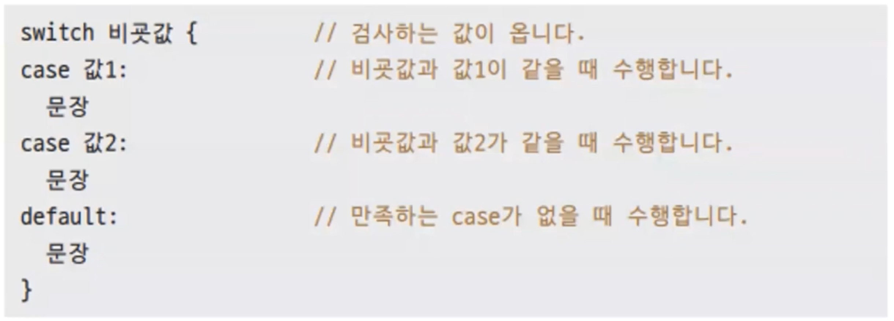

# 10장. Switch문

## `Switch`문

---



- `if`문은 조건을 검사한다.
- `switch`문은 값을 검사한다.

- ex10.1.go
    
    ```go
    package main
    
    import "fmt"
    
    func main() {
    	a := 3
    
    	switch a {
    	case 1:
    		fmt.Println("a == 1")
    	case 2:
    		fmt.Println("a == 2")
    	case 3:
    		fmt.Println("a == 3")
    	default:
    		fmt.Println("a != 1,2,3", a)
    	}
    }
    ```
    
- 실행
    
    ```powershell
    yoonhee@Yoonhee ex10.1 % ./ex10.1
    a == 3
    ```
    

### `Switch`문 언제 쓰는가?

---


- 보기 좋으라고 쓰는 경우가 많다.

### 한 번에 여러값 비교

---

- ex10.4.go
    
    ```go
    package main
    
    import "fmt"
    
    func main() {
    	day := "thursday"
    
    	switch day {
    	case "monday", "tuesday":
    		fmt.Println("월, 화요일은 수업 가는 날입니다.")
    	case "wednesday", "thursday", "friday":
    		fmt.Println("수, 목, 금요일은 실습 가는 날입니다.")
    	}
    }
    ```
    
- 실행
    
    ```powershell
    yoonhee@Yoonhee ex10.4 % ./ex10.4
    수, 목, 금요일은 실습 가는 날입니다.
    ```
    

### 조건문 비교

---


- 조건을 검사하는 경우라면 `if`를 추천하지만 `||` 대신 `,`로 쓸 수 있다.

## Switch 초기문

---


- 예제
    
    
    

## `Const` 열거값과 `switch`

---

- ex10.8.go
    
    ```go
    package main
    
    import "fmt"
    
    type ColorType int
    
    const (
    	Red ColorType = iota
    	Blue
    	Green
    	Yellow
    )
    
    func colorToString(color ColorType) string {
    	switch color {
    	case Red:
    		return "Red"
    	case Blue:
    		return "Blue"
    	case Green:
    		return "Green"
    	case Yellow:
    		return "Yellow"
    	default:
    		return "Undefined"
    	}
    }
    
    func getMyFavoriteColor() ColorType {
    	return Red
    }
    
    func main() {
    	fmt.Println("My favorite color is", colorToString(getMyFavoriteColor()))
    	fmt.Println("My favorite color is", colorToString(1))
    }
    ```
    
- 실행
    
    ```powershell
    yoonhee@Yoonhee ex10.8 % ./ex10.8
    My favorite color is Red
    My favorite color is Blue
    ```
    
    - 별칭을 쓰는 이유: 이 값의 의미를 명확하게 하기 위해서

## `break`와 `fallthrough`

---

- ex10.10.go
    
    ```go
    package main
    
    import "fmt"
    
    func main() {
    	a := 3
    
    	switch a {
    	case 1:
    		fmt.Println("a==1")
    		break
    	case 2:
    		fmt.Println("a==2")
    	case 3:
    		fmt.Println("a==3")
    		fallthrough
    	case 4:
    		fmt.Println("a==4")
    	default:
    		fmt.Println("a != 1, 2, 3")
    	}
    }
    ```
    
- 실행
    
    ```powershell
    yoonhee@Yoonhee ex10.10 % ./ex10.10
    a==3
    a==4
    ```
    
    - 다른 언어에서는 `case` 사이에 `break`를 해줘야 한다.
        - Go에서는 `break` 안써줘도 된다.
    - 헷갈릴 수 있어서 `fallthrough` 안쓰는게 좋다.
