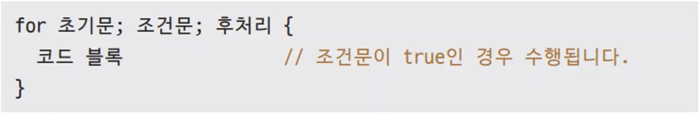

# 11장. for문

## `for`문

---



- ex11.1.go
    
    ```go
    package main
    
    import "fmt"
    
    func main() {
    	for i := 0; i < 10; i++ {
    		fmt.Print(i, ",")
    	}
    }
    ```
    
- 실행
    
    ```powershell
    yoonhee@Yoonhee ex11.1 % go mod init goprojects/ex11.1
    go: creating new go.mod: module goprojects/ex11.1
    go: to add module requirements and sums:
            go mod tidy
    yoonhee@Yoonhee ex11.1 % go build
    yoonhee@Yoonhee ex11.1 % ./ex11.1 
    0,1,2,3,4,5,6,7,8,9,%                                                         
    ```
    

### 초기문 생략

---


- 초기문 생략 가능
    
    ```go
    func main() {
    	i := 0
    	for ; i < 10; i++ {
    		fmt.Print(i, ",")
    	}
    }
    ```
    

### 후처리 생략

---


- 후처리 생략 가능
    
    ```go
    func main() {
    	for i := 0; i < 10; { // 무한히 실행된다. 0, 0, 0, 0, 0, 0, 0...
    		fmt.Print(i, ",")
    	}
    }
    ```
    

### 조건문만 있는 경우

---


- 전처리, 후처리가 없는 경우 세미콜론 빼도 된다.

### 무한 루프

---


- ex11.2.go
    
    ```go
    package main
    
    import (
    	"fmt"
    	"time"
    )
    
    func main() {
    	i := 1
    	for {
    		time.Sleep(time.Second)
    		fmt.Println(i)
    		i++
    	}
    }
    ```
    
- 실행
    
    ```powershell
    yoonhee@Yoonhee ex11.2 % go build
    yoonhee@Yoonhee ex11.2 % ./ex11.2 
    1
    2
    3
    4
    5
    6
    7
    8
    ^C
    ```
    

### `continue` 와 `break`

---


- 실행
    
    ```powershell
    6 * 0 = 0
    6 * 1 = 6
    6 * 2 = 12
    6 * 4 = 24
    6 * 5 = 30
    ```
    

- ex11.3.go
    
    ```go
    package main
    
    import (
    	"bufio"
    	"fmt"
    	"os"
    )
    
    func main() {
    	stdin := bufio.NewReader(os.Stdin)
    	for {
    		fmt.Println("입력하세요")
    		var number int
    		_, err := fmt.Scanln(&number)
    
    		if err != nil {
    			fmt.Println("숫자로 입력하세요")
    
    			// 키보드 버퍼를 지웁니다.
    			stdin.ReadString('\n')
    			continue
    		}
    		fmt.Printf("입력하신 숫자는 %d입니다.\n", number)
    
    		if number%2 == 0 {
    			break //짝수 검사를 합니다.
    		}
    	}
    	fmt.Println("for문이 종료되었습니다.")
    }
    ```
    
- 실행
    
    ```powershell
    yoonhee@Yoonhee ex11.3 % ./ex11.3
    입력하세요
    sdfsdf  
    숫자로 입력하세요
    입력하세요
    45
    입력하신 숫자는 45입니다.
    입력하세요
    입력하신 숫자는 44입니다.
    for문이 종료되었습니다.
    ```
    

## 중첩 `for`문

---


- ex11.5.go
    
    ```go
    package main
    
    import (
    	"fmt"
    )
    
    func main() {
    	for i := 0; i < 5; i++ {
    		for j := 0; j < i+1; j++ {
    			fmt.Print("*")
    		}
    		fmt.Println()
    	}
    }
    ```
    
- 실행
    
    ```powershell
    yoonhee@Yoonhee ex11.5 % ./ex11.5
    *
    **
    ***
    ****
    *****
    ```
    
- 3중 `for`문은 안쓰는게 좋다.

- 숙제
    - ex11.5.go-1
        
        ```go
        package main
        
        import (
        	"fmt"
        )
        
        func main() {
        	for i := 0; i < 5; i++ {
        		for j := 0; j < 5-i; j++ {
        			fmt.Print("*")
        		}
        		fmt.Println()
        	}
        }
        ```
        
    - 실행
        
        ```powershell
        yoonhee@Yoonhee ex11.5 % ./ex11.5
        *****
        ****
        ***
        **
        *
        ```
        
    - ex11.5.go-2
        
        ```go
        package main
        
        import (
        	"fmt"
        )
        
        func main() {
        	for i := 1; i < 5; i++ {
        		for j := 0; j < 7; j++ {
        			left := (8 - 2*i) / 2
        
        			if j < left || j >= 7-left {
        				fmt.Print(" ")
        			} else {
        				fmt.Print("*")
        			}
        		}
        		fmt.Println()
        	}
        }
        ```
        
    - 실행
        
        ```powershell
        yoonhee@Yoonhee ex11.5 % ./ex11.5
           *   
          ***  
         ***** 
        *******
        ```
        

### 중첩 `for`문과 `break`, 레이블

---

- 특정 조건일 때 `for`문을 종료하고 싶을 때
    1. 플래그 변수 활용
        - ex11.7.go
            
            ```go
            package main
            
            import (
            	"fmt"
            )
            
            func main() {
            	a := 1
            	b := 1
            	found := false
            	for ; a <= 9; a++ {
            		for b = 1; b <= 9; b++ {
            			if a*b == 45 {
            				found = true
            				break
            			}
            		}
            		if found {
            			break
            		}
            	}
            	fmt.Printf("%d * %d = %d\n", a, b, a*b)
            }
            ```
            
        - 실행
            
            ```powershell
            yoonhee@Yoonhee ex11.7 % ./ex11.7
            5 * 9 = 45
            ```
            
    2. 레이블 활용
        - ex11.8.go
            
            ```go
            package main
            
            import (
            	"fmt"
            )
            
            func main() {
            	a := 1
            	b := 1
            
            OuterFor: //Label 레이블
            	for ; a <= 9; a++ {
            		for b = 1; b <= 9; b++ {
            			if a*b == 45 {
            				break OuterFor
            			}
            		}
            	}
            	fmt.Printf("%d * %d = %d\n", a, b, a*b)
            }
            ```
            
        - 실행
            
            ```powershell
            yoonhee@Yoonhee ex11.8 % ./ex11.8
            5 * 9 = 45
            ```
            
- 레이블은 안 쓰는게 좋다.
    - 동작을 살펴보면 instruction pointer를 강제로 바꿔버리기 때문에 위험할 수 있다.
    - 레이블 지원되지 않는 언어가 많다.