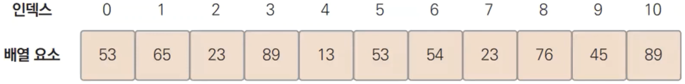

# 12장. 배열

## 배열

---

- 배열은 같은 타입의 데이터들로 이루어진 타입
    
    
    

### 배열은 자료구조

---

- 배열은 자료구조 중 한 종류이다.
- 자료구조란 데이터들을 어떤 형태로 저장할지를 나타내는 구조를 말한다.

### 배열 변수 선언

---


- ex> `var t [5]float64`

- ex12.1.go
    
    ```go
    package main
    
    import (
    	"fmt"
    )
    
    func main() {
    	var t [5]float64 = [5]float64{24.0, 25.9, 27.8, 26.9, 26.2}
    	for i := 0; i < 5; i++ {
    		fmt.Println(t[i])
    	}
    }
    ```
    
- 실행
    
    ```powershell
    yoonhee@Yoonhee ex12.1 % ./ex12.1
    24
    25.9
    27.8
    26.9
    26.2
    ```
    

### 다양한 배열 변수 선언

---


1. 초기값은 디폴트값으로 채워진다.
2. 초기값을 주면서 할당시킬 수 있다.
3. 5개짜리 실수 중 앞에 2개만 셋팅하고 나머지는 초기값으로 채워진다.
4. s는 뒤의 타입과 같아진다. 인덱스 1에 10을, 3에 30을 셋팅한다.
5. x 배열의 길이는 뒤에있는 것만큼으로 길이를 정하겠다.
    - `[]int{10, 20, 30}`과 타입이 다르다. → `slice`(동적 배열). 길이가 고정되어있지 않다.

### 배열 선언시 개수는 항상 상수

---


1. 에러난다.
2. 괜찮다.
3. literal(숫자 10)을 직접 주는 방식이다. 괜찮다.

- ex12.3.go
    
    ```go
    package main
    
    import (
    	"fmt"
    )
    
    func main() {
    	nums := [...]int{10, 20, 30, 40, 50}
    
    	nums[2] = 300
    
    	for i := 0; i < len(nums); i++ {
    		fmt.Println(nums[i])
    	}
    }
    ```
    
- 실행
    
    ```powershell
    yoonhee@Yoonhee ex12.3 % ./ex12.3
    10
    20
    300
    40
    50
    ```
    
    - `len`: 배열(, `slice`, `map`, `String`, `Channel`)의 길이를 반환한다.

## 배열 순회 - `range` 이용 - ex12.4

---

- ex12.4.go
    
    ```go
    package main
    
    import (
    	"fmt"
    )
    
    func main() {
    	var t [5]float64 = [5]float64{24.0, 25.9, 27.8, 26.9, 26.2}
    
    	for i, v := range t {
    		fmt.Println(i, v)
    	}
    }
    ```
    
- 실행
    
    ```powershell
    yoonhee@Yoonhee ex12.4 % ./ex12.4 
    0 24
    1 25.9
    2 27.8
    3 26.9
    4 26.2
    ```
    
    - `range`: 자료구조 요소들을 순회하면서 인덱스, 값 2개를 반환해준다.

### `range`

---


- i값 안쓰려면 빈칸 지시자(`_`)로 표시해도 안써도 되게 한다.
- v값 안쓰려면 그냥 안쓰면 된다. 2번째 값은 무시된다.
    
    ```go
    for i := range t {
    	fmt.Println(i)
    }
    ```
    

## 배열은 연속된 메모리

---


### 배열 요소 찾아가기

---


- 배열은 특정 요소 찾아가는게(Random Access) 매우 빠르다.
    - `List`보다도 빠르다. 모든 자료구조 중에서 제일 빠르다. 연속된 메모리 구조라서.

### 정리하면

---

1. 배열은 연속된 메모리다.
2. 컴퓨터는 인덱스와 타입 크기를 사용해서 메모리 주소를 간단하게 찾는다.

## 배열 복사 - ex12.5

---

- ex12.5.go
    
    ```go
    package main
    
    import (
    	"fmt"
    )
    
    func main() {
    	a := [5]int{1, 2, 3, 4, 5}
    	b := [5]int{500, 400, 300, 200, 100}
    
    	for i, v := range a {
    		fmt.Printf("a[%d] = %d\n", i, v)
    	}
    
    	fmt.Println()
    
    	for i, v := range b {
    		fmt.Printf("b[%d] = %d\n", i, v)
    	}
    
    	b = a
    
    	fmt.Println()
    
    	for i, v := range b {
    		fmt.Printf("b[%d] = %d\n", i, v)
    	}
    }
    ```
    
- 실행
    
    ```powershell
    yoonhee@Yoonhee ex12.5 % ./ex12.5
    a[0] = 1
    a[1] = 2
    a[2] = 3
    a[3] = 4
    a[4] = 5
    
    b[0] = 500
    b[1] = 400
    b[2] = 300
    b[3] = 200
    b[4] = 100
    
    b[0] = 1
    b[1] = 2
    b[2] = 3
    b[3] = 4
    b[4] = 5
    ```
    
    - 대입하려는 값이 `[10]int` 배열이면 타입이 달라서 에러난다.
    - `[5]int`, `[5]int64`는 타입이 다르다.

## 다중 배열

---


### 이중 배열 순회 - ex12.6

---

- ex12.6.go
    
    ```go
    package main
    
    import (
    	"fmt"
    )
    
    func main() {
    	a := [2][5]int{
    		{1, 2, 3, 4, 5},
    		{5, 6, 7, 8, 9},
    	}
    
    	for _, arr := range a {
    		for _, v := range arr {
    			fmt.Print(v, " ")
    		}
    		fmt.Println()
    	}
    }
    
    ```
    
- 실행
    
    ```powershell
    yoonhee@Yoonhee ex12.6 % ./ex12.6
    1 2 3 4 5 
    5 6 7 8 9 
    ```
    
    - 마지막 요소여도 컴마(`,`)를 찍어줘야 한다. 끝이 같은 줄에서 닫히면 괜찮다.
        
        ```go
        a := [5]int{
        	1,
        	2,
        	3,
        	4,
        	5,
        }
        ```
        

## 배열 크기

---


- 자바에서는 `ArrayList`가 `Array`들이 연결되어 있는 상태로 `List`여서 떨어져 있을 수 있지만, Go는 무조건 연속되있는 메모리다.