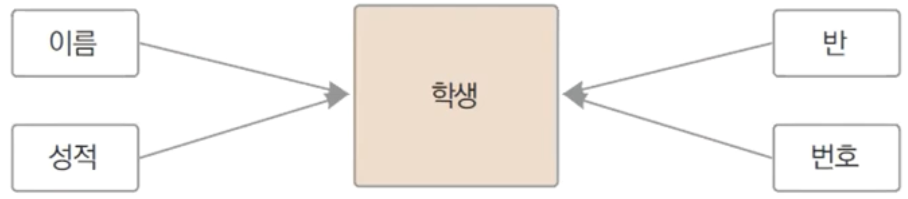

# 13장. 구조체

## 구조체

---

- 구조체는 여러 필드를 묶어서 사용하는 타입
    
    
    

### 구조체 선언

---


1. `type`을 선언하겠다.
2. 타입명
3. 형태. 구조체
    - cf> `type myInt int`: myInt 라는 `int` aliasing 타입을 선언하겠다.

- ex13.1.go
    
    ```go
    package main
    
    import (
    	"fmt"
    )
    
    type House struct {
    	Address  string
    	Size     int
    	Price    float64
    	Category string
    }
    
    func main() {
    	var house House
    	house.Address = "서울시 강남구 ..."
    	house.Size = 28
    	house.Price = 10
    	house.Category = "아파트"
    
    	fmt.Println(house)
    }
    ```
    
- 실행
    
    ```powershell
    yoonhee@Yoonhee ex13.1 % ./ex13.1
    {서울시 강남구 ... 28 10 아파트}
    ```
    
    - `fmt.Println(house)`: `fmt.Println("%v\n", house)`과 동일하다.

### 구조체 변수 초기화

---


1. 모든 필드값이 기본값으로 초기화된다.
2. 모든 필드값 초기화


1. 특정 필드값만 초기화

### 구조체를 포함하는 구조체

---


- ex13.2.go
    
    ```go
    package main
    
    import "fmt"
    
    type User struct {
    	Name string
    	ID   string
    	Age  int
    }
    
    type VIPUser struct {
    	UserInfo User
    	VIPLevel int
    	Price    int
    }
    
    func main() {
    	user := User{"송하나", "hana", 23}
    	vip := VIPUser{
    		User{"화랑", "hwarang", 48},
    		3,
    		250,
    	}
    
    	fmt.Printf("유저: %s ID: %s 나이: %d\n", user.Name, user.ID, user.Age)
    	fmt.Printf("VIP 유저: %s ID: %s 나이: %d VIP레벨: %d VIP가격: %d만원\n",
    		vip.UserInfo.Name,
    		vip.UserInfo.ID,
    		vip.UserInfo.Age,
    		vip.VIPLevel,
    		vip.Price,
    	)
    }
    ```
    
- 실행
    
    ```powershell
    yoonhee@Yoonhee ex13.2 % ./ex13.2
    유저: 송하나 ID: hana 나이: 23
    VIP 유저: 화랑 ID: hwarang 나이: 48 VIP레벨: 3 VIP가격: 250만원
    ```
    

## 포함된 필드방식 (embedded field)

---


1. embedded field
    - user 통해서가 아닌, 필드에 직접 접근할 수 있다.(내장된 필드)
2. VIPUser의 Level 필드가 우선 출력된다.
    - user의 Level 접근하고 싶으면 `vip.User.Level`로 접근하면 된다.

## 구조체 크기

---


- 모든 필드의 사이즈를 `sum`한 결과다.

## 구조체 복사

---

- 모든 필드 값이 복사된다.
    
    
    
- 24바이트를 전체 그대로 복사한다.
    - 구조체는 모든 필드가 서로 다른 메모리 공간에 전부 복사된다.

## 필드 배치에 따른 구조체 크기 변화

---

- ex13.6.go
    
    ```go
    package main
    
    import (
    	"fmt"
    	"unsafe"
    )
    
    type User struct {
    	Age   int
    	Score float64
    }
    
    func main() {
    	user := User{23, 77.2}
    	fmt.Println(unsafe.Sizeof(user))
    }
    ```
    
- 실행
    
    ```powershell
    yoonhee@Yoonhee ex13.6 % ./ex13.6
    16
    ```
    
    - `unsafe.Sizeof`: 사이즈를 알려준다.

- 왜 12바이트 가 아니고 16바이트 가 찍혔을까?
    - 패딩 때문!

## 메모리 정렬(Memory Alignment)

---


- 레지스터에 담기 편하게 메모리를 정렬한다.
    - 구조체같은 경우 Age(4바이트), Score(8바이트) 붙여서 정렬하려면 가져오기가 불편하다.
    - 그래서 4바이트 패딩으로 미뤄서 8바이트 단위로 정렬한다.

- ex13.7.go
    
    ```go
    package main
    
    import (
    	"fmt"
    	"unsafe"
    )
    
    type User struct {
    	A int8
    	B int
    	C int8
    	D int
    	E int8
    }
    
    func main() {
    	user := User{1, 2, 3, 4, 5}
    	fmt.Println(unsafe.Sizeof(user))
    }
    ```
    
- 실행
    
    ```powershell
    yoonhee@Yoonhee ex13.7 % ./ex13.7
    40
    ```
    
    - 19바이트 대신 40바이트 되면서 메모리 낭비가 생기게 된다.
        
        
        
- ex13.7.go - 개선 버전
    
    ```go
    package main
    
    import (
    	"fmt"
    	"unsafe"
    )
    
    type User struct {
    	A int8 // 1
    	C int8 // 1
    	E int8 // 1
    	B int  // 8
    	D int  // 8
    }
    
    func main() {
    	user := User{1, 2, 3, 4, 5}
    	fmt.Println(unsafe.Sizeof(user))
    }
    ```
    
- 실행
    
    ```powershell
    yoonhee@Yoonhee ex13.7 % ./ex13.7
    24
    ```
    

- 8바이트보다 작은 필드는 8바이트 크기(단위)를 고려해서 몰아서 배치하자.
    
    
    

## 구조체의 역할

---

- 결합도(의존성)은 낮게 응집도는 높게 (low coupling, high cohesion)
    - 함수는 관련 코드 블록을 묶어서 응집도를 높이고 재사용성을 증가시킵니다.
    - 배열은 같은 타입의 데이터들을 묶어서 응집도를 높입니다.
    - 구조체는 관련된 데이터들을 묶어서 응집도를 높이고 재사용성을 증가시킵니다.

## 프로그래밍에서 객체의 등장

---

- 구조체는 객체 지향 프로그래밍의 기반이 됨.
    - Go: 클래스가 없고 구조체(`struct`)만 지원하고 있다. 구조체가 객체다.