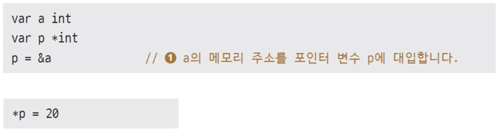

# 14장. 포인터

## 포인터

---

- 포인터는 메모리 주소를 값으로 갖는 타입
    
    
    
    - 포인터 타입의 변수를 만들 수 있다.
    - `&`: a의 주소
    1. p는 a의 int타입 메모리 주소를 값으로 갖게 된다. (형변환 안됨)

### 여러 포인터 변수가 하나의 변수를 가리킬 수 있다.

---


- ex14.1.go
    
    ```go
    package main
    
    import (
    	"fmt"
    )
    
    func main() {
    	var a int = 500
    	var p *int
    
    	p = &a
    
    	fmt.Printf("p의 값: %p\n", p)
    	fmt.Printf("p가 가리키는 메모리의 값: %d\n", *p)
    
    	*p = 100
    	fmt.Printf("a의 값: %d\n", a)
    }
    ```
    
- 실행
    
    ```powershell
    yoonhee@Yoonhee ex14.1 % ./ex14.1 
    p의 값: 0x14000110018
    p가 가리키는 메모리의 값: 500
    a의 값: 100
    ```
    
    
    
    - p: 16진수값. 메모리 주소값 출력

- ex14.2.go
    
    ```go
    package main
    
    import "fmt"
    
    func main() {
    	var a int = 10
    	var b int = 20
    
    	var p1 *int = &a
    	var p2 *int = &a
    	var p3 *int = &b
    
    	fmt.Printf("p1 == p2: %v\n", p1 == p2)
    	fmt.Printf("p2 == p3: %v\n", p2 == p3)
    }
    ```
    
- 실행
    
    ```powershell
    yoonhee@Yoonhee ex14.2 % ./ex14.2
    p1 == p2: true
    p2 == p3: false
    ```
    

### 포인터 변수의 기본값은 `nil`

---


- 포인터 타입의 기본값은 `nil`이다.

### 포인터 왜 쓰나? - ex14.3

---

- ex14.3.go
    
    ```go
    package main
    
    import "fmt"
    
    type Data struct {
    	value int
    	data  [200]int
    }
    
    func ChangeData(arg Data) {
    	arg.value = 999
    	arg.data[100] = 999
    }
    
    func main() {
    	var data Data
    
    	ChangeData(data)
    	fmt.Printf("value = %d\n", data.value)
    	fmt.Printf("data[100] = %d\n", data.data[100])
    }
    ```
    
- 실행
    
    ```powershell
    yoonhee@Yoonhee ex14.3 % ./ex14.3
    value = 0
    data[100] = 0
    ```
    
    - 함수의 인자는 무조건 r-value로 쓰인다. 그래서 값으로 쓰인다.
    - arg에 같은 메모리 공간 사이즈만큼 확보 후 data 값 복사한다.

- ex14.3.go - 개선 버전
    
    ```go
    package main
    
    import "fmt"
    
    type Data struct {
    	value int
    	data  [200]int
    }
    
    func ChangeData(arg *Data) {
    	arg.value = 999
    	arg.data[100] = 999
    }
    
    func main() {
    	var data Data
    
    	ChangeData(&data)
    	fmt.Printf("value = %d\n", data.value)
    	fmt.Printf("data[100] = %d\n", data.data[100])
    }
    ```
    
- 실행
    
    ```powershell
    yoonhee@Yoonhee ex14.3 % ./ex14.3
    value = 999
    data[100] = 999
    ```
    
    - data의 주소값을 넘겨서 arg 포인터로 받으면 값이 변경된다.(메모리 주소값의 메모리 공간 8바이트만 복사된다)
    - 포인터 변수면 원래는 아래와 같이 `*` 붙여서 값에서 꺼내줘야 하는데, Go에서는 이 부분을 자동으로 해준다.
        
        ```go
        func ChangeData(arg *Data) {
        	(*arg).value = 999
        	(*arg).data[100] = 999
        }
        ```
        

- 메모리 주소값의 메모리 공간: 64비트 컴퓨터에서는 8바이트, 32비트 컴퓨터에서는 4바이트

## 구조체 포인터 초기화

---


## 인스턴스

---

- 인스턴스(Instance)는 메모리에 할당된 데이터의 실체
    
    
    

### 1개의 인스턴스

---


### 3개의 인스턴스

---


### `new()` 내장함수

---


1. 값을 초기화 할 수 있다.
2. p2: `*Data` 타입. 기본값으로만 초기화 할 수 있다.

### 인스턴스는 언제 사라지나?

---

- 인스턴스는 아무도 찾지 않을 때 사라진다.


- u: 다음 가비지컬렉터 타임 때 사라진다.

### 정리하면

---

- 인스턴스는 메모리에 생성된 데이터의 실체입니다.
- 포인터를 이용해서 인스턴스를 가리키게 할 수 있습니다.
- 함수 호출 시 포인터 인수를 통해서 인스턴스를 입력받고 그 값을 변경할 수 있게 됩니다.
- 쓸모 없어진 인스턴스는 가비지 컬렉터가 자동으로 지워줍니다.

## 스택메모리와 힙메모리

---

- ex14.5.go
    
    ```go
    package main
    
    import "fmt"
    
    type User struct {
    	Name string
    	Age  int
    }
    
    func NewUser(name string, age int) *User {
    	var u = User{name, age}
    	return &u
    }
    
    func main() {
    	userPointer := NewUser("AAA", 23)
    	fmt.Println(userPointer)
    }
    ```
    
- 실행
    
    ```powershell
    yoonhee@Yoonhee ex14.5 % ./ex14.5 
    &{AAA 23}
    ```
    
    - C에서는 이런 코드가 안 된다.
        
        ```go
        func NewUser(name string, age int) *User {
        	var u = User{name, age}
        	return &u
        }
        ```
        

- function 내 변수는 stack메모리에 쌓인다. 함수 내에서 쓰였던 변수는 다 스택에서 pop 시켜서 무효한 주소가 된다.
- Go에서는 Escape Analyzing(탈출 분석)을 해서 (코드 분석)
    
    → function 밖으로 탈출하는지 아닌지 검사한다.
    
    - 탈출하는 놈들은 힙에다가 만든다. 힙은 쓰임이 다하면 사라진다.
    - 아니면 스택에다가 만든다. 함수 끝나면 사라진다.